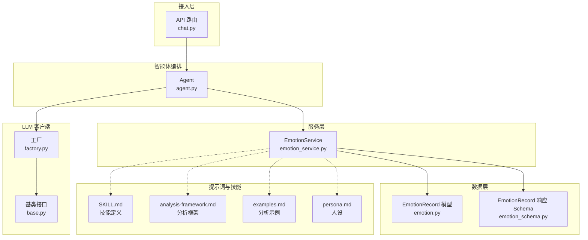
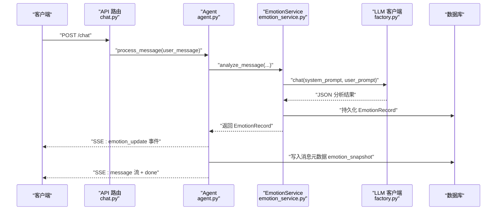
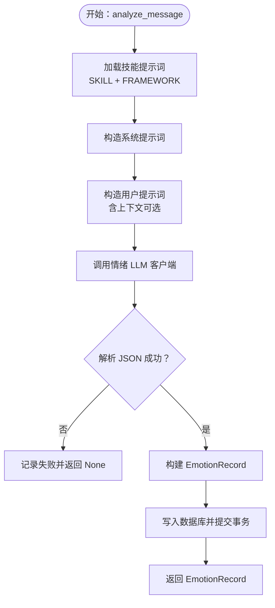
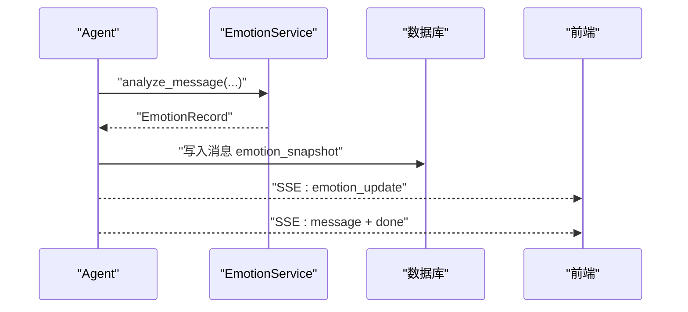
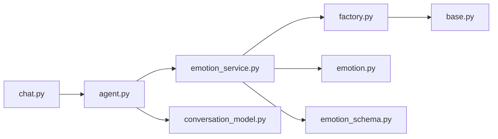

# 焕 - 情绪分析智能体

<cite>
**本文引用的文件**
- [SKILL.md](file://backend/app/ai/skills/xuanji-huan/SKILL.md)
- [analysis-framework.md](file://backend/app/ai/skills/xuanji-huan/analysis-framework.md)
- [examples.md](file://backend/app/ai/skills/xuanji-huan/examples.md)
- [persona.md](file://backend/app/ai/skills/xuanji-huan/persona.md)
- [emotion_service.py](file://backend/app/services/emotion_service.py)
- [emotion.py](file://backend/app/models/emotion.py)
- [emotion_schema.py](file://backend/app/schemas/emotion.py)
- [agent.py](file://backend/app/ai/agent.py)
- [factory.py](file://backend/app/ai/factory.py)
- [base.py](file://backend/app/ai/base.py)
- [chat.py](file://backend/app/api/v1/chat.py)
- [chat_schema.py](file://backend/app/schemas/chat.py)
- [conversation_model.py](file://backend/app/models/conversation.py)
</cite>

## 目录
1. [简介](#简介)
2. [项目结构](#项目结构)
3. [核心组件](#核心组件)
4. [架构总览](#架构总览)
5. [详细组件分析](#详细组件分析)
6. [依赖分析](#依赖分析)
7. [性能考虑](#性能考虑)
8. [故障排查指南](#故障排查指南)
9. [结论](#结论)
10. [附录](#附录)

## 简介
本文件面向“焕”（心理情绪分析智能体）的全面技术与实践说明，聚焦其作为璇玑系统“心灵感应者”的专业职责：识别用户情绪状态、分析情感强度、评估心理需求、判断风险等级；并阐述其情绪分析框架、心理学理论基础与情感建模方法。文档覆盖情绪分类标准、风险预警机制、深度需求识别算法，并通过端到端流程图与序列图，展示焕如何处理用户消息、生成结构化情绪分析报告、影响后续智能体决策，以及与情感服务层的集成与数据流转。

## 项目结构
围绕“焕”的实现，后端采用模块化分层组织：
- 技能与提示词层：位于 skills/xuanji-huan，包含技能定义、分析框架、示例与人设
- 服务层：emotion_service 提供情绪分析调用、持久化与推荐获取
- 数据模型与序列化：emotion 模型与响应 Schema
- 接入层：API 路由 chat.py 将请求交由 Agent 处理
- 智能体编排：Agent 负责意图解析、并发情绪分析、协作日志与最终回复生成
- LLM 客户端工厂：factory 统一创建不同角色的 LLM 客户端

图表来源
- [chat.py:40-106](file://backend/app/api/v1/chat.py#L40-L106)
- [agent.py:35-120](file://backend/app/ai/agent.py#L35-L120)
- [emotion_service.py:94-157](file://backend/app/services/emotion_service.py#L94-L157)
- [emotion.py:9-29](file://backend/app/models/emotion.py#L9-L29)
- [emotion_schema.py:6-20](file://backend/app/schemas/emotion.py#L6-L20)
- [factory.py:116-134](file://backend/app/ai/factory.py#L116-L134)
- [base.py:8-36](file://backend/app/ai/base.py#L8-L36)

章节来源
- [chat.py:40-106](file://backend/app/api/v1/chat.py#L40-L106)
- [agent.py:35-120](file://backend/app/ai/agent.py#L35-L120)
- [emotion_service.py:94-157](file://backend/app/services/emotion_service.py#L94-L157)
- [emotion.py:9-29](file://backend/app/models/emotion.py#L9-L29)
- [emotion_schema.py:6-20](file://backend/app/schemas/emotion.py#L6-L20)
- [factory.py:116-134](file://backend/app/ai/factory.py#L116-L134)
- [base.py:8-36](file://backend/app/ai/base.py#L8-L36)

## 核心组件
- 技能与提示词（SKILL.md、analysis-framework.md、examples.md、persona.md）
  - 明确定义“焕”的角色边界、分析流程、输出结构、系统边界原则与应用上下文
  - 提供七维分析能力框架：情绪识别、个性画像、深度需求、动态情绪建模、记忆-情绪分析、多维心理评估、梦境解析
- 情绪服务（EmotionService）
  - 加载技能提示词，构造系统提示词，调用 LLM 客户端进行情绪分析
  - 解析并校验 JSON 输出，持久化记录，提供最新情绪与历史查询
- 数据模型与序列化
  - EmotionRecord 模型承载一次分析的完整结果
  - EmotionRecordResponse 用于对外返回结构化数据
- 智能体编排（Agent）
  - 在消息处理主循环中并发触发“焕”的情绪分析，注入协作日志，等待并消费分析结果
  - 将情绪快照写入消息元数据，供后续模块使用
- LLM 客户端工厂（factory.py）
  - 为“焕”提供独立的 LLM 客户端，支持在线与本地 Ollama 两种 Provider

章节来源
- [SKILL.md:15-186](file://backend/app/ai/skills/xuanji-huan/SKILL.md#L15-L186)
- [analysis-framework.md:1-225](file://backend/app/ai/skills/xuanji-huan/analysis-framework.md#L1-L225)
- [examples.md:1-181](file://backend/app/ai/skills/xuanji-huan/examples.md#L1-L181)
- [persona.md:1-26](file://backend/app/ai/skills/xuanji-huan/persona.md#L1-L26)
- [emotion_service.py:94-214](file://backend/app/services/emotion_service.py#L94-L214)
- [emotion.py:9-29](file://backend/app/models/emotion.py#L9-L29)
- [emotion_schema.py:6-20](file://backend/app/schemas/emotion.py#L6-L20)
- [agent.py:118-320](file://backend/app/ai/agent.py#L118-L320)
- [factory.py:116-134](file://backend/app/ai/factory.py#L116-L134)

## 架构总览
“焕”在系统中的定位是“情绪顾问”，其分析结果直接影响对话核心（玄）、风格设计（遥）与意图调度（晴）。整体流程包括：API 接收消息 → Agent 编排 → 并发情绪分析 → 结果持久化与事件推送 → 后续模块消费情绪快照。

图表来源
- [chat.py:40-106](file://backend/app/api/v1/chat.py#L40-L106)
- [agent.py:118-320](file://backend/app/ai/agent.py#L118-L320)
- [emotion_service.py:98-157](file://backend/app/services/emotion_service.py#L98-L157)
- [factory.py:116-134](file://backend/app/ai/factory.py#L116-L134)

## 详细组件分析

### 情绪分析框架与心理学基础
- 框架维度
  - 情绪识别：识别主次情绪、强度、持续性、压抑程度、表达方式与伪装行为
  - 个性画像：基于语言风格、逻辑表达、情感波动、依恋模式、自我价值等维度刻画当前心理状态
  - 深度需求：区分表层表达、即时需求、潜在需求与核心需求，识别防御机制
  - 动态情绪建模：以“触发事件→心理解释→情绪反应→行为表达→后续影响”的链路追踪趋势与风险指标
  - 记忆-情绪分析：区分情感记忆、创伤记忆、安全记忆、潜意识记忆、强化记忆与依恋记忆
  - 多维心理评估：压力、安全感、韧性、自尊、情绪稳定性、社交依赖、内在冲突、疲劳与恢复力
  - 梦境解析：投射心理、原型象征、情绪残留与内在冲突的多视角解读
- 输出结构
  - 主要情绪、情绪强度、深层需求、风险等级、交互建议（沟通方式、语气、节奏、关键指导）
  - 心理特征、情绪趋势预测、分析摘要（包含观察到的信号→判断依据→结论→需求推断）

章节来源
- [analysis-framework.md:7-225](file://backend/app/ai/skills/xuanji-huan/analysis-framework.md#L7-L225)
- [SKILL.md:31-186](file://backend/app/ai/skills/xuanji-huan/SKILL.md#L31-L186)
- [examples.md:7-181](file://backend/app/ai/skills/xuanji-huan/examples.md#L7-L181)
- [persona.md:1-26](file://backend/app/ai/skills/xuanji-huan/persona.md#L1-L26)

### 情绪服务（EmotionService）实现要点
- 提示词加载与拼装
  - 动态加载 SKILL.md 与 analysis-framework.md，剥离 YAML frontmatter，拼接为 skill_content
  - 使用统一的系统提示词模板，约束输出 JSON 字段与格式
- LLM 调用与解析
  - 构造 user_prompt（支持对话上下文），调用 get_emotion_llm_client
  - 严格解析 LLM 返回的 JSON，兼容代码块包裹与非标准 JSON，必要时正则抽取
- 结果持久化与推荐
  - 将完整 JSON 存入 full_analysis，便于回溯
  - interaction_recommendation 以 JSON 文本存储，便于后续模块按需解析
  - 提供 get_latest_emotion 与 get_interaction_recommendation 供 Agent 注入上下文

图表来源
- [emotion_service.py:18-52](file://backend/app/services/emotion_service.py#L18-L52)
- [emotion_service.py:55-91](file://backend/app/services/emotion_service.py#L55-L91)
- [emotion_service.py:98-157](file://backend/app/services/emotion_service.py#L98-L157)
- [emotion_service.py:194-214](file://backend/app/services/emotion_service.py#L194-L214)

章节来源
- [emotion_service.py:18-52](file://backend/app/services/emotion_service.py#L18-L52)
- [emotion_service.py:55-91](file://backend/app/services/emotion_service.py#L55-L91)
- [emotion_service.py:98-157](file://backend/app/services/emotion_service.py#L98-L157)
- [emotion_service.py:194-214](file://backend/app/services/emotion_service.py#L194-L214)

### 智能体编排与情绪快照注入
- 并发分析与协作日志
  - Agent 在处理消息时并发启动“焕”的分析任务，记录协作日志，确保情绪分析不影响主对话流
  - 在“done”事件之后异步补录 token 用量，避免阻塞用户交互
- 情绪快照与后续模块
  - 将最新情绪注入消息元数据 emotion_snapshot，供对话核心（玄）与风格设计（遥）在后续生成中使用
  - 提供 get_interaction_recommendation 以结构化形式供其他模块读取

图表来源
- [agent.py:118-320](file://backend/app/ai/agent.py#L118-L320)
- [emotion_service.py:158-191](file://backend/app/services/emotion_service.py#L158-L191)

章节来源
- [agent.py:118-320](file://backend/app/ai/agent.py#L118-L320)
- [emotion_service.py:158-191](file://backend/app/services/emotion_service.py#L158-L191)

### 数据模型与序列化
- EmotionRecord 模型
  - 关键字段：primary_emotion、emotion_intensity、deep_need、risk_level、interaction_recommendation、full_analysis
  - 关联外键：user_id、message_id、conversation_id
- EmotionRecordResponse 序列化
  - 与模型一致的对外响应结构，支持 from_attributes

章节来源
- [emotion.py:9-29](file://backend/app/models/emotion.py#L9-L29)
- [emotion_schema.py:6-20](file://backend/app/schemas/emotion.py#L6-L20)

### API 接入与事件流
- 路由 chat.py
  - 支持流式与非流式两种模式，流式通过 SSE 推送事件
  - 在 done 事件中汇总并记录各角色 token 使用情况
- 请求结构 chat_schema.py
  - ChatRequest 包含 messages、stream、working_dir、conversation_id

章节来源
- [chat.py:40-106](file://backend/app/api/v1/chat.py#L40-L106)
- [chat_schema.py:9-14](file://backend/app/schemas/chat.py#L9-L14)

### LLM 客户端工厂与角色隔离
- 工厂方法
  - get_emotion_llm_client 为“焕”提供专用客户端，参数来自 user_setting
  - 支持 online 与 ollama 两种 Provider，均进行必填项校验
- 接口抽象
  - BaseLLMClient 统一 chat 与 stream_chat 接口，便于替换与扩展

章节来源
- [factory.py:116-134](file://backend/app/ai/factory.py#L116-L134)
- [base.py:8-36](file://backend/app/ai/base.py#L8-L36)

## 依赖分析
- 组件耦合
  - EmotionService 依赖工厂创建 LLM 客户端，依赖数据库模型与 Schema
  - Agent 依赖 EmotionService 与其他服务，负责编排与事件推送
  - API 路由依赖 Agent，负责请求解析与 SSE 流
- 外部依赖
  - LLM 提供商（online 或 ollama），模型名称与密钥配置
- 潜在环路
  - 当前模块间为单向依赖，无循环导入

图表来源
- [chat.py:40-106](file://backend/app/api/v1/chat.py#L40-L106)
- [agent.py:35-120](file://backend/app/ai/agent.py#L35-L120)
- [emotion_service.py:94-157](file://backend/app/services/emotion_service.py#L94-L157)
- [factory.py:116-134](file://backend/app/ai/factory.py#L116-L134)
- [base.py:8-36](file://backend/app/ai/base.py#L8-L36)
- [emotion.py:9-29](file://backend/app/models/emotion.py#L9-L29)
- [emotion_schema.py:6-20](file://backend/app/schemas/emotion.py#L6-L20)
- [conversation_model.py:9-41](file://backend/app/models/conversation.py#L9-L41)

章节来源
- [chat.py:40-106](file://backend/app/api/v1/chat.py#L40-L106)
- [agent.py:35-120](file://backend/app/ai/agent.py#L35-L120)
- [emotion_service.py:94-157](file://backend/app/services/emotion_service.py#L94-L157)
- [factory.py:116-134](file://backend/app/ai/factory.py#L116-L134)
- [base.py:8-36](file://backend/app/ai/base.py#L8-L36)
- [emotion.py:9-29](file://backend/app/models/emotion.py#L9-L29)
- [emotion_schema.py:6-20](file://backend/app/schemas/emotion.py#L6-L20)
- [conversation_model.py:9-41](file://backend/app/models/conversation.py#L9-L41)

## 性能考虑
- 并发与非阻塞
  - “焕”的情绪分析以 asyncio.Task 并发执行，避免阻塞主对话流
  - SSE 流式输出，done 事件后异步补录 token 用量
- JSON 解析健壮性
  - EmotionService 对 LLM 返回的 JSON 进行多策略解析，提升鲁棒性
- 上下文长度控制
  - 用户提示词支持传入最近对话上下文，建议在调用侧控制上下文长度，避免超出模型上下文窗口
- 模型选择与温度
  - 情绪分析 temperature 设为较低值，提升输出稳定性与一致性

[本节为通用性能建议，不直接分析特定文件]

## 故障排查指南
- LLM 配置缺失
  - 当用户设置中缺少 Provider、API Key 或模型名时，将抛出 LLMConfigError，导致情绪分析跳过或失败
  - 排查步骤：检查 user_setting 的 emotion_llm_* 配置项
- JSON 解析失败
  - 若 LLM 返回非标准 JSON，EmotionService 会尝试去除代码块与抽取 JSON，仍失败则记录 None
  - 排查步骤：查看 full_analysis 是否为空，检查系统提示词是否严格约束输出格式
- 数据库写入异常
  - 情绪记录写入失败时，返回 None；检查数据库连接与权限
- SSE 连接中断
  - 客户端断开时，API 层会中断流；检查网络与前端连接状态

章节来源
- [emotion_service.py:152-156](file://backend/app/services/emotion_service.py#L152-L156)
- [emotion_service.py:194-214](file://backend/app/services/emotion_service.py#L194-L214)
- [chat.py:78-87](file://backend/app/api/v1/chat.py#L78-L87)

## 结论
“焕”作为心理情绪分析智能体，通过严谨的七维分析框架与结构化输出，为对话系统提供稳定、可解释且可复用的情绪洞察。其与 Agent 的紧密集成确保情绪分析既高效又不阻塞用户体验；与数据库的持久化结合为后续模块提供了可靠的情绪快照。建议在生产环境中强化配置校验、输出格式约束与异常监控，以保障情绪分析的稳定性与一致性。

[本节为总结性内容，不直接分析特定文件]

## 附录

### 情绪分析报告字段说明
- primary_emotion：主要情绪（如：焦虑、快乐、失落、愤怒、孤独、压力、困惑、兴奋、平静等）
- emotion_intensity：light / moderate / high
- deep_need：深层需求（如：被理解、被接纳、被陪伴、被认可、被支持等）
- risk_level：none / low / moderate / high
- interaction_recommendation：交互建议对象，包含 communication_approach、tone、pacing、key_guidance
- psychological_traits：当前观察到的心理特征描述
- emotional_trend：情绪发展趋势预测
- analysis_summary：详细分析描述（3-5 句，包含分析链路）

章节来源
- [emotion_service.py:55-91](file://backend/app/services/emotion_service.py#L55-L91)

### 示例：如何使用“焕”的分析结果
- 交互建议（communication_approach、tone、pacing、key_guidance）可直接用于对话核心（玄）的回复策略
- 情绪快照（emotion_snapshot）可写入消息元数据，供风格设计（遥）与后续对话上下文使用
- 风险等级与深度需求可用于风险预警与个性化策略调整

章节来源
- [agent.py:302-320](file://backend/app/ai/agent.py#L302-L320)
- [emotion_service.py:166-182](file://backend/app/services/emotion_service.py#L166-L182)