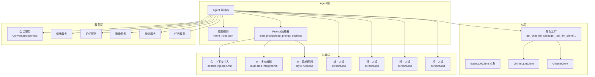
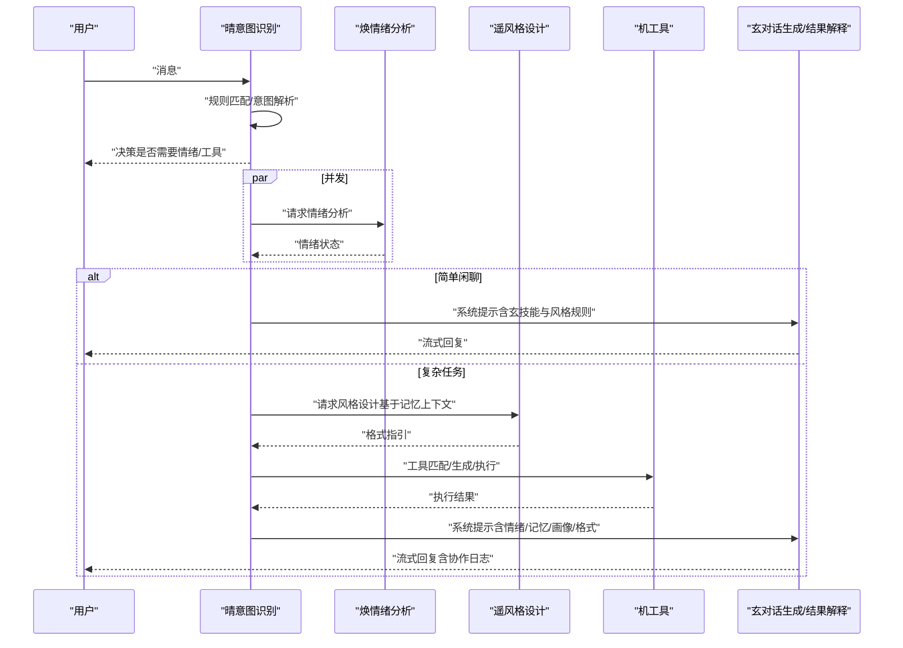
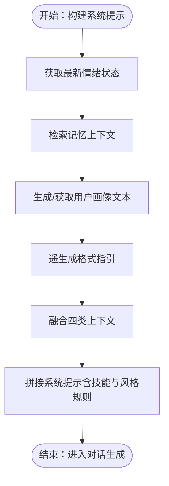
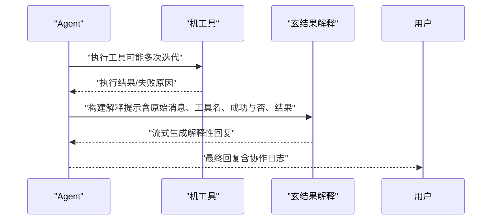
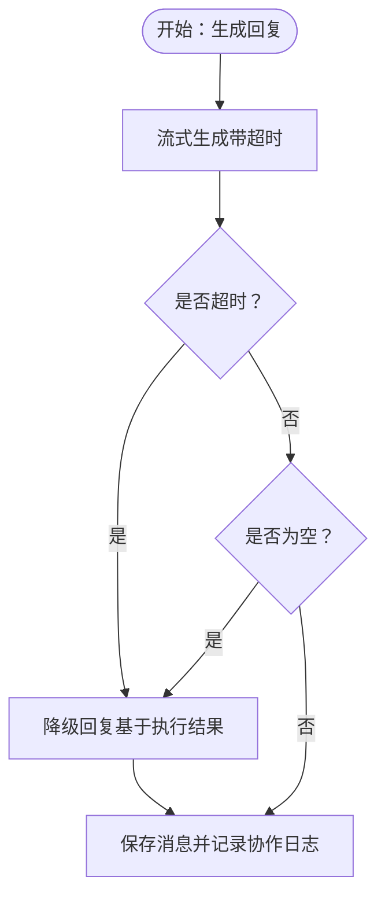
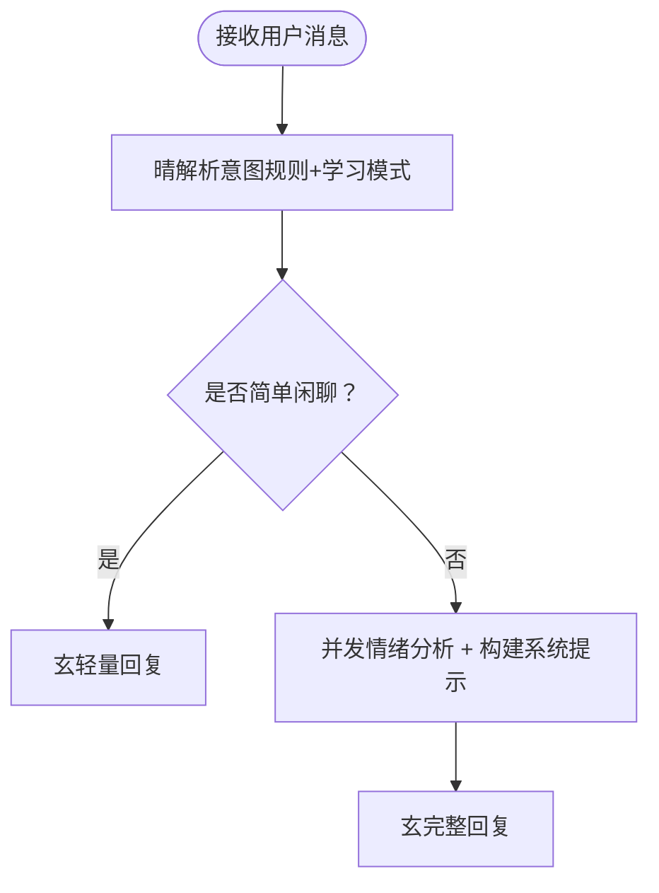
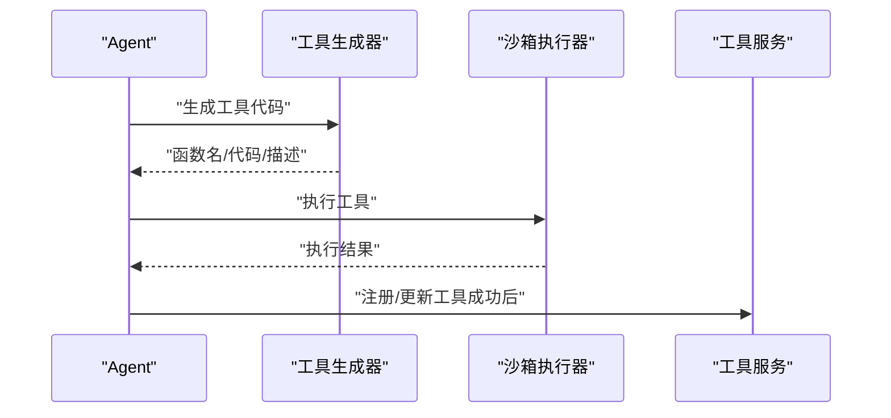
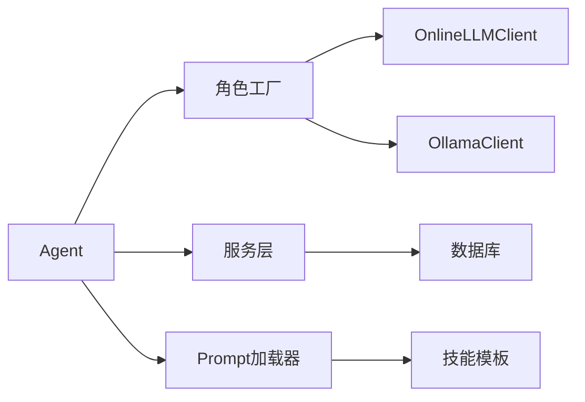

# 玄 - 对话生成智能体

<cite>
**本文引用的文件**
- [backend/app/ai/agent.py](file://backend/app/ai/agent.py)
- [backend/app/ai/base.py](file://backend/app/ai/base.py)
- [backend/app/ai/factory.py](file://backend/app/ai/factory.py)
- [backend/app/ai/online.py](file://backend/app/ai/online.py)
- [backend/app/ai/ollama.py](file://backend/app/ai/ollama.py)
- [backend/app/ai/tool_generator.py](file://backend/app/ai/tool_generator.py)
- [backend/app/ai/intent_rules.json](file://backend/app/ai/intent_rules.json)
- [backend/app/ai/skills/xuanji-xuan/context-injection.md](file://backend/app/ai/skills/xuanji-xuan/context-injection.md)
- [backend/app/ai/skills/xuanji-xuan/multi-step-interpret.md](file://backend/app/ai/skills/xuanji-xuan/multi-step-interpret.md)
- [backend/app/ai/skills/xuanji-xuan/style-rules.md](file://backend/app/ai/skills/xuanji-xuan/style-rules.md)
- [backend/app/ai/skills/xuanji-xuan/persona.md](file://backend/app/ai/skills/xuanji-xuan/persona.md)
- [backend/app/ai/skills/xuanji-huan/persona.md](file://backend/app/ai/skills/xuanji-huan/persona.md)
- [backend/app/ai/skills/xuanji-yao/persona.md](file://backend/app/ai/skills/xuanji-yao/persona.md)
- [backend/app/ai/skills/xuanji-qing/persona.md](file://backend/app/ai/skills/xuanji-qing/persona.md)
- [backend/app/ai/skills/xuanji-ji/persona.md](file://backend/app/ai/skills/xuanji-ji/persona.md)
- [backend/app/services/conversation_service.py](file://backend/app/services/conversation_service.py)
</cite>

## 目录
1. [简介](#简介)
2. [项目结构](#项目结构)
3. [核心组件](#核心组件)
4. [架构总览](#架构总览)
5. [详细组件分析](#详细组件分析)
6. [依赖关系分析](#依赖关系分析)
7. [性能考量](#性能考量)
8. [故障排查指南](#故障排查指南)
9. [结论](#结论)
10. [附录](#附录)

## 简介
本文件面向“玄”这一对话生成智能体，系统化阐述其在多智能体协作体系中的核心职责：基于多智能体协同信息生成自然语言回复、注入上下文信息、处理多步骤任务解释、遵循风格规则约束。文档聚焦以下能力与机制：
- 上下文注入：情绪上下文、记忆片段、用户画像、格式指引的融合策略
- 多步骤解释：将工具执行结果与多源信息整合为连贯、口语化的回复
- 个性化风格适配：依据遥的风格设计结果与严格规则约束，生成符合“玄”的人设与表达风格
- 回复质量保证：通过流式输出、超时控制、降级策略与协作日志保障用户体验与一致性

## 项目结构
后端采用分层+多智能体协作架构：
- AI 层：统一抽象 LLM 客户端接口，按角色工厂化创建对话、工具、意图、情绪、格式等客户端
- Agent 层：编排多智能体协作，负责意图解析、工具匹配/生成、结果解释、上下文注入与回复生成
- 服务层：围绕会话、记忆、情绪、身份、任务等提供持久化与状态管理
- 技能层：以“技能模板”形式定义各智能体的行为规范、上下文注入与风格规则

图表来源
- [backend/app/ai/agent.py](file://backend/app/ai/agent.py)
- [backend/app/ai/factory.py](file://backend/app/ai/factory.py)
- [backend/app/ai/base.py](file://backend/app/ai/base.py)
- [backend/app/ai/online.py](file://backend/app/ai/online.py)
- [backend/app/ai/ollama.py](file://backend/app/ai/ollama.py)
- [backend/app/ai/intent_rules.json](file://backend/app/ai/intent_rules.json)
- [backend/app/ai/skills/xuanji-xuan/context-injection.md](file://backend/app/ai/skills/xuanji-xuan/context-injection.md)
- [backend/app/ai/skills/xuanji-xuan/multi-step-interpret.md](file://backend/app/ai/skills/xuanji-xuan/multi-step-interpret.md)
- [backend/app/ai/skills/xuanji-xuan/style-rules.md](file://backend/app/ai/skills/xuanji-xuan/style-rules.md)
- [backend/app/ai/skills/xuanji-huan/persona.md](file://backend/app/ai/skills/xuanji-huan/persona.md)
- [backend/app/ai/skills/xuanji-yao/persona.md](file://backend/app/ai/skills/xuanji-yao/persona.md)
- [backend/app/ai/skills/xuanji-qing/persona.md](file://backend/app/ai/skills/xuanji-qing/persona.md)
- [backend/app/ai/skills/xuanji-ji/persona.md](file://backend/app/ai/skills/xuanji-ji/persona.md)
- [backend/app/services/conversation_service.py](file://backend/app/services/conversation_service.py)

章节来源
- [backend/app/ai/agent.py](file://backend/app/ai/agent.py)
- [backend/app/ai/factory.py](file://backend/app/ai/factory.py)
- [backend/app/ai/base.py](file://backend/app/ai/base.py)
- [backend/app/ai/online.py](file://backend/app/ai/online.py)
- [backend/app/ai/ollama.py](file://backend/app/ai/ollama.py)
- [backend/app/ai/intent_rules.json](file://backend/app/ai/intent_rules.json)
- [backend/app/ai/skills/xuanji-xuan/context-injection.md](file://backend/app/ai/skills/xuanji-xuan/context-injection.md)
- [backend/app/ai/skills/xuanji-xuan/multi-step-interpret.md](file://backend/app/ai/skills/xuanji-xuan/multi-step-interpret.md)
- [backend/app/ai/skills/xuanji-xuan/style-rules.md](file://backend/app/ai/skills/xuanji-xuan/style-rules.md)
- [backend/app/ai/skills/xuanji-huan/persona.md](file://backend/app/ai/skills/xuanji-huan/persona.md)
- [backend/app/ai/skills/xuanji-yao/persona.md](file://backend/app/ai/skills/xuanji-yao/persona.md)
- [backend/app/ai/skills/xuanji-qing/persona.md](file://backend/app/ai/skills/xuanji-qing/persona.md)
- [backend/app/ai/skills/xuanji-ji/persona.md](file://backend/app/ai/skills/xuanji-ji/persona.md)
- [backend/app/services/conversation_service.py](file://backend/app/services/conversation_service.py)

## 核心组件
- 统一 LLM 客户端抽象与实现
  - BaseLLMClient：定义 chat 与 stream_chat 的统一接口
  - OnlineLLMClient：对接在线 OpenAI 风格 API，支持流式与非流式
  - OllamaClient：对接本地 Ollama 推理服务，支持流式与非流式
- 角色工厂：按用户设置动态创建不同角色的 LLM 客户端，严格校验配置
- Agent 编排器：多智能体协作主控制器，负责意图解析、工具匹配/生成、结果解释、上下文注入与回复生成
- Prompt 加载器：从技能目录加载模板与分段提示，支持 JSON 配置与分节加载
- 服务层：会话、记忆、情绪、画像、身份、任务等服务，支撑上下文与状态管理
- 技能模板：玄的上下文注入、多步解释、风格规则与各智能体人设

章节来源
- [backend/app/ai/base.py](file://backend/app/ai/base.py)
- [backend/app/ai/online.py](file://backend/app/ai/online.py)
- [backend/app/ai/ollama.py](file://backend/app/ai/ollama.py)
- [backend/app/ai/factory.py](file://backend/app/ai/factory.py)
- [backend/app/ai/agent.py](file://backend/app/ai/agent.py)
- [backend/app/ai/tool_generator.py](file://backend/app/ai/tool_generator.py)
- [backend/app/ai/skills/xuanji-xuan/context-injection.md](file://backend/app/ai/skills/xuanji-xuan/context-injection.md)
- [backend/app/ai/skills/xuanji-xuan/multi-step-interpret.md](file://backend/app/ai/skills/xuanji-xuan/multi-step-interpret.md)
- [backend/app/ai/skills/xuanji-xuan/style-rules.md](file://backend/app/ai/skills/xuanji-xuan/style-rules.md)
- [backend/app/ai/skills/xuanji-huan/persona.md](file://backend/app/ai/skills/xuanji-huan/persona.md)
- [backend/app/ai/skills/xuanji-yao/persona.md](file://backend/app/ai/skills/xuanji-yao/persona.md)
- [backend/app/ai/skills/xuanji-qing/persona.md](file://backend/app/ai/skills/xuanji-qing/persona.md)
- [backend/app/ai/skills/xuanji-ji/persona.md](file://backend/app/ai/skills/xuanji-ji/persona.md)
- [backend/app/services/conversation_service.py](file://backend/app/services/conversation_service.py)

## 架构总览
玄在多智能体协作中的职责与交互如下：
- 晴（意图识别）：快速规则匹配与意图描述，决定是否需要情绪分析与工具路径
- 焕（情绪分析）：并发启动，产出情绪状态与深层需求，供后续上下文注入
- 遥（风格设计）：基于记忆上下文生成格式指引（结构、长度、风格、特殊元素、避免事项）
- 机（工具）：工具匹配/生成/执行，失败时自动迭代修复
- 玄（对话生成）：整合情绪、记忆、画像、格式指引与历史会话，生成自然口语化回复；在工具路径中负责结果解释与降级兜底

图表来源
- [backend/app/ai/agent.py](file://backend/app/ai/agent.py)
- [backend/app/ai/intent_rules.json](file://backend/app/ai/intent_rules.json)
- [backend/app/ai/skills/xuanji-xuan/context-injection.md](file://backend/app/ai/skills/xuanji-xuan/context-injection.md)
- [backend/app/ai/skills/xuanji-xuan/multi-step-interpret.md](file://backend/app/ai/skills/xuanji-xuan/multi-step-interpret.md)
- [backend/app/ai/skills/xuanji-xuan/style-rules.md](file://backend/app/ai/skills/xuanji-xuan/style-rules.md)

## 详细组件分析

### 组件A：上下文注入机制（情绪/记忆/画像/格式）
- 情绪上下文注入：从情绪服务获取最新情绪状态（主情绪、强度、深层需求、风险等级、沟通建议等），在系统提示中自然融入，避免术语化表达
- 记忆上下文注入：从记忆服务检索短期/长期记忆片段，自然融入对话，体现陪伴感与个性化
- 用户画像注入：从画像服务生成的文本中抽取关键特征，提升回复的个性化与共情
- 格式上下文注入：遥根据记忆上下文生成格式指引（结构、长度、风格、特殊元素、避免事项），确保回复符合“玄”的风格与规范

图表来源
- [backend/app/ai/agent.py](file://backend/app/ai/agent.py)
- [backend/app/ai/skills/xuanji-xuan/context-injection.md](file://backend/app/ai/skills/xuanji-xuan/context-injection.md)
- [backend/app/ai/skills/xuanji-xuan/style-rules.md](file://backend/app/ai/skills/xuanji-xuan/style-rules.md)
- [backend/app/services/conversation_service.py](file://backend/app/services/conversation_service.py)

章节来源
- [backend/app/ai/agent.py](file://backend/app/ai/agent.py)
- [backend/app/ai/skills/xuanji-xuan/context-injection.md](file://backend/app/ai/skills/xuanji-xuan/context-injection.md)
- [backend/app/ai/skills/xuanji-xuan/style-rules.md](file://backend/app/ai/skills/xuanji-xuan/style-rules.md)
- [backend/app/services/conversation_service.py](file://backend/app/services/conversation_service.py)

### 组件B：多步骤任务解释流程
- 当意图描述较长或涉及多个条件时，触发多步规划与执行
- 玄在工具路径中负责将工具执行结果与多源信息整合，生成自然口语化、有深度的回复
- 若部分信息获取失败，自然提及并给出替代建议；不罗列技术细节，避免结构化排版

图表来源
- [backend/app/ai/agent.py](file://backend/app/ai/agent.py)
- [backend/app/ai/skills/xuanji-xuan/multi-step-interpret.md](file://backend/app/ai/skills/xuanji-xuan/multi-step-interpret.md)

章节来源
- [backend/app/ai/agent.py](file://backend/app/ai/agent.py)
- [backend/app/ai/skills/xuanji-xuan/multi-step-interpret.md](file://backend/app/ai/skills/xuanji-xuan/multi-step-interpret.md)

### 组件C：个性化风格适配与回复质量保证
- 风格规则：严格禁止括号动作/场景描写、星号动作、角色扮演/小说式表达、结构化排版等，确保回复自然口语化
- 人设适配：结合“玄”的细腻、坚韧、温柔、通透、独立、认真负责等特质，调整语气与节奏
- 流式输出与超时控制：对流式回复设置总时长与分片超时，防止长时间卡顿
- 降级策略：当 LLM 异常或结果为空时，提供可读性强的降级回复，并记录协作日志

图表来源
- [backend/app/ai/agent.py](file://backend/app/ai/agent.py)
- [backend/app/ai/skills/xuanji-xuan/style-rules.md](file://backend/app/ai/skills/xuanji-xuan/style-rules.md)

章节来源
- [backend/app/ai/agent.py](file://backend/app/ai/agent.py)
- [backend/app/ai/skills/xuanji-xuan/style-rules.md](file://backend/app/ai/skills/xuanji-xuan/style-rules.md)

### 组件D：意图解析与分流策略
- 快速规则匹配：基于关键字与学习模式，快速判定是否需要情绪分析与工具路径
- 简单闲聊路径：直接使用“玄”的系统提示与风格规则，生成轻量回复
- 复杂任务路径：并发启动情绪分析，构建带记忆与格式指引的系统提示，进入完整对话生成

图表来源
- [backend/app/ai/agent.py](file://backend/app/ai/agent.py)
- [backend/app/ai/intent_rules.json](file://backend/app/ai/intent_rules.json)

章节来源
- [backend/app/ai/agent.py](file://backend/app/ai/agent.py)
- [backend/app/ai/intent_rules.json](file://backend/app/ai/intent_rules.json)

### 组件E：工具生成与执行（机）
- 工具生成：基于描述生成 Python 工具代码，提取函数名与中英文描述，进行语法与安全校验
- 工具执行：在沙箱中执行，支持失败后的自动迭代修复与版本快照
- 结果回传：将执行结果与元信息回传给 Agent，由玄进行解释与回复

图表来源
- [backend/app/ai/tool_generator.py](file://backend/app/ai/tool_generator.py)
- [backend/app/ai/agent.py](file://backend/app/ai/agent.py)

章节来源
- [backend/app/ai/tool_generator.py](file://backend/app/ai/tool_generator.py)
- [backend/app/ai/agent.py](file://backend/app/ai/agent.py)

## 依赖关系分析
- 组件耦合与内聚
  - Agent 对各服务与工厂高度依赖，但通过统一接口与配置驱动，降低实现耦合
  - Prompt 加载器与技能模板解耦，便于维护与扩展
- 直接与间接依赖
  - Agent 直接依赖工厂与服务；间接依赖 LLM 提供商（Online/Ollama）
  - 工具生成器依赖验证器与工厂，间接依赖 LLM
- 外部依赖与集成点
  - 在线模型：OpenAI 风格 API，需正确配置 base_url 与 api_key
  - 本地模型：Ollama，需正确配置 base_url 与 model
- 接口契约与实现细节
  - BaseLLMClient 统一 chat/stream_chat 签名，确保各角色客户端一致行为
  - 角色工厂严格校验配置缺失，避免运行期异常

图表来源
- [backend/app/ai/agent.py](file://backend/app/ai/agent.py)
- [backend/app/ai/factory.py](file://backend/app/ai/factory.py)
- [backend/app/ai/base.py](file://backend/app/ai/base.py)
- [backend/app/ai/skills/xuanji-xuan/context-injection.md](file://backend/app/ai/skills/xuanji-xuan/context-injection.md)

章节来源
- [backend/app/ai/agent.py](file://backend/app/ai/agent.py)
- [backend/app/ai/factory.py](file://backend/app/ai/factory.py)
- [backend/app/ai/base.py](file://backend/app/ai/base.py)

## 性能考量
- 流式输出与超时控制：对流式回复设置总时长与分片超时，避免长时间阻塞
- 并发与资源竞争：情绪分析与工具执行并发进行，注意资源占用与超时处理
- 缓存与模板加载：Prompt 加载器使用 LRU 缓存，减少重复 IO
- 用量统计与记录：通过 usage_callback 收集 token 使用，完成后补录后置用量

## 故障排查指南
- LLM 配置错误
  - 现象：初始化角色客户端时报错
  - 排查：检查用户设置中的 provider、api_key、base_url、model 等字段
  - 参考
    - [backend/app/ai/factory.py](file://backend/app/ai/factory.py)
- 流式回复异常
  - 现象：回复卡顿或无输出
  - 排查：检查网络连通性、超时设置、LLM 返回格式（如 think 标签过滤）
  - 参考
    - [backend/app/ai/online.py](file://backend/app/ai/online.py)
    - [backend/app/ai/ollama.py](file://backend/app/ai/ollama.py)
- 工具生成/执行失败
  - 现象：工具生成失败或执行异常
  - 排查：查看生成器日志、验证器错误、沙箱执行器异常
  - 参考
    - [backend/app/ai/tool_generator.py](file://backend/app/ai/tool_generator.py)
    - [backend/app/ai/agent.py](file://backend/app/ai/agent.py)
- 协作日志缺失
  - 现象：前端未显示协作日志
  - 排查：确认 finally 分支是否正常发送 done 与 collaboration 事件
  - 参考
    - [backend/app/ai/agent.py](file://backend/app/ai/agent.py)

章节来源
- [backend/app/ai/factory.py](file://backend/app/ai/factory.py)
- [backend/app/ai/online.py](file://backend/app/ai/online.py)
- [backend/app/ai/ollama.py](file://backend/app/ai/ollama.py)
- [backend/app/ai/tool_generator.py](file://backend/app/ai/tool_generator.py)
- [backend/app/ai/agent.py](file://backend/app/ai/agent.py)

## 结论
“玄”作为对话生成智能体，通过与晴、焕、遥、机的紧密协作，实现了：
- 基于多源上下文的自然语言生成
- 多步骤任务的整合解释与口语化表达
- 严格的风格规则约束与个性化适配
- 流式输出、超时控制与降级兜底的质量保障

其架构以统一抽象与工厂化配置为核心，配合技能模板与服务层，形成高内聚、低耦合、易扩展的对话生成体系。

## 附录
- 技能模板与人设参考
  - 玄：上下文注入、多步解释、风格规则、人设
  - 焕：人设
  - 遥：人设
  - 晴：人设
  - 机：人设
- 关键实现路径
  - 上下文注入：[backend/app/ai/skills/xuanji-xuan/context-injection.md](file://backend/app/ai/skills/xuanji-xuan/context-injection.md)
  - 多步解释：[backend/app/ai/skills/xuanji-xuan/multi-step-interpret.md](file://backend/app/ai/skills/xuanji-xuan/multi-step-interpret.md)
  - 风格规则：[backend/app/ai/skills/xuanji-xuan/style-rules.md](file://backend/app/ai/skills/xuanji-xuan/style-rules.md)
  - 玄人设：[backend/app/ai/skills/xuanji-xuan/persona.md](file://backend/app/ai/skills/xuanji-xuan/persona.md)
  - 焕人设：[backend/app/ai/skills/xuanji-huan/persona.md](file://backend/app/ai/skills/xuanji-huan/persona.md)
  - 遥人设：[backend/app/ai/skills/xuanji-yao/persona.md](file://backend/app/ai/skills/xuanji-yao/persona.md)
  - 晴人设：[backend/app/ai/skills/xuanji-qing/persona.md](file://backend/app/ai/skills/xuanji-qing/persona.md)
  - 机人设：[backend/app/ai/skills/xuanji-ji/persona.md](file://backend/app/ai/skills/xuanji-ji/persona.md)
- 意图规则
  - [backend/app/ai/intent_rules.json](file://backend/app/ai/intent_rules.json)
- 服务与模型
  - 会话服务：[backend/app/services/conversation_service.py](file://backend/app/services/conversation_service.py)
  - 在线模型：[backend/app/ai/online.py](file://backend/app/ai/online.py)
  - 本地模型：[backend/app/ai/ollama.py](file://backend/app/ai/ollama.py)
  - 角色工厂：[backend/app/ai/factory.py](file://backend/app/ai/factory.py)
  - 基础抽象：[backend/app/ai/base.py](file://backend/app/ai/base.py)
  - 工具生成器：[backend/app/ai/tool_generator.py](file://backend/app/ai/tool_generator.py)