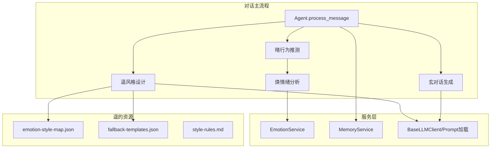
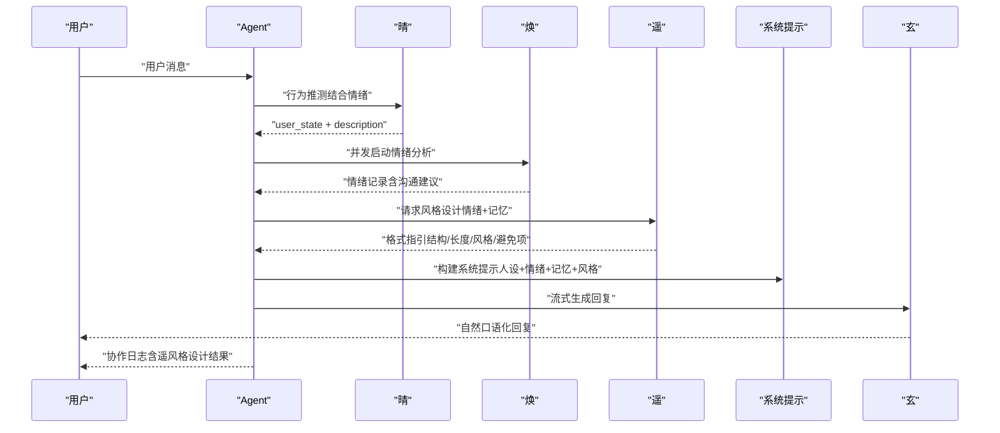
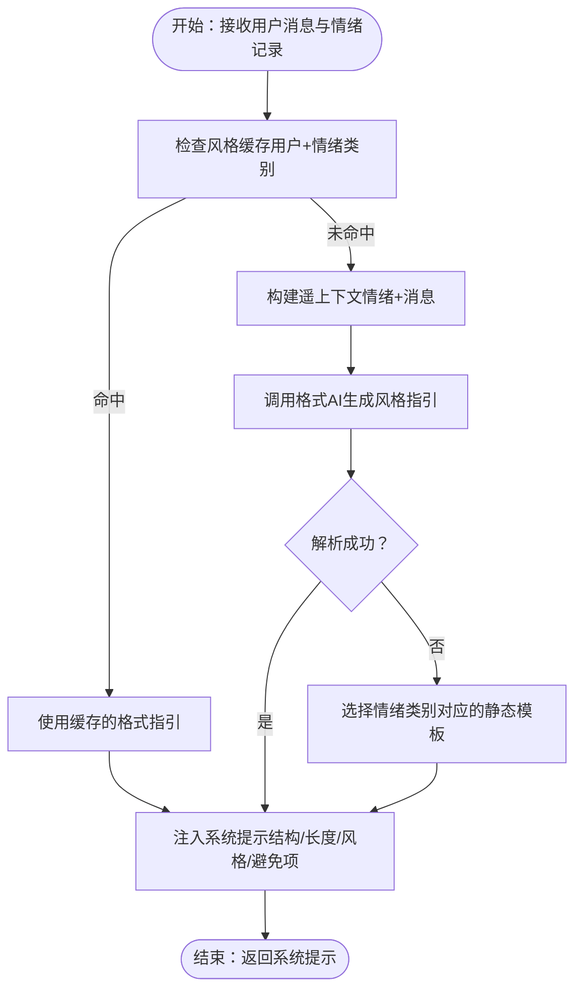
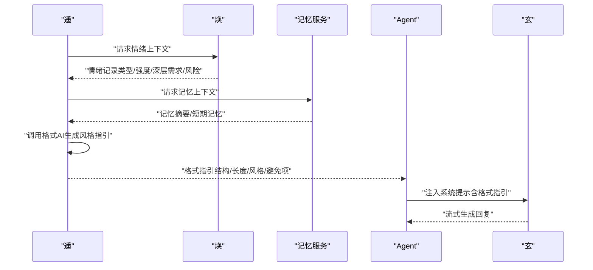
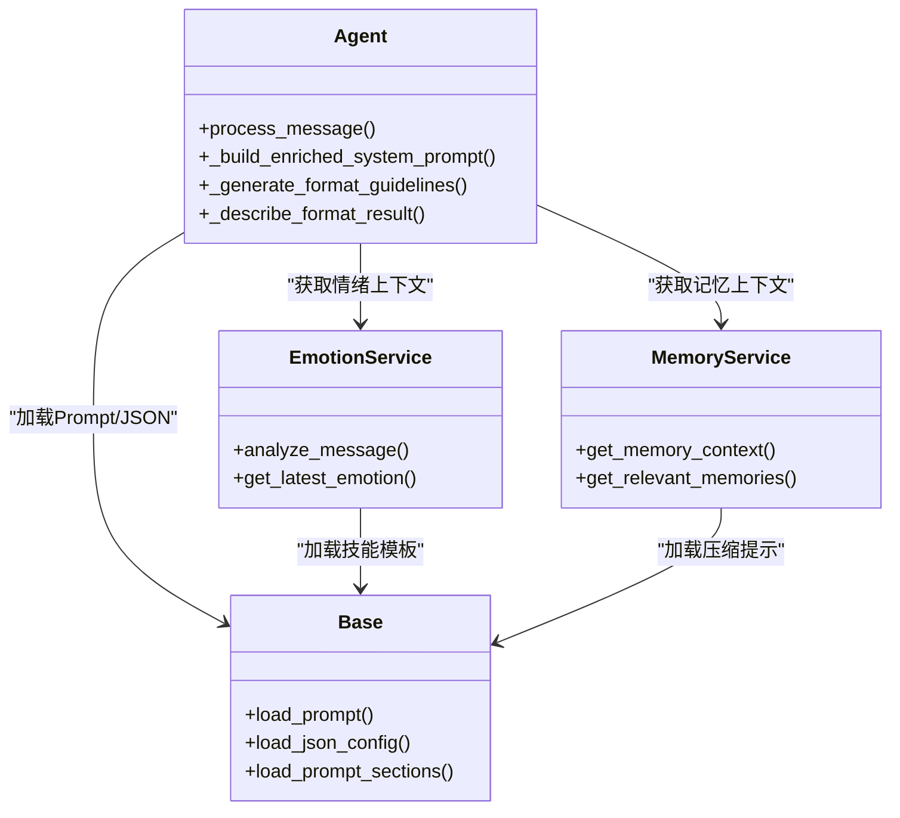
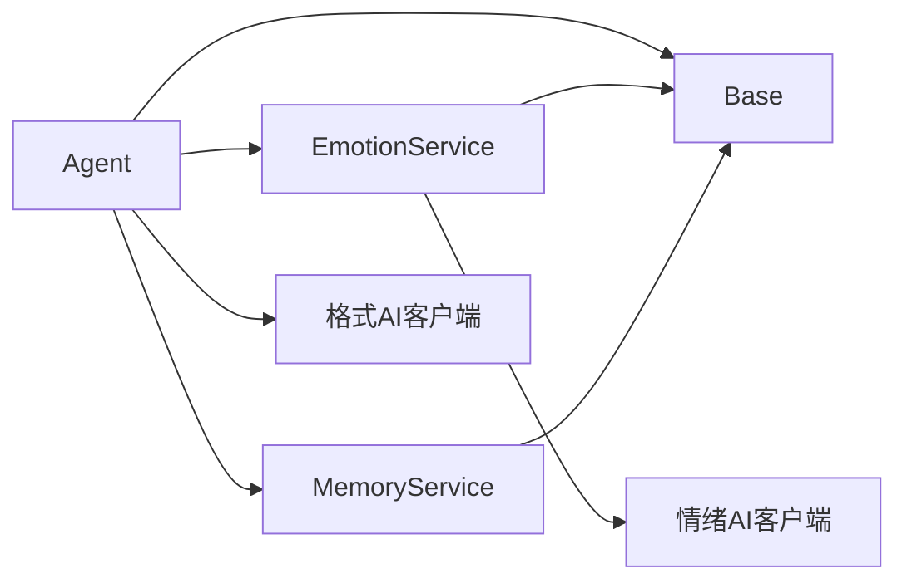
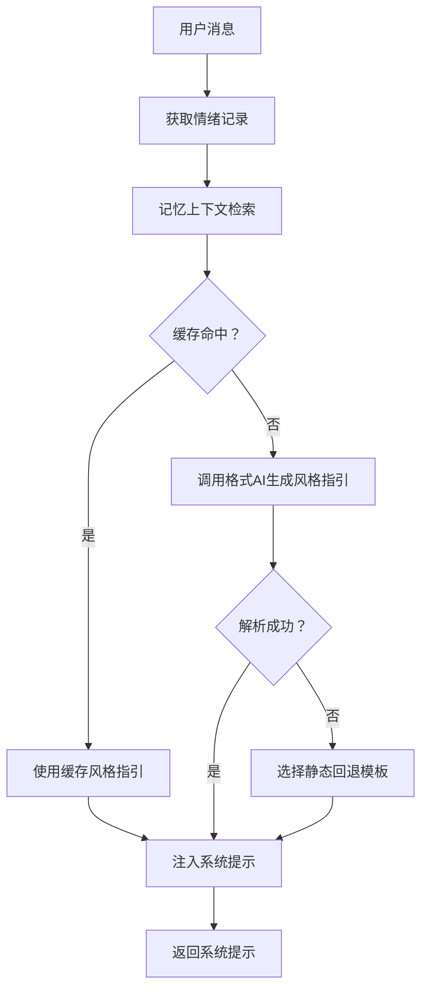

# 遥 - 风格设计智能体

<cite>
**本文引用的文件**
- [backend/app/ai/agent.py](file://backend/app/ai/agent.py)
- [backend/app/services/emotion_service.py](file://backend/app/services/emotion_service.py)
- [backend/app/services/memory_service.py](file://backend/app/services/memory_service.py)
- [backend/app/ai/base.py](file://backend/app/ai/base.py)
- [backend/app/ai/intent_rules.json](file://backend/app/ai/intent_rules.json)
- [backend/app/ai/skills/xuanji-yao/persona.md](file://backend/app/ai/skills/xuanji-yao/persona.md)
- [backend/app/ai/skills/xuanji-yao/emotion-format.md](file://backend/app/ai/skills/xuanji-yao/emotion-format.md)
- [backend/app/ai/skills/xuanji-yao/emotion-style-map.json](file://backend/app/ai/skills/xuanji-yao/emotion-style-map.json)
- [backend/app/ai/skills/xuanji-yao/fallback-templates.json](file://backend/app/ai/skills/xuanji-yao/fallback-templates.json)
- [backend/app/ai/skills/xuanji-xuan/style-rules.md](file://backend/app/ai/skills/xuanji-xuan/style-rules.md)
- [backend/app/ai/skills/xuanji-huan/SKILL.md](file://backend/app/ai/skills/xuanji-huan/SKILL.md)
- [backend/app/ai/skills/xuanji-ji/SKILL.md](file://backend/app/ai/skills/xuanji-ji/SKILL.md)
- [backend/app/ai/skills/xuanji-qing/SKILL.md](file://backend/app/ai/skills/xuanji-qing/SKILL.md)
</cite>

## 目录
1. [简介](#简介)
2. [项目结构](#项目结构)
3. [核心组件](#核心组件)
4. [架构总览](#架构总览)
5. [详细组件分析](#详细组件分析)
6. [依赖分析](#依赖分析)
7. [性能考量](#性能考量)
8. [故障排查指南](#故障排查指南)
9. [结论](#结论)
10. [附录](#附录)

## 简介
遥是璇玑系统中的风格设计智能体，负责根据用户情绪状态、对话上下文与记忆片段，动态生成“恰到好处”的回复风格与个性化表达。遥通过与焕（情绪分析）、晴（行为推测）、玄（对话生成）的协作，实现“情感—风格—表达”的一体化闭环：先由焕感知情绪并给出沟通建议，再由遥基于情绪与记忆设计风格，最后由玄在统一的系统提示下生成自然、有温度的回复。遥还维护情感-风格映射表与静态回退模板，确保在LLM不可用或失败时仍能提供一致、稳定的风格输出。

## 项目结构
遥相关能力分布在后端AI技能目录与Agent主流程中：
- 遥的技能定义与风格资源：backend/app/ai/skills/xuanji-yao/
- Agent主流程：backend/app/ai/agent.py（风格设计调用、缓存、回退）
- 情绪服务：backend/app/services/emotion_service.py（提供情绪上下文）
- 记忆服务：backend/app/services/memory_service.py（提供记忆上下文）
- Prompt与配置加载：backend/app/ai/base.py（统一加载技能模板与JSON）
- 规则引擎：backend/app/ai/intent_rules.json（行为推测与关键词学习）

**图示来源**
- [backend/app/ai/agent.py](file://backend/app/ai/agent.py)
- [backend/app/services/emotion_service.py](file://backend/app/services/emotion_service.py)
- [backend/app/services/memory_service.py](file://backend/app/services/memory_service.py)
- [backend/app/ai/base.py](file://backend/app/ai/base.py)
- [backend/app/ai/skills/xuanji-yao/emotion-style-map.json](file://backend/app/ai/skills/xuanji-yao/emotion-style-map.json)
- [backend/app/ai/skills/xuanji-yao/fallback-templates.json](file://backend/app/ai/skills/xuanji-yao/fallback-templates.json)
- [backend/app/ai/skills/xuanji-xuan/style-rules.md](file://backend/app/ai/skills/xuanji-xuan/style-rules.md)

**章节来源**
- [backend/app/ai/agent.py](file://backend/app/ai/agent.py)
- [backend/app/ai/skills/xuanji-yao/persona.md](file://backend/app/ai/skills/xuanji-yao/persona.md)

## 核心组件
- 遥风格设计（Agent._generate_format_guidelines）：根据情绪记录与用户消息，动态生成风格指引；失败时回退到静态模板，并记录回退原因与情绪状态。
- 情绪上下文注入（Agent._build_enriched_system_prompt）：将焕提供的沟通建议、情绪强度、深层需求等注入系统提示，供玄生成回复。
- 记忆上下文注入（MemoryService.get_memory_context）：检索并拼接记忆摘要或短期记忆，作为风格设计与回复生成的背景。
- 风格一致性与回退（Agent._describe_format_result）：在协作日志中描述遥的风格设计结果，包括是否使用静态模板与情绪状态，保证风格一致性可追溯。
- 严格规范约束（style-rules.md）：对回复格式、表达方式、禁止项进行最高优先级约束，确保风格设计不越界。

**章节来源**
- [backend/app/ai/agent.py](file://backend/app/ai/agent.py)
- [backend/app/services/emotion_service.py](file://backend/app/services/emotion_service.py)
- [backend/app/services/memory_service.py](file://backend/app/services/memory_service.py)
- [backend/app/ai/skills/xuanji-xuan/style-rules.md](file://backend/app/ai/skills/xuanji-xuan/style-rules.md)

## 架构总览
遥在对话流程中的位置与协作关系如下：

**图示来源**
- [backend/app/ai/agent.py](file://backend/app/ai/agent.py)
- [backend/app/ai/skills/xuanji-qing/SKILL.md](file://backend/app/ai/skills/xuanji-qing/SKILL.md)
- [backend/app/ai/skills/xuanji-huan/SKILL.md](file://backend/app/ai/skills/xuanji-huan/SKILL.md)
- [backend/app/ai/skills/xuanji-yao/emotion-format.md](file://backend/app/ai/skills/xuanji-yao/emotion-format.md)

## 详细组件分析

### 遥风格设计与情感-风格映射
- 情感-风格映射表（emotion-style-map.json）：将具体情绪（如开心、难过、焦虑、兴奋、孤独、压力、困惑）映射为“语气/节奏/情感色彩”的风格描述；提供默认风格兜底。
- 遥的风格模板系统：遥根据用户消息与情绪记录，调用格式AI生成结构化风格指引（包含结构、长度、风格、特殊元素、避免项），并注入到系统提示中。
- 回退策略：当格式AI不可用或失败时，遥使用按情绪类别（正向/负向/强烈/中性/默认）选择静态回退模板，确保风格一致性与可预期性。
- 缓存机制：按用户+情绪类别缓存风格指引，TTL为30分钟，降低重复计算与延迟。

**图示来源**
- [backend/app/ai/agent.py](file://backend/app/ai/agent.py)
- [backend/app/ai/skills/xuanji-yao/emotion-style-map.json](file://backend/app/ai/skills/xuanji-yao/emotion-style-map.json)
- [backend/app/ai/skills/xuanji-yao/fallback-templates.json](file://backend/app/ai/skills/xuanji-yao/fallback-templates.json)

**章节来源**
- [backend/app/ai/agent.py](file://backend/app/ai/agent.py)
- [backend/app/ai/skills/xuanji-yao/emotion-style-map.json](file://backend/app/ai/skills/xuanji-yao/emotion-style-map.json)
- [backend/app/ai/skills/xuanji-yao/fallback-templates.json](file://backend/app/ai/skills/xuanji-yao/fallback-templates.json)

### 遥的情感格式化机制
- 情感格式化模板（emotion-format.md）：定义回复要求（口语化、自然分段、比喻意象、避免结构化格式等），并注入当前用户情绪与强度，指导风格设计与生成。
- 与焕的协作：遥将“情绪类型/强度/深层需求/风险等级”作为输入，结合记忆上下文，生成风格指引；随后由Agent注入系统提示，确保风格与情感融合。

**图示来源**
- [backend/app/ai/agent.py](file://backend/app/ai/agent.py)
- [backend/app/services/emotion_service.py](file://backend/app/services/emotion_service.py)
- [backend/app/services/memory_service.py](file://backend/app/services/memory_service.py)
- [backend/app/ai/skills/xuanji-yao/emotion-format.md](file://backend/app/ai/skills/xuanji-yao/emotion-format.md)

**章节来源**
- [backend/app/ai/skills/xuanji-yao/emotion-format.md](file://backend/app/ai/skills/xuanji-yao/emotion-format.md)
- [backend/app/services/emotion_service.py](file://backend/app/services/emotion_service.py)
- [backend/app/services/memory_service.py](file://backend/app/services/memory_service.py)

### 遥的个性化参数与一致性保证
- 个性化参数：风格指引包含结构、长度、风格、特殊元素、避免项等，既保证风格多样性，又确保与用户情绪、记忆背景相匹配。
- 一致性保证：协作日志中对遥的风格设计结果进行描述（是否使用静态模板、情绪状态、风格要点），便于前端展示与审计。
- 严格规范约束：style-rules.md对回复格式、禁止项进行最高优先级约束，确保风格设计不越界。

**图示来源**
- [backend/app/ai/agent.py](file://backend/app/ai/agent.py)
- [backend/app/services/emotion_service.py](file://backend/app/services/emotion_service.py)
- [backend/app/services/memory_service.py](file://backend/app/services/memory_service.py)
- [backend/app/ai/base.py](file://backend/app/ai/base.py)

**章节来源**
- [backend/app/ai/agent.py](file://backend/app/ai/agent.py)
- [backend/app/ai/skills/xuanji-xuan/style-rules.md](file://backend/app/ai/skills/xuanji-xuan/style-rules.md)

### 遥与规则引擎的协同
- 规则引擎（intent_rules.json）：由焕在情绪分析过程中贡献关键词与触发话题，机负责规则引擎的迭代优化，遥通过风格设计与系统提示间接受益于更准确的行为推测与情绪上下文。
- 遥的回退模板与规则引擎：静态回退模板按情绪类别选择，与规则引擎中的安全话题列表相互配合，避免敏感话题引发不适。

**章节来源**
- [backend/app/ai/intent_rules.json](file://backend/app/ai/intent_rules.json)
- [backend/app/ai/skills/xuanji-ji/SKILL.md](file://backend/app/ai/skills/xuanji-ji/SKILL.md)
- [backend/app/ai/skills/xuanji-huan/SKILL.md](file://backend/app/ai/skills/xuanji-huan/SKILL.md)

## 依赖分析
- 组件耦合
  - Agent对EmotionService与MemoryService存在强依赖，用于构建系统提示。
  - 遥风格设计依赖emotion-style-map.json与fallback-templates.json，同时受style-rules.md的格式约束。
  - Base模块提供统一的Prompt与JSON加载，降低各模块间的文件路径与格式差异。
- 外部依赖
  - 格式AI客户端（get_format_llm_client）：用于动态生成风格指引；若不可用则回退到静态模板。
  - 情绪AI客户端（get_emotion_llm_client）：用于记忆压缩与情绪分析，间接支撑遥的上下文质量。

**图示来源**
- [backend/app/ai/agent.py](file://backend/app/ai/agent.py)
- [backend/app/services/emotion_service.py](file://backend/app/services/emotion_service.py)
- [backend/app/services/memory_service.py](file://backend/app/services/memory_service.py)
- [backend/app/ai/base.py](file://backend/app/ai/base.py)

**章节来源**
- [backend/app/ai/agent.py](file://backend/app/ai/agent.py)
- [backend/app/ai/base.py](file://backend/app/ai/base.py)

## 性能考量
- 缓存策略：遥风格设计结果按用户+情绪类别缓存，TTL 30分钟，显著降低重复请求成本。
- 并发与流式：Agent对情绪分析采用异步并发，避免阻塞对话主流程；回复生成采用流式输出，提升感知延迟表现。
- 规则学习与回退：通过规则引擎学习用户情绪关键词与触发话题，减少格式AI调用频率；失败时快速回退到静态模板，保证稳定性。

[本节为通用性能讨论，无需特定文件引用]

## 故障排查指南
- 格式AI不可用或失败
  - 现象：风格设计回退到静态模板，协作日志显示“使用静态风格模板（情绪状态：…）”。
  - 排查：检查格式AI客户端配置与可用性；查看遥的调用日志与usage回调。
  - 参考
    - [backend/app/ai/agent.py](file://backend/app/ai/agent.py)
- 情绪AI配置缺失
  - 现象：记忆压缩与情绪分析跳过，协作日志记录警告。
  - 排查：确认情绪AI客户端配置；检查记忆服务的压缩流程。
  - 参考
    - [backend/app/services/memory_service.py](file://backend/app/services/memory_service.py)
    - [backend/app/services/emotion_service.py](file://backend/app/services/emotion_service.py)
- 风格不符合预期
  - 现象：风格指引与用户情绪不匹配或过于模板化。
  - 排查：检查emotion-style-map.json与fallback-templates.json；确认协作日志中遥的风格设计描述。
  - 参考
    - [backend/app/ai/agent.py](file://backend/app/ai/agent.py)
    - [backend/app/ai/skills/xuanji-yao/emotion-style-map.json](file://backend/app/ai/skills/xuanji-yao/emotion-style-map.json)
    - [backend/app/ai/skills/xuanji-yao/fallback-templates.json](file://backend/app/ai/skills/xuanji-yao/fallback-templates.json)

**章节来源**
- [backend/app/ai/agent.py](file://backend/app/ai/agent.py)
- [backend/app/services/memory_service.py](file://backend/app/services/memory_service.py)
- [backend/app/services/emotion_service.py](file://backend/app/services/emotion_service.py)

## 结论
遥通过“情感-风格-表达”的闭环设计，将用户情绪与记忆背景转化为可执行的风格指引，并在格式AI不可用时提供稳健的回退策略。其与焕、晴、玄的协作确保风格与内容的一致性与温度，同时借助规则引擎与缓存机制提升性能与稳定性。未来可在风格模板的动态学习与个性化权重调节方面进一步优化，以适应更复杂的用户偏好与情境变化。

[本节为总结性内容，无需特定文件引用]

## 附录

### 遥的风格设计流程（代码级示意）
- 输入：用户消息、情绪记录、记忆上下文
- 处理：
  - 情绪类别归类与缓存检查
  - 调用格式AI生成风格指引
  - 解析并注入系统提示
  - 记录协作日志与回退信息
- 输出：系统提示（含风格指引），供玄生成回复

**图示来源**
- [backend/app/ai/agent.py](file://backend/app/ai/agent.py)
- [backend/app/services/memory_service.py](file://backend/app/services/memory_service.py)
- [backend/app/ai/skills/xuanji-yao/fallback-templates.json](file://backend/app/ai/skills/xuanji-yao/fallback-templates.json)