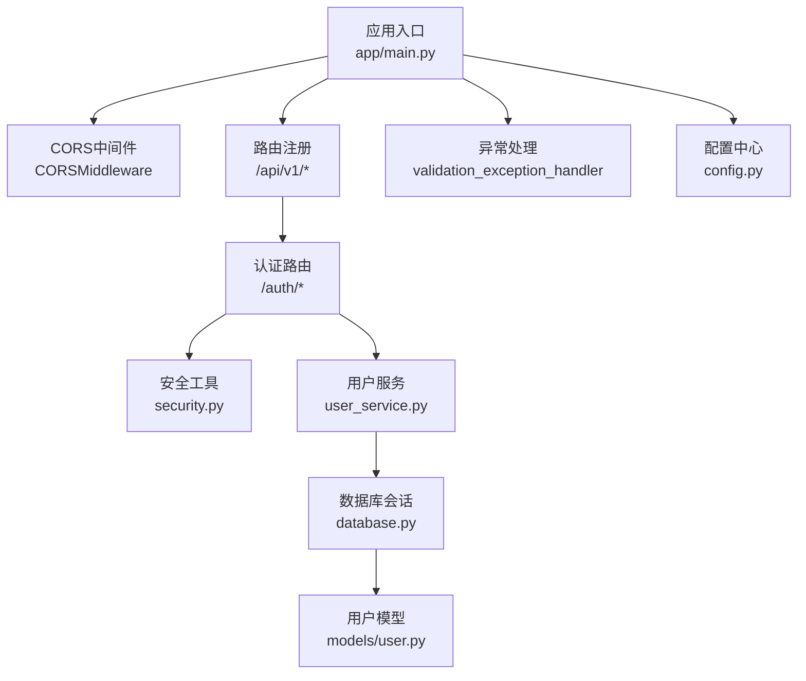
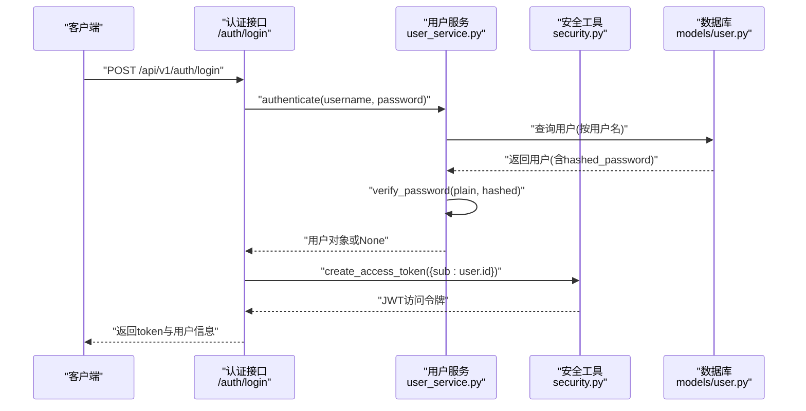
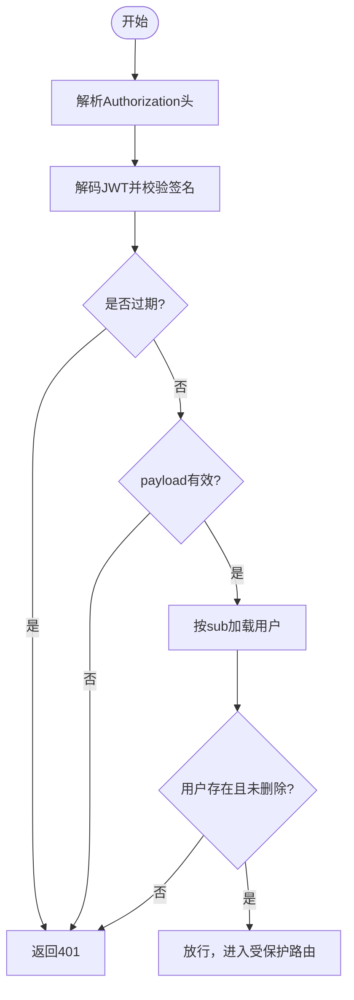
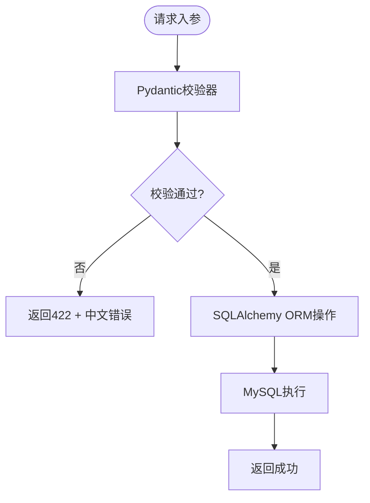
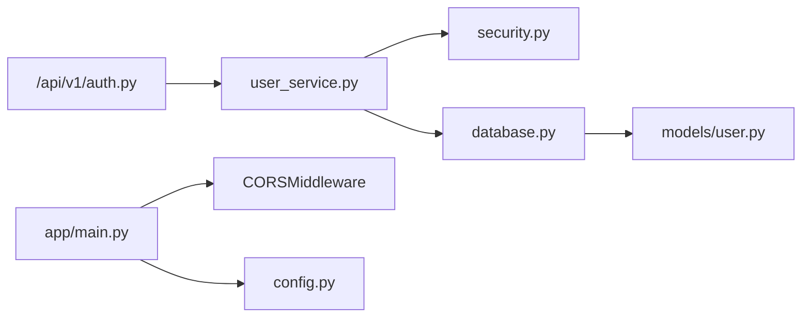

# 安全架构设计

<cite>
**本文引用的文件**
- [backend/app/main.py](file://backend/app/main.py)
- [backend/app/core/config.py](file://backend/app/core/config.py)
- [backend/app/core/security.py](file://backend/app/core/security.py)
- [backend/app/core/deps.py](file://backend/app/core/deps.py)
- [backend/app/core/database.py](file://backend/app/core/database.py)
- [backend/app/api/v1/auth.py](file://backend/app/api/v1/auth.py)
- [backend/app/schemas/user.py](file://backend/app/schemas/user.py)
- [backend/app/models/user.py](file://backend/app/models/user.py)
- [backend/app/services/user_service.py](file://backend/app/services/user_service.py)
- [backend/app/core/exceptions.py](file://backend/app/core/exceptions.py)
</cite>

## 目录
1. [引言](#引言)
2. [项目结构](#项目结构)
3. [核心组件](#核心组件)
4. [架构总览](#架构总览)
5. [详细组件分析](#详细组件分析)
6. [依赖分析](#依赖分析)
7. [性能考量](#性能考量)
8. [故障排查指南](#故障排查指南)
9. [结论](#结论)
10. [附录](#附录)

## 引言
本设计文档聚焦于XuanJi系统的安全架构，围绕认证授权、CORS配置、输入验证、SQL注入防护、权限控制模型、密码存储与会话管理、CSRF防护、安全中间件与异常处理、日志审计以及威胁建模与防护策略进行系统化梳理。文档旨在帮助开发者与运维人员全面理解系统安全设计，并提供可操作的实施建议。

## 项目结构
后端采用FastAPI + SQLAlchemy架构，安全相关的关键模块分布如下：
- 应用入口与中间件：FastAPI应用、CORS中间件、异常处理器
- 配置中心：集中管理密钥、CORS允许域、数据库连接等
- 安全工具：JWT编码/解码、密码哈希/校验
- 认证与授权：认证接口、Bearer Token解析、当前用户依赖
- 数据层：数据库初始化、会话管理、自动迁移
- 模型与校验：用户模型、Pydantic输入校验器
- 服务层：用户业务逻辑（注册/登录/认证）

图表来源
- [backend/app/main.py:30-60](file://backend/app/main.py#L30-L60)
- [backend/app/api/v1/auth.py:14-61](file://backend/app/api/v1/auth.py#L14-L61)
- [backend/app/core/security.py:24-38](file://backend/app/core/security.py#L24-L38)
- [backend/app/services/user_service.py:12-31](file://backend/app/services/user_service.py#L12-L31)
- [backend/app/core/database.py:14-19](file://backend/app/core/database.py#L14-L19)
- [backend/app/models/user.py:9-23](file://backend/app/models/user.py#L9-L23)

章节来源
- [backend/app/main.py:30-60](file://backend/app/main.py#L30-L60)
- [backend/app/core/config.py:40-47](file://backend/app/core/config.py#L40-L47)

## 核心组件
- JWT认证与会话
  - 使用HS256算法的对称签名JWT，包含过期时间与用户标识，用于无状态会话。
  - 访问令牌生成与解码分别在安全工具模块中实现。
- CORS配置
  - 通过配置中心读取允许的源列表，默认允许本地开发前端地址。
- 输入验证
  - 使用Pydantic模型与字段校验器对用户名、密码、邮箱等进行强约束。
- SQL注入防护
  - 使用SQLAlchemy ORM，避免原生SQL拼接，降低注入风险。
- 权限控制与访问控制
  - 当前实现为基于Bearer Token的用户身份解析，未发现显式的RBAC/ACL实现。
- 密码存储
  - 使用bcrypt进行哈希存储，明文密码不落库。
- 会话与CSRF
  - 采用JWT无状态会话；未检测到CSRF令牌或Cookie会话机制。
- 安全中间件与异常处理
  - 注册CORS中间件；统一异常处理将Pydantic验证错误转为中文提示。
- 日志与审计
  - 未发现内置审计日志记录；健康检查接口返回状态信息。

章节来源
- [backend/app/core/security.py:24-38](file://backend/app/core/security.py#L24-L38)
- [backend/app/core/config.py:40-47](file://backend/app/core/config.py#L40-L47)
- [backend/app/schemas/user.py:11-37](file://backend/app/schemas/user.py#L11-L37)
- [backend/app/core/database.py:6-7](file://backend/app/core/database.py#L6-L7)
- [backend/app/api/v1/auth.py:14-61](file://backend/app/api/v1/auth.py#L14-L61)
- [backend/app/main.py:43-59](file://backend/app/main.py#L43-L59)

## 架构总览
下图展示了认证流程与关键安全组件的交互：

图表来源
- [backend/app/api/v1/auth.py:34-51](file://backend/app/api/v1/auth.py#L34-L51)
- [backend/app/services/user_service.py:23-31](file://backend/app/services/user_service.py#L23-L31)
- [backend/app/core/security.py:24-30](file://backend/app/core/security.py#L24-L30)
- [backend/app/models/user.py:9-23](file://backend/app/models/user.py#L9-L23)

## 详细组件分析

### JWT认证机制
- 令牌生成
  - 使用HS256算法，包含exp过期时间与sub用户标识。
  - 默认过期时间为7天。
- 令牌验证
  - 依赖中间件解析Authorization Bearer头。
  - 解码时校验签名与过期时间，payload缺失或过期即拒绝。
- 刷新策略
  - 代码中未实现refresh token机制；当前为一次性访问令牌。

图表来源
- [backend/app/core/deps.py:12-42](file://backend/app/core/deps.py#L12-L42)
- [backend/app/core/security.py:33-38](file://backend/app/core/security.py#L33-L38)
- [backend/app/models/user.py:9-23](file://backend/app/models/user.py#L9-L23)

章节来源
- [backend/app/core/security.py:24-38](file://backend/app/core/security.py#L24-L38)
- [backend/app/core/deps.py:12-42](file://backend/app/core/deps.py#L12-L42)

### CORS配置
- 允许的源列表来源于配置中心，支持本地开发环境。
- 允许凭证、方法与头部通配，便于跨域请求。

章节来源
- [backend/app/main.py:32-38](file://backend/app/main.py#L32-L38)
- [backend/app/core/config.py:40-47](file://backend/app/core/config.py#L40-L47)

### 输入验证与SQL注入防护
- 输入验证
  - 用户名：长度4-20、仅字母/数字/下划线、不可为纯数字。
  - 密码：≥8位、必须包含大小写字母、数字与特殊字符。
  - 邮箱：使用EmailStr类型校验。
- SQL注入防护
  - 使用SQLAlchemy ORM进行查询与插入，避免原生SQL拼接。
  - 数据库初始化时自动创建表与缺失列，降低手工SQL风险。

图表来源
- [backend/app/schemas/user.py:11-37](file://backend/app/schemas/user.py#L11-L37)
- [backend/app/services/user_service.py:12-21](file://backend/app/services/user_service.py#L12-L21)
- [backend/app/core/database.py:6-7](file://backend/app/core/database.py#L6-L7)

章节来源
- [backend/app/schemas/user.py:11-37](file://backend/app/schemas/user.py#L11-L37)
- [backend/app/core/database.py:22-38](file://backend/app/core/database.py#L22-L38)

### 权限控制模型与访问控制
- 当前实现
  - 基于Bearer Token的身份解析，未发现显式的角色/权限/ACL模型。
  - 受保护路由通过依赖注入获取当前用户，未对资源粒度进行细粒度授权。
- 建议
  - 引入角色模型与权限矩阵，结合装饰器或中间件实现RBAC。
  - 对资源级操作引入ACL，限制用户对特定资源的读写权限。

章节来源
- [backend/app/core/deps.py:12-42](file://backend/app/core/deps.py#L12-L42)
- [backend/app/api/v1/auth.py:54-61](file://backend/app/api/v1/auth.py#L54-L61)

### 密码加密存储与会话管理
- 密码存储
  - 使用bcrypt进行哈希存储，校验时比较哈希值。
- 会话管理
  - 采用JWT无状态会话，服务端无需保存会话状态。
  - 未实现CSRF防护，若未来引入Cookie会话需补充CSRF令牌。

章节来源
- [backend/app/core/security.py:12-21](file://backend/app/core/security.py#L12-L21)
- [backend/app/services/user_service.py:12-21](file://backend/app/services/user_service.py#L12-L21)

### CSRF防护机制
- 现状
  - 未检测到CSRF令牌或Cookie会话机制。
- 建议
  - 若后续采用Cookie会话，需在每个GET表单页与POST请求中加入CSRF令牌，并在服务端校验。

章节来源
- [backend/app/main.py:32-38](file://backend/app/main.py#L32-L38)

### 安全中间件与异常处理
- CORS中间件已在应用入口注册。
- 统一异常处理将Pydantic验证错误转换为中文提示，便于前端展示。

章节来源
- [backend/app/main.py:32-38](file://backend/app/main.py#L32-L38)
- [backend/app/main.py:43-59](file://backend/app/main.py#L43-L59)

### 日志审计与异常安全处理
- 日志审计
  - 未发现内置审计日志记录。
- 异常安全处理
  - 请求验证异常统一返回422与中文提示，避免泄露内部错误细节。

章节来源
- [backend/app/main.py:43-59](file://backend/app/main.py#L43-L59)
- [backend/app/core/exceptions.py:1-20](file://backend/app/core/exceptions.py#L1-L20)

## 依赖分析
- 组件耦合
  - 认证接口依赖用户服务与安全工具；用户服务依赖数据库会话与模型。
  - 中间件与配置中心为全局共享。
- 外部依赖
  - FastAPI、SQLAlchemy、Pydantic、bcrypt、python-jose。
- 潜在风险
  - 未发现显式RBAC/ACL，需在业务扩展时补充。
  - 未检测到CSRF防护，若引入Cookie会话需补全。

图表来源
- [backend/app/api/v1/auth.py:14-61](file://backend/app/api/v1/auth.py#L14-L61)
- [backend/app/services/user_service.py:12-31](file://backend/app/services/user_service.py#L12-L31)
- [backend/app/core/security.py:24-30](file://backend/app/core/security.py#L24-L30)
- [backend/app/core/database.py:14-19](file://backend/app/core/database.py#L14-L19)
- [backend/app/models/user.py:9-23](file://backend/app/models/user.py#L9-L23)
- [backend/app/main.py:32-38](file://backend/app/main.py#L32-L38)
- [backend/app/core/config.py:40-47](file://backend/app/core/config.py#L40-L47)

章节来源
- [backend/app/api/v1/auth.py:14-61](file://backend/app/api/v1/auth.py#L14-L61)
- [backend/app/services/user_service.py:12-31](file://backend/app/services/user_service.py#L12-L31)
- [backend/app/core/security.py:24-30](file://backend/app/core/security.py#L24-L30)
- [backend/app/core/database.py:14-19](file://backend/app/core/database.py#L14-L19)
- [backend/app/models/user.py:9-23](file://backend/app/models/user.py#L9-L23)
- [backend/app/main.py:32-38](file://backend/app/main.py#L32-L38)
- [backend/app/core/config.py:40-47](file://backend/app/core/config.py#L40-L47)

## 性能考量
- JWT解码与bcrypt校验均为CPU密集型，建议：
  - 在网关层或反向代理缓存静态资源，减少重复鉴权开销。
  - 对频繁访问的接口启用HTTP缓存策略（针对非敏感GET）。
  - 优化数据库索引（用户名、邮箱唯一索引）以降低认证查询时间。
- CORS通配配置在生产环境应收紧允许源列表，避免不必要的预检请求。

## 故障排查指南
- 认证失败
  - 检查Authorization头格式是否为Bearer Token。
  - 确认令牌未过期，secret_key与签发方一致。
- 用户不存在或被删除
  - 确认用户状态正常且deleted_at为空。
- 参数校验失败
  - 查看422响应中的中文提示，修正用户名/密码/邮箱格式。
- 数据库连接异常
  - 检查数据库URL、账号密码与网络连通性。

章节来源
- [backend/app/core/deps.py:16-41](file://backend/app/core/deps.py#L16-L41)
- [backend/app/models/user.py:9-23](file://backend/app/models/user.py#L9-L23)
- [backend/app/main.py:43-59](file://backend/app/main.py#L43-L59)
- [backend/app/core/database.py:22-38](file://backend/app/core/database.py#L22-L38)

## 结论
XuanJi当前的安全架构以JWT无状态认证为核心，配合bcrypt密码存储、Pydantic输入校验与SQLAlchemy ORM，构建了基础的安全防线。CORS中间件与统一异常处理提升了跨域与错误体验。建议在后续版本中引入RBAC/ACL、CSRF防护与审计日志，以进一步完善整体安全设计。

## 附录
- 安全配置清单
  - secret_key：生产环境必须随机且保密。
  - cors_origins：生产环境应限定为可信域名。
  - 数据库凭据：最小权限原则，避免root账户。
- 威胁建模与对比
  - JWT泄露：通过短期令牌与安全存储缓解；建议引入刷新令牌与吊销机制。
  - CORS滥用：生产环境收紧允许源，避免通配符。
  - 输入绕过：依赖Pydantic校验器与ORM，避免原生SQL。
  - 权限越界：当前未实现RBAC/ACL，建议引入角色与资源授权矩阵。