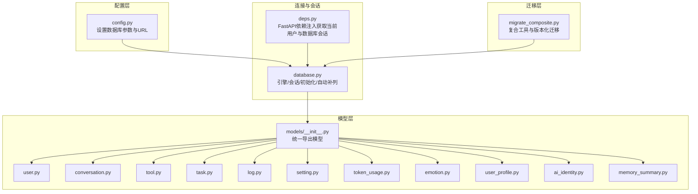
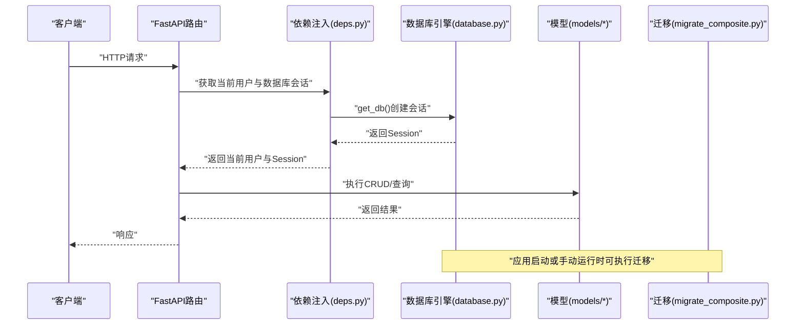
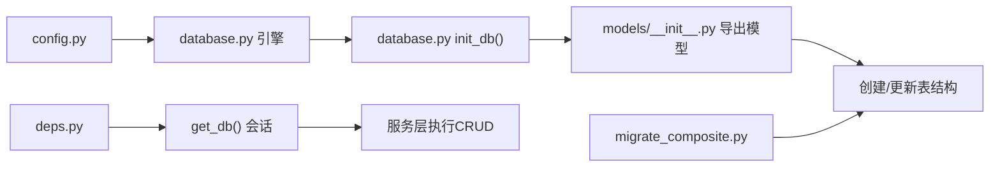

# 数据库架构

<cite>
**本文引用的文件**
- [backend/app/core/database.py](file://backend/app/core/database.py)
- [backend/app/core/config.py](file://backend/app/core/config.py)
- [backend/app/models/__init__.py](file://backend/app/models/__init__.py)
- [backend/app/models/user.py](file://backend/app/models/user.py)
- [backend/app/models/conversation.py](file://backend/app/models/conversation.py)
- [backend/app/models/tool.py](file://backend/app/models/tool.py)
- [backend/app/models/task.py](file://backend/app/models/task.py)
- [backend/app/models/log.py](file://backend/app/models/log.py)
- [backend/app/models/setting.py](file://backend/app/models/setting.py)
- [backend/app/models/token_usage.py](file://backend/app/models/token_usage.py)
- [backend/app/models/emotion.py](file://backend/app/models/emotion.py)
- [backend/app/models/user_profile.py](file://backend/app/models/user_profile.py)
- [backend/app/models/ai_identity.py](file://backend/app/models/ai_identity.py)
- [backend/app/models/memory_summary.py](file://backend/app/models/memory_summary.py)
- [backend/app/core/migrate_composite.py](file://backend/app/core/migrate_composite.py)
- [backend/app/core/deps.py](file://backend/app/core/deps.py)
</cite>

## 目录
1. [简介](#简介)
2. [项目结构](#项目结构)
3. [核心组件](#核心组件)
4. [架构总览](#架构总览)
5. [详细组件分析](#详细组件分析)
6. [依赖分析](#依赖分析)
7. [性能考虑](#性能考虑)
8. [故障排查指南](#故障排查指南)
9. [结论](#结论)
10. [附录](#附录)

## 简介
本文件面向XuanJi项目的数据库架构，系统化阐述基于SQLAlchemy ORM的模型设计原则、实体关系映射、字段与约束配置；解释连接池与会话管理、事务与并发控制；梳理一对多、多对多关系的实现方式；总结数据迁移策略与版本管理、备份与恢复建议；并给出索引优化、查询性能调优与缓存策略建议。同时提供Schema图表与ER图，帮助读者快速把握数据结构设计理念。

## 项目结构
后端数据库相关的核心位置集中在以下模块：
- 配置层：数据库连接参数与URL拼装
- 连接与会话：引擎、会话工厂、依赖注入
- 模型层：所有业务实体的ORM定义与导出
- 迁移层：复合工具与版本化迁移脚本
- 服务层：通过依赖注入获取数据库会话进行CRUD



**图表来源**
- [backend/app/core/config.py:1-68](file://backend/app/core/config.py#L1-L68)
- [backend/app/core/database.py:1-65](file://backend/app/core/database.py#L1-L65)
- [backend/app/models/__init__.py:1-19](file://backend/app/models/__init__.py#L1-L19)
- [backend/app/core/migrate_composite.py:1-153](file://backend/app/core/migrate_composite.py#L1-L153)
- [backend/app/core/deps.py:1-42](file://backend/app/core/deps.py#L1-L42)

**章节来源**
- [backend/app/core/config.py:1-68](file://backend/app/core/config.py#L1-L68)
- [backend/app/core/database.py:1-65](file://backend/app/core/database.py#L1-L65)
- [backend/app/models/__init__.py:1-19](file://backend/app/models/__init__.py#L1-L19)
- [backend/app/core/migrate_composite.py:1-153](file://backend/app/core/migrate_composite.py#L1-L153)
- [backend/app/core/deps.py:1-42](file://backend/app/core/deps.py#L1-L42)

## 核心组件
- 数据库配置与URL
  - 通过配置类集中管理主机、端口、账号、密码与数据库名，并提供完整连接字符串与“不带库名”的连接串，用于数据库创建与初始化。
  - 参考路径：[backend/app/core/config.py:48-62](file://backend/app/core/config.py#L48-L62)

- 引擎与会话
  - 使用SQLAlchemy创建引擎，启用连接前ping以提升健壮性；使用sessionmaker绑定引擎，关闭自动提交与自动flush，确保显式事务控制。
  - 提供get_db依赖函数，按需创建会话并在finally中关闭，避免连接泄漏。
  - 参考路径：[backend/app/core/database.py:6-19](file://backend/app/core/database.py#L6-L19)

- 基类与初始化
  - 统一的ORM基类，所有模型继承该基类；init_db负责创建数据库（如不存在）、创建所有表，并执行“自动补列”逻辑以保证模型与数据库结构一致。
  - 参考路径：[backend/app/core/database.py:10-38](file://backend/app/core/database.py#L10-L38)

- 自动补列机制
  - 通过反射检查现有表结构，逐列对比模型定义，对缺失列执行ALTER TABLE添加，支持类型、非空与默认值同步。
  - 参考路径：[backend/app/core/database.py:44-65](file://backend/app/core/database.py#L44-L65)

- 模型导出
  - 在models/__init__.py中集中导出所有模型，便于在初始化时一次性导入并创建表。
  - 参考路径：[backend/app/models/__init__.py:1-19](file://backend/app/models/__init__.py#L1-L19)

**章节来源**
- [backend/app/core/config.py:48-62](file://backend/app/core/config.py#L48-L62)
- [backend/app/core/database.py:6-19](file://backend/app/core/database.py#L6-L19)
- [backend/app/core/database.py:22-38](file://backend/app/core/database.py#L22-L38)
- [backend/app/core/database.py:44-65](file://backend/app/core/database.py#L44-L65)
- [backend/app/models/__init__.py:1-19](file://backend/app/models/__init__.py#L1-L19)

## 架构总览
下图展示了数据库层的整体交互：配置提供连接信息，引擎与会话工厂负责连接生命周期管理，模型层定义数据结构，迁移脚本负责演进，依赖注入在服务层获取会话执行业务。



**图表来源**
- [backend/app/core/deps.py:12-41](file://backend/app/core/deps.py#L12-L41)
- [backend/app/core/database.py:14-19](file://backend/app/core/database.py#L14-L19)
- [backend/app/models/__init__.py:1-19](file://backend/app/models/__init__.py#L1-L19)
- [backend/app/core/migrate_composite.py:33-146](file://backend/app/core/migrate_composite.py#L33-L146)

## 详细组件分析

### 用户与身份安全
- 用户表
  - 主键自增整数，用户名与邮箱唯一且建立索引；内置时间戳字段；支持软删除字段deleted_at。
  - 参考路径：[backend/app/models/user.py:9-23](file://backend/app/models/user.py#L9-L23)

- 当前用户依赖
  - 通过Bearer Token解析用户ID，从数据库查询当前用户并校验未被软删除。
  - 参考路径：[backend/app/core/deps.py:12-41](file://backend/app/core/deps.py#L12-L41)

**章节来源**
- [backend/app/models/user.py:9-23](file://backend/app/models/user.py#L9-L23)
- [backend/app/core/deps.py:12-41](file://backend/app/core/deps.py#L12-L41)

### 对话与消息
- 会话表
  - 外键指向用户，级联删除；标题、活跃状态、消息计数等字段；时间戳字段。
  - 参考路径：[backend/app/models/conversation.py:9-23](file://backend/app/models/conversation.py#L9-L23)

- 消息表
  - 外键分别指向会话与用户，级联删除；角色、内容、元数据JSON、情感快照、是否已摘要等字段；时间戳字段。
  - 参考路径：[backend/app/models/conversation.py:25-41](file://backend/app/models/conversation.py#L25-L41)

**章节来源**
- [backend/app/models/conversation.py:9-23](file://backend/app/models/conversation.py#L9-L23)
- [backend/app/models/conversation.py:25-41](file://backend/app/models/conversation.py#L25-L41)

### 工具与版本化
- 工具表
  - 名称唯一且索引；代码、语言、版本、类型、是否内置、创建者外键（可为空）；时间戳字段。
  - 参考路径：[backend/app/models/tool.py:9-30](file://backend/app/models/tool.py#L9-L30)

- 工具组合表
  - 复合工具与子工具的步骤顺序、输入映射JSON、输出键；外键约束：复合工具级联删除、子工具限制删除。
  - 参考路径：[backend/app/models/tool.py:32-45](file://backend/app/models/tool.py#L32-L45)

- 工具版本表
  - 版本号、代码与描述快照、管道快照JSON、变更摘要；外键到工具与用户（可为空）。
  - 参考路径：[backend/app/models/tool.py:47-64](file://backend/app/models/tool.py#L47-L64)

- 复合工具迁移
  - 自动添加描述中文、工具类型字段；创建组合表与版本表；为已有工具插入v1快照；扩展用户设置与令牌用量字段。
  - 参考路径：[backend/app/core/migrate_composite.py:33-146](file://backend/app/core/migrate_composite.py#L33-L146)

**章节来源**
- [backend/app/models/tool.py:9-30](file://backend/app/models/tool.py#L9-L30)
- [backend/app/models/tool.py:32-45](file://backend/app/models/tool.py#L32-L45)
- [backend/app/models/tool.py:47-64](file://backend/app/models/tool.py#L47-L64)
- [backend/app/core/migrate_composite.py:33-146](file://backend/app/core/migrate_composite.py#L33-L146)

### 任务与日志
- 任务表
  - 关联用户、标题、描述、状态（含索引）、结果、时间戳。
  - 参考路径：[backend/app/models/task.py:9-28](file://backend/app/models/task.py#L9-L28)

- 日志表
  - 关联任务、工具、用户；级别、消息、详情JSON；来源模块与状态码；时间戳。
  - 参考路径：[backend/app/models/log.py:9-30](file://backend/app/models/log.py#L9-L30)

**章节来源**
- [backend/app/models/task.py:9-28](file://backend/app/models/task.py#L9-L28)
- [backend/app/models/log.py:9-30](file://backend/app/models/log.py#L9-L30)

### 设置与令牌用量
- 用户设置表
  - 关联用户唯一索引；多套AI配置（聊天、工具生成、意图识别、情感、格式）；显示偏好与月度预算；时间戳。
  - 参考路径：[backend/app/models/setting.py:9-60](file://backend/app/models/setting.py#L9-L60)

- 令牌用量表
  - 关联用户；提示词/补全/总计令牌；模型名称与角色名（新增字段）；时间戳。
  - 参考路径：[backend/app/models/token_usage.py:9-24](file://backend/app/models/token_usage.py#L9-L24)

**章节来源**
- [backend/app/models/setting.py:9-60](file://backend/app/models/setting.py#L9-L60)
- [backend/app/models/token_usage.py:9-24](file://backend/app/models/token_usage.py#L9-L24)

### 情感记录与档案
- 情感记录表
  - 关联用户；可选关联消息与会话；主情感、强度、深层需求、风险等级、互动建议与完整分析；时间戳。
  - 参考路径：[backend/app/models/emotion.py:9-29](file://backend/app/models/emotion.py#L9-L29)

- 用户档案表
  - 关联用户唯一索引；个性特征、依恋类型、核心需求、情感基线、触发/安全话题、兴趣、摘要文本、版本号；时间戳。
  - 参考路径：[backend/app/models/user_profile.py:9-29](file://backend/app/models/user_profile.py#L9-L29)

- AI身份表
  - 用户+AI名称唯一约束；核心人设、外观、个性、说话风格、价值观；情绪状态与演化日志、锁定状态、版本号；时间戳。
  - 参考路径：[backend/app/models/ai_identity.py:9-38](file://backend/app/models/ai_identity.py#L9-L38)

- 记忆摘要表
  - 用户+周期类型+起止时间；摘要文本与关键情感/主题/事件JSON；来源消息数与摘要ID列表；时间戳。
  - 参考路径：[backend/app/models/memory_summary.py:9-26](file://backend/app/models/memory_summary.py#L9-L26)

**章节来源**
- [backend/app/models/emotion.py:9-29](file://backend/app/models/emotion.py#L9-L29)
- [backend/app/models/user_profile.py:9-29](file://backend/app/models/user_profile.py#L9-L29)
- [backend/app/models/ai_identity.py:9-38](file://backend/app/models/ai_identity.py#L9-L38)
- [backend/app/models/memory_summary.py:9-26](file://backend/app/models/memory_summary.py#L9-L26)

### 实体关系图（ER）
```mermaid
erDiagram
USERS {
bigint id PK
varchar username UK
varchar email UK
varchar hashed_password
datetime created_at
datetime updated_at
datetime deleted_at
}
CONVERSATIONS {
bigint id PK
bigint user_id FK
varchar title
boolean is_active
int message_count
datetime created_at
datetime updated_at
}
MESSAGES {
bigint id PK
bigint conversation_id FK
bigint user_id FK
varchar role
text content
text metadata
text emotion_snapshot
boolean is_summarized
datetime created_at
}
TOOLS {
bigint id PK
varchar name UK
text description
text description_zh
text code
varchar language
int version
varchar tool_type
boolean is_builtin
bigint created_by
datetime created_at
datetime updated_at
}
TOOL_COMPOSITIONS {
bigint id PK
bigint composite_tool_id FK
bigint sub_tool_id FK
int step_order
json input_mapping
varchar output_key
}
TOOL_VERSIONS {
bigint id PK
bigint tool_id FK
int version
text code
text description
text description_zh
json pipeline_snapshot
text change_summary
datetime created_at
bigint created_by
}
TASKS {
bigint id PK
bigint user_id FK
varchar title
text description
varchar status
text result
datetime created_at
datetime updated_at
}
LOGS {
bigint id PK
bigint task_id FK
bigint tool_id FK
varchar level
varchar message
json details
bigint user_id FK
varchar source
int status_code
datetime created_at
}
USER_SETTINGS {
bigint id PK
bigint user_id FK UK
varchar llm_provider
varchar llm_api_key
varchar llm_api_base_url
varchar llm_model_name
varchar ollama_base_url
varchar ollama_model
varchar tool_llm_provider
varchar tool_llm_api_key
varchar tool_llm_api_base_url
varchar tool_llm_model_name
varchar tool_ollama_base_url
varchar tool_ollama_model
varchar intent_llm_provider
varchar intent_llm_api_key
varchar intent_llm_api_base_url
varchar intent_llm_model_name
varchar emotion_llm_provider
varchar emotion_llm_api_key
varchar emotion_llm_api_base_url
varchar emotion_llm_model_name
varchar format_llm_provider
varchar format_llm_api_key
varchar format_llm_api_base_url
varchar format_llm_model_name
boolean show_tool_result
boolean show_collaboration
int token_monthly_budget
datetime created_at
datetime updated_at
}
TOKEN_USAGES {
bigint id PK
bigint user_id FK
int prompt_tokens
int completion_tokens
int total_tokens
varchar model
varchar role_name
datetime created_at
}
EMOTION_RECORDS {
bigint id PK
bigint user_id FK
bigint message_id
bigint conversation_id
varchar primary_emotion
varchar emotion_intensity
varchar deep_need
varchar risk_level
text interaction_recommendation
text full_analysis
datetime created_at
}
USER_PROFILES {
bigint id PK
bigint user_id FK UK
text personality_traits
varchar attachment_style
text core_needs
text emotional_baseline
text trigger_topics
text safe_topics
text interests
text summary_text
int version
datetime created_at
datetime updated_at
}
AI_IDENTITIES {
bigint id PK
bigint user_id FK
varchar ai_name
text persona_text
varchar gender
text appearance
text personality
text speaking_style
text values
text emotional_state
text evolution_log
boolean is_base_locked
int version
datetime created_at
datetime updated_at
}
MEMORY_SUMMARIES {
bigint id PK
bigint user_id FK
varchar period_type
datetime period_start
datetime period_end
text summary_text
text key_emotions
text key_topics
text important_events
int source_message_count
text source_summary_ids
datetime created_at
}
USERS ||--o{ CONVERSATIONS : "拥有"
USERS ||--o{ MESSAGES : "发送"
CONVERSATIONS ||--o{ MESSAGES : "包含"
USERS ||--o{ TASKS : "创建"
USERS ||--o{ USER_SETTINGS : "配置"
USERS ||--o{ TOKEN_USAGES : "产生"
USERS ||--o{ EMOTION_RECORDS : "产生"
USERS ||--o{ USER_PROFILES : "拥有"
USERS ||--o{ AI_IDENTITIES : "拥有"
USERS ||--o{ TOOLS : "创建"
TOOLS ||--o{ TOOL_COMPOSITIONS : "组合"
TOOLS ||--o{ TOOL_VERSIONS : "版本化"
TASKS ||--o{ LOGS : "产生"
TOOLS ||--o{ LOGS : "关联"
MESSAGES ||--o{ EMOTION_RECORDS : "触发"
CONVERSATIONS ||--o{ EMOTION_RECORDS : "上下文"
```

**图表来源**
- [backend/app/models/user.py:9-23](file://backend/app/models/user.py#L9-L23)
- [backend/app/models/conversation.py:9-41](file://backend/app/models/conversation.py#L9-L41)
- [backend/app/models/tool.py:9-64](file://backend/app/models/tool.py#L9-L64)
- [backend/app/models/task.py:9-28](file://backend/app/models/task.py#L9-L28)
- [backend/app/models/log.py:9-30](file://backend/app/models/log.py#L9-L30)
- [backend/app/models/setting.py:9-60](file://backend/app/models/setting.py#L9-L60)
- [backend/app/models/token_usage.py:9-24](file://backend/app/models/token_usage.py#L9-L24)
- [backend/app/models/emotion.py:9-29](file://backend/app/models/emotion.py#L9-L29)
- [backend/app/models/user_profile.py:9-29](file://backend/app/models/user_profile.py#L9-L29)
- [backend/app/models/ai_identity.py:9-38](file://backend/app/models/ai_identity.py#L9-L38)
- [backend/app/models/memory_summary.py:9-26](file://backend/app/models/memory_summary.py#L9-L26)

## 依赖分析
- 配置到连接
  - 配置类提供数据库URL与“无库名”URL，驱动引擎创建与数据库初始化。
  - 参考路径：[backend/app/core/config.py:48-62](file://backend/app/core/config.py#L48-L62)

- 连接与模型
  - 初始化时导入models包，触发所有模型注册，随后统一创建表并执行自动补列。
  - 参考路径：[backend/app/core/database.py:35-38](file://backend/app/core/database.py#L35-L38)

- 迁移脚本
  - 通过反射判断表/列是否存在，按需ALTER/CREATE，最后写入初始版本快照。
  - 参考路径：[backend/app/core/migrate_composite.py:33-146](file://backend/app/core/migrate_composite.py#L33-L146)

- 依赖注入
  - FastAPI路由通过Depends获取数据库会话与当前用户，确保每个请求有独立会话。
  - 参考路径：[backend/app/core/deps.py:12-41](file://backend/app/core/deps.py#L12-L41)



**图表来源**
- [backend/app/core/config.py:48-62](file://backend/app/core/config.py#L48-L62)
- [backend/app/core/database.py:22-38](file://backend/app/core/database.py#L22-L38)
- [backend/app/models/__init__.py:1-19](file://backend/app/models/__init__.py#L1-L19)
- [backend/app/core/migrate_composite.py:33-146](file://backend/app/core/migrate_composite.py#L33-L146)
- [backend/app/core/deps.py:12-41](file://backend/app/core/deps.py#L12-L41)

**章节来源**
- [backend/app/core/config.py:48-62](file://backend/app/core/config.py#L48-L62)
- [backend/app/core/database.py:22-38](file://backend/app/core/database.py#L22-L38)
- [backend/app/models/__init__.py:1-19](file://backend/app/models/__init__.py#L1-L19)
- [backend/app/core/migrate_composite.py:33-146](file://backend/app/core/migrate_composite.py#L33-L146)
- [backend/app/core/deps.py:12-41](file://backend/app/core/deps.py#L12-L41)

## 性能考虑
- 连接池与会话
  - 使用SQLAlchemy默认连接池行为；建议结合生产环境调整池大小、超时与回收策略，避免连接耗尽。
  - 参考路径：[backend/app/core/database.py:6-7](file://backend/app/core/database.py#L6-L7)

- 索引策略
  - 已在高频过滤/关联字段上建立索引（如用户唯一索引、会话/消息/任务/日志的外键索引），可进一步评估复合索引与选择性。
  - 参考路径：[backend/app/models/user.py:13-14](file://backend/app/models/user.py#L13-L14)
  - 参考路径：[backend/app/models/conversation.py:14-18](file://backend/app/models/conversation.py#L14-L18)
  - 参考路径：[backend/app/models/conversation.py:29-34](file://backend/app/models/conversation.py#L29-L34)
  - 参考路径：[backend/app/models/task.py:14-19](file://backend/app/models/task.py#L14-L19)
  - 参考路径：[backend/app/models/log.py:14-18](file://backend/app/models/log.py#L14-L18)

- 查询优化
  - 使用selectinload/joinload减少N+1查询；对大表分页查询；避免SELECT *，仅取必要字段。
  - 使用索引覆盖查询；对高基数字段建立索引；定期统计表与索引信息。

- 缓存策略
  - 对热点用户设置与近期对话摘要可引入Redis缓存；注意缓存失效策略与一致性。
  - 参考路径：[backend/app/models/setting.py:9-60](file://backend/app/models/setting.py#L9-L60)
  - 参考路径：[backend/app/models/memory_summary.py:9-26](file://backend/app/models/memory_summary.py#L9-L26)

- 并发与事务
  - 默认不自动提交与刷新，需显式commit/rollback；对长事务拆分，减少锁持有时间；使用乐观/悲观锁应对并发更新。
  - 参考路径：[backend/app/core/database.py:6-7](file://backend/app/core/database.py#L6-L7)

[本节为通用性能指导，不直接分析具体代码文件]

## 故障排查指南
- 初始化失败
  - 确认数据库凭据与网络可达；检查“无库名”URL能否连通；确认初始化流程是否正确导入模型并创建表。
  - 参考路径：[backend/app/core/database.py:22-38](file://backend/app/core/database.py#L22-L38)

- 字段缺失导致异常
  - 自动补列会在表存在但列缺失时执行ALTER；若仍报错，请检查列类型、非空与默认值是否匹配。
  - 参考路径：[backend/app/core/database.py:44-65](file://backend/app/core/database.py#L44-L65)

- 迁移冲突
  - 复合工具迁移脚本为幂等；若重复执行出现异常，检查目标表/列是否存在；必要时回滚DDL后重试。
  - 参考路径：[backend/app/core/migrate_composite.py:33-146](file://backend/app/core/migrate_composite.py#L33-L146)

- 会话泄漏
  - 确保每个请求结束后关闭会话；避免在长生命周期对象中复用会话。
  - 参考路径：[backend/app/core/database.py:14-19](file://backend/app/core/database.py#L14-L19)

**章节来源**
- [backend/app/core/database.py:22-38](file://backend/app/core/database.py#L22-L38)
- [backend/app/core/database.py:44-65](file://backend/app/core/database.py#L44-L65)
- [backend/app/core/migrate_composite.py:33-146](file://backend/app/core/migrate_composite.py#L33-L146)
- [backend/app/core/database.py:14-19](file://backend/app/core/database.py#L14-L19)

## 结论
XuanJi数据库采用清晰的分层设计：配置集中化、连接与会话可控、模型统一导出、迁移脚本幂等化。通过外键约束与索引策略保障数据完整性与查询效率；自动补列机制降低模型演进成本。建议在生产环境中结合连接池参数、缓存与查询优化进一步提升稳定性与性能。

## 附录
- 数据库连接参数
  - 主机、端口、用户名、密码、数据库名由配置类提供；支持从环境文件加载。
  - 参考路径：[backend/app/core/config.py:6-10](file://backend/app/core/config.py#L6-L10)

- 初始化流程
  - 创建数据库（如不存在）→ 创建/更新表 → 自动补列。
  - 参考路径：[backend/app/core/database.py:22-42](file://backend/app/core/database.py#L22-L42)

- 复合工具迁移要点
  - 新增列、创建组合与版本表、写入初始快照、扩展用户设置与令牌用量字段。
  - 参考路径：[backend/app/core/migrate_composite.py:33-146](file://backend/app/core/migrate_composite.py#L33-L146)