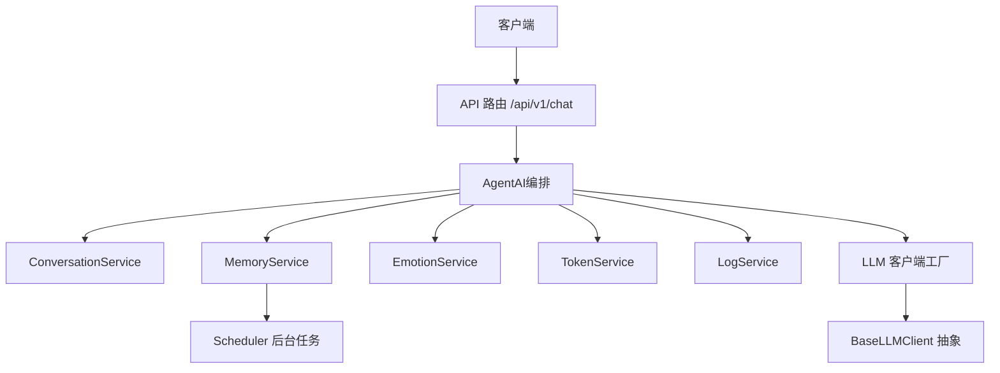
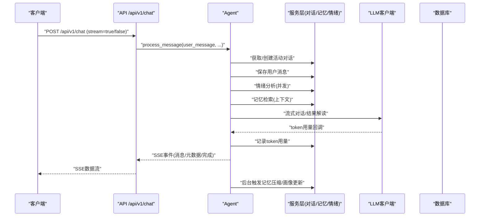
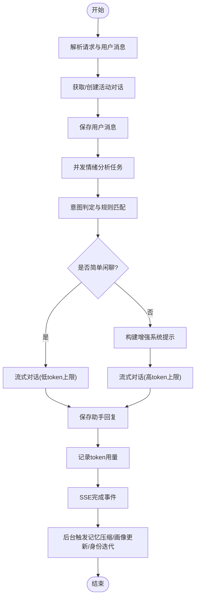
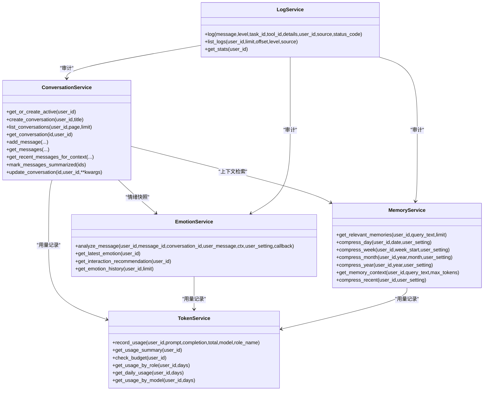
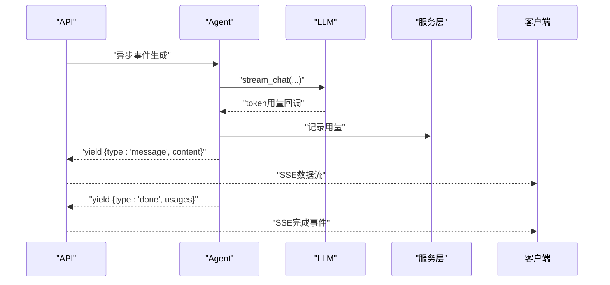
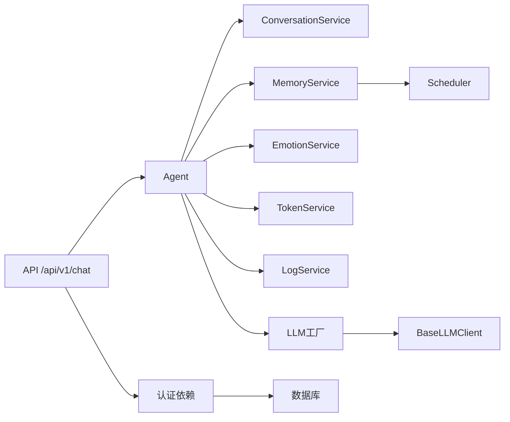
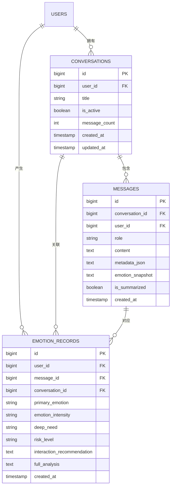

# 数据流与控制流

<cite>
**本文引用的文件**
- [backend/app/main.py](file://backend/app/main.py)
- [backend/app/api/v1/chat.py](file://backend/app/api/v1/chat.py)
- [backend/app/ai/agent.py](file://backend/app/ai/agent.py)
- [backend/app/ai/base.py](file://backend/app/ai/base.py)
- [backend/app/ai/factory.py](file://backend/app/ai/factory.py)
- [backend/app/services/conversation_service.py](file://backend/app/services/conversation_service.py)
- [backend/app/services/memory_service.py](file://backend/app/services/memory_service.py)
- [backend/app/services/emotion_service.py](file://backend/app/services/emotion_service.py)
- [backend/app/services/token_service.py](file://backend/app/services/token_service.py)
- [backend/app/services/log_service.py](file://backend/app/services/log_service.py)
- [backend/app/services/scheduler.py](file://backend/app/services/scheduler.py)
- [backend/app/core/deps.py](file://backend/app/core/deps.py)
- [backend/app/models/conversation.py](file://backend/app/models/conversation.py)
- [backend/app/models/emotion.py](file://backend/app/models/emotion.py)
- [backend/app/schemas/chat.py](file://backend/app/schemas/chat.py)
</cite>

## 目录
1. [引言](#引言)
2. [项目结构](#项目结构)
3. [核心组件](#核心组件)
4. [架构总览](#架构总览)
5. [详细组件分析](#详细组件分析)
6. [依赖分析](#依赖分析)
7. [性能考虑](#性能考虑)
8. [故障排查指南](#故障排查指南)
9. [结论](#结论)
10. [附录](#附录)

## 引言
本文件面向XuanJi系统，聚焦“数据流与控制流”的完整架构文档。目标是从用户输入到最终回复的全过程，梳理消息处理生命周期，阐明ConversationService、MemoryService、EmotionService等核心服务的协作关系，解释异步处理、事件驱动与流式响应机制，以及缓存策略、事务管理与并发控制。同时给出错误传播路径、异常恢复机制与系统监控指标，并提供数据流向图与控制流程图，帮助读者快速把握系统运行时行为。

## 项目结构
后端采用FastAPI框架，API路由集中在/api/v1下，业务逻辑由Agent协调各服务完成。核心模块包括：
- API层：接收HTTP请求，封装SSE流式响应
- AI层：统一抽象LLM客户端接口，工厂负责按用户设置动态创建
- 服务层：围绕对话、记忆、情绪、日志、令牌等进行领域服务
- 模型层：SQLAlchemy ORM定义表结构
- 核心依赖：认证、数据库连接、异常处理

图表来源
- [backend/app/api/v1/chat.py:1-106](file://backend/app/api/v1/chat.py#L1-L106)
- [backend/app/ai/agent.py:1-800](file://backend/app/ai/agent.py#L1-L800)
- [backend/app/ai/factory.py:1-154](file://backend/app/ai/factory.py#L1-L154)
- [backend/app/ai/base.py:1-73](file://backend/app/ai/base.py#L1-L73)
- [backend/app/services/conversation_service.py:1-141](file://backend/app/services/conversation_service.py#L1-L141)
- [backend/app/services/memory_service.py:1-389](file://backend/app/services/memory_service.py#L1-L389)
- [backend/app/services/emotion_service.py:1-214](file://backend/app/services/emotion_service.py#L1-L214)
- [backend/app/services/token_service.py:1-183](file://backend/app/services/token_service.py#L1-L183)
- [backend/app/services/log_service.py:1-67](file://backend/app/services/log_service.py#L1-L67)
- [backend/app/services/scheduler.py:1-880](file://backend/app/services/scheduler.py#L1-L880)

章节来源
- [backend/app/main.py:1-79](file://backend/app/main.py#L1-L79)
- [backend/app/api/v1/chat.py:1-106](file://backend/app/api/v1/chat.py#L1-L106)

## 核心组件
- Agent：消息处理主控，负责意图识别、情绪分析、记忆检索、工具匹配/生成、结果解读与回复生成，贯穿流式事件产出与SSE推送。
- ConversationService：维护对话与消息持久化，支持活动对话获取、消息追加、最近消息检索、批量标记摘要等。
- MemoryService：记忆压缩与检索，支持日/周/月/年多粒度摘要生成，提供相关记忆上下文注入。
- EmotionService：基于系统提示与技能文件进行情绪分析，产出交互建议与风险等级，供对话与风格设计协同。
- TokenService：记录与汇总令牌用量，支持预算检查与多维统计。
- LogService：统一日志记录与统计，便于审计与问题定位。
- Scheduler：后台定时任务，执行记忆压缩、身份迭代评估、规则引擎迭代、对话质量自评、效率分析等。

章节来源
- [backend/app/ai/agent.py:1-800](file://backend/app/ai/agent.py#L1-L800)
- [backend/app/services/conversation_service.py:1-141](file://backend/app/services/conversation_service.py#L1-L141)
- [backend/app/services/memory_service.py:1-389](file://backend/app/services/memory_service.py#L1-L389)
- [backend/app/services/emotion_service.py:1-214](file://backend/app/services/emotion_service.py#L1-L214)
- [backend/app/services/token_service.py:1-183](file://backend/app/services/token_service.py#L1-L183)
- [backend/app/services/log_service.py:1-67](file://backend/app/services/log_service.py#L1-L67)
- [backend/app/services/scheduler.py:1-880](file://backend/app/services/scheduler.py#L1-L880)

## 架构总览
XuanJi采用事件驱动与流式响应的控制流，结合服务解耦与统一LLM抽象，形成“意图-情绪-记忆-风格-对话-工具-结果解读”的闭环。API层负责请求接入与SSE推送，Agent作为编排器协调各服务，服务层通过数据库事务保证一致性，后台任务保障长期记忆与身份演化的持续优化。

图表来源
- [backend/app/api/v1/chat.py:40-106](file://backend/app/api/v1/chat.py#L40-L106)
- [backend/app/ai/agent.py:78-792](file://backend/app/ai/agent.py#L78-L792)
- [backend/app/ai/factory.py:54-154](file://backend/app/ai/factory.py#L54-L154)
- [backend/app/services/conversation_service.py:13-141](file://backend/app/services/conversation_service.py#L13-L141)
- [backend/app/services/memory_service.py:45-175](file://backend/app/services/memory_service.py#L45-L175)
- [backend/app/services/emotion_service.py:98-157](file://backend/app/services/emotion_service.py#L98-L157)
- [backend/app/services/token_service.py:14-35](file://backend/app/services/token_service.py#L14-L35)

## 详细组件分析

### 组件A：消息处理生命周期（从输入到回复）
- 请求接入：API层解析ChatRequest，识别是否流式，构造SSE响应。
- 编排启动：Agent初始化，建立对话上下文，保存用户消息，触发情绪分析任务。
- 意图与情绪：并发执行情绪分析，同时进行意图判定与规则匹配，决定对话路径。
- 记忆与风格：检索相关记忆作为上下文，遥（风格设计）产出风格建议。
- 对话生成：调用LLM进行流式回复，实时产出SSE事件。
- 工具路径（可选）：若非简单闲聊，进入工具匹配/生成-执行-迭代-结果解读流程。
- 回复落库：将助手回复写入消息表，记录协作日志与token用量。
- 后台任务：触发记忆压缩、画像更新与身份迭代评估。

图表来源
- [backend/app/api/v1/chat.py:40-106](file://backend/app/api/v1/chat.py#L40-L106)
- [backend/app/ai/agent.py:78-792](file://backend/app/ai/agent.py#L78-L792)
- [backend/app/services/conversation_service.py:111-141](file://backend/app/services/conversation_service.py#L111-L141)
- [backend/app/services/emotion_service.py:98-157](file://backend/app/services/emotion_service.py#L98-L157)
- [backend/app/services/token_service.py:14-35](file://backend/app/services/token_service.py#L14-L35)

章节来源
- [backend/app/api/v1/chat.py:40-106](file://backend/app/api/v1/chat.py#L40-L106)
- [backend/app/ai/agent.py:78-792](file://backend/app/ai/agent.py#L78-L792)

### 组件B：服务层协作关系（对话/记忆/情绪）
- ConversationService：提供活动对话管理、消息增删改查、最近消息检索、批量标记摘要等。
- MemoryService：提供相关记忆检索、日/周/月/年压缩、短临记忆回退、JSON解析与LLM压缩。
- EmotionService：提供情绪分析、最新情绪获取、交互建议抽取、JSON解析与LLM分析。
- TokenService：提供用量记录、汇总、预算检查、按角色/模型/日期维度统计。
- LogService：提供统一日志记录、分页查询与统计。

图表来源
- [backend/app/services/conversation_service.py:1-141](file://backend/app/services/conversation_service.py#L1-L141)
- [backend/app/services/memory_service.py:1-389](file://backend/app/services/memory_service.py#L1-L389)
- [backend/app/services/emotion_service.py:1-214](file://backend/app/services/emotion_service.py#L1-L214)
- [backend/app/services/token_service.py:1-183](file://backend/app/services/token_service.py#L1-L183)
- [backend/app/services/log_service.py:1-67](file://backend/app/services/log_service.py#L1-L67)

章节来源
- [backend/app/services/conversation_service.py:1-141](file://backend/app/services/conversation_service.py#L1-L141)
- [backend/app/services/memory_service.py:1-389](file://backend/app/services/memory_service.py#L1-L389)
- [backend/app/services/emotion_service.py:1-214](file://backend/app/services/emotion_service.py#L1-L214)
- [backend/app/services/token_service.py:1-183](file://backend/app/services/token_service.py#L1-L183)
- [backend/app/services/log_service.py:1-67](file://backend/app/services/log_service.py#L1-L67)

### 组件C：异步处理、事件驱动与流式响应
- 异步事件：Agent通过异方法yield事件类型（元数据、思考、消息、完成、错误、协作日志、情绪更新等），API层以SSE推送。
- 并发控制：情绪分析以任务并发执行，其余步骤串行或按条件分支；后台任务fire-and-forget，避免阻塞主线程。
- 流式响应：LLM提供stream_chat接口，Agent逐片产出消息事件，前端可即时渲染。
- 断开检测：API层检测客户端断开，及时终止流并记录日志。

图表来源
- [backend/app/api/v1/chat.py:62-87](file://backend/app/api/v1/chat.py#L62-L87)
- [backend/app/ai/agent.py:183-252](file://backend/app/ai/agent.py#L183-L252)
- [backend/app/ai/base.py:24-35](file://backend/app/ai/base.py#L24-L35)

章节来源
- [backend/app/api/v1/chat.py:62-87](file://backend/app/api/v1/chat.py#L62-L87)
- [backend/app/ai/agent.py:183-252](file://backend/app/ai/agent.py#L183-L252)

### 组件D：数据缓存策略、事务管理与并发控制
- 缓存策略：
  - Prompt与JSON配置采用LRU缓存加载，降低IO开销。
  - Agent内部对风格设计结果进行描述缓存，减少重复计算。
- 事务管理：
  - 各服务方法内显式commit/refresh，确保数据一致性。
  - 后台任务使用独立数据库会话，避免长事务阻塞。
- 并发控制：
  - 情绪分析以任务并发执行，超时与异常被捕获并记录。
  - 身份迭代评估并发gather执行，return_exceptions避免单点失败影响整体。

章节来源
- [backend/app/ai/base.py:41-53](file://backend/app/ai/base.py#L41-L53)
- [backend/app/ai/agent.py:140-149](file://backend/app/ai/agent.py#L140-L149)
- [backend/app/services/scheduler.py:780-796](file://backend/app/services/scheduler.py#L780-L796)

### 组件E：错误传播路径与异常恢复
- 配置错误：当LLM客户端创建失败（缺少必要配置），Agent直接返回错误事件，避免无效调用。
- 情绪分析超时/失败：记录警告/错误日志，不影响主线回复生成，完成后置记录用量。
- LLM流式超时：采用分片等待与总时长限制，超时降级为固定提示，保证可用性。
- 工具迭代：失败时尝试自动迭代生成新代码并重试，记录版本快照与变更摘要。
- 日志审计：LogService统一记录错误与状态码，便于追踪。

章节来源
- [backend/app/ai/agent.py:95-97](file://backend/app/ai/agent.py#L95-L97)
- [backend/app/ai/agent.py:278-300](file://backend/app/ai/agent.py#L278-L300)
- [backend/app/ai/agent.py:603-626](file://backend/app/ai/agent.py#L603-L626)
- [backend/app/ai/agent.py:420-476](file://backend/app/ai/agent.py#L420-L476)
- [backend/app/services/log_service.py:14-38](file://backend/app/services/log_service.py#L14-L38)

### 组件F：系统监控指标
- 令牌用量：TokenService提供按角色/模型/日期的统计，支持预算检查。
- 日志统计：LogService按级别分组统计，辅助SLA与容量规划。
- 后台任务：Scheduler记录每轮任务执行状态、耗时与变更详情，形成自评估闭环。

章节来源
- [backend/app/services/token_service.py:37-183](file://backend/app/services/token_service.py#L37-L183)
- [backend/app/services/log_service.py:58-67](file://backend/app/services/log_service.py#L58-L67)
- [backend/app/services/scheduler.py:616-796](file://backend/app/services/scheduler.py#L616-L796)

## 依赖分析
- API层依赖Agent与服务层，通过依赖注入获取当前用户与数据库会话。
- Agent依赖各服务与LLM工厂，统一抽象不同Provider的客户端接口。
- 服务层依赖模型层ORM，遵循数据库事务与索引策略。
- 后台任务依赖服务层与LLM工厂，定期执行记忆与身份演进。

图表来源
- [backend/app/api/v1/chat.py:1-106](file://backend/app/api/v1/chat.py#L1-L106)
- [backend/app/core/deps.py:1-42](file://backend/app/core/deps.py#L1-L42)
- [backend/app/ai/agent.py:44-64](file://backend/app/ai/agent.py#L44-L64)
- [backend/app/ai/factory.py:1-154](file://backend/app/ai/factory.py#L1-L154)
- [backend/app/ai/base.py:1-73](file://backend/app/ai/base.py#L1-L73)
- [backend/app/services/scheduler.py:1-880](file://backend/app/services/scheduler.py#L1-L880)

章节来源
- [backend/app/api/v1/chat.py:1-106](file://backend/app/api/v1/chat.py#L1-L106)
- [backend/app/core/deps.py:1-42](file://backend/app/core/deps.py#L1-L42)
- [backend/app/ai/agent.py:44-64](file://backend/app/ai/agent.py#L44-L64)
- [backend/app/ai/factory.py:1-154](file://backend/app/ai/factory.py#L1-L154)
- [backend/app/ai/base.py:1-73](file://backend/app/ai/base.py#L1-L73)
- [backend/app/services/scheduler.py:1-880](file://backend/app/services/scheduler.py#L1-L880)

## 性能考虑
- 流式响应：前端即时渲染，降低首字节延迟；分片等待与总时长限制防止资源长时间占用。
- 并发与超时：情绪分析与身份迭代并发执行，设置合理超时与异常捕获，避免阻塞主线。
- 缓存与预热：Prompt/JSON配置LRU缓存，减少磁盘IO；风格设计结果描述缓存。
- 后台压缩：按日/周/月/年分层压缩，降低在线检索成本；短临记忆回退保证无摘要时的上下文可用。
- 令牌统计：按角色/模型/日期聚合，便于容量与成本控制。

## 故障排查指南
- SSE异常：检查API层异常处理器与客户端断开检测，确认事件流是否提前终止。
- 情绪分析失败：查看日志服务错误记录，确认配置是否正确；检查并发任务超时与异常。
- 工具执行失败：查看工具迭代事件与版本快照，确认自动迭代是否生效。
- 记忆压缩失败：检查后台任务日志与数据库连接，确认用户消息是否满足压缩阈值。
- 令牌用量异常：核对用量回调与记录时机，确保完成事件后置用量补录。

章节来源
- [backend/app/api/v1/chat.py:78-87](file://backend/app/api/v1/chat.py#L78-L87)
- [backend/app/services/log_service.py:14-38](file://backend/app/services/log_service.py#L14-L38)
- [backend/app/services/scheduler.py:79-110](file://backend/app/services/scheduler.py#L79-L110)
- [backend/app/ai/agent.py:694-737](file://backend/app/ai/agent.py#L694-L737)

## 结论
XuanJi通过事件驱动与流式响应实现了高效、可观测的消息处理闭环，Agent作为编排中枢协调对话、记忆、情绪与工具链路，服务层以事务与缓存保障一致性与性能，后台任务推动长期记忆与身份演进。该架构在保证用户体验的同时，提供了完善的监控与异常恢复能力。

## 附录
- 数据模型概览（对话与情绪）

图表来源
- [backend/app/models/conversation.py:9-41](file://backend/app/models/conversation.py#L9-L41)
- [backend/app/models/emotion.py:9-29](file://backend/app/models/emotion.py#L9-L29)