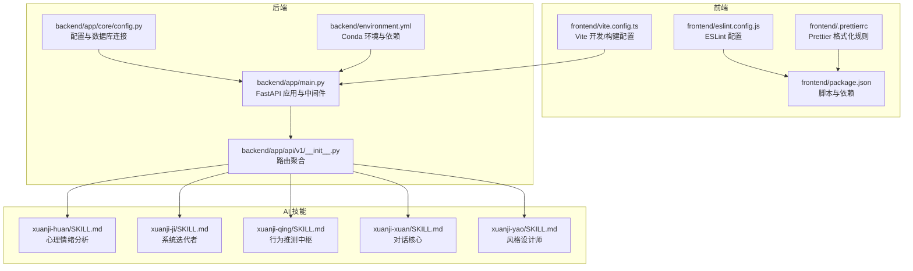
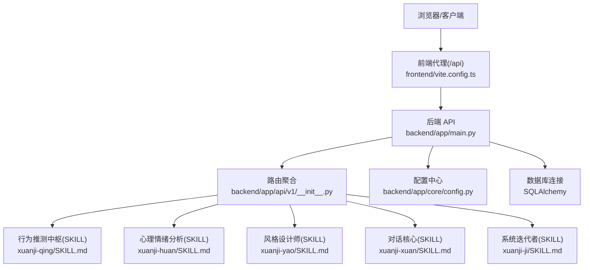
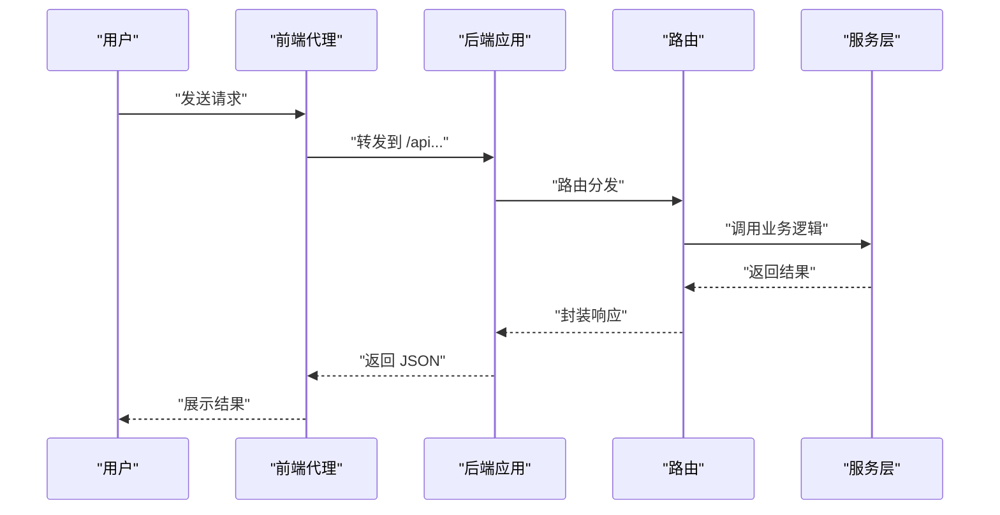
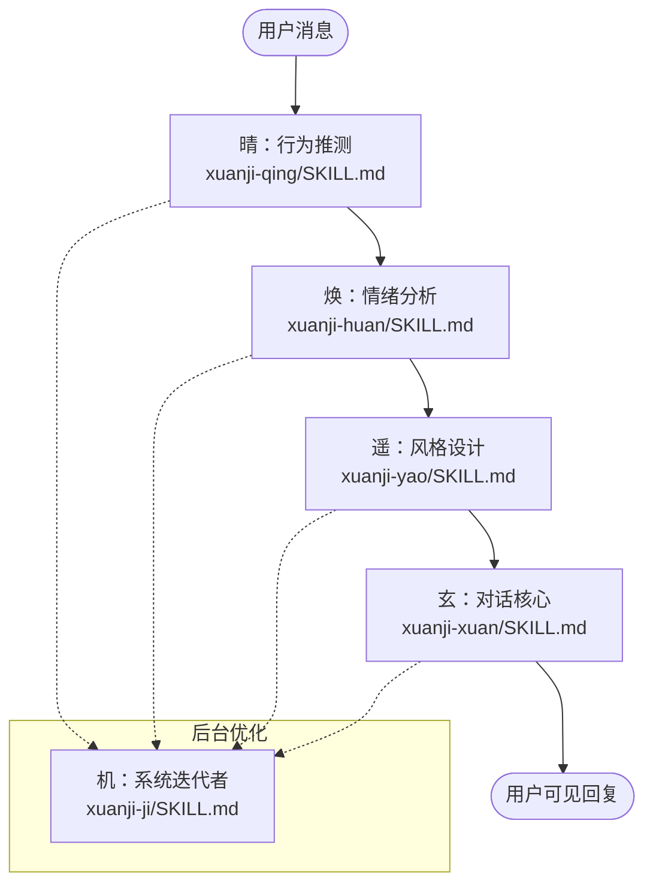
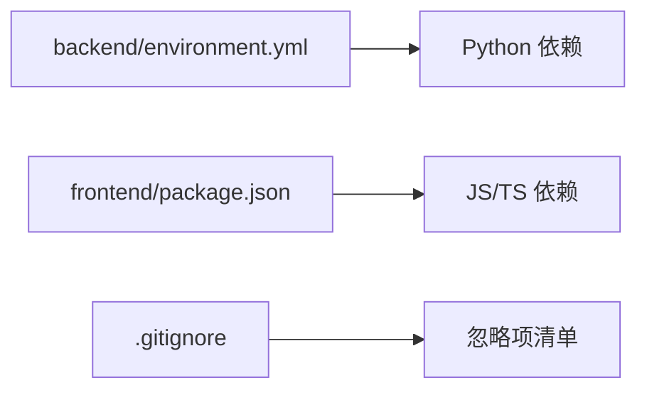

# 贡献指南

<cite>
**本文档引用的文件**
- [backend/app/main.py](file://backend/app/main.py)
- [backend/app/api/v1/__init__.py](file://backend/app/api/v1/__init__.py)
- [backend/app/core/config.py](file://backend/app/core/config.py)
- [backend/environment.yml](file://backend/environment.yml)
- [frontend/package.json](file://frontend/package.json)
- [frontend/eslint.config.js](file://frontend/eslint.config.js)
- [frontend/.prettierrc](file://frontend/.prettierrc)
- [frontend/vite.config.ts](file://frontend/vite.config.ts)
- [.gitignore](file://.gitignore)
- [backend/app/ai/skills/xuanji-huan/SKILL.md](file://backend/app/ai/skills/xuanji-huan/SKILL.md)
- [backend/app/ai/skills/xuanji-ji/SKILL.md](file://backend/app/ai/skills/xuanji-ji/SKILL.md)
- [backend/app/ai/skills/xuanji-qing/SKILL.md](file://backend/app/ai/skills/xuanji-qing/SKILL.md)
- [backend/app/ai/skills/xuanji-xuan/SKILL.md](file://backend/app/ai/skills/xuanji-xuan/SKILL.md)
- [backend/app/ai/skills/xuanji-yao/SKILL.md](file://backend/app/ai/skills/xuanji-yao/SKILL.md)
</cite>

## 目录
1. [简介](#简介)
2. [项目结构](#项目结构)
3. [核心组件](#核心组件)
4. [架构总览](#架构总览)
5. [详细组件分析](#详细组件分析)
6. [依赖分析](#依赖分析)
7. [性能考量](#性能考量)
8. [故障排查指南](#故障排查指南)
9. [结论](#结论)
10. [附录](#附录)

## 简介
本贡献指南面向开源贡献者，旨在帮助新老贡献者快速理解并参与 XuanJi 项目的开发。文档覆盖开发环境搭建、代码风格与命名约定、注释与文档标准、Git 工作流与 Pull Request 提交规范、测试要求、代码审查流程、Issue 报告模板与功能请求流程、以及社区交流规范。通过清晰的质量标准与参与路径，确保贡献过程高效、可追溯且可持续。

## 项目结构
XuanJi 采用前后端分离架构：
- 后端使用 Python/FastAPI，提供 REST API 服务，包含路由聚合、数据库初始化、异常处理与健康检查等。
- 前端使用 React/Vite，提供用户界面与交互，通过代理访问后端 API。
- AI 技能模块位于后端 app/ai/skills 下，定义了多角色协作的对话与推理流程（晴、焕、遥、玄、机）。

图表来源
- [backend/app/main.py:1-79](file://backend/app/main.py#L1-L79)
- [backend/app/api/v1/__init__.py:1-23](file://backend/app/api/v1/__init__.py#L1-L23)
- [backend/app/core/config.py:1-68](file://backend/app/core/config.py#L1-L68)
- [backend/environment.yml:1-25](file://backend/environment.yml#L1-L25)
- [frontend/package.json:1-44](file://frontend/package.json#L1-L44)
- [frontend/eslint.config.js:1-29](file://frontend/eslint.config.js#L1-L29)
- [frontend/.prettierrc:1-9](file://frontend/.prettierrc#L1-L9)
- [frontend/vite.config.ts:1-35](file://frontend/vite.config.ts#L1-L35)
- [backend/app/ai/skills/xuanji-huan/SKILL.md:1-186](file://backend/app/ai/skills/xuanji-huan/SKILL.md#L1-L186)
- [backend/app/ai/skills/xuanji-ji/SKILL.md:1-195](file://backend/app/ai/skills/xuanji-ji/SKILL.md#L1-L195)
- [backend/app/ai/skills/xuanji-qing/SKILL.md:1-206](file://backend/app/ai/skills/xuanji-qing/SKILL.md#L1-L206)
- [backend/app/ai/skills/xuanji-xuan/SKILL.md:1-167](file://backend/app/ai/skills/xuanji-xuan/SKILL.md#L1-L167)
- [backend/app/ai/skills/xuanji-yao/SKILL.md:1-170](file://backend/app/ai/skills/xuanji-yao/SKILL.md#L1-L170)

章节来源
- [backend/app/main.py:1-79](file://backend/app/main.py#L1-L79)
- [backend/app/api/v1/__init__.py:1-23](file://backend/app/api/v1/__init__.py#L1-L23)
- [backend/app/core/config.py:1-68](file://backend/app/core/config.py#L1-L68)
- [backend/environment.yml:1-25](file://backend/environment.yml#L1-L25)
- [frontend/package.json:1-44](file://frontend/package.json#L1-L44)
- [frontend/eslint.config.js:1-29](file://frontend/eslint.config.js#L1-L29)
- [frontend/.prettierrc:1-9](file://frontend/.prettierrc#L1-L9)
- [frontend/vite.config.ts:1-35](file://frontend/vite.config.ts#L1-L35)

## 核心组件
- 后端应用与生命周期：FastAPI 应用、CORS 中间件、路由注册、异常处理、健康检查与后台任务调度。
- API 路由聚合：将认证、聊天、会话、任务、工具、文件、统计、设置、日志等子路由统一挂载。
- 配置系统：集中管理数据库、AI 服务、应用密钥、跨域与沙箱等配置，并提供数据库连接字符串。
- 前端开发与构建：Vite 开发服务器、代理后端 API、React 组件、TypeScript 类型检查与 ESLint/Prettier 规范。
- AI 技能体系：多角色协作的对话与推理流程，定义行为规范、输出格式与质量标准。

章节来源
- [backend/app/main.py:1-79](file://backend/app/main.py#L1-L79)
- [backend/app/api/v1/__init__.py:1-23](file://backend/app/api/v1/__init__.py#L1-L23)
- [backend/app/core/config.py:1-68](file://backend/app/core/config.py#L1-L68)
- [frontend/vite.config.ts:1-35](file://frontend/vite.config.ts#L1-L35)

## 架构总览
XuanJi 的系统架构围绕“多 AI 角色协作”展开，后端提供统一 API，前端通过代理访问后端服务。AI 技能模块定义了角色职责与协作流程，确保对话体验的自然性与一致性。

图表来源
- [backend/app/main.py:1-79](file://backend/app/main.py#L1-L79)
- [backend/app/api/v1/__init__.py:1-23](file://backend/app/api/v1/__init__.py#L1-L23)
- [backend/app/core/config.py:1-68](file://backend/app/core/config.py#L1-L68)
- [frontend/vite.config.ts:1-35](file://frontend/vite.config.ts#L1-L35)
- [backend/app/ai/skills/xuanji-qing/SKILL.md:1-206](file://backend/app/ai/skills/xuanji-qing/SKILL.md#L1-L206)
- [backend/app/ai/skills/xuanji-huan/SKILL.md:1-186](file://backend/app/ai/skills/xuanji-huan/SKILL.md#L1-L186)
- [backend/app/ai/skills/xuanji-yao/SKILL.md:1-170](file://backend/app/ai/skills/xuanji-yao/SKILL.md#L1-L170)
- [backend/app/ai/skills/xuanji-xuan/SKILL.md:1-167](file://backend/app/ai/skills/xuanji-xuan/SKILL.md#L1-L167)
- [backend/app/ai/skills/xuanji-ji/SKILL.md:1-195](file://backend/app/ai/skills/xuanji-ji/SKILL.md#L1-L195)

## 详细组件分析

### 后端应用与生命周期
- 生命周期钩子负责数据库初始化与后台定时任务的启动/停止。
- CORS 中间件允许指定来源访问，便于前端本地联调。
- 异常处理器将 Pydantic 验证错误转换为中文提示，提升用户体验。
- 健康检查接口返回服务状态。
- 开发模式下通过 reload_dirs 精确控制热重载范围，避免工具文件变更导致的不必要重启。

图表来源
- [backend/app/main.py:1-79](file://backend/app/main.py#L1-L79)
- [backend/app/api/v1/__init__.py:1-23](file://backend/app/api/v1/__init__.py#L1-L23)

章节来源
- [backend/app/main.py:1-79](file://backend/app/main.py#L1-L79)

### API 路由聚合
- 路由聚合器将多个子路由统一挂载，便于扩展与维护。
- 新增 API 时，应在对应模块实现路由并在聚合器中注册。

章节来源
- [backend/app/api/v1/__init__.py:1-23](file://backend/app/api/v1/__init__.py#L1-L23)

### 配置系统
- 集中管理数据库连接、AI 服务地址与模型、应用密钥、跨域来源、沙箱目录与超时等。
- 提供数据库连接字符串属性，便于 SQLAlchemy 使用。
- 通过环境文件加载配置，支持本地开发与生产部署。

章节来源
- [backend/app/core/config.py:1-68](file://backend/app/core/config.py#L1-L68)

### 前端开发与构建
- Vite 提供开发服务器与代理，将 /api 请求转发至后端。
- ESLint 与 TypeScript 提供静态检查，Prettier 统一格式化。
- 依赖管理与脚本命令集中在 package.json。

章节来源
- [frontend/vite.config.ts:1-35](file://frontend/vite.config.ts#L1-L35)
- [frontend/eslint.config.js:1-29](file://frontend/eslint.config.js#L1-L29)
- [frontend/.prettierrc:1-9](file://frontend/.prettierrc#L1-L9)
- [frontend/package.json:1-44](file://frontend/package.json#L1-L44)

### AI 技能模块
- 晴：行为推测中枢，结合情绪上下文进行行为模式与需求推测，输出结构化 JSON。
- 焕：心理情绪分析，提供情绪状态、强度与风险信号，支撑后续风格与对话设计。
- 遥：风格设计师，依据情绪与意图设计回复结构、语气与风格指引，输出 JSON 格式。
- 玄：对话核心，融合多源上下文，以自然、温暖、口语化的方式生成最终回复。
- 机：系统迭代者，负责规则引擎迭代、Prompt 评估、流程效率分析与质量监控。

图表来源
- [backend/app/ai/skills/xuanji-qing/SKILL.md:1-206](file://backend/app/ai/skills/xuanji-qing/SKILL.md#L1-L206)
- [backend/app/ai/skills/xuanji-huan/SKILL.md:1-186](file://backend/app/ai/skills/xuanji-huan/SKILL.md#L1-L186)
- [backend/app/ai/skills/xuanji-yao/SKILL.md:1-170](file://backend/app/ai/skills/xuanji-yao/SKILL.md#L1-L170)
- [backend/app/ai/skills/xuanji-xuan/SKILL.md:1-167](file://backend/app/ai/skills/xuanji-xuan/SKILL.md#L1-L167)
- [backend/app/ai/skills/xuanji-ji/SKILL.md:1-195](file://backend/app/ai/skills/xuanji-ji/SKILL.md#L1-L195)

章节来源
- [backend/app/ai/skills/xuanji-qing/SKILL.md:1-206](file://backend/app/ai/skills/xuanji-qing/SKILL.md#L1-L206)
- [backend/app/ai/skills/xuanji-huan/SKILL.md:1-186](file://backend/app/ai/skills/xuanji-huan/SKILL.md#L1-L186)
- [backend/app/ai/skills/xuanji-yao/SKILL.md:1-170](file://backend/app/ai/skills/xuanji-yao/SKILL.md#L1-L170)
- [backend/app/ai/skills/xuanji-xuan/SKILL.md:1-167](file://backend/app/ai/skills/xuanji-xuan/SKILL.md#L1-L167)
- [backend/app/ai/skills/xuanji-ji/SKILL.md:1-195](file://backend/app/ai/skills/xuanji-ji/SKILL.md#L1-L195)

## 依赖分析
- 后端依赖通过 Conda 环境文件集中声明，包括 Web 框架、数据库、序列化、安全与测试等。
- 前端依赖通过 package.json 管理，包含 React、TypeScript、ESLint、Prettier、TailwindCSS 等。
- .gitignore 屏蔽了 Python/Conda/Node 缓存、环境变量、IDE 文件、日志与沙箱运行产物等。

图表来源
- [backend/environment.yml:1-25](file://backend/environment.yml#L1-L25)
- [frontend/package.json:1-44](file://frontend/package.json#L1-L44)
- [.gitignore:1-49](file://.gitignore#L1-L49)

章节来源
- [backend/environment.yml:1-25](file://backend/environment.yml#L1-L25)
- [frontend/package.json:1-44](file://frontend/package.json#L1-L44)
- [.gitignore:1-49](file://.gitignore#L1-L49)

## 性能考量
- 后端开发模式下通过 reload_dirs 精确控制热重载目录，避免无关文件变更导致的频繁重启。
- 前端 Vite 通过手动分包策略优化大型依赖（如图表库）的打包体积与加载性能。
- AI 技能模块在遥处引入格式指引缓存机制，降低重复计算开销并保持风格一致性。

章节来源
- [backend/app/main.py:67-79](file://backend/app/main.py#L67-L79)
- [frontend/vite.config.ts:8-19](file://frontend/vite.config.ts#L8-L19)
- [backend/app/ai/skills/xuanji-yao/SKILL.md:140-151](file://backend/app/ai/skills/xuanji-yao/SKILL.md#L140-L151)

## 故障排查指南
- 后端异常处理：Pydantic 验证错误会被转换为中文提示，便于定位输入参数问题。
- 健康检查：通过健康接口确认服务状态。
- 前端代理：确认 Vite 代理配置指向正确的后端地址。
- 环境变量：确保 .env 文件存在且包含必要的配置项。
- 依赖安装：使用 Conda 环境文件安装后端依赖，使用 npm/pnpm/yarn 安装前端依赖。

章节来源
- [backend/app/main.py:43-64](file://backend/app/main.py#L43-L64)
- [backend/app/main.py:62-64](file://backend/app/main.py#L62-L64)
- [frontend/vite.config.ts:25-33](file://frontend/vite.config.ts#L25-L33)
- [backend/app/core/config.py:64](file://backend/app/core/config.py#L64)

## 结论
本贡献指南提供了从开发环境搭建到代码贡献、测试与审查的全流程规范，明确了前后端协作与 AI 技能模块的职责边界。遵循本文档可显著提升贡献效率与代码质量，促进社区协作与项目可持续发展。

## 附录

### 开发环境搭建
- 后端
  - 使用 Conda 创建并激活环境，安装环境文件中声明的依赖。
  - 设置环境变量文件，确保数据库与 AI 服务配置正确。
  - 运行后端应用，监听端口并启用 CORS。
- 前端
  - 安装依赖后启动开发服务器，通过代理访问后端 API。
  - 使用 ESLint 与 Prettier 保证代码风格一致。

章节来源
- [backend/environment.yml:1-25](file://backend/environment.yml#L1-L25)
- [backend/app/core/config.py:1-68](file://backend/app/core/config.py#L1-L68)
- [backend/app/main.py:30-40](file://backend/app/main.py#L30-L40)
- [frontend/package.json:6-11](file://frontend/package.json#L6-L11)
- [frontend/vite.config.ts:25-33](file://frontend/vite.config.ts#L25-L33)

### 代码风格与命名约定
- Python
  - 使用类型注解与 Pydantic 模型，保持接口清晰。
  - 遵循 FastAPI 路由与异常处理最佳实践。
- JavaScript/TypeScript
  - ESLint 规则禁止未使用变量与显式 any，限制 console 使用。
  - Prettier 统一格式化，遵循单引号、尾随逗号、2 空格缩进等约定。
- 命名
  - 变量与函数使用清晰语义，避免缩写。
  - 路由与模块按功能域划分，保持层级清晰。

章节来源
- [frontend/eslint.config.js:22-26](file://frontend/eslint.config.js#L22-L26)
- [frontend/.prettierrc:1-9](file://frontend/.prettierrc#L1-L9)

### 注释与文档标准
- 模块与函数需提供清晰的中文注释，说明用途、参数与返回值。
- AI 技能模块的 SKILL.md 需明确角色职责、协作流程、输出格式与质量标准。
- README 与配置文件需保持与实现一致，避免过时信息。

章节来源
- [backend/app/ai/skills/xuanji-qing/SKILL.md:95-116](file://backend/app/ai/skills/xuanji-qing/SKILL.md#L95-L116)
- [backend/app/ai/skills/xuanji-yao/SKILL.md:69-84](file://backend/app/ai/skills/xuanji-yao/SKILL.md#L69-L84)
- [backend/app/ai/skills/xuanji-xuan/SKILL.md:104-116](file://backend/app/ai/skills/xuanji-xuan/SKILL.md#L104-L116)

### Git 工作流与分支规范
- 分支策略
  - 主分支用于发布稳定版本，特性分支从主分支切出，完成后合并回主分支。
  - Hotfix 分支用于紧急修复，修复后同时合并到主分支与开发分支。
- 提交信息
  - 使用动宾结构，简明扼要描述变更内容，必要时补充变更动机与影响范围。
- 代码审查
  - PR 需至少一名维护者审查，确保符合风格、测试与安全要求。
  - 审查通过后方可合并，避免直接推送至主分支。

[本节为通用流程说明，无需特定文件引用]

### Pull Request 提交标准
- 标题与描述
  - 标题简洁明确，描述包含变更动机、改动范围与测试情况。
- 变更粒度
  - 小步快跑，避免一次提交过大；必要时拆分为多个提交。
- 代码与测试
  - 通过本地 lint 与格式化检查；新增功能配套单元测试或集成测试。
- 文档更新
  - 更新相关 README、配置与注释，确保与实现一致。

[本节为通用流程说明，无需特定文件引用]

### 测试要求
- 后端
  - 使用测试框架与异步支持，覆盖关键业务逻辑与异常路径。
- 前端
  - 使用类型检查与静态分析，确保组件与类型定义一致。
- AI 技能
  - 针对输出格式与质量标准进行回归测试，确保稳定性。

章节来源
- [backend/environment.yml:23-24](file://backend/environment.yml#L23-L24)
- [frontend/package.json:6-11](file://frontend/package.json#L6-L11)

### Issue 报告模板与功能请求流程
- Issue 报告模板
  - 标题：简要描述问题
  - 环境：操作系统、浏览器/客户端版本、后端版本
  - 复现步骤：清晰的操作顺序
  - 预期与实际结果：对比说明
  - 截图/日志：有助于定位问题
- 功能请求流程
  - 在讨论区或 Issue 中描述需求背景与预期收益
  - 维护者评估可行性与优先级，制定开发计划
  - 通过 PR 提交实现，配套测试与文档

[本节为通用流程说明，无需特定文件引用]

### 社区交流规范
- 尊重与包容：保持友善与专业的沟通氛围。
- 事实导向：基于证据与数据进行讨论，避免主观臆断。
- 开放协作：欢迎不同背景的贡献者参与，共同推动项目发展。

[本节为通用流程说明，无需特定文件引用]