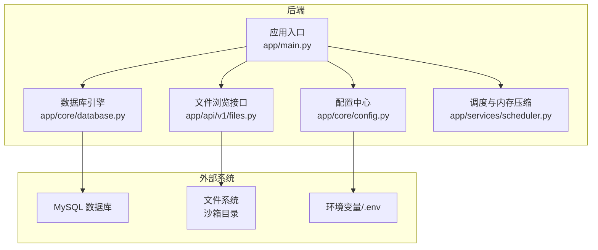
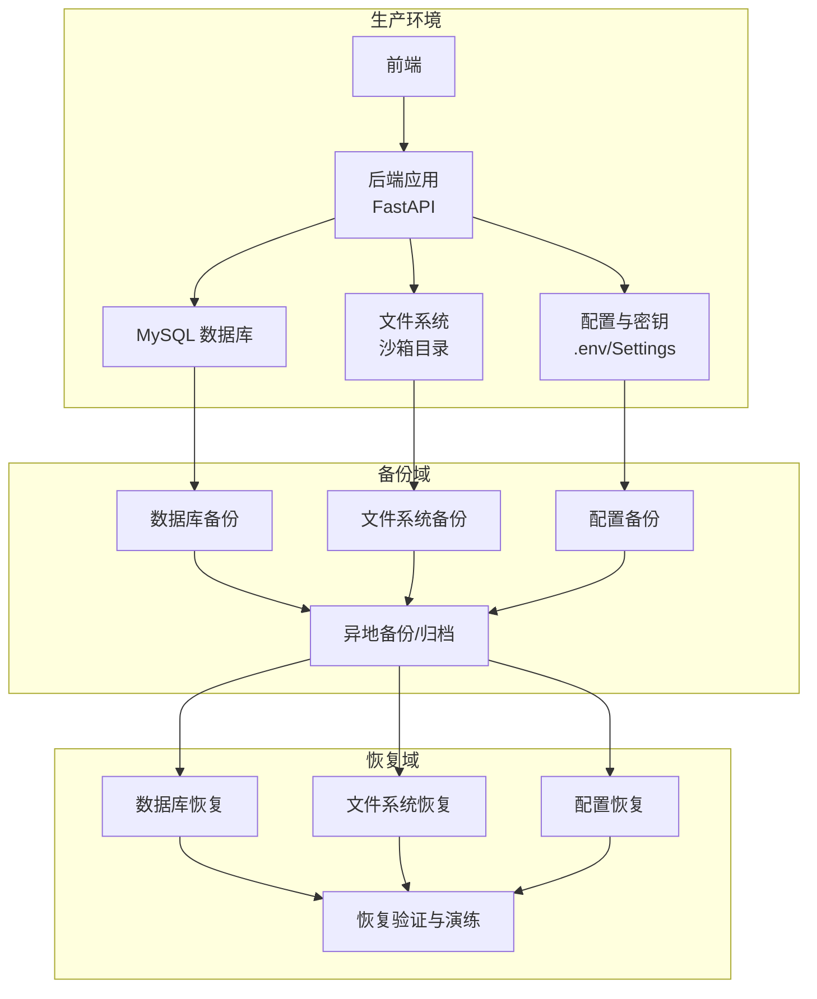
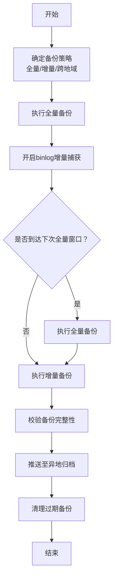
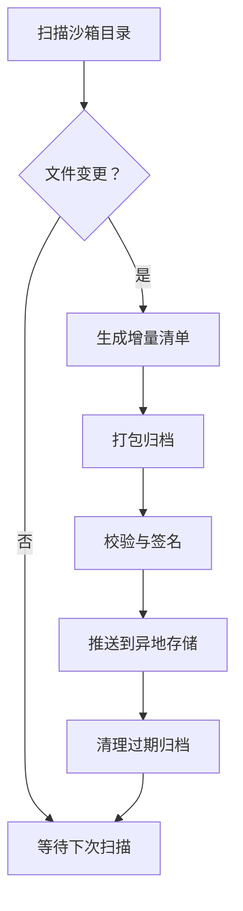
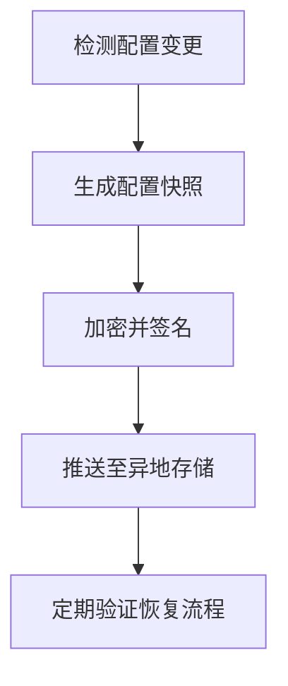
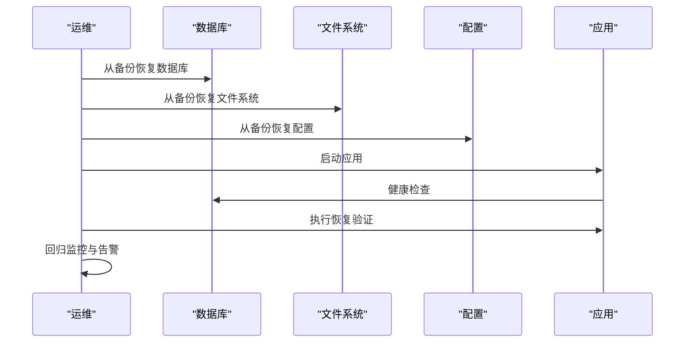
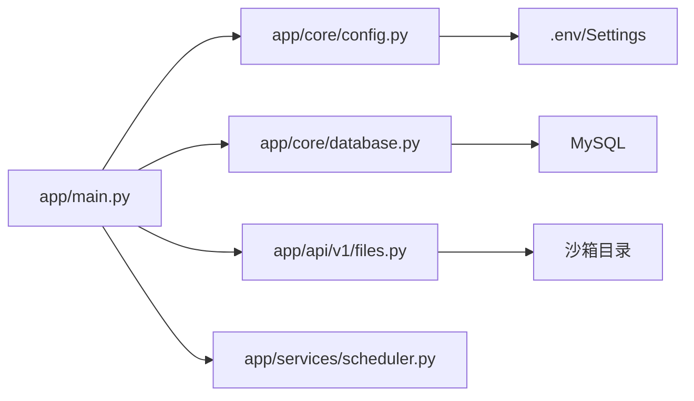

# 备份恢复

<cite>
**本文引用的文件**
- [backend/app/main.py](file://backend/app/main.py)
- [backend/app/core/config.py](file://backend/app/core/config.py)
- [backend/app/core/database.py](file://backend/app/core/database.py)
- [backend/app/api/v1/files.py](file://backend/app/api/v1/files.py)
- [backend/environment.yml](file://backend/environment.yml)
- [backend/app/services/scheduler.py](file://backend/app/services/scheduler.py)
</cite>

## 目录
1. [简介](#简介)
2. [项目结构](#项目结构)
3. [核心组件](#核心组件)
4. [架构总览](#架构总览)
5. [详细组件分析](#详细组件分析)
6. [依赖分析](#依赖分析)
7. [性能考虑](#性能考虑)
8. [故障排查指南](#故障排查指南)
9. [结论](#结论)
10. [附录](#附录)

## 简介
本指南面向运维团队，提供XuanJi项目的端到端备份与恢复策略，覆盖数据库备份、文件系统备份、配置文件备份，并明确增量/全量/跨地域备份配置思路，制定灾难恢复流程、数据恢复测试与RTO/RPO指标，配套自动化备份脚本、备份验证与恢复演练方法，确保企业级数据保护与快速恢复能力。

## 项目结构
XuanJi采用前后端分离架构，后端基于FastAPI+SQLAlchemy，数据库为MySQL，运行在本地或容器环境中。关键数据面包括：
- 关系型数据：MySQL数据库（用户、会话、消息、日志、记忆摘要等）
- 文件系统：沙箱目录用于工具执行与文件浏览
- 配置与密钥：环境变量与配置对象（包含数据库连接串）

图表来源
- [backend/app/main.py:1-79](file://backend/app/main.py#L1-L79)
- [backend/app/core/config.py:1-68](file://backend/app/core/config.py#L1-L68)
- [backend/app/core/database.py:1-65](file://backend/app/core/database.py#L1-L65)
- [backend/app/api/v1/files.py:1-48](file://backend/app/api/v1/files.py#L1-L48)
- [backend/app/services/scheduler.py:1-880](file://backend/app/services/scheduler.py#L1-L880)

章节来源
- [backend/app/main.py:1-79](file://backend/app/main.py#L1-L79)
- [backend/app/core/config.py:1-68](file://backend/app/core/config.py#L1-L68)
- [backend/app/core/database.py:1-65](file://backend/app/core/database.py#L1-L65)
- [backend/app/api/v1/files.py:1-48](file://backend/app/api/v1/files.py#L1-L48)
- [backend/environment.yml:1-25](file://backend/environment.yml#L1-L25)

## 核心组件
- 应用生命周期与初始化：应用启动时进行数据库初始化与表结构创建，并启动后台调度器。
- 配置与连接：集中管理数据库主机、端口、账号、密码、库名及沙箱目录等配置。
- 数据库引擎：通过SQLAlchemy创建引擎与会话，支持自动建库与列增量补齐。
- 文件系统访问：提供沙箱内目录浏览能力，受路径白名单限制。
- 调度与压缩：定期对消息与记忆进行压缩归档，减少长期存储压力。

章节来源
- [backend/app/main.py:15-28](file://backend/app/main.py#L15-L28)
- [backend/app/core/config.py:48-62](file://backend/app/core/config.py#L48-L62)
- [backend/app/core/database.py:22-42](file://backend/app/core/database.py#L22-L42)
- [backend/app/api/v1/files.py:11-47](file://backend/app/api/v1/files.py#L11-L47)
- [backend/app/services/scheduler.py:78-199](file://backend/app/services/scheduler.py#L78-L199)

## 架构总览
下图展示备份与恢复策略在系统中的位置与交互：

图表来源
- [backend/app/main.py:15-28](file://backend/app/main.py#L15-L28)
- [backend/app/core/config.py:48-62](file://backend/app/core/config.py#L48-L62)
- [backend/app/core/database.py:22-42](file://backend/app/core/database.py#L22-L42)
- [backend/app/api/v1/files.py:11-47](file://backend/app/api/v1/files.py#L11-L47)
- [backend/app/services/scheduler.py:78-199](file://backend/app/services/scheduler.py#L78-L199)

## 详细组件分析

### 数据库备份策略
- 备份介质：MySQL关系型数据
- 备份类型
  - 全量备份：周期性导出数据库结构与数据，作为基准快照
  - 增量备份：基于二进制日志（binlog）的增量捕获，缩短RPO
- 备份频率
  - 全量：每日/每周（根据RPO目标与数据量选择）
  - 增量：每小时/每15分钟（取决于binlog轮转与存储成本）
- 跨地域备份
  - 在不同可用区/区域部署备份存储，实现地理冗余
  - 异地归档：将冷数据迁移至低成本存储（如对象存储）
- 备份保留与轮转
  - 基于时间窗口的保留策略（如7天热备、30天温备、1年归档）
  - 自动清理过期备份，避免磁盘占用
- 备份验证
  - 定期抽样恢复演练，验证备份可恢复性与一致性
- RTO/RPO
  - RPO：由增量备份频率决定（如15分钟）
  - RTO：由备份恢复脚本与数据库实例恢复速度决定（如数分钟到数十分钟）

图表来源
- [backend/app/core/database.py:22-42](file://backend/app/core/database.py#L22-L42)
- [backend/app/services/scheduler.py:78-199](file://backend/app/services/scheduler.py#L78-L199)

章节来源
- [backend/app/core/database.py:22-42](file://backend/app/core/database.py#L22-L42)
- [backend/app/services/scheduler.py:78-199](file://backend/app/services/scheduler.py#L78-L199)

### 文件系统备份方案
- 备份范围：沙箱目录（工具执行与临时文件）、用户上传/生成的文件
- 备份方式
  - 全量：周期性归档沙箱目录
  - 增量：基于文件变更的时间戳/哈希差异
- 跨地域：与数据库备份一致，采用异地归档
- 验证：抽样解压/解包，核对关键文件存在与完整性
- RTO/RPO：依据文件规模与传输带宽设定（如RPO=15分钟，RTO=数小时）

图表来源
- [backend/app/api/v1/files.py:11-47](file://backend/app/api/v1/files.py#L11-L47)
- [backend/app/core/config.py:44-46](file://backend/app/core/config.py#L44-L46)

章节来源
- [backend/app/api/v1/files.py:11-47](file://backend/app/api/v1/files.py#L11-L47)
- [backend/app/core/config.py:44-46](file://backend/app/core/config.py#L44-L46)

### 配置文件备份方案
- 备份对象：.env文件、Settings配置、数据库连接串、密钥
- 备份方式：全量备份（敏感信息加密存储）
- 跨地域：与数据库/文件备份一致
- 验证：恢复后启动应用，检查健康检查接口与数据库连通性
- RTO/RPO：RPO=15分钟，RTO=数分钟

图表来源
- [backend/app/core/config.py:48-62](file://backend/app/core/config.py#L48-L62)
- [backend/environment.yml:64-64](file://backend/environment.yml#L64-L64)

章节来源
- [backend/app/core/config.py:48-62](file://backend/app/core/config.py#L48-L62)
- [backend/environment.yml:64-64](file://backend/environment.yml#L64-L64)

### 灾难恢复流程
- 触发条件：数据库/文件系统/配置不可用或损坏
- 恢复步骤
  - 评估影响范围与RTO/RPO目标
  - 从最近可用备份恢复数据库、文件系统与配置
  - 启动应用，执行健康检查
  - 运行恢复验证脚本，确认业务功能正常
  - 回归监控告警，关闭故障切换
- 人员分工：DBA负责数据库恢复，运维负责文件与配置恢复，开发协助验证

图表来源
- [backend/app/main.py:62-64](file://backend/app/main.py#L62-L64)
- [backend/app/core/database.py:22-42](file://backend/app/core/database.py#L22-L42)

章节来源
- [backend/app/main.py:62-64](file://backend/app/main.py#L62-L64)
- [backend/app/core/database.py:22-42](file://backend/app/core/database.py#L22-L42)

### 数据恢复测试与RTO/RPO设定
- 测试频次：每月一次数据库恢复测试，每季度一次全链路恢复演练
- 测试内容：从备份恢复数据库/文件/配置，验证应用健康、接口可用、关键业务流程
- RTO/RPO指标
  - RPO：≤15分钟（基于binlog增量）
  - RTO：≤30分钟（包含恢复与验证）
- 指标监控：通过日志与监控系统记录每次演练结果，持续优化

章节来源
- [backend/app/services/scheduler.py:78-199](file://backend/app/services/scheduler.py#L78-L199)

### 自动化备份脚本与恢复演练
- 自动化备份脚本
  - 数据库：mysqldump/物理备份（如Percona XtraBackup）+ binlog归档
  - 文件系统：rsync/快照 + 增量归档
  - 配置：.env与配置对象快照 + 加密
- 备份验证
  - 抽样恢复：随机选取备份集进行恢复验证
  - 一致性检查：比对关键表行数、文件哈希
- 恢复演练
  - 定期组织跨团队演练，模拟真实故障场景
  - 记录演练过程与改进建议

章节来源
- [backend/app/core/database.py:22-42](file://backend/app/core/database.py#L22-L42)
- [backend/app/api/v1/files.py:11-47](file://backend/app/api/v1/files.py#L11-L47)
- [backend/app/core/config.py:48-62](file://backend/app/core/config.py#L48-L62)

## 依赖分析
- 应用启动依赖配置与数据库初始化，数据库初始化包含自动建库与表结构创建
- 文件浏览接口依赖沙箱目录配置
- 调度器依赖数据库会话与模型，定期执行压缩与归档任务

图表来源
- [backend/app/main.py:15-28](file://backend/app/main.py#L15-L28)
- [backend/app/core/config.py:48-62](file://backend/app/core/config.py#L48-L62)
- [backend/app/core/database.py:22-42](file://backend/app/core/database.py#L22-L42)
- [backend/app/api/v1/files.py:11-47](file://backend/app/api/v1/files.py#L11-L47)
- [backend/app/services/scheduler.py:78-199](file://backend/app/services/scheduler.py#L78-L199)

章节来源
- [backend/app/main.py:15-28](file://backend/app/main.py#L15-L28)
- [backend/app/core/config.py:48-62](file://backend/app/core/config.py#L48-L62)
- [backend/app/core/database.py:22-42](file://backend/app/core/database.py#L22-L42)
- [backend/app/api/v1/files.py:11-47](file://backend/app/api/v1/files.py#L11-L47)
- [backend/app/services/scheduler.py:78-199](file://backend/app/services/scheduler.py#L78-L199)

## 性能考虑
- 备份窗口：避开业务高峰期，采用增量与并行归档
- 存储分层：热数据在线，温数据归档，冷数据离线
- 并发控制：备份期间限制写入或使用只读快照
- 网络与带宽：跨地域备份采用压缩与并发传输

## 故障排查指南
- 数据库无法连接
  - 检查数据库URL与凭据（来自配置对象）
  - 确认网络连通与防火墙策略
- 备份失败
  - 校验备份脚本权限与存储空间
  - 查看binlog状态与归档路径
- 恢复异常
  - 核对备份集完整性与版本
  - 检查应用日志与健康检查接口

章节来源
- [backend/app/core/config.py:48-62](file://backend/app/core/config.py#L48-L62)
- [backend/app/main.py:62-64](file://backend/app/main.py#L62-L64)

## 结论
通过建立全量+增量的数据库备份、文件系统备份与配置备份体系，并结合跨地域归档与定期恢复演练，XuanJi可在保证RPO与RTO目标的同时，实现高可靠的企业级数据保护与快速恢复能力。建议持续优化备份策略与自动化脚本，完善监控与告警机制，确保备份与恢复流程稳定可控。

## 附录
- 关键配置项参考
  - 数据库连接串：见配置对象属性
  - 沙箱目录：见配置对象属性
- 健康检查接口：见应用路由

章节来源
- [backend/app/core/config.py:48-62](file://backend/app/core/config.py#L48-L62)
- [backend/app/core/config.py:44-46](file://backend/app/core/config.py#L44-L46)
- [backend/app/main.py:62-64](file://backend/app/main.py#L62-L64)