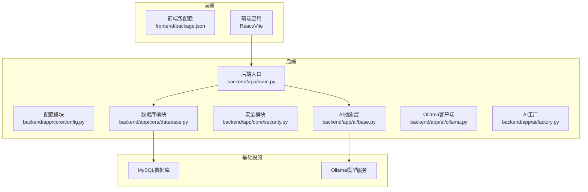
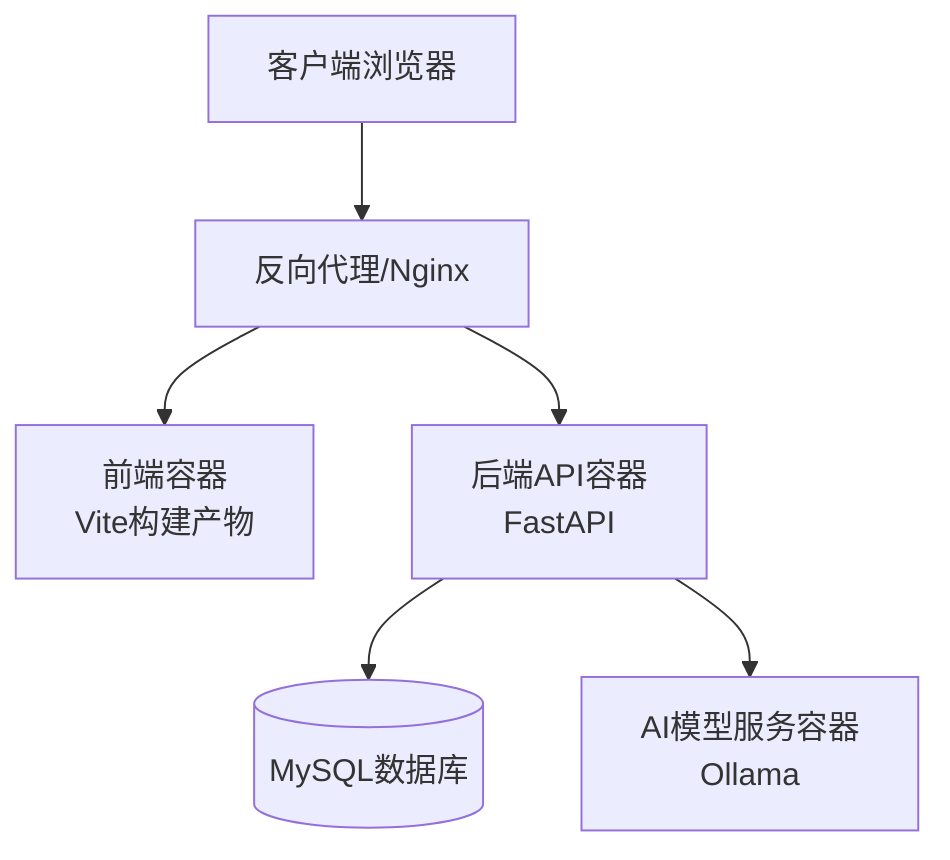
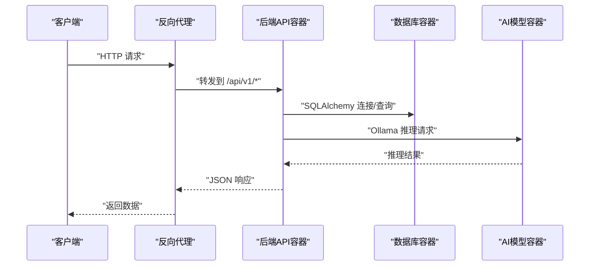
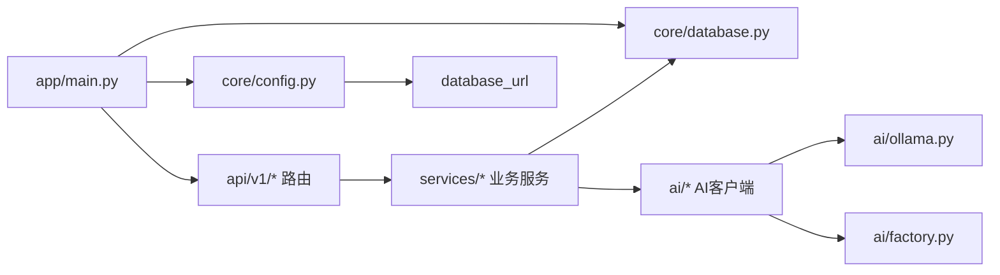

# 容器化部署

<cite>
**本文引用的文件**
- [backend/app/main.py](file://backend/app/main.py)
- [backend/app/core/config.py](file://backend/app/core/config.py)
- [backend/app/core/database.py](file://backend/app/core/database.py)
- [backend/app/core/security.py](file://backend/app/core/security.py)
- [backend/app/ai/base.py](file://backend/app/ai/base.py)
- [backend/app/ai/ollama.py](file://backend/app/ai/ollama.py)
- [backend/app/ai/factory.py](file://backend/app/ai/factory.py)
- [backend/app/tools/call_all_models.py](file://backend/app/tools/call_all_models.py)
- [frontend/package.json](file://frontend/package.json)
</cite>

## 目录
1. [简介](#简介)
2. [项目结构](#项目结构)
3. [核心组件](#核心组件)
4. [架构总览](#架构总览)
5. [详细组件分析](#详细组件分析)
6. [依赖分析](#依赖分析)
7. [性能考虑](#性能考虑)
8. [故障排查指南](#故障排查指南)
9. [结论](#结论)
10. [附录](#附录)

## 简介
本文件面向DevOps团队，提供XuanJi项目的容器化部署指导。内容涵盖后端API服务、前端静态站点、数据库与AI模型服务的容器化策略，以及基于Docker Compose的服务编排、健康检查、资源限制、监控与日志收集、故障排查等实践建议。文档以仓库现有代码为依据，结合实际部署场景给出可操作的实施方案。

## 项目结构
XuanJi采用前后端分离架构：前端为React/Vite应用，后端为Python/FastAPI服务，数据库采用MySQL，AI推理通过本地Ollama服务完成。整体部署建议使用Docker Compose进行统一编排，形成“前端静态站点 + 后端API + 数据库 + AI模型服务”的多容器协同。

图表来源
- [backend/app/main.py:1-79](file://backend/app/main.py#L1-L79)
- [backend/app/core/config.py:1-68](file://backend/app/core/config.py#L1-L68)
- [backend/app/core/database.py:1-65](file://backend/app/core/database.py#L1-L65)
- [backend/app/core/security.py:1-38](file://backend/app/core/security.py#L1-L38)
- [backend/app/ai/base.py:1-73](file://backend/app/ai/base.py#L1-L73)
- [backend/app/ai/ollama.py:1-91](file://backend/app/ai/ollama.py#L1-L91)
- [backend/app/ai/factory.py:1-154](file://backend/app/ai/factory.py#L1-L154)
- [frontend/package.json:1-44](file://frontend/package.json#L1-L44)

章节来源
- [backend/app/main.py:1-79](file://backend/app/main.py#L1-L79)
- [backend/app/core/config.py:1-68](file://backend/app/core/config.py#L1-L68)
- [backend/app/core/database.py:1-65](file://backend/app/core/database.py#L1-L65)
- [backend/app/core/security.py:1-38](file://backend/app/core/security.py#L1-L38)
- [backend/app/ai/base.py:1-73](file://backend/app/ai/base.py#L1-L73)
- [backend/app/ai/ollama.py:1-91](file://backend/app/ai/ollama.py#L1-L91)
- [backend/app/ai/factory.py:1-154](file://backend/app/ai/factory.py#L1-L154)
- [frontend/package.json:1-44](file://frontend/package.json#L1-L44)

## 核心组件
- 后端API服务
  - 使用FastAPI提供REST接口，内置CORS中间件与健康检查端点，启动时初始化数据库并启动后台调度任务。
  - 关键路径参考：[backend/app/main.py:30-64](file://backend/app/main.py#L30-L64)
- 配置与连接
  - 通过Pydantic Settings加载环境变量，定义数据库连接串、AI服务地址与模型名、CORS允许域、沙箱目录与超时等。
  - 关键路径参考：[backend/app/core/config.py:4-64](file://backend/app/core/config.py#L4-L64)
- 数据库
  - 使用SQLAlchemy创建数据库与表，自动迁移缺失列；提供会话管理与上下文注入。
  - 关键路径参考：[backend/app/core/database.py:6-38](file://backend/app/core/database.py#L6-L38)
- 安全
  - 提供密码哈希、JWT签发与解码，用于认证与授权。
  - 关键路径参考：[backend/app/core/security.py:12-37](file://backend/app/core/security.py#L12-L37)
- AI服务
  - 抽象统一的LLM客户端接口，Ollama客户端封装HTTP调用，工厂根据用户设置动态创建不同角色的AI客户端。
  - 关键路径参考：[backend/app/ai/base.py:8-35](file://backend/app/ai/base.py#L8-L35)，[backend/app/ai/ollama.py:10-91](file://backend/app/ai/ollama.py#L10-L91)，[backend/app/ai/factory.py:54-154](file://backend/app/ai/factory.py#L54-L154)

章节来源
- [backend/app/main.py:15-64](file://backend/app/main.py#L15-L64)
- [backend/app/core/config.py:4-64](file://backend/app/core/config.py#L4-L64)
- [backend/app/core/database.py:22-42](file://backend/app/core/database.py#L22-L42)
- [backend/app/core/security.py:12-37](file://backend/app/core/security.py#L12-L37)
- [backend/app/ai/base.py:8-35](file://backend/app/ai/base.py#L8-L35)
- [backend/app/ai/ollama.py:10-91](file://backend/app/ai/ollama.py#L10-L91)
- [backend/app/ai/factory.py:54-154](file://backend/app/ai/factory.py#L54-L154)

## 架构总览
下图展示容器化后的系统交互：前端静态站点通过反向代理暴露给外部；后端API服务与数据库、AI模型服务在同一网络内通信；健康检查与资源限制确保服务稳定性。

图表来源
- [backend/app/main.py:30-64](file://backend/app/main.py#L30-L64)
- [backend/app/core/config.py:6-14](file://backend/app/core/config.py#L6-L14)
- [backend/app/core/database.py:6-7](file://backend/app/core/database.py#L6-L7)
- [backend/app/ai/ollama.py:16-17](file://backend/app/ai/ollama.py#L16-L17)

## 详细组件分析

### 后端API容器化要点
- 入口与端口
  - 应监听0.0.0.0并绑定固定端口，便于容器网络访问。
  - 参考路径：[backend/app/main.py:67-78](file://backend/app/main.py#L67-L78)
- 健康检查
  - 提供/health端点，适合容器健康探针使用。
  - 参考路径：[backend/app/main.py:62-64](file://backend/app/main.py#L62-L64)
- 数据库初始化
  - 启动时自动创建数据库与表，并执行列级自动迁移。
  - 参考路径：[backend/app/core/database.py:22-42](file://backend/app/core/database.py#L22-L42)
- CORS与安全
  - CORS允许域来自配置，生产环境需明确域名；JWT密钥需在环境变量中设置。
  - 参考路径：[backend/app/main.py:32-38](file://backend/app/main.py#L32-L38)，[backend/app/core/config.py:41-42](file://backend/app/core/config.py#L41-L42)，[backend/app/core/security.py:24-30](file://backend/app/core/security.py#L24-L30)
- AI服务集成
  - Ollama默认地址可在容器网络内通过服务名访问；模型名与在线LLM配置来自用户设置。
  - 参考路径：[backend/app/core/config.py:12-26](file://backend/app/core/config.py#L12-L26)，[backend/app/ai/ollama.py:16-17](file://backend/app/ai/ollama.py#L16-L17)，[backend/app/ai/factory.py:54-73](file://backend/app/ai/factory.py#L54-L73)

图表来源
- [backend/app/main.py:40-40](file://backend/app/main.py#L40-L40)
- [backend/app/core/database.py:6-7](file://backend/app/core/database.py#L6-L7)
- [backend/app/ai/ollama.py:26-48](file://backend/app/ai/ollama.py#L26-L48)

章节来源
- [backend/app/main.py:30-78](file://backend/app/main.py#L30-L78)
- [backend/app/core/config.py:4-64](file://backend/app/core/config.py#L4-L64)
- [backend/app/core/database.py:22-42](file://backend/app/core/database.py#L22-L42)
- [backend/app/ai/ollama.py:10-91](file://backend/app/ai/ollama.py#L10-L91)
- [backend/app/ai/factory.py:54-154](file://backend/app/ai/factory.py#L54-L154)

### 前端容器化要点
- 构建产物
  - 使用Vite构建静态资源，建议将dist目录挂载至Nginx容器提供服务。
  - 参考路径：[frontend/package.json:6-10](file://frontend/package.json#L6-L10)
- 跨域与反向代理
  - 生产环境需在Nginx中配置CORS与后端API转发规则，避免浏览器同源限制。
  - 参考路径：[backend/app/core/config.py:41-42](file://backend/app/core/config.py#L41-L42)

章节来源
- [frontend/package.json:6-10](file://frontend/package.json#L6-L10)
- [backend/app/core/config.py:41-42](file://backend/app/core/config.py#L41-L42)

### 数据库容器配置
- MySQL
  - 使用官方镜像，持久化卷映射至宿主机；初始化脚本可由后端自动执行。
  - 参考路径：[backend/app/core/database.py:22-38](file://backend/app/core/database.py#L22-L38)，[backend/app/core/config.py:6-10](file://backend/app/core/config.py#L6-L10)
- 连接池与字符集
  - 建议启用pool_pre_ping，字符集使用utf8mb4。
  - 参考路径：[backend/app/core/database.py:6-6](file://backend/app/core/database.py#L6-L6)

章节来源
- [backend/app/core/database.py:22-38](file://backend/app/core/database.py#L22-L38)
- [backend/app/core/config.py:6-10](file://backend/app/core/config.py#L6-L10)

### AI模型服务容器化
- Ollama
  - 作为独立容器运行，后端通过配置中的base_url访问；模型名在用户设置中指定。
  - 参考路径：[backend/app/core/config.py:12-14](file://backend/app/core/config.py#L12-L14)，[backend/app/ai/ollama.py:16-17](file://backend/app/ai/ollama.py#L16-L17)，[backend/app/ai/factory.py:44-51](file://backend/app/ai/factory.py#L44-L51)
- 在线LLM
  - 支持通过在线提供商接入，需正确配置API Key与Base URL。
  - 参考路径：[backend/app/ai/factory.py:14-36](file://backend/app/ai/factory.py#L14-L36)，[backend/app/ai/factory.py:65-70](file://backend/app/ai/factory.py#L65-L70)

章节来源
- [backend/app/core/config.py:12-26](file://backend/app/core/config.py#L12-L26)
- [backend/app/ai/ollama.py:16-17](file://backend/app/ai/ollama.py#L16-L17)
- [backend/app/ai/factory.py:14-51](file://backend/app/ai/factory.py#L14-L51)

### 工具与模型状态检查
- 模型状态检查
  - 提供示例函数用于检查可用模型与离线模型数量，可作为容器健康检查的参考实现。
  - 参考路径：[backend/app/tools/call_all_models.py:1-37](file://backend/app/tools/call_all_models.py#L1-L37)

章节来源
- [backend/app/tools/call_all_models.py:1-37](file://backend/app/tools/call_all_models.py#L1-L37)

## 依赖分析
后端服务的关键依赖关系如下：

图表来源
- [backend/app/main.py:10-40](file://backend/app/main.py#L10-L40)
- [backend/app/core/config.py:48-64](file://backend/app/core/config.py#L48-L64)
- [backend/app/core/database.py:6-38](file://backend/app/core/database.py#L6-L38)
- [backend/app/ai/ollama.py:10-91](file://backend/app/ai/ollama.py#L10-L91)
- [backend/app/ai/factory.py:54-154](file://backend/app/ai/factory.py#L54-L154)

章节来源
- [backend/app/main.py:10-40](file://backend/app/main.py#L10-L40)
- [backend/app/core/config.py:48-64](file://backend/app/core/config.py#L48-L64)
- [backend/app/core/database.py:6-38](file://backend/app/core/database.py#L6-L38)
- [backend/app/ai/ollama.py:10-91](file://backend/app/ai/ollama.py#L10-L91)
- [backend/app/ai/factory.py:54-154](file://backend/app/ai/factory.py#L54-L154)

## 性能考虑
- 数据库连接
  - 使用连接池与pool_pre_ping，减少断连与重建成本。
  - 参考路径：[backend/app/core/database.py:6-6](file://backend/app/core/database.py#L6-L6)
- AI推理超时
  - Ollama客户端设置合理超时，避免长时间阻塞。
  - 参考路径：[backend/app/ai/ollama.py:26-26](file://backend/app/ai/ollama.py#L26-L26)
- 前端静态资源
  - 使用压缩与缓存策略，降低带宽占用。
  - 参考路径：[frontend/package.json:6-10](file://frontend/package.json#L6-L10)
- 资源限制
  - 建议为各容器设置CPU/内存限制，防止资源争抢。
  - 参考路径：[backend/app/main.py:67-78](file://backend/app/main.py#L67-L78)

## 故障排查指南
- 健康检查
  - 使用/health端点快速判断后端存活；若失败，检查数据库连接与AI服务可达性。
  - 参考路径：[backend/app/main.py:62-64](file://backend/app/main.py#L62-L64)
- 数据库初始化失败
  - 确认数据库凭据与网络连通；查看初始化日志与自动迁移输出。
  - 参考路径：[backend/app/core/database.py:22-42](file://backend/app/core/database.py#L22-L42)
- AI服务不可达
  - 校验Ollama地址与模型名；确认容器网络与防火墙策略。
  - 参考路径：[backend/app/core/config.py:12-14](file://backend/app/core/config.py#L12-L14)，[backend/app/ai/ollama.py:16-17](file://backend/app/ai/ollama.py#L16-L17)
- CORS跨域问题
  - 生产环境需在Nginx中配置允许的源与头，避免浏览器拦截。
  - 参考路径：[backend/app/core/config.py:41-42](file://backend/app/core/config.py#L41-L42)
- 日志与监控
  - 建议开启容器标准输出日志采集；结合指标导出与告警策略。
  - 参考路径：[backend/app/main.py:67-78](file://backend/app/main.py#L67-L78)

章节来源
- [backend/app/main.py:62-64](file://backend/app/main.py#L62-L64)
- [backend/app/core/database.py:22-42](file://backend/app/core/database.py#L22-L42)
- [backend/app/core/config.py:12-14](file://backend/app/core/config.py#L12-L14)
- [backend/app/ai/ollama.py:16-17](file://backend/app/ai/ollama.py#L16-L17)
- [backend/app/core/config.py:41-42](file://backend/app/core/config.py#L41-L42)
- [backend/app/main.py:67-78](file://backend/app/main.py#L67-L78)

## 结论
通过容器化部署，XuanJi可以实现前后端分离、数据库与AI模型服务的独立扩展与弹性伸缩。建议以Docker Compose统一编排，配合健康检查、资源限制、日志与监控体系，确保生产环境的稳定性与可观测性。后续可根据业务增长逐步引入负载均衡、缓存与消息队列等组件。

## 附录
- Docker与Docker Compose最佳实践
  - 使用多阶段构建优化镜像体积；为每个服务设置独立的用户与非root运行。
  - 使用只读根文件系统与最小权限原则；敏感配置通过环境变量或密钥管理服务注入。
  - 为数据库与AI服务配置持久化存储与备份策略。
  - 为各容器设置合理的重启策略与健康检查间隔。
- 监控与日志
  - 使用集中式日志收集（如Fluent Bit/Fluentd）与日志聚合（如ELK/EFK）。
  - 导出Prometheus指标，结合Grafana可视化；设置关键阈值告警。
- 安全加固
  - 强制HTTPS与TLS终止；限制入站流量与端口暴露。
  - 定期更新基础镜像与依赖；启用容器漏洞扫描。