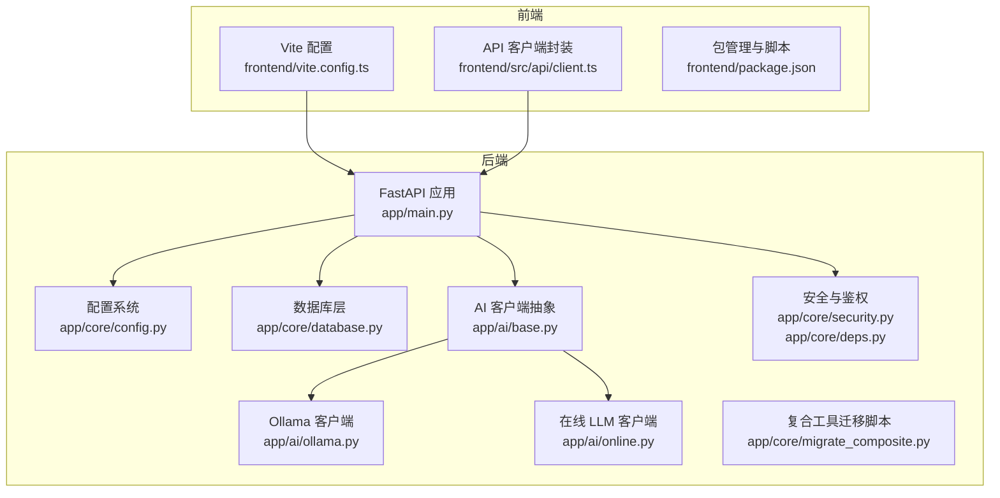
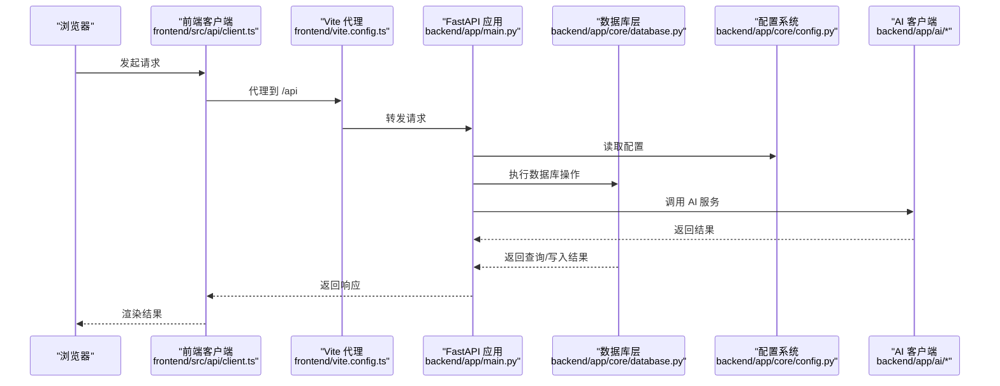
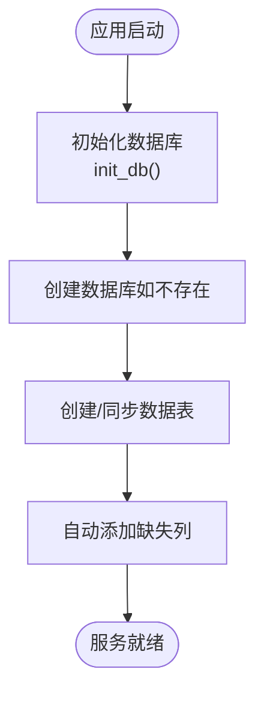
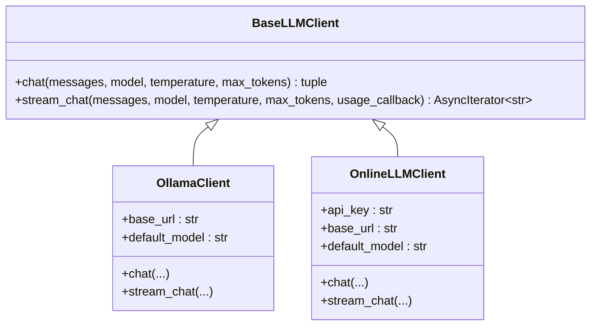
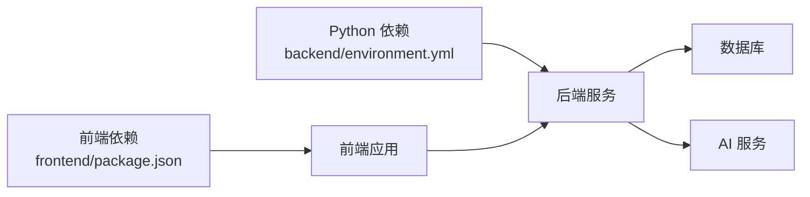

# 环境配置

<cite>
**本文引用的文件**
- [environment.yml](file://backend/environment.yml)
- [config.py](file://backend/app/core/config.py)
- [main.py](file://backend/app/main.py)
- [database.py](file://backend/app/core/database.py)
- [ollama.py](file://backend/app/ai/ollama.py)
- [online.py](file://backend/app/ai/online.py)
- [base.py](file://backend/app/ai/base.py)
- [deps.py](file://backend/app/core/deps.py)
- [security.py](file://backend/app/core/security.py)
- [migrate_composite.py](file://backend/app/core/migrate_composite.py)
- [vite.config.ts](file://frontend/vite.config.ts)
- [client.ts](file://frontend/src/api/client.ts)
- [package.json](file://frontend/package.json)
</cite>

## 目录
1. [简介](#简介)
2. [项目结构](#项目结构)
3. [核心组件](#核心组件)
4. [架构总览](#架构总览)
5. [详细组件分析](#详细组件分析)
6. [依赖分析](#依赖分析)
7. [性能考虑](#性能考虑)
8. [故障排查指南](#故障排查指南)
9. [结论](#结论)
10. [附录](#附录)

## 简介
本指南面向开发者与运维人员，提供 XuanJi 项目的完整环境准备与配置说明，涵盖：
- Conda 环境搭建与 Python 依赖安装
- 环境变量与配置文件结构
- 数据库连接与初始化
- AI 模型服务配置（本地 Ollama 与在线 LLM）
- 开发与生产环境差异配置
- 环境验证方法与常见问题排查

## 项目结构
后端采用 FastAPI + SQLAlchemy 架构，前端使用 Vite + React。后端通过 pydantic-settings 读取 .env 环境变量，统一管理数据库、AI 服务与应用配置。

图表来源
- [main.py:1-79](file://backend/app/main.py#L1-L79)
- [config.py:1-68](file://backend/app/core/config.py#L1-L68)
- [database.py:1-65](file://backend/app/core/database.py#L1-L65)
- [base.py:1-73](file://backend/app/ai/base.py#L1-L73)
- [ollama.py:1-91](file://backend/app/ai/ollama.py#L1-L91)
- [online.py:1-134](file://backend/app/ai/online.py#L1-L134)
- [security.py:1-38](file://backend/app/core/security.py#L1-L38)
- [deps.py:1-42](file://backend/app/core/deps.py#L1-L42)
- [migrate_composite.py:1-153](file://backend/app/core/migrate_composite.py#L1-L153)
- [vite.config.ts:1-35](file://frontend/vite.config.ts#L1-L35)
- [client.ts:1-119](file://frontend/src/api/client.ts#L1-L119)
- [package.json:1-44](file://frontend/package.json#L1-L44)

章节来源
- [main.py:1-79](file://backend/app/main.py#L1-L79)
- [config.py:1-68](file://backend/app/core/config.py#L1-L68)
- [vite.config.ts:1-35](file://frontend/vite.config.ts#L1-L35)

## 核心组件
- 配置系统：集中定义数据库、AI 服务、应用与沙箱配置，并通过 .env 注入。
- 数据库层：自动创建数据库与表，支持列级增量迁移。
- AI 客户端：统一抽象，支持本地 Ollama 与在线 LLM。
- 安全与鉴权：基于 JWT 的访问令牌签发与校验。
- 前端代理与 API 封装：本地开发时代理到后端，运行时可配置 API 基础地址。

章节来源
- [config.py:1-68](file://backend/app/core/config.py#L1-L68)
- [database.py:1-65](file://backend/app/core/database.py#L1-L65)
- [base.py:1-73](file://backend/app/ai/base.py#L1-L73)
- [ollama.py:1-91](file://backend/app/ai/ollama.py#L1-L91)
- [online.py:1-134](file://backend/app/ai/online.py#L1-L134)
- [security.py:1-38](file://backend/app/core/security.py#L1-L38)
- [deps.py:1-42](file://backend/app/core/deps.py#L1-L42)
- [vite.config.ts:1-35](file://frontend/vite.config.ts#L1-L35)
- [client.ts:1-119](file://frontend/src/api/client.ts#L1-L119)

## 架构总览
下图展示从浏览器到后端 API 再到数据库与 AI 服务的整体流程。

图表来源
- [client.ts:1-119](file://frontend/src/api/client.ts#L1-L119)
- [vite.config.ts:1-35](file://frontend/vite.config.ts#L1-L35)
- [main.py:1-79](file://backend/app/main.py#L1-L79)
- [config.py:1-68](file://backend/app/core/config.py#L1-L68)
- [database.py:1-65](file://backend/app/core/database.py#L1-L65)
- [ollama.py:1-91](file://backend/app/ai/ollama.py#L1-L91)
- [online.py:1-134](file://backend/app/ai/online.py#L1-L134)

## 详细组件分析

### 1) Conda 环境与 Python 依赖
- 使用 Conda 创建隔离环境，指定 Python 版本与通道。
- 通过 environment.yml 安装后端所需依赖（FastAPI、Uvicorn、SQLAlchemy、PyMySQL、Cryptography、Pydantic、Alembic、httpx、python-dotenv、pytest 等）。
- 建议在虚拟环境中执行安装，避免系统 Python 干扰。

章节来源
- [environment.yml:1-25](file://backend/environment.yml#L1-L25)

### 2) 环境变量与配置文件结构
- 配置类集中于 app/core/config.py，包含数据库、AI 服务、应用与沙箱相关字段。
- 默认值用于本地开发，生产环境需通过 .env 覆盖。
- 配置类通过 pydantic-settings 从 ../.env 加载键值对，编码为 UTF-8。

章节来源
- [config.py:1-68](file://backend/app/core/config.py#L1-L68)

### 3) 数据库连接与初始化
- 数据库引擎通过 settings.database_url 初始化，启用连接池预检查。
- 应用启动时自动创建数据库与所有表，并进行列级增量迁移。
- 提供 database_url_without_db 属性用于创建数据库。

图表来源
- [database.py:1-65](file://backend/app/core/database.py#L1-L65)
- [config.py:48-64](file://backend/app/core/config.py#L48-L64)

章节来源
- [database.py:1-65](file://backend/app/core/database.py#L1-L65)
- [config.py:48-64](file://backend/app/core/config.py#L48-L64)

### 4) AI 模型服务配置
- 本地 Ollama：通过 OllamaClient 调用本地推理服务，支持流式与非流式对话。
- 在线 LLM：通过 OnlineLLMClient 调用第三方 API，支持流式与非流式对话。
- 配置项包括基础地址、模型名、API Key 等，可在 .env 中设置或通过用户设置覆盖。

图表来源
- [base.py:1-73](file://backend/app/ai/base.py#L1-L73)
- [ollama.py:1-91](file://backend/app/ai/ollama.py#L1-L91)
- [online.py:1-134](file://backend/app/ai/online.py#L1-L134)

章节来源
- [base.py:1-73](file://backend/app/ai/base.py#L1-L73)
- [ollama.py:1-91](file://backend/app/ai/ollama.py#L1-L91)
- [online.py:1-134](file://backend/app/ai/online.py#L1-L134)

### 5) 安全与鉴权
- 密钥与令牌：secret_key 用于 JWT 签发，ACCESS_TOKEN_EXPIRE_MINUTES 控制过期时间。
- 令牌签发与解码：create_access_token / decode_access_token。
- 鉴权依赖：HTTP Bearer 方案，校验令牌并解析用户 ID。

章节来源
- [security.py:1-38](file://backend/app/core/security.py#L1-L38)
- [deps.py:1-42](file://backend/app/core/deps.py#L1-L42)

### 6) 复合工具迁移脚本
- 自动为工具表增加描述与类型字段，创建组合工具与版本化表。
- 为现有工具插入初始版本快照，保证向后兼容。
- 脚本幂等，可重复执行。

章节来源
- [migrate_composite.py:1-153](file://backend/app/core/migrate_composite.py#L1-L153)

### 7) 前端代理与 API 封装
- Vite 本地开发服务器默认端口 5173，代理 /api 到后端 8000 端口。
- 前端通过 import.meta.env.VITE_API_BASE_URL 动态配置 API 基础地址，默认使用相对路径。
- 请求封装支持 Bearer Token 注入与 SSE 流式事件解析。

章节来源
- [vite.config.ts:1-35](file://frontend/vite.config.ts#L1-L35)
- [client.ts:1-119](file://frontend/src/api/client.ts#L1-L119)
- [package.json:1-44](file://frontend/package.json#L1-L44)

## 依赖分析
- 后端依赖：FastAPI、Uvicorn、SQLAlchemy、PyMySQL、Pydantic、Pydantic-Settings、Alembic、httpx、python-dotenv、bcrypt、jose、email-validator、pytest、pytest-asyncio。
- 前端依赖：React、React Router、TailwindCSS、Vite、TypeScript、ECharts、Zustand 等。

图表来源
- [environment.yml:1-25](file://backend/environment.yml#L1-L25)
- [package.json:1-44](file://frontend/package.json#L1-L44)

章节来源
- [environment.yml:1-25](file://backend/environment.yml#L1-L25)
- [package.json:1-44](file://frontend/package.json#L1-L44)

## 性能考虑
- 数据库连接池与预检查：启用 pool_pre_ping，提升连接稳定性。
- 表与列增量迁移：减少手动维护成本，避免生产中断。
- AI 请求超时：Ollama 与在线 LLM 客户端分别设置合理超时，避免阻塞。
- 前端打包优化：Vite 配置按需拆分大依赖，降低首屏体积。

章节来源
- [database.py:1-65](file://backend/app/core/database.py#L1-L65)
- [migrate_composite.py:1-153](file://backend/app/core/migrate_composite.py#L1-L153)
- [ollama.py:1-91](file://backend/app/ai/ollama.py#L1-L91)
- [online.py:1-134](file://backend/app/ai/online.py#L1-L134)
- [vite.config.ts:1-35](file://frontend/vite.config.ts#L1-L35)

## 故障排查指南
- 数据库无法连接
  - 检查 .env 中 db_host、db_port、db_user、db_password、db_name 是否正确。
  - 确认 MySQL 服务运行且允许来自容器/主机的连接。
  - 如需远程连接，确保防火墙与权限配置。
  - 参考：[config.py:6-10](file://backend/app/core/config.py#L6-L10)、[database.py:22-38](file://backend/app/core/database.py#L22-L38)

- 数据库初始化失败
  - 确保具备创建数据库与表的权限。
  - 查看是否存在同名数据库或表冲突。
  - 参考：[database.py:22-42](file://backend/app/core/database.py#L22-L42)

- AI 服务不可达
  - Ollama：确认本地服务运行与端口开放，检查 ollama_base_url 与 ollama_model。
  - 在线 LLM：确认 llm_api_key、llm_api_base_url、llm_model_name 已配置。
  - 参考：[config.py:13-20](file://backend/app/core/config.py#L13-L20)、[ollama.py:16-17](file://backend/app/ai/ollama.py#L16-L17)、[online.py:17-23](file://backend/app/ai/online.py#L17-L23)

- CORS 或跨域问题
  - 检查 cors_origins 是否包含前端地址（默认 localhost:5173）。
  - 参考：[config.py](file://backend/app/core/config.py#L42)、[main.py:32-38](file://backend/app/main.py#L32-L38)

- JWT 令牌无效
  - 确认 secret_key 未泄露且与后端一致。
  - 检查令牌是否过期或 payload 结构异常。
  - 参考：[security.py:24-37](file://backend/app/core/security.py#L24-L37)、[deps.py:16-41](file://backend/app/core/deps.py#L16-L41)

- 前端代理失败
  - 确认 Vite 代理配置指向后端 8000 端口。
  - 检查网络连通性与防火墙策略。
  - 参考：[vite.config.ts:27-32](file://frontend/vite.config.ts#L27-L32)

- 环境变量未生效
  - 确认 .env 文件位于 ../.env 路径，编码为 UTF-8。
  - 参考：[config.py](file://backend/app/core/config.py#L64)

## 结论
通过 Conda 环境与统一的配置体系，XuanJi 实现了前后端分离、数据库自动化与 AI 服务可插拔的工程化部署。建议在生产环境严格管理密钥与网络策略，开启 HTTPS 与最小权限原则，并定期执行数据库迁移脚本以保障数据一致性。

## 附录

### A. 开发环境与生产环境差异化配置
- 开发环境
  - 使用默认数据库与 AI 配置，便于快速启动。
  - 前端通过 Vite 代理到后端，便于联调。
  - 参考：[config.py:6-46](file://backend/app/core/config.py#L6-L46)、[vite.config.ts:25-33](file://frontend/vite.config.ts#L25-L33)

- 生产环境
  - 强制覆盖敏感配置（数据库凭据、AI API Key、secret_key、CORS 来源）。
  - 使用独立 .env 文件，限制权限与备份。
  - 参考：[config.py:41-46](file://backend/app/core/config.py#L41-L46)、[security.py:40-41](file://backend/app/core/security.py#L40-L41)

### B. 环境验证清单
- 后端
  - 运行健康检查接口 /health，确认返回状态正常。
  - 参考：[main.py:62-64](file://backend/app/main.py#L62-L64)

- 数据库
  - 登录数据库验证表结构与数据迁移结果。
  - 参考：[database.py:35-42](file://backend/app/core/database.py#L35-L42)、[migrate_composite.py:33-148](file://backend/app/core/migrate_composite.py#L33-L148)

- AI 服务
  - 发送一条测试消息，确认 Ollama 或在线 LLM 返回内容与用量。
  - 参考：[ollama.py:26-48](file://backend/app/ai/ollama.py#L26-L48)、[online.py:39-57](file://backend/app/ai/online.py#L39-L57)

- 前端
  - 访问前端页面，确认代理与 API 调用成功。
  - 参考：[client.ts:33-44](file://frontend/src/api/client.ts#L33-L44)、[vite.config.ts:27-32](file://frontend/vite.config.ts#L27-L32)