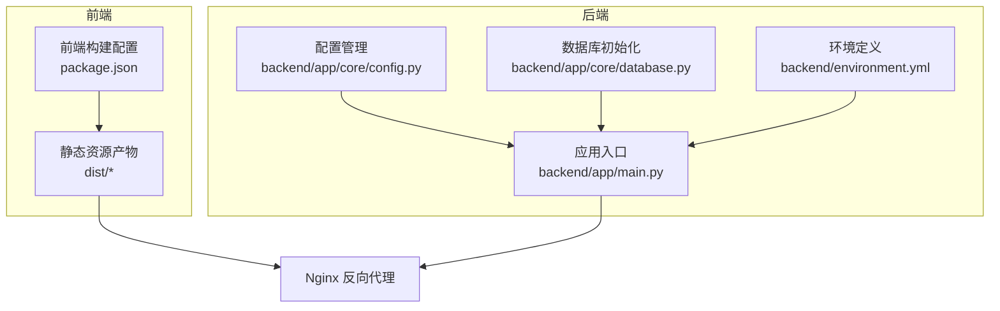
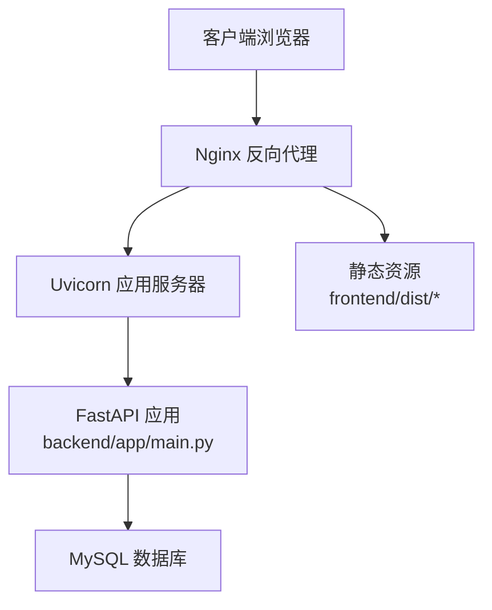
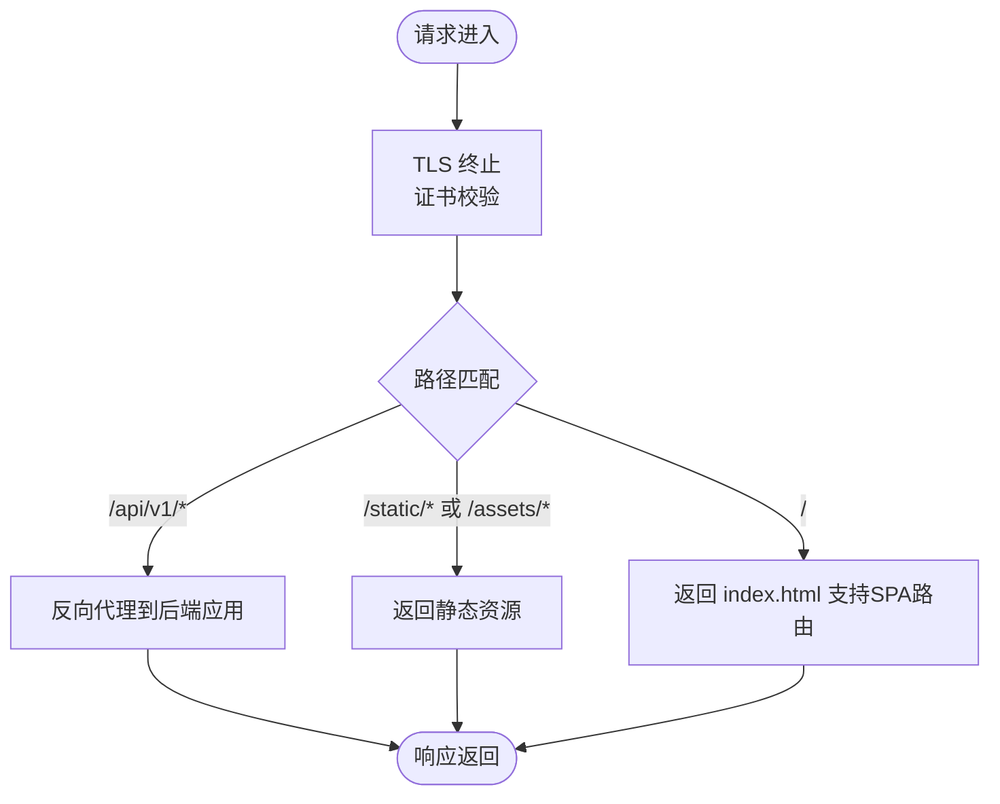
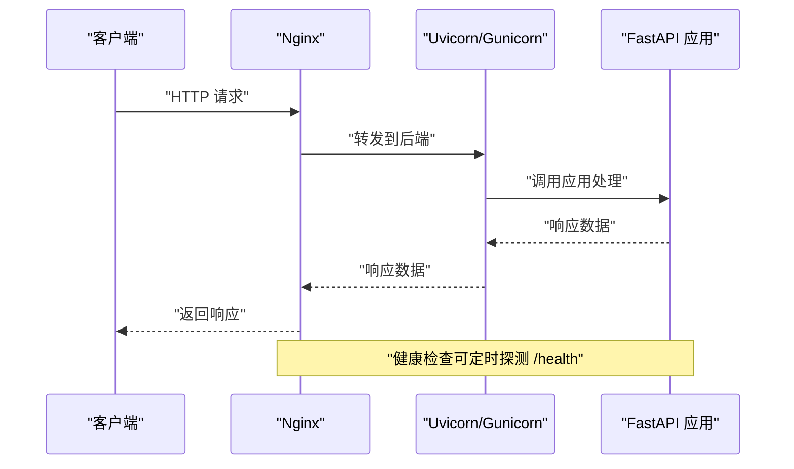
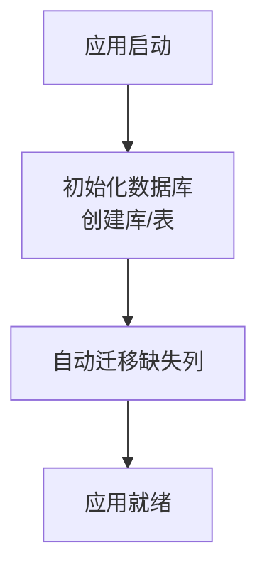
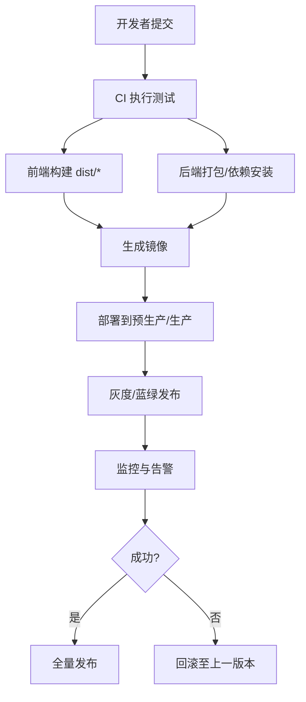
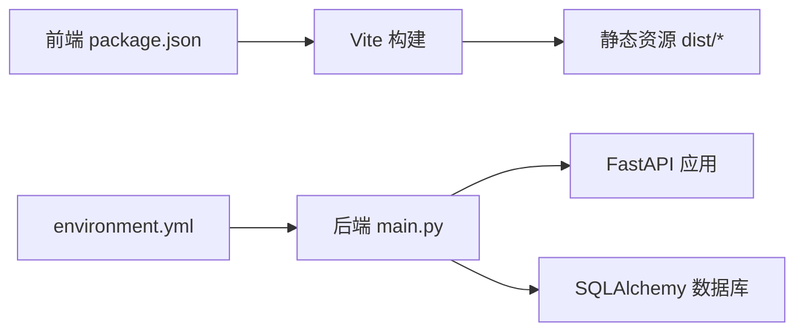

# 生产部署

<cite>
**本文引用的文件**
- [backend/app/main.py](file://backend/app/main.py)
- [backend/app/core/config.py](file://backend/app/core/config.py)
- [backend/app/core/database.py](file://backend/app/core/database.py)
- [backend/environment.yml](file://backend/environment.yml)
- [frontend/package.json](file://frontend/package.json)
</cite>

## 目录
1. [简介](#简介)
2. [项目结构](#项目结构)
3. [核心组件](#核心组件)
4. [架构总览](#架构总览)
5. [详细组件分析](#详细组件分析)
6. [依赖分析](#依赖分析)
7. [性能考虑](#性能考虑)
8. [故障排查指南](#故障排查指南)
9. [结论](#结论)
10. [附录](#附录)

## 简介
本指南面向运维团队，提供XuanJi项目的生产环境部署最佳实践，覆盖以下方面：
- Nginx反向代理与静态资源优化
- SSL/TLS证书部署与安全加固
- Gunicorn/Uvicorn进程与并发配置、健康检查
- 数据库生产配置与迁移策略
- 缓存与消息队列集成建议
- 自动化部署脚本与版本发布策略
- 健康检查与可观测性配置

本指南以仓库现有代码为基础，结合FastAPI应用特性与前后端构建产物，给出可落地的生产部署方案。

## 项目结构
XuanJi采用前后端分离架构：
- 后端：基于FastAPI的Python应用，使用SQLAlchemy进行数据库访问，通过Pydantic设置管理运行时配置。
- 前端：基于Vite+React的单页应用，构建后生成静态资源，由Nginx提供服务。

**图示来源**
- [backend/app/main.py:1-79](file://backend/app/main.py#L1-L79)
- [backend/app/core/config.py:1-68](file://backend/app/core/config.py#L1-L68)
- [backend/app/core/database.py:1-65](file://backend/app/core/database.py#L1-L65)
- [backend/environment.yml](file://backend/environment.yml)
- [frontend/package.json:1-44](file://frontend/package.json#L1-L44)

**章节来源**
- [backend/app/main.py:1-79](file://backend/app/main.py#L1-L79)
- [backend/app/core/config.py:1-68](file://backend/app/core/config.py#L1-L68)
- [backend/app/core/database.py:1-65](file://backend/app/core/database.py#L1-L65)
- [backend/environment.yml](file://backend/environment.yml)
- [frontend/package.json:1-44](file://frontend/package.json#L1-L44)

## 核心组件
- 应用入口与生命周期：应用在启动时初始化数据库并启动后台任务调度器，提供健康检查端点。
- 配置系统：集中于Settings类，支持从.env文件加载，包含数据库、AI模型、CORS等关键参数。
- 数据库层：通过SQLAlchemy创建引擎与会话，自动创建数据库与表，并对缺失列进行自动迁移。
- 前端构建：Vite负责开发与生产构建，输出静态资源供Nginx托管。

**章节来源**
- [backend/app/main.py:15-64](file://backend/app/main.py#L15-L64)
- [backend/app/core/config.py:4-67](file://backend/app/core/config.py#L4-L67)
- [backend/app/core/database.py:22-65](file://backend/app/core/database.py#L22-L65)
- [frontend/package.json:6-11](file://frontend/package.json#L6-L11)

## 架构总览
生产部署建议采用“Nginx + 应用服务器(Uvicorn/Gunicorn) + 数据库”的经典三层架构。Nginx负责反向代理、静态资源分发与TLS终止；应用服务器承载FastAPI服务；数据库提供持久化能力。

**图示来源**
- [backend/app/main.py:30-64](file://backend/app/main.py#L30-L64)
- [backend/app/core/database.py:6-38](file://backend/app/core/database.py#L6-L38)

## 详细组件分析

### Nginx反向代理与静态资源优化
- 反向代理：将/api/v1前缀转发至后端应用，静态资源直接由Nginx提供。
- TLS终止：建议在Nginx上启用TLS，使用Let’s Encrypt或企业CA签发的证书。
- 缓存与压缩：对静态资源启用长期缓存与gzip/HTTP/2压缩。
- 安全头：设置安全响应头，限制内联脚本与XSS攻击面。
- 超时与限流：合理设置proxy_read_timeout、proxy_connect_timeout与连接数限制。

[本图为概念性流程图，无需图示来源]

### SSL/TLS证书部署
- 推荐使用ACME协议自动签发与续期（如certbot），或企业CA签发证书。
- 在Nginx中配置强密码套件与TLS版本策略，禁用过时算法。
- 启用HSTS、OCSP Stapling与证书透明度日志。

[本节为通用实践说明，无需章节来源]

### Gunicorn/Uvicorn进程与并发配置
- 进程模式：建议使用Uvicorn多进程（uvicorn --workers N）或Gunicorn + Uvicorn worker。
- 工作进程数：CPU密集型建议N=2×核数+1，I/O密集型可适当增加。
- 异步模式：Uvicorn默认异步，适合I/O密集型场景；若需多核并行计算，可考虑Gunicorn + sync worker。
- 进程健康检查：结合Nginx upstream健康检查与应用内部/health端点。
- 日志与资源限制：开启access/error日志，设置内存与CPU上限，避免资源争用。

[本图为概念性序列图，无需图示来源]

### 负载均衡与高可用
- 多实例：在同一主机或跨主机部署多个应用实例，Nginx使用upstream实现负载均衡。
- 健康检查：定期探测/health端点，自动摘除不健康节点。
- 会话粘性：若存在状态，可启用ip_hash或基于Cookie的粘性会话。
- 熔断与降级：在峰值流量下启用快速失败与降级策略，保护后端。

[本节为通用实践说明，无需章节来源]

### 健康检查配置
- 应用端点：/health返回健康状态，便于探活。
- Nginx探活：使用curl或内置健康检查模块定期探测。
- 进程监控：结合系统监控平台记录CPU、内存、QPS、P99延迟。

**章节来源**
- [backend/app/main.py:62-64](file://backend/app/main.py#L62-L64)

### 数据库生产配置
- 连接池：启用pool_pre_ping，确保连接可用性；合理设置最大连接数与超时。
- 字符集：utf8mb4，排序规则统一为不区分大小写。
- 自动迁移：启动时自动创建数据库与表，并对缺失列进行ALTER迁移。
- 备份与恢复：制定定期备份策略，验证RPO/RTO目标。
- 主从复制：根据读写分离需求配置主从或集群。

**图示来源**
- [backend/app/core/database.py:22-65](file://backend/app/core/database.py#L22-L65)

**章节来源**
- [backend/app/core/database.py:6-38](file://backend/app/core/database.py#L6-L38)
- [backend/app/core/database.py:44-65](file://backend/app/core/database.py#L44-L65)

### 缓存服务部署
- Redis：用于会话存储、限流令牌桶、热点数据缓存。
- 配置要点：启用持久化、合理设置TTL、主从复制与哨兵/集群。
- 与应用集成：通过连接池与超时控制，避免阻塞。

[本节为通用实践说明，无需章节来源]

### 消息队列集成
- 场景：异步任务、日志上报、事件通知。
- 建议：RabbitMQ/Kafka/Redis Streams，结合重试与死信队列。
- 与应用：通过任务调度器或独立消费者进程处理消息。

[本节为通用实践说明，无需章节来源]

### 部署脚本与自动化流程
- 构建阶段：前端使用Vite打包，后端使用Python虚拟环境与依赖安装。
- 镜像化：可选Dockerfile将静态资源与后端打包为镜像。
- 发布策略：蓝绿/金丝雀发布，配合Nginx切换与滚动更新。
- 回滚：保留最近N个版本镜像，快速回滚。
- 自动化：CI/CD流水线集成构建、测试、打包与部署。

[本图为概念性流程图，无需图示来源]

### 版本发布策略
- 语义化版本：遵循MAJOR.MINOR.PATCH。
- 分支策略：main/release hotfix分支，合并使用rebase或squash。
- 发布标签：打Tag并推送，触发CI/CD自动部署。
- 变更日志：维护CHANGELOG，记录破坏性变更与修复。

[本节为通用实践说明，无需章节来源]

## 依赖分析
- 应用依赖：FastAPI、SQLAlchemy、Pydantic Settings、uvicorn等。
- 前端依赖：React、Vite、TailwindCSS等，构建后产物由Nginx提供。
- 环境定义：后端environment.yml用于Conda环境管理，便于在生产容器中复现。

**图示来源**
- [frontend/package.json:1-44](file://frontend/package.json#L1-L44)
- [backend/app/main.py:1-79](file://backend/app/main.py#L1-L79)
- [backend/environment.yml](file://backend/environment.yml)

**章节来源**
- [frontend/package.json:12-42](file://frontend/package.json#L12-L42)
- [backend/environment.yml](file://backend/environment.yml)

## 性能考虑
- 连接池与并发：合理设置数据库连接池与应用并发，避免阻塞。
- 静态资源：启用长期缓存与CDN，减少带宽与延迟。
- GC与内存：监控Python进程内存与GC行为，必要时调整worker数量。
- I/O优化：将慢查询与外部API调用异步化，避免阻塞主循环。

[本节为通用指导，无需章节来源]

## 故障排查指南
- 健康检查失败：检查/health端点是否可达，确认应用已完全启动。
- CORS问题：核对Settings中的cors_origins配置，确保允许前端域名。
- 数据库连接：确认数据库URL、凭据与网络连通性，查看连接池状态。
- 静态资源404：确认Nginx配置指向正确的dist目录，清理浏览器缓存。
- 日志定位：查看Nginx access/error日志与应用日志，结合时间戳定位问题。

**章节来源**
- [backend/app/main.py:32-38](file://backend/app/main.py#L32-L38)
- [backend/app/core/config.py:48-64](file://backend/app/core/config.py#L48-L64)
- [backend/app/main.py:62-64](file://backend/app/main.py#L62-L64)

## 结论
本指南基于XuanJi现有代码与配置，给出了生产部署的完整路径：Nginx反向代理与静态资源优化、TLS证书部署、应用服务器并发与健康检查、数据库生产配置与自动迁移、缓存与消息队列集成建议、自动化部署与版本发布策略。建议在预生产充分验证后再上线生产，并持续完善监控与告警体系。

## 附录
- 关键端点与配置项
  - 健康检查：/health
  - API前缀：/api/v1
  - 数据库URL：settings.database_url/settings.database_url_without_db
  - CORS来源：settings.cors_origins
- 建议的环境变量
  - 数据库：DB_HOST/DB_PORT/DB_USER/DB_PASSWORD/DB_NAME
  - AI模型：OLLAMA_BASE_URL/LLM_PROVIDER/LLM_API_KEY/LLM_MODEL_NAME
  - 应用：SECRET_KEY/CORS_ORIGINS

[本节为概要说明，无需章节来源]