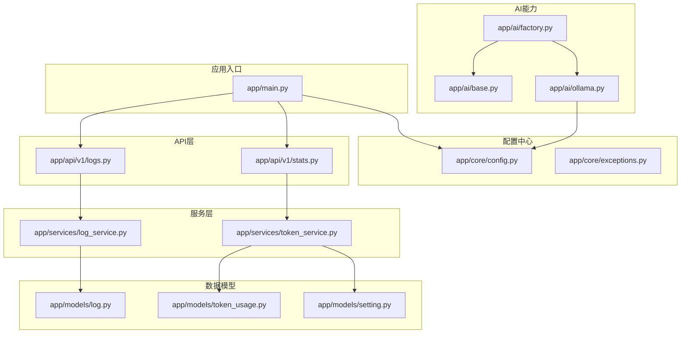
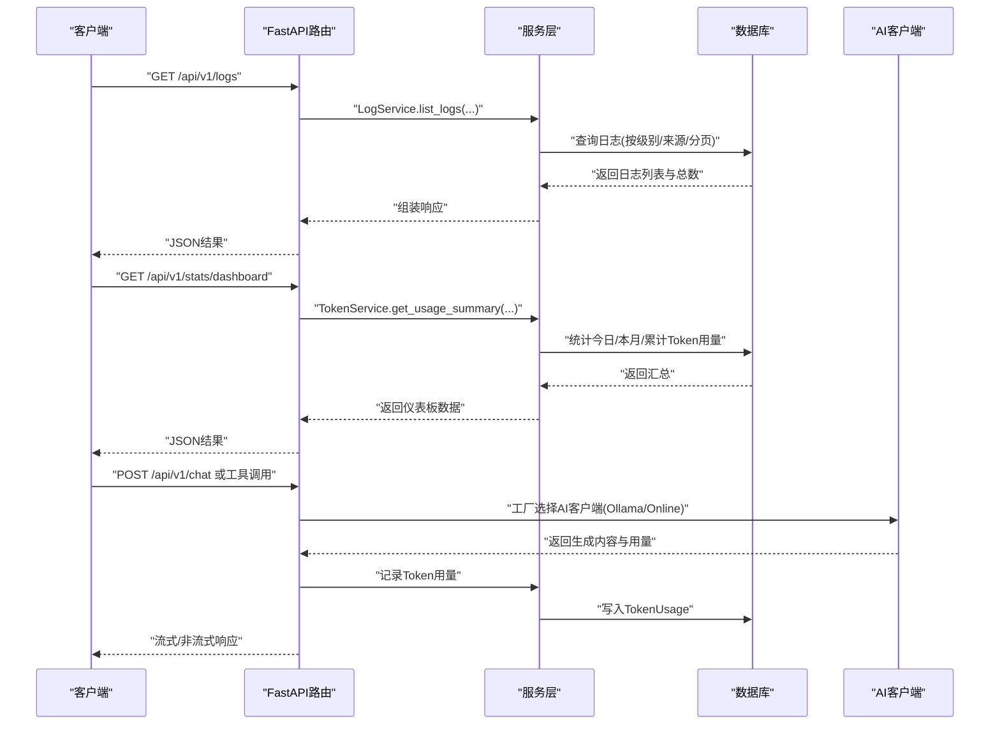
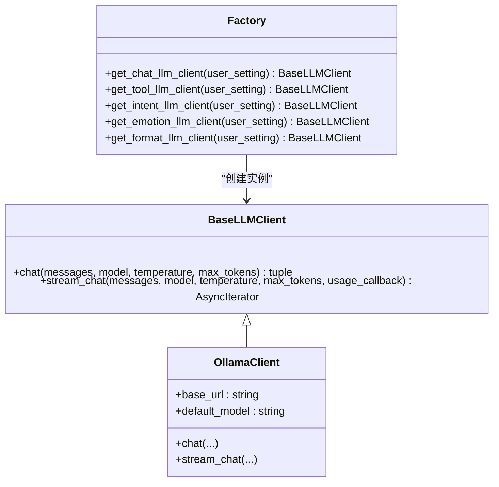
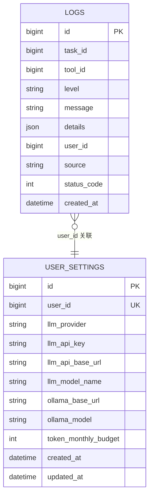
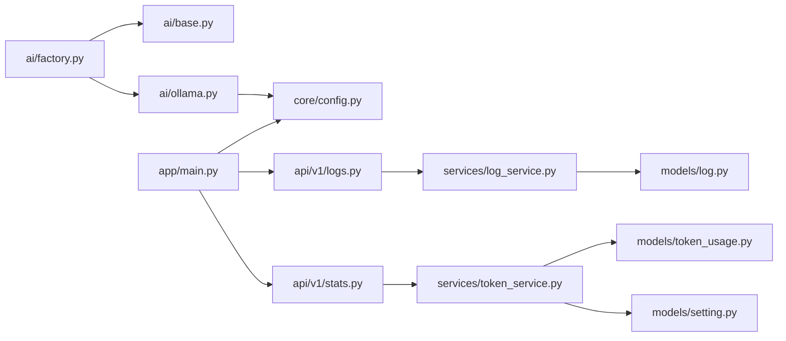

# 监控告警

<cite>
**本文引用的文件**
- [backend/app/main.py](file://backend/app/main.py)
- [backend/app/core/config.py](file://backend/app/core/config.py)
- [backend/app/core/exceptions.py](file://backend/app/core/exceptions.py)
- [backend/app/api/v1/logs.py](file://backend/app/api/v1/logs.py)
- [backend/app/api/v1/stats.py](file://backend/app/api/v1/stats.py)
- [backend/app/services/log_service.py](file://backend/app/services/log_service.py)
- [backend/app/services/token_service.py](file://backend/app/services/token_service.py)
- [backend/app/models/log.py](file://backend/app/models/log.py)
- [backend/app/models/token_usage.py](file://backend/app/models/token_usage.py)
- [backend/app/models/setting.py](file://backend/app/models/setting.py)
- [backend/app/ai/base.py](file://backend/app/ai/base.py)
- [backend/app/ai/factory.py](file://backend/app/ai/factory.py)
- [backend/app/ai/ollama.py](file://backend/app/ai/ollama.py)
</cite>

## 目录
1. [简介](#简介)
2. [项目结构](#项目结构)
3. [核心组件](#核心组件)
4. [架构总览](#架构总览)
5. [详细组件分析](#详细组件分析)
6. [依赖分析](#依赖分析)
7. [性能考虑](#性能考虑)
8. [故障排查指南](#故障排查指南)
9. [结论](#结论)
10. [附录](#附录)

## 简介
本指南面向运维团队，提供XuanJi项目的监控告警体系构建方案。内容覆盖应用性能监控、系统资源监控、AI服务监控配置，涵盖日志采集与分析、错误追踪、性能指标监控、告警规则与通知渠道、监控仪表板搭建，并给出Prometheus/Grafana集成思路、APM工具建议以及自定义监控指标设计方法。文档以仓库现有代码为基础，结合可扩展性建议，帮助快速落地生产级可观测性。

## 项目结构
后端采用FastAPI框架，模块化组织如下：
- 应用入口与生命周期：应用启动、关闭钩子、CORS中间件、健康检查接口
- 配置中心：统一读取环境变量，支持数据库、AI Provider、沙箱等配置
- API层：v1版本接口，包括日志查询、统计报表等
- 服务层：日志服务、Token用量服务等业务逻辑封装
- 数据模型：日志、Token用量、用户设置等持久化实体
- AI能力：抽象LLM客户端、Ollama客户端、工厂模式按角色动态选择AI Provider

图表来源
- [backend/app/main.py:1-79](file://backend/app/main.py#L1-L79)
- [backend/app/core/config.py:1-68](file://backend/app/core/config.py#L1-L68)
- [backend/app/api/v1/logs.py:1-53](file://backend/app/api/v1/logs.py#L1-L53)
- [backend/app/api/v1/stats.py:1-62](file://backend/app/api/v1/stats.py#L1-L62)
- [backend/app/services/log_service.py:1-67](file://backend/app/services/log_service.py#L1-L67)
- [backend/app/services/token_service.py:1-183](file://backend/app/services/token_service.py#L1-L183)
- [backend/app/models/log.py:1-30](file://backend/app/models/log.py#L1-L30)
- [backend/app/models/token_usage.py:1-24](file://backend/app/models/token_usage.py#L1-L24)
- [backend/app/models/setting.py:1-60](file://backend/app/models/setting.py#L1-L60)
- [backend/app/ai/base.py:1-73](file://backend/app/ai/base.py#L1-L73)
- [backend/app/ai/factory.py:1-154](file://backend/app/ai/factory.py#L1-L154)
- [backend/app/ai/ollama.py:1-91](file://backend/app/ai/ollama.py#L1-L91)

章节来源
- [backend/app/main.py:1-79](file://backend/app/main.py#L1-L79)
- [backend/app/core/config.py:1-68](file://backend/app/core/config.py#L1-L68)

## 核心组件
- 应用生命周期与健康检查：通过lifespan注册后台任务调度器，提供/health健康检查端点
- 配置中心：集中管理数据库、AI Provider、沙箱等配置项，支持从.env文件加载
- 日志系统：统一记录日志到数据库，支持按级别、来源模块筛选与统计
- Token用量统计：记录prompt/completion/total tokens，支持按角色、模型、日期聚合
- AI客户端：抽象统一接口，支持在线Provider与本地Ollama，工厂按角色动态选择

章节来源
- [backend/app/main.py:15-64](file://backend/app/main.py#L15-L64)
- [backend/app/core/config.py:4-64](file://backend/app/core/config.py#L4-L64)
- [backend/app/api/v1/logs.py:13-52](file://backend/app/api/v1/logs.py#L13-L52)
- [backend/app/services/log_service.py:14-66](file://backend/app/services/log_service.py#L14-L66)
- [backend/app/api/v1/stats.py:12-61](file://backend/app/api/v1/stats.py#L12-L61)
- [backend/app/services/token_service.py:14-182](file://backend/app/services/token_service.py#L14-L182)
- [backend/app/ai/base.py:8-35](file://backend/app/ai/base.py#L8-L35)
- [backend/app/ai/factory.py:54-153](file://backend/app/ai/factory.py#L54-L153)
- [backend/app/ai/ollama.py:10-90](file://backend/app/ai/ollama.py#L10-L90)

## 架构总览
下图展示从API到服务再到数据存储与AI Provider的整体调用链路，以及关键监控点位。

图表来源
- [backend/app/api/v1/logs.py:13-37](file://backend/app/api/v1/logs.py#L13-L37)
- [backend/app/api/v1/stats.py:12-28](file://backend/app/api/v1/stats.py#L12-L28)
- [backend/app/services/log_service.py:40-56](file://backend/app/services/log_service.py#L40-L56)
- [backend/app/services/token_service.py:37-82](file://backend/app/services/token_service.py#L37-L82)
- [backend/app/ai/factory.py:54-93](file://backend/app/ai/factory.py#L54-L93)
- [backend/app/ai/ollama.py:19-48](file://backend/app/ai/ollama.py#L19-L48)

## 详细组件分析

### 应用性能监控
- 健康检查：/health端点用于Kubernetes/负载均衡探活
- 请求验证错误：统一将Pydantic验证错误转为中文友好提示，便于前端与监控平台识别
- 后台任务：启动/停止多个定时调度器，确保内存衰减等周期任务稳定运行

章节来源
- [backend/app/main.py:62-64](file://backend/app/main.py#L62-L64)
- [backend/app/main.py:43-59](file://backend/app/main.py#L43-L59)
- [backend/app/main.py:19-27](file://backend/app/main.py#L19-L27)

### 系统资源监控
- 进程与端口：应用监听8000端口，可通过系统监控工具采集CPU、内存、网络连接数
- 文件系统：沙箱目录位于./sandbox，需关注磁盘空间与IO
- 外部依赖：MySQL数据库、Ollama服务，需分别监控连接数、延迟与可用性

章节来源
- [backend/app/main.py:67-78](file://backend/app/main.py#L67-L78)
- [backend/app/core/config.py:48-62](file://backend/app/core/config.py#L48-L62)
- [backend/app/core/config.py:12-14](file://backend/app/core/config.py#L12-L14)
- [backend/app/core/config.py:44-46](file://backend/app/core/config.py#L44-L46)

### AI服务监控配置
- 客户端抽象：统一chat/stream_chat接口，便于埋点与指标采集
- 工厂模式：按角色选择Provider（online/Ollama），支持配置缺失时抛出明确异常
- Ollama客户端：支持非流式与流式两种模式，自动计算prompt/completion/total tokens
- 异常处理：LLMConfigError提供清晰的配置缺失提示，利于告警与排障

图表来源
- [backend/app/ai/base.py:8-35](file://backend/app/ai/base.py#L8-L35)
- [backend/app/ai/ollama.py:10-90](file://backend/app/ai/ollama.py#L10-L90)
- [backend/app/ai/factory.py:54-153](file://backend/app/ai/factory.py#L54-L153)

章节来源
- [backend/app/ai/base.py:8-35](file://backend/app/ai/base.py#L8-L35)
- [backend/app/ai/factory.py:54-153](file://backend/app/ai/factory.py#L54-L153)
- [backend/app/ai/ollama.py:19-48](file://backend/app/ai/ollama.py#L19-L48)
- [backend/app/core/exceptions.py:1-19](file://backend/app/core/exceptions.py#L1-L19)

### 日志收集与分析
- 日志模型：包含级别、消息、详情、来源模块、状态码、时间戳等字段
- 日志服务：支持分页查询、按级别/来源过滤、按用户聚合统计
- API接口：提供日志列表与统计概览，便于前端仪表板展示

图表来源
- [backend/app/models/log.py:9-29](file://backend/app/models/log.py#L9-L29)
- [backend/app/models/setting.py:9-59](file://backend/app/models/setting.py#L9-L59)

章节来源
- [backend/app/models/log.py:9-29](file://backend/app/models/log.py#L9-L29)
- [backend/app/services/log_service.py:14-66](file://backend/app/services/log_service.py#L14-L66)
- [backend/app/api/v1/logs.py:13-52](file://backend/app/api/v1/logs.py#L13-L52)

### 错误追踪与异常处理
- 统一异常：LLMConfigError提供角色名与缺失字段信息，便于定位配置问题
- 请求验证：将Pydantic错误映射为中文提示，减少跨语言沟通成本
- 建议：在生产中接入结构化日志与错误追踪平台（如Sentry/APM），对异常进行采样与告警

章节来源
- [backend/app/core/exceptions.py:1-19](file://backend/app/core/exceptions.py#L1-L19)
- [backend/app/main.py:43-59](file://backend/app/main.py#L43-L59)

### 性能指标监控
- Token用量：记录prompt/completion/total tokens，支持按角色、模型、日期聚合
- Dashboard：提供今日/本月/累计用量与预算对比，便于预算告警
- 建议：结合Prometheus/Grafana导出自定义指标，采集请求耗时、并发、错误率、AI调用耗时与用量

章节来源
- [backend/app/api/v1/stats.py:12-61](file://backend/app/api/v1/stats.py#L12-L61)
- [backend/app/services/token_service.py:14-182](file://backend/app/services/token_service.py#L14-L182)
- [backend/app/models/token_usage.py:9-23](file://backend/app/models/token_usage.py#L9-L23)
- [backend/app/models/setting.py:53-53](file://backend/app/models/setting.py#L53-L53)

## 依赖分析
- 组件耦合：API层依赖服务层；服务层依赖数据模型与配置；AI工厂依赖配置与异常模块
- 外部依赖：HTTP客户端、数据库驱动、AI Provider（Ollama/Online）
- 可能风险：AI Provider配置缺失会直接导致异常；数据库连接失败影响日志与统计功能

图表来源
- [backend/app/api/v1/logs.py:1-53](file://backend/app/api/v1/logs.py#L1-L53)
- [backend/app/api/v1/stats.py:1-62](file://backend/app/api/v1/stats.py#L1-L62)
- [backend/app/services/log_service.py:1-67](file://backend/app/services/log_service.py#L1-L67)
- [backend/app/services/token_service.py:1-183](file://backend/app/services/token_service.py#L1-L183)
- [backend/app/models/log.py:1-30](file://backend/app/models/log.py#L1-L30)
- [backend/app/models/token_usage.py:1-24](file://backend/app/models/token_usage.py#L1-L24)
- [backend/app/models/setting.py:1-60](file://backend/app/models/setting.py#L1-L60)
- [backend/app/ai/factory.py:1-154](file://backend/app/ai/factory.py#L1-L154)
- [backend/app/ai/base.py:1-73](file://backend/app/ai/base.py#L1-L73)
- [backend/app/ai/ollama.py:1-91](file://backend/app/ai/ollama.py#L1-L91)
- [backend/app/core/config.py:1-68](file://backend/app/core/config.py#L1-L68)
- [backend/app/main.py:1-79](file://backend/app/main.py#L1-L79)

## 性能考虑
- AI调用超时与重试：Ollama客户端设置合理超时，避免阻塞请求线程
- 流式输出：支持流式返回，降低首字节延迟，提升用户体验
- 数据库查询优化：日志与Token统计均使用聚合查询与索引，建议在高并发场景开启连接池与只读副本
- 缓存策略：Prompt模板与JSON配置使用LRU缓存，减少文件IO

章节来源
- [backend/app/ai/ollama.py:26-48](file://backend/app/ai/ollama.py#L26-L48)
- [backend/app/ai/ollama.py:57-90](file://backend/app/ai/ollama.py#L57-L90)
- [backend/app/ai/base.py:41-53](file://backend/app/ai/base.py#L41-L53)

## 故障排查指南
- AI配置缺失：当Provider为空或关键字段缺失时，抛出LLMConfigError，建议在配置界面与告警中明确提示
- 日志查询异常：检查数据库连接、表是否存在、索引是否生效
- Token统计异常：确认用户设置中的预算字段与TokenUsage记录是否一致
- Ollama不可达：检查基础URL与模型名称，确认外部服务可用性

章节来源
- [backend/app/core/exceptions.py:1-19](file://backend/app/core/exceptions.py#L1-L19)
- [backend/app/ai/factory.py:54-72](file://backend/app/ai/factory.py#L54-L72)
- [backend/app/ai/factory.py:100-113](file://backend/app/ai/factory.py#L100-L113)
- [backend/app/ai/ollama.py:16-17](file://backend/app/ai/ollama.py#L16-L17)

## 结论
XuanJi项目已具备完善的日志与Token用量基础能力，结合AI客户端抽象与工厂模式，可轻松扩展监控与告警维度。建议在现有基础上接入Prometheus/Grafana与APM工具，完善告警规则与通知渠道，形成闭环的可观测性体系。

## 附录

### Prometheus/Grafana集成建议
- 导出指标：在AI调用处埋点，记录请求耗时、成功/失败计数、Token用量、模型名称、角色名
- 告警规则：基于错误率、P95/P99延迟、Token预算阈值、Ollama可用性等
- 仪表板：展示请求趋势、错误分布、Token消耗趋势、各角色/模型用量占比

### APM工具配置
- 推荐：Sentry/OpenTelemetry等，用于捕获异常、追踪慢请求、关联日志与Span
- 埋点位置：API入口、AI客户端、Token记录、数据库事务

### 自定义监控指标清单
- 应用层：请求QPS/错误率、P95/P99延迟、并发连接数、健康检查状态
- AI层：AI调用次数、平均耗时、失败次数、Token用量、模型切换频率
- 数据层：数据库连接数、查询耗时、慢查询、锁等待
- 资源层：CPU、内存、磁盘、网络、进程FD数