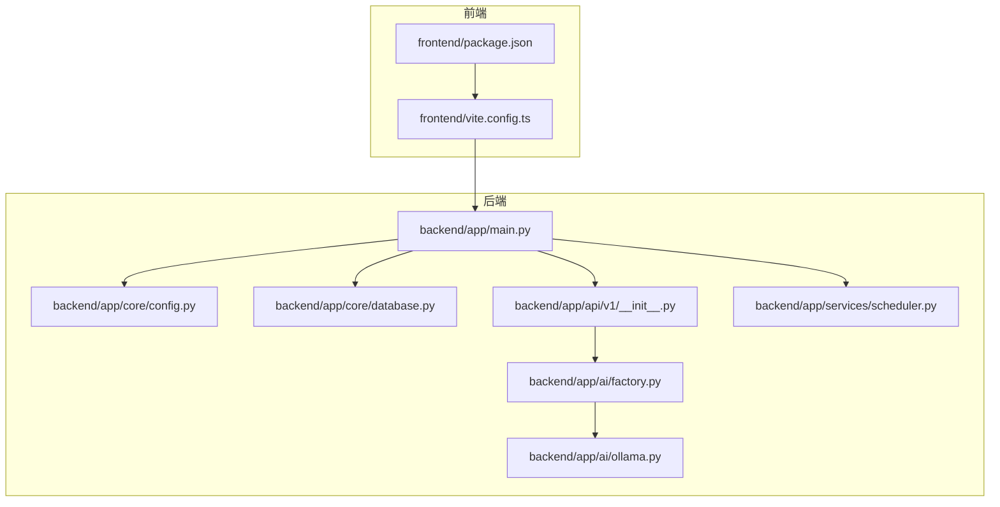
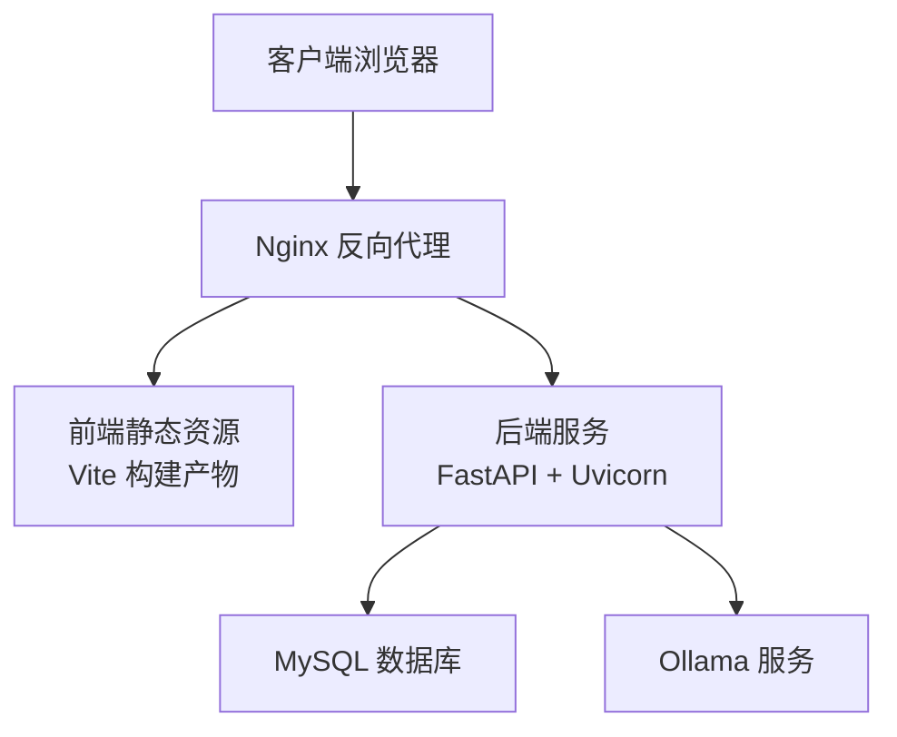
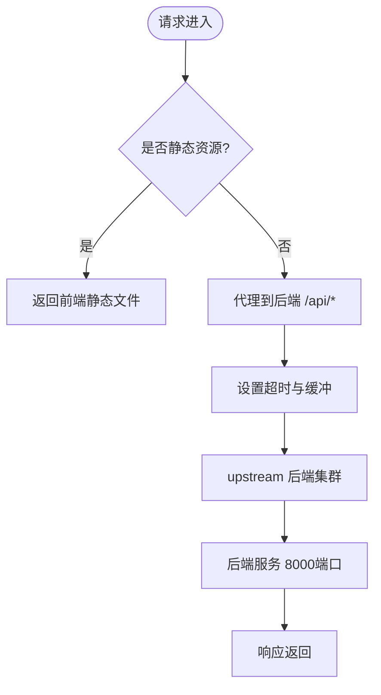
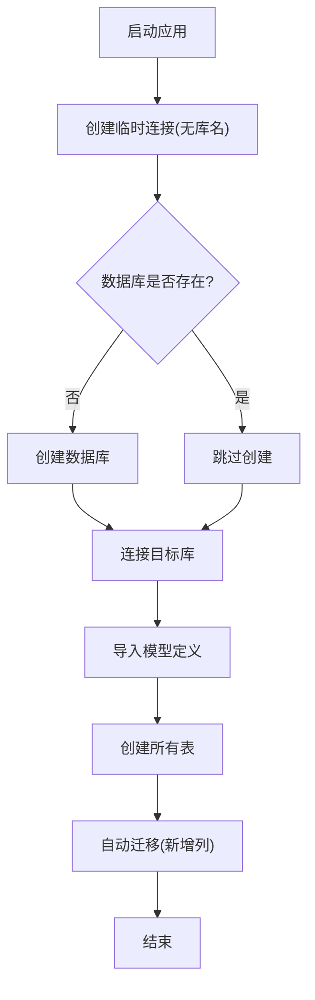
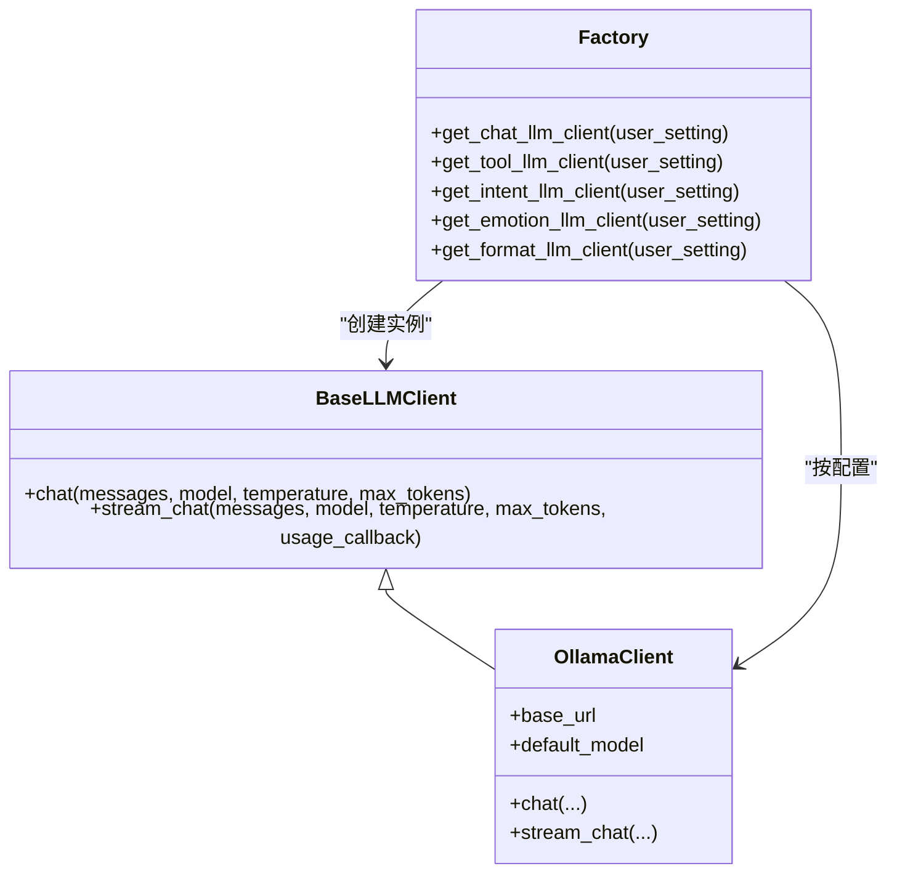
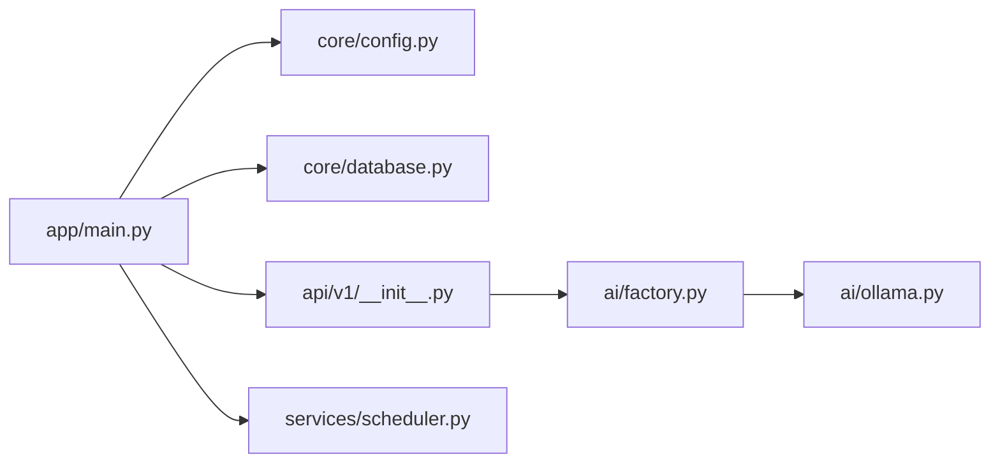

# 部署运维

<cite>
**本文引用的文件**
- [backend/app/main.py](file://backend/app/main.py)
- [backend/app/core/config.py](file://backend/app/core/config.py)
- [backend/app/core/database.py](file://backend/app/core/database.py)
- [backend/app/api/v1/__init__.py](file://backend/app/api/v1/__init__.py)
- [backend/app/services/scheduler.py](file://backend/app/services/scheduler.py)
- [backend/app/ai/factory.py](file://backend/app/ai/factory.py)
- [backend/app/ai/ollama.py](file://backend/app/ai/ollama.py)
- [backend/environment.yml](file://backend/environment.yml)
- [frontend/package.json](file://frontend/package.json)
- [frontend/vite.config.ts](file://frontend/vite.config.ts)
</cite>

## 目录
1. [简介](#简介)
2. [项目结构](#项目结构)
3. [核心组件](#核心组件)
4. [架构总览](#架构总览)
5. [详细组件分析](#详细组件分析)
6. [依赖关系分析](#依赖关系分析)
7. [性能考虑](#性能考虑)
8. [故障排查指南](#故障排查指南)
9. [结论](#结论)
10. [附录](#附录)

## 简介
本指南面向运维工程师与DevOps团队，提供XuanJi项目的生产级部署与运维实践，覆盖生产环境部署配置、Docker容器化方案、Nginx反向代理、环境变量与数据库连接、AI模型服务集成、监控告警与日志分析、性能指标监控、负载均衡与高可用、灾难恢复策略、自动化部署与CI/CD流程以及版本回滚方案。

## 项目结构
- 后端采用FastAPI + SQLAlchemy，提供REST API与定时调度能力。
- 前端基于Vite + React，开发时通过本地代理转发到后端。
- AI模块通过工厂模式对接Ollama与在线LLM，支持多角色AI切换与流式/非流式对话。
- 数据库初始化与自动迁移由核心模块负责，确保表结构一致性。

**图表来源**
- [backend/app/main.py:1-79](file://backend/app/main.py#L1-L79)
- [backend/app/core/config.py:1-68](file://backend/app/core/config.py#L1-L68)
- [backend/app/core/database.py:1-65](file://backend/app/core/database.py#L1-L65)
- [backend/app/api/v1/__init__.py:1-23](file://backend/app/api/v1/__init__.py#L1-L23)
- [backend/app/services/scheduler.py:1-800](file://backend/app/services/scheduler.py#L1-L800)
- [backend/app/ai/factory.py:1-154](file://backend/app/ai/factory.py#L1-L154)
- [backend/app/ai/ollama.py:1-91](file://backend/app/ai/ollama.py#L1-L91)
- [frontend/package.json:1-44](file://frontend/package.json#L1-L44)
- [frontend/vite.config.ts:1-35](file://frontend/vite.config.ts#L1-L35)

**章节来源**
- [backend/app/main.py:1-79](file://backend/app/main.py#L1-L79)
- [backend/app/core/config.py:1-68](file://backend/app/core/config.py#L1-L68)
- [backend/app/core/database.py:1-65](file://backend/app/core/database.py#L1-L65)
- [backend/app/api/v1/__init__.py:1-23](file://backend/app/api/v1/__init__.py#L1-L23)
- [backend/app/services/scheduler.py:1-800](file://backend/app/services/scheduler.py#L1-L800)
- [backend/app/ai/factory.py:1-154](file://backend/app/ai/factory.py#L1-L154)
- [backend/app/ai/ollama.py:1-91](file://backend/app/ai/ollama.py#L1-L91)
- [frontend/package.json:1-44](file://frontend/package.json#L1-L44)
- [frontend/vite.config.ts:1-35](file://frontend/vite.config.ts#L1-L35)

## 核心组件
- 应用入口与生命周期：定义FastAPI实例、CORS、路由挂载、健康检查与开发热重载。
- 配置中心：集中管理数据库、AI模型、应用密钥、跨域与沙箱参数，并通过环境文件加载。
- 数据库层：创建数据库、建表与自动迁移，保证表结构一致性。
- API路由：聚合认证、聊天、会话、任务、工具、文件、统计、设置、日志等子路由。
- 定时调度：内存压缩、身份演进与“机”角色的周期性任务。
- AI工厂与Ollama客户端：统一LLM接入，支持在线与本地Ollama两种Provider。

**章节来源**
- [backend/app/main.py:15-79](file://backend/app/main.py#L15-L79)
- [backend/app/core/config.py:4-64](file://backend/app/core/config.py#L4-L64)
- [backend/app/core/database.py:22-65](file://backend/app/core/database.py#L22-L65)
- [backend/app/api/v1/__init__.py:1-23](file://backend/app/api/v1/__init__.py#L1-L23)
- [backend/app/services/scheduler.py:78-264](file://backend/app/services/scheduler.py#L78-L264)
- [backend/app/ai/factory.py:54-154](file://backend/app/ai/factory.py#L54-L154)
- [backend/app/ai/ollama.py:10-91](file://backend/app/ai/ollama.py#L10-L91)

## 架构总览
下图展示生产部署的关键交互：Nginx作为反向代理，将前端静态资源与后端API分发到容器内的服务；后端通过配置中心读取数据库与AI模型参数，数据库持久化，AI模块对接Ollama或在线LLM。

**图表来源**
- [backend/app/main.py:30-64](file://backend/app/main.py#L30-L64)
- [backend/app/core/config.py:4-64](file://backend/app/core/config.py#L4-L64)
- [backend/app/core/database.py:6-38](file://backend/app/core/database.py#L6-L38)
- [backend/app/ai/ollama.py:16-48](file://backend/app/ai/ollama.py#L16-L48)

## 详细组件分析

### 生产环境部署配置
- 主机要求：Linux服务器，具备Docker与Docker Compose运行环境；开放80/443端口用于Nginx，8000端口用于后端服务。
- 文件组织：后端与前端分别构建镜像，Nginx配置静态资源与API代理。
- 端口规划：后端监听8000；Nginx对外暴露80/443；前端开发时使用5173端口并通过Vite代理转发到后端。

**章节来源**
- [backend/app/main.py:67-79](file://backend/app/main.py#L67-L79)
- [frontend/vite.config.ts:25-33](file://frontend/vite.config.ts#L25-L33)

### Docker容器化方案
- 后端镜像：基于Python 3.11，安装FastAPI、Uvicorn、SQLAlchemy及相关依赖，映射8000端口，挂载.env与沙箱目录。
- 前端镜像：基于Node基础镜像，构建静态资源，Nginx提供静态文件服务。
- Nginx镜像：提供SSL终止、静态资源缓存、API反向代理到后端容器。
- 健康检查：后端提供/health接口，Nginx可配置探针检查。

**章节来源**
- [backend/environment.yml:1-25](file://backend/environment.yml#L1-L25)
- [backend/app/main.py:62-64](file://backend/app/main.py#L62-L64)

### Nginx反向代理设置
- 静态资源：将/build目录映射到Nginx根路径，开启Gzip与缓存头。
- API代理：将/api前缀转发至后端8000端口，设置超时与缓冲区。
- SSL/TLS：启用HTTPS，配置证书与安全头。
- 负载均衡：多后端实例时，使用upstream与轮询策略。

**图表来源**
- [frontend/vite.config.ts:27-32](file://frontend/vite.config.ts#L27-L32)

**章节来源**
- [frontend/vite.config.ts:25-33](file://frontend/vite.config.ts#L25-L33)

### 环境变量配置
- 数据库连接：db_host、db_port、db_user、db_password、db_name，生成database_url与database_url_without_db。
- AI模型：ollama_base_url、ollama_model；在线LLM提供者参数；各角色AI的Provider与模型配置。
- 应用参数：secret_key、cors_origins；沙箱目录与超时。
- 加载方式：通过pydantic-settings从.env文件加载，UTF-8编码。

**章节来源**
- [backend/app/core/config.py:4-64](file://backend/app/core/config.py#L4-L64)

### 数据库连接与初始化
- 连接池：pool_pre_ping确保连接有效性。
- 初始化：先连接数据库实例创建库，再建表并自动迁移新增列。
- 自动迁移：遍历模型表，对比列定义，按需ALTER TABLE。

**图表来源**
- [backend/app/core/database.py:22-65](file://backend/app/core/database.py#L22-L65)

**章节来源**
- [backend/app/core/database.py:6-38](file://backend/app/core/database.py#L6-L38)
- [backend/app/core/database.py:44-65](file://backend/app/core/database.py#L44-L65)

### AI模型服务集成
- 工厂模式：根据用户设置动态选择Online或Ollama Provider，校验必要参数。
- Ollama客户端：支持非流式与流式对话，记录token用量。
- 角色划分：对话（玄）、工具（机）、意图（晴）、情绪（焕）、格式（遥）。

**图表来源**
- [backend/app/ai/factory.py:54-154](file://backend/app/ai/factory.py#L54-L154)
- [backend/app/ai/ollama.py:10-91](file://backend/app/ai/ollama.py#L10-L91)

**章节来源**
- [backend/app/ai/factory.py:14-51](file://backend/app/ai/factory.py#L14-L51)
- [backend/app/ai/ollama.py:19-48](file://backend/app/ai/ollama.py#L19-L48)

### 监控告警与日志
- 健康检查：/health接口返回服务状态。
- 日志记录：定时任务与关键流程记录INFO/WARN/ERROR级别日志。
- 建议：集成Prometheus+Grafana采集后端指标（QPS、延迟、错误率、内存、CPU、磁盘），ELK收集日志，钉钉/企业微信告警。

**章节来源**
- [backend/app/main.py:62-64](file://backend/app/main.py#L62-L64)
- [backend/app/services/scheduler.py:104-108](file://backend/app/services/scheduler.py#L104-L108)
- [backend/app/services/scheduler.py:740-757](file://backend/app/services/scheduler.py#L740-L757)

### 性能指标监控
- 关键指标：请求量、P95/P99延迟、错误率、数据库连接数、AI调用token用量、内存占用、磁盘IO。
- 前端：构建产物体积与缓存命中率。
- 后端：uvicorn worker数量与队列长度。

**章节来源**
- [backend/app/ai/ollama.py:42-48](file://backend/app/ai/ollama.py#L42-L48)
- [backend/app/services/scheduler.py:552-613](file://backend/app/services/scheduler.py#L552-L613)

### 负载均衡与高可用
- 多实例：后端部署多个容器实例，Nginx upstream轮询或加权。
- 数据库高可用：主从复制或云数据库高可用实例。
- 缓存：Redis用于会话与热点数据（可选）。
- 存储：共享存储或对象存储用于上传文件。

**章节来源**
- [frontend/vite.config.ts:27-32](file://frontend/vite.config.ts#L27-L32)

### 灾难恢复策略
- 备份：数据库定时快照与增量备份；重要配置与模型权重归档。
- 回滚：容器镜像版本标签化，支持一键回滚；数据库迁移脚本版本化。
- 故障演练：定期演练故障切换与数据恢复流程。

**章节来源**
- [backend/app/core/database.py:22-38](file://backend/app/core/database.py#L22-L38)

### 自动化部署与CI/CD
- 构建：后端使用Python依赖清单，前端使用Vite构建。
- 镜像：Dockerfile构建后端镜像，Node镜像构建前端静态资源，Nginx镜像提供反向代理。
- 流水线：代码提交触发构建与测试，成功后推送镜像到私有仓库，Kubernetes或Docker Compose拉起新版本，滚动更新后健康检查通过则切换流量。
- 回滚：版本标签化，失败自动回滚至上一稳定版本。

**章节来源**
- [backend/environment.yml:8-24](file://backend/environment.yml#L8-L24)
- [frontend/package.json:6-10](file://frontend/package.json#L6-L10)

### 版本回滚方案
- 金丝雀发布：先对部分实例升级，观察指标与日志，确认稳定后再全量。
- 滚动回滚：停止新版本实例，重启旧版本实例，恢复Nginx指向。
- 数据库：回滚前先备份，回滚后执行逆向迁移脚本。

**章节来源**
- [backend/app/core/database.py:44-65](file://backend/app/core/database.py#L44-L65)

## 依赖关系分析

**图表来源**
- [backend/app/main.py:10-40](file://backend/app/main.py#L10-L40)
- [backend/app/api/v1/__init__.py:1-23](file://backend/app/api/v1/__init__.py#L1-L23)
- [backend/app/ai/factory.py:1-8](file://backend/app/ai/factory.py#L1-L8)
- [backend/app/ai/ollama.py:1-7](file://backend/app/ai/ollama.py#L1-L7)
- [backend/app/services/scheduler.py:1-13](file://backend/app/services/scheduler.py#L1-L13)

**章节来源**
- [backend/app/main.py:10-40](file://backend/app/main.py#L10-L40)
- [backend/app/api/v1/__init__.py:1-23](file://backend/app/api/v1/__init__.py#L1-L23)
- [backend/app/ai/factory.py:1-8](file://backend/app/ai/factory.py#L1-L8)
- [backend/app/ai/ollama.py:1-7](file://backend/app/ai/ollama.py#L1-L7)
- [backend/app/services/scheduler.py:1-13](file://backend/app/services/scheduler.py#L1-L13)

## 性能考虑
- 数据库：合理设置连接池大小与超时；索引覆盖高频查询；分表分库策略（按用户ID）。
- AI调用：限制并发与超时；对长上下文进行截断；缓存常用提示词结果。
- 前端：代码分割与懒加载；CDN加速静态资源；Gzip压缩。
- 后端：多worker与异步I/O；限流与熔断；慢查询与阻塞操作监控。

## 故障排查指南
- 健康检查：访问/health确认服务可用。
- 数据库：检查连接字符串、权限与网络连通；查看自动迁移是否成功。
- AI服务：确认Ollama服务可达与模型存在；核对API Key与Base URL。
- 日志：定位INFO/WARN/ERROR级别日志，关注定时任务与AI调用异常。
- 前端：确认Vite代理配置正确，Nginx静态资源路径与缓存头。

**章节来源**
- [backend/app/main.py:62-64](file://backend/app/main.py#L62-L64)
- [backend/app/core/database.py:22-38](file://backend/app/core/database.py#L22-L38)
- [backend/app/ai/ollama.py:26-38](file://backend/app/ai/ollama.py#L26-L38)
- [backend/app/services/scheduler.py:104-108](file://backend/app/services/scheduler.py#L104-L108)

## 结论
通过标准化的容器化与反向代理方案、完善的环境变量与数据库初始化、清晰的AI模型接入与定时调度机制，XuanJi可在生产环境中实现高可用、可观测与可扩展的部署运维。建议配合CI/CD流水线与监控告警体系，持续提升稳定性与交付效率。

## 附录
- 开发与预览：前端使用Vite开发服务器，端口5173；后端开发模式监听0.0.0.0:8000。
- 依赖清单：后端使用FastAPI、Uvicorn、SQLAlchemy、Pydantic Settings等；前端使用React、Vite、TailwindCSS等。

**章节来源**
- [backend/app/main.py:67-79](file://backend/app/main.py#L67-L79)
- [frontend/vite.config.ts:25-33](file://frontend/vite.config.ts#L25-L33)
- [frontend/package.json:6-10](file://frontend/package.json#L6-L10)
- [backend/environment.yml:8-24](file://backend/environment.yml#L8-L24)