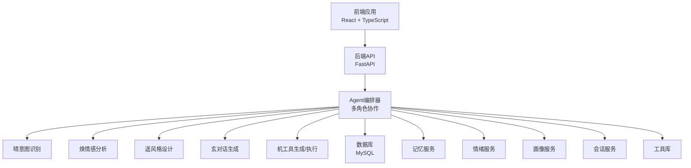
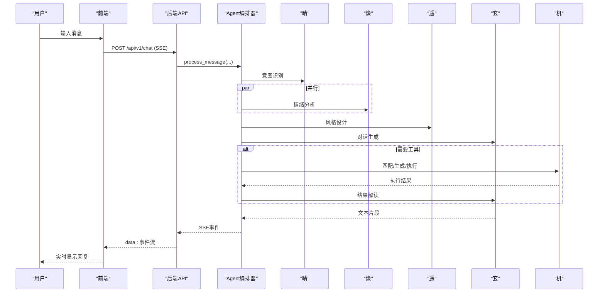
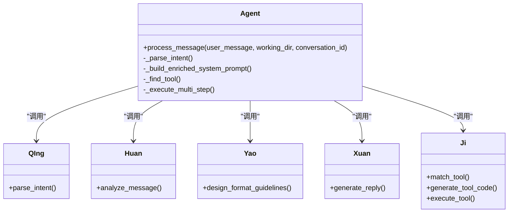
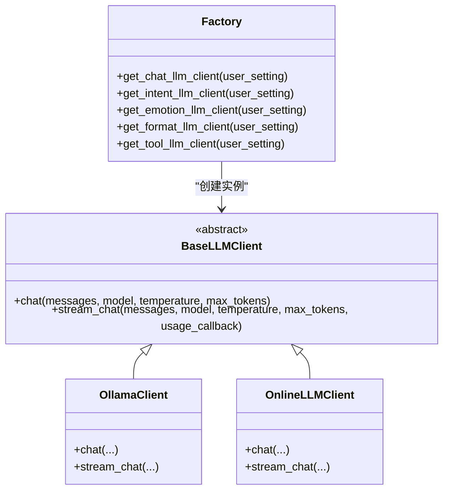
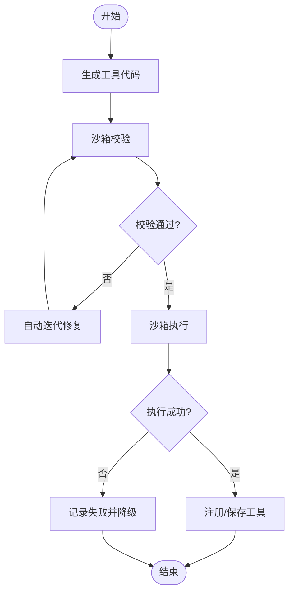
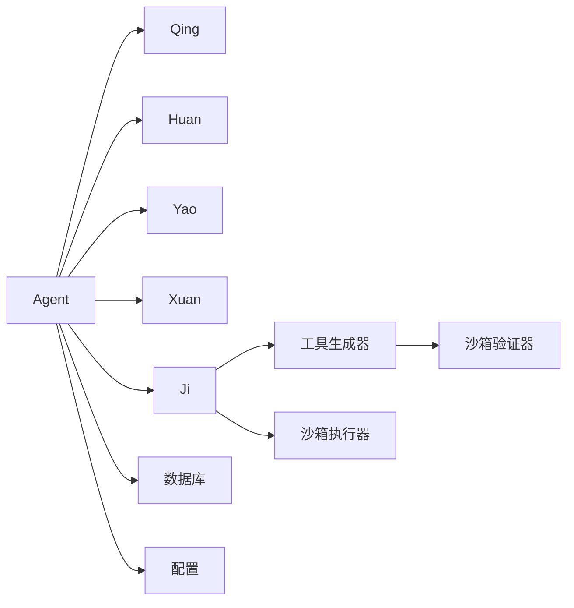

# 项目概述

<cite>
**本文档引用的文件**
- [backend/app/main.py](file://backend/app/main.py)
- [backend/app/api/v1/chat.py](file://backend/app/api/v1/chat.py)
- [backend/app/ai/agent.py](file://backend/app/ai/agent.py)
- [backend/app/ai/base.py](file://backend/app/ai/base.py)
- [backend/app/ai/factory.py](file://backend/app/ai/factory.py)
- [backend/app/ai/ollama.py](file://backend/app/ai/ollama.py)
- [backend/app/ai/online.py](file://backend/app/ai/online.py)
- [backend/app/ai/tool_generator.py](file://backend/app/ai/tool_generator.py)
- [backend/app/ai/intent_rules.json](file://backend/app/ai/intent_rules.json)
- [backend/app/ai/skills/xuanji-qing/SKILL.md](file://backend/app/ai/skills/xuanji-qing/SKILL.md)
- [backend/app/ai/skills/xuanji-huan/SKILL.md](file://backend/app/ai/skills/xuanji-huan/SKILL.md)
- [backend/app/ai/skills/xuanji-yao/SKILL.md](file://backend/app/ai/skills/xuanji-yao/SKILL.md)
- [backend/app/ai/skills/xuanji-xuan/SKILL.md](file://backend/app/ai/skills/xuanji-xuan/SKILL.md)
- [backend/app/core/config.py](file://backend/app/core/config.py)
- [frontend/src/App.tsx](file://frontend/src/App.tsx)
</cite>

## 目录
1. [引言](#引言)
2. [项目结构](#项目结构)
3. [核心组件](#核心组件)
4. [架构总览](#架构总览)
5. [详细组件分析](#详细组件分析)
6. [依赖分析](#依赖分析)
7. [性能考量](#性能考量)
8. [故障排查指南](#故障排查指南)
9. [结论](#结论)
10. [附录](#附录)

## 引言
璇玑多智能体AI对话系统以“四象协作”为核心理念，通过晴（意图识别）、焕（情感分析）、遥（风格设计）、玄（对话生成）四大AI角色的分工与协同，构建出既具备强逻辑推理能力，又能提供温暖陪伴体验的对话体系。系统采用前后端分离架构，后端基于FastAPI提供流式SSE接口，前端使用React实现即时对话与可视化展示。项目强调可扩展的多模型接入（本地Ollama与在线模型）、可演化的角色能力、以及对用户情绪与记忆的长期追踪，旨在为用户提供自然、稳定、可持续进化的智能对话体验。

## 项目结构
项目采用典型的三层架构：前端React应用负责用户交互与界面渲染；后端FastAPI服务提供REST与SSE接口；数据库层持久化用户会话、记忆、工具与配置。AI核心位于后端app/ai目录，围绕Agent编排器组织多角色协作，并通过工厂模式抽象不同LLM提供商，便于替换与扩展。

图表来源
- [backend/app/main.py:30-40](file://backend/app/main.py#L30-L40)
- [backend/app/api/v1/chat.py:40-87](file://backend/app/api/v1/chat.py#L40-L87)
- [backend/app/ai/agent.py:35-69](file://backend/app/ai/agent.py#L35-L69)

章节来源
- [backend/app/main.py:1-79](file://backend/app/main.py#L1-L79)
- [frontend/src/App.tsx:21-76](file://frontend/src/App.tsx#L21-L76)

## 核心组件
- 后端入口与生命周期
  - FastAPI应用初始化、CORS中间件、健康检查端点、数据库初始化与定时调度器启动。
- API路由与SSE流
  - /api/v1/chat提供流式SSE接口，支持断线重连与usage记录。
- Agent编排器
  - 负责意图解析、情绪分析、风格设计、工具匹配/生成/执行、结果解读与最终回复生成。
- LLM客户端抽象
  - BaseLLMClient定义统一接口；OllamaClient与OnlineLLMClient分别对接本地与在线模型。
- 工具生成与执行
  - 基于LLM生成Python工具代码，经沙箱校验与执行，失败时支持自动迭代优化。
- 角色技能与规则
  - 晴、焕、遥、玄、机各自具备明确职责与行为规范，配合规则引擎与Persona设定形成稳定的协作闭环。

章节来源
- [backend/app/main.py:15-27](file://backend/app/main.py#L15-L27)
- [backend/app/api/v1/chat.py:40-105](file://backend/app/api/v1/chat.py#L40-L105)
- [backend/app/ai/agent.py:35-69](file://backend/app/ai/agent.py#L35-L69)
- [backend/app/ai/base.py:8-35](file://backend/app/ai/base.py#L8-L35)
- [backend/app/ai/ollama.py:10-91](file://backend/app/ai/ollama.py#L10-L91)
- [backend/app/ai/online.py:10-134](file://backend/app/ai/online.py#L10-L134)
- [backend/app/ai/tool_generator.py:10-67](file://backend/app/ai/tool_generator.py#L10-L67)

## 架构总览
系统采用“事件驱动 + 流式SSE”的交互模式，后端Agent在收到用户消息后，按顺序触发晴意图识别、焕情绪分析、遥风格设计、玄对话生成，并在必要时调用机进行工具匹配/生成/执行与结果解读。全程记录token用量并持久化协作日志，确保可观测与可审计。

图表来源
- [backend/app/api/v1/chat.py:62-87](file://backend/app/api/v1/chat.py#L62-L87)
- [backend/app/ai/agent.py:78-273](file://backend/app/ai/agent.py#L78-L273)
- [backend/app/ai/agent.py:350-675](file://backend/app/ai/agent.py#L350-L675)

## 详细组件分析

### 璇玑四象协作架构
- 晴（意图识别）
  - 职责：对用户消息进行行为推测，提取意图描述、用户状态、目标路径与参数，为后续模块提供上下文。
  - 关键点：结合最新情绪上下文进行综合判断，快速决策，避免成为系统瓶颈。
- 焕（情感分析）
  - 职责：对用户输入进行多维心理分析，输出情绪状态、强度、深层需求、风险信号与交互建议。
  - 关键点：概率性、非绝对化、尊重用户主观体验，不替代专业诊断。
- 遥（风格设计）
  - 职责：将情绪分析与行为推测转化为可执行的风格指引（结构、长度、语气、特殊元素等），注入玄的系统提示。
  - 关键点：情绪-风格映射、结构化设计、缓存机制与风险规避。
- 玄（对话生成）
  - 职责：融合多源上下文，以自然、温暖、口语化的方式生成最终回复，避免结构化排版与内部术语。
  - 关键点：多轮上下文管理、情感共鸣、个性化与团队协作意识。
- 机（系统迭代）
  - 职责：在后台独立运行工具生成、迭代与系统优化任务，不参与对话流程。
  - 关键点：工具匹配/生成/执行、失败自动迭代、版本快照与复用。

图表来源
- [backend/app/ai/agent.py:35-69](file://backend/app/ai/agent.py#L35-L69)
- [backend/app/ai/skills/xuanji-qing/SKILL.md:10-170](file://backend/app/ai/skills/xuanji-qing/SKILL.md#L10-L170)
- [backend/app/ai/skills/xuanji-huan/SKILL.md:15-186](file://backend/app/ai/skills/xuanji-huan/SKILL.md#L15-L186)
- [backend/app/ai/skills/xuanji-yao/SKILL.md:9-170](file://backend/app/ai/skills/xuanji-yao/SKILL.md#L9-L170)
- [backend/app/ai/skills/xuanji-xuan/SKILL.md:10-167](file://backend/app/ai/skills/xuanji-xuan/SKILL.md#L10-L167)

章节来源
- [backend/app/ai/skills/xuanji-qing/SKILL.md:10-170](file://backend/app/ai/skills/xuanji-qing/SKILL.md#L10-L170)
- [backend/app/ai/skills/xuanji-huan/SKILL.md:15-186](file://backend/app/ai/skills/xuanji-huan/SKILL.md#L15-L186)
- [backend/app/ai/skills/xuanji-yao/SKILL.md:9-170](file://backend/app/ai/skills/xuanji-yao/SKILL.md#L9-L170)
- [backend/app/ai/skills/xuanji-xuan/SKILL.md:10-167](file://backend/app/ai/skills/xuanji-xuan/SKILL.md#L10-L167)

### LLM客户端与多模型接入
- 统一接口
  - BaseLLMClient定义chat与stream_chat两个异步方法，支持token用量回调。
- Ollama客户端
  - 通过HTTP调用本地Ollama服务，支持流式与非流式对话，聚合prompt_eval_count与eval_count作为usage。
- 在线模型客户端
  - 通过HTTP调用在线API，支持流式SSE并解析usage，过滤<think>片段以保证输出纯净。
- 工厂模式
  - 根据用户设置动态创建不同提供商的客户端，支持online与ollama两种provider，并对缺失配置进行显式报错。

图表来源
- [backend/app/ai/base.py:8-35](file://backend/app/ai/base.py#L8-L35)
- [backend/app/ai/ollama.py:10-91](file://backend/app/ai/ollama.py#L10-L91)
- [backend/app/ai/online.py:10-134](file://backend/app/ai/online.py#L10-L134)
- [backend/app/ai/factory.py:54-154](file://backend/app/ai/factory.py#L54-L154)

章节来源
- [backend/app/ai/base.py:8-73](file://backend/app/ai/base.py#L8-L73)
- [backend/app/ai/ollama.py:10-91](file://backend/app/ai/ollama.py#L10-L91)
- [backend/app/ai/online.py:10-134](file://backend/app/ai/online.py#L10-L134)
- [backend/app/ai/factory.py:54-154](file://backend/app/ai/factory.py#L54-L154)

### 工具生成与执行流程
- 生成阶段
  - 使用工具LLM客户端根据用户描述生成Python工具代码，清理Markdown围栏、提取META元信息、AST解析函数名并进行沙箱校验。
- 执行阶段
  - 在沙箱中执行工具代码，收集执行结果与状态；若失败，依据决策进行自动迭代并更新版本。
- 保存与复用
  - 成功执行的工具自动注册入库，支持后续复用与版本管理。

图表来源
- [backend/app/ai/tool_generator.py:10-67](file://backend/app/ai/tool_generator.py#L10-L67)
- [backend/app/ai/agent.py:477-551](file://backend/app/ai/agent.py#L477-L551)

章节来源
- [backend/app/ai/tool_generator.py:10-129](file://backend/app/ai/tool_generator.py#L10-L129)
- [backend/app/ai/agent.py:477-551](file://backend/app/ai/agent.py#L477-L551)

### 意图识别与规则引擎
- 规则来源
  - intent_rules.json包含查询关键词、闲聊关键词、情绪关键词与已学习模式，支撑晴的快速分类与参数提取。
- 学习机制
  - 通过历史对话与用户习惯，持续优化行为推测与情绪关键词映射，与焕协作维护规则引擎。

章节来源
- [backend/app/ai/intent_rules.json:1-306](file://backend/app/ai/intent_rules.json#L1-L306)
- [backend/app/ai/skills/xuanji-qing/SKILL.md:66-82](file://backend/app/ai/skills/xuanji-qing/SKILL.md#L66-L82)

### API与SSE流式交互
- 路由与鉴权
  - /api/v1/chat路由依赖当前用户与数据库会话，支持流式与非流式两种模式。
- 流式SSE
  - 事件类型涵盖metadata、thinking、message、emotion_update、tool_selected/executing/result、done、collaboration等，前端逐条消费并实时渲染。
- Token用量
  - 在done事件中汇总各角色usage并记录，保障成本透明与可审计。

章节来源
- [backend/app/api/v1/chat.py:40-105](file://backend/app/api/v1/chat.py#L40-L105)
- [backend/app/main.py:43-59](file://backend/app/main.py#L43-L59)

## 依赖分析
- 组件耦合
  - Agent对各角色服务依赖集中于构造函数注入，通过统一的LLM工厂创建客户端，降低外部依赖耦合。
- 外部依赖
  - 数据库连接、HTTP客户端（httpx）、SQLAlchemy ORM、沙箱执行器与验证器。
- 潜在循环依赖
  - 当前结构以Agent为中心向外依赖，未见循环导入迹象；工具生成依赖沙箱验证器，但验证器不反向依赖Agent，避免循环。

图表来源
- [backend/app/ai/agent.py:44-62](file://backend/app/ai/agent.py#L44-L62)
- [backend/app/ai/tool_generator.py:5-7](file://backend/app/ai/tool_generator.py#L5-L7)

章节来源
- [backend/app/ai/agent.py:44-62](file://backend/app/ai/agent.py#L44-L62)
- [backend/app/ai/tool_generator.py:5-7](file://backend/app/ai/tool_generator.py#L5-L7)

## 性能考量
- 流式SSE
  - 采用SSE事件流，前端可边收边播，显著降低首字节延迟与交互阻塞。
- 并发与超时
  - 情绪分析任务并发执行并设置超时，避免阻塞主线对话；工具执行与结果解读均设置超时保护。
- 缓存与复用
  - 遥的风格设计结果按情绪大类缓存，减少重复计算；Prompt模板与JSON配置使用LRU缓存。
- 资源回收
  - 生命周期内启动/停止定时调度器，释放资源；finally块中补录后置token用量，确保统计完整性。

章节来源
- [backend/app/ai/agent.py:139-157](file://backend/app/ai/agent.py#L139-L157)
- [backend/app/ai/agent.py:676-751](file://backend/app/ai/agent.py#L676-L751)
- [backend/app/ai/base.py:41-54](file://backend/app/ai/base.py#L41-L54)

## 故障排查指南
- 请求参数验证失败
  - FastAPI统一异常处理器将Pydantic错误转为中文提示，便于前端与用户理解。
- LLM配置错误
  - 工厂创建客户端时对缺失字段抛出明确异常，提示缺少的配置项名称。
- SSE连接中断
  - 捕获取消异常并记录日志；在非流式模式下收集最终文本并记录usage。
- 工具执行失败
  - 记录失败详情并尝试自动迭代；若仍失败，返回降级回复并保留协作日志。
- 情绪分析超时/失败
  - 记录警告/错误日志并继续对话流程，保证用户体验连续性。

章节来源
- [backend/app/main.py:43-59](file://backend/app/main.py#L43-L59)
- [backend/app/ai/factory.py:14-36](file://backend/app/ai/factory.py#L14-L36)
- [backend/app/api/v1/chat.py:78-85](file://backend/app/api/v1/chat.py#L78-L85)
- [backend/app/ai/agent.py:275-318](file://backend/app/ai/agent.py#L275-L318)
- [backend/app/ai/agent.py:418-476](file://backend/app/ai/agent.py#L418-L476)

## 结论
璇玑系统通过“四象协作”的角色分工与统一的Agent编排，实现了从意图识别、情绪感知、风格设计到对话生成的全链路闭环。其技术栈兼顾易用性与扩展性（本地Ollama与在线模型双栈支持）、可演化的角色能力与完善的工具生态，适合在个人助理、心理咨询辅助、教育陪伴等场景落地。项目在性能与可靠性方面做了充分设计，既满足初学者快速上手，也为有经验的开发者提供了深入定制的空间。

## 附录
- 项目背景与发展愿景
  - 背景：随着大模型能力提升，对话系统需在“理性+感性”之间取得平衡，既要有准确的信息处理能力，也要具备情感陪伴与长期记忆。
  - 愿景：构建一个可演化、可解释、可持续进化的多智能体对话平台，帮助用户在日常生活中获得更自然、温暖、可靠的AI伙伴。
- 应用价值
  - 个人助理：信息查询、任务执行、日程提醒与知识整理。
  - 情感支持：情绪感知、风险预警与陪伴式对话。
  - 学习与创作：知识问答、创意激发与内容润色。
  - 开发与运维：自动化工具生成与执行，降低技术门槛。