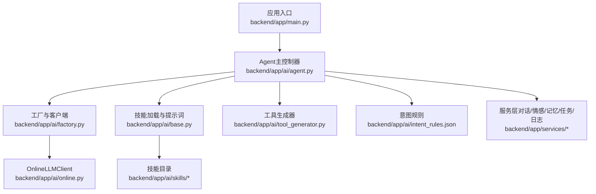
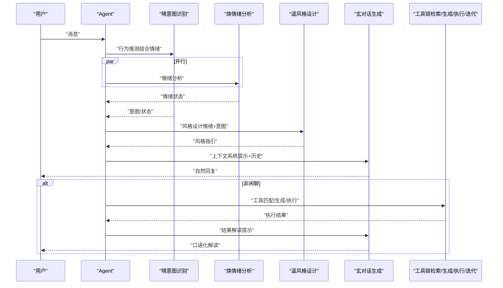
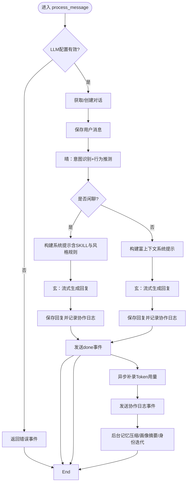
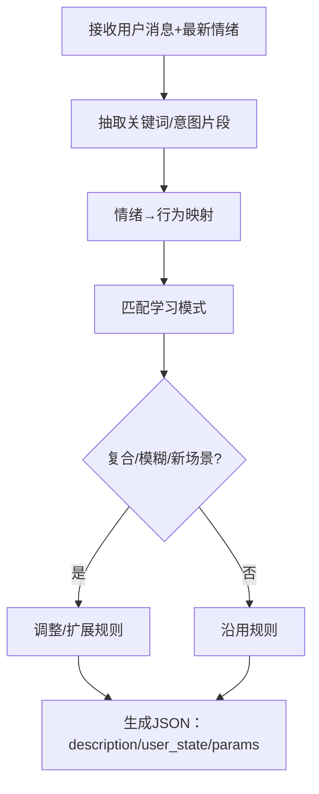
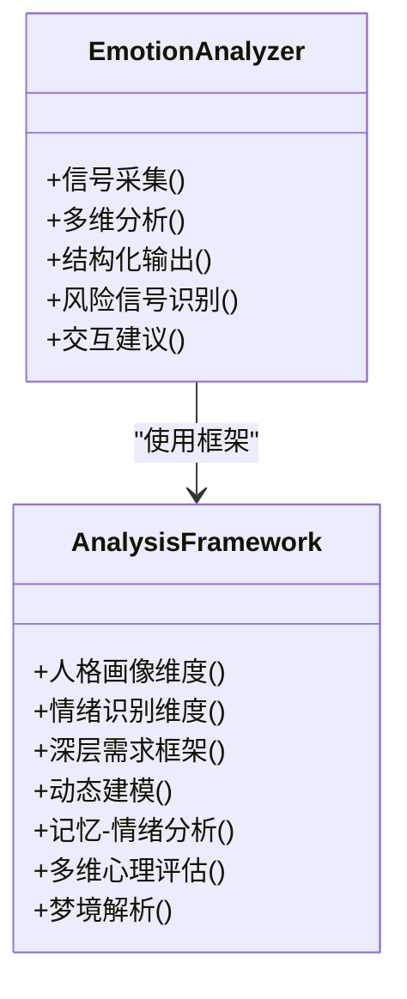
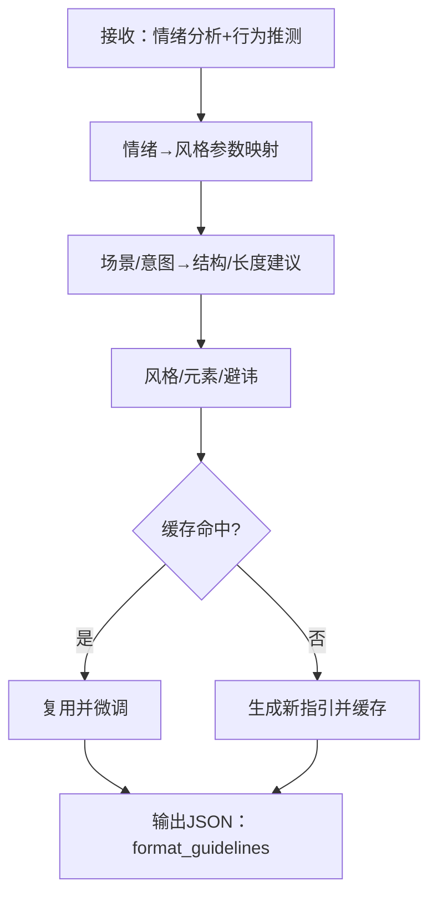
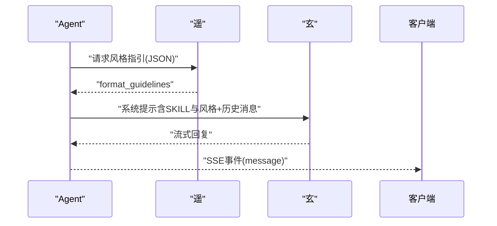
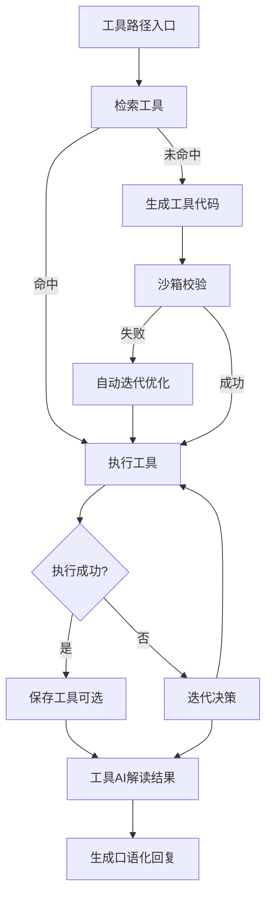
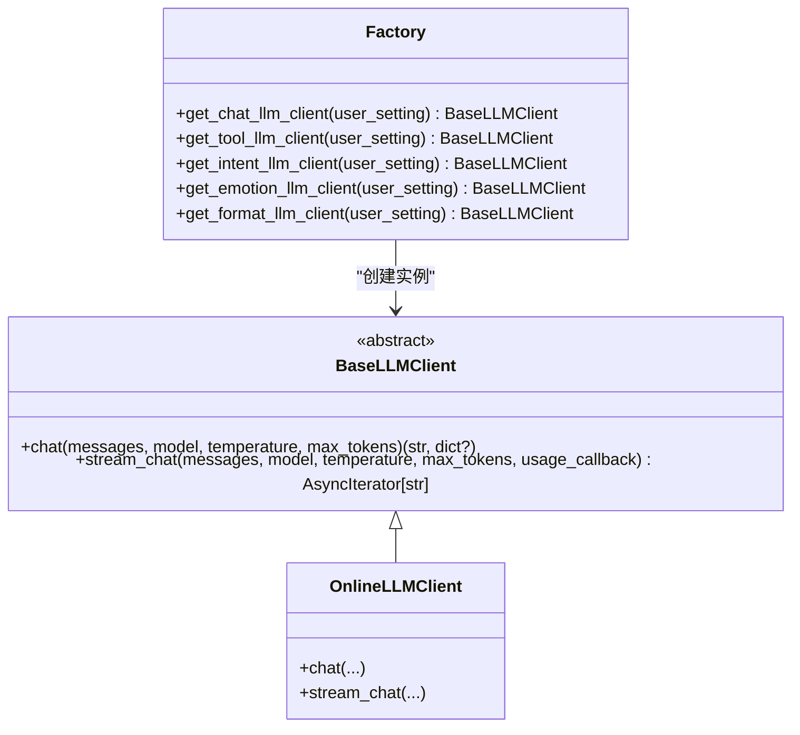
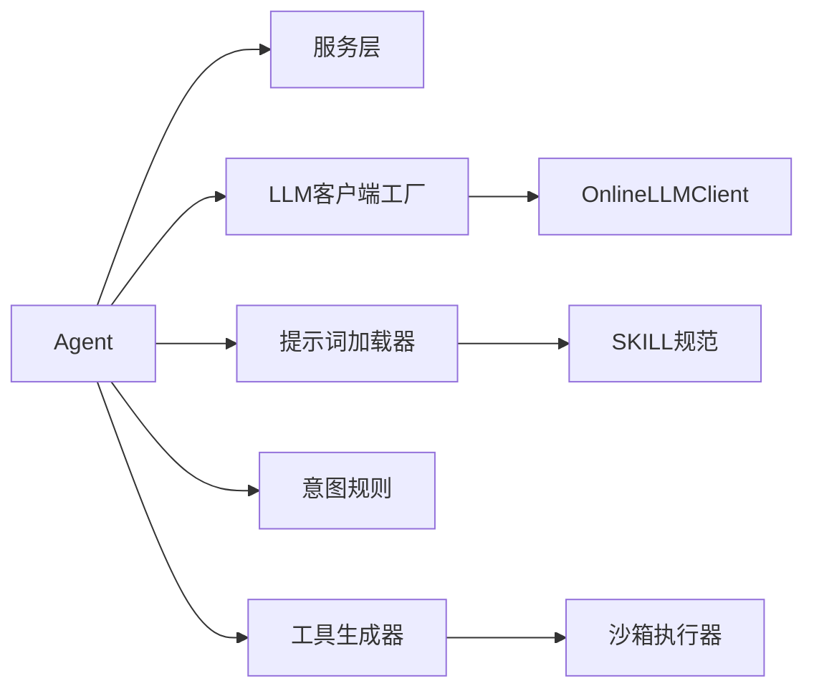

# AI智能体系统

<cite>
**本文档引用的文件**
- [backend/app/main.py](file://backend/app/main.py)
- [backend/app/ai/agent.py](file://backend/app/ai/agent.py)
- [backend/app/ai/base.py](file://backend/app/ai/base.py)
- [backend/app/ai/factory.py](file://backend/app/ai/factory.py)
- [backend/app/ai/tool_generator.py](file://backend/app/ai/tool_generator.py)
- [backend/app/ai/online.py](file://backend/app/ai/online.py)
- [backend/app/ai/intent_rules.json](file://backend/app/ai/intent_rules.json)
- [backend/app/ai/skills/xuanji-qing/SKILL.md](file://backend/app/ai/skills/xuanji-qing/SKILL.md)
- [backend/app/ai/skills/xuanji-qing/evolution-rules.md](file://backend/app/ai/skills/xuanji-qing/evolution-rules.md)
- [backend/app/ai/skills/xuanji-huan/SKILL.md](file://backend/app/ai/skills/xuanji-huan/SKILL.md)
- [backend/app/ai/skills/xuanji-huan/analysis-framework.md](file://backend/app/ai/skills/xuanji-huan/analysis-framework.md)
- [backend/app/ai/skills/xuanji-yao/SKILL.md](file://backend/app/ai/skills/xuanji-yao/SKILL.md)
- [backend/app/ai/skills/xuanji-yao/emotion-style-map.json](file://backend/app/ai/skills/xuanji-yao/emotion-style-map.json)
- [backend/app/ai/skills/xuanji-xuan/SKILL.md](file://backend/app/ai/skills/xuanji-xuan/SKILL.md)
- [backend/app/ai/skills/xuanji-xuan/style-rules.md](file://backend/app/ai/skills/xuanji-xuan/style-rules.md)
</cite>

## 目录
1. [简介](#简介)
2. [项目结构](#项目结构)
3. [核心组件](#核心组件)
4. [架构总览](#架构总览)
5. [详细组件分析](#详细组件分析)
6. [依赖分析](#依赖分析)
7. [性能考量](#性能考量)
8. [故障排查指南](#故障排查指南)
9. [结论](#结论)
10. [附录](#附录)

## 简介
本文件面向AI开发者与系统架构师，系统性解析XuanJi多智能体系统的深度技术实现。重点涵盖Agent核心架构、五象智能体（晴、焕、遥、玄、机）的协作机制与角色分工、AI技能实现细节（意图识别、情感分析、风格设计、对话生成、系统迭代）、智能体间通信协议与上下文传递、结果整合流程、AI模型集成与Skill文件体系、推理链设计、性能优化与错误处理策略，并提供调试技巧与最佳实践。

## 项目结构
后端采用FastAPI应用入口，核心AI逻辑位于backend/app/ai目录，包含：
- Agent主控制器：负责消息处理全流程编排、服务集成、事件流与协作日志
- LLM客户端工厂与实现：统一在线与本地Ollama模型接入
- 技能模块：五象角色的Skill文件与行为规范（替代原 prompts.py）
- 工具生成与执行：工具检索/生成/执行与迭代
- 服务层：对话、情感、身份、记忆、任务、日志、配额等

图表来源
- [backend/app/main.py:1-79](file://backend/app/main.py#L1-L79)
- [backend/app/ai/agent.py:1-800](file://backend/app/ai/agent.py#L1-L800)
- [backend/app/ai/factory.py:1-154](file://backend/app/ai/factory.py#L1-L154)
- [backend/app/ai/online.py:1-134](file://backend/app/ai/online.py#L1-L134)
- [backend/app/ai/base.py:1-73](file://backend/app/ai/base.py#L1-L73)

章节来源
- [backend/app/main.py:1-79](file://backend/app/main.py#L1-L79)

## 核心组件
- Agent主控制器：统一编排意图识别、情绪分析、风格设计、对话生成、工具检索/生成/执行与结果解读，产出SSE事件流，记录协作日志与Token用量。
- LLM客户端工厂：按用户配置动态创建在线或本地模型客户端，确保不同角色（对话、工具、意图、情绪、风格）使用各自模型与参数。
- 技能系统：通过统一的提示词加载器加载各角色的SKILL规范与行为指南，保证输出格式与风格约束。
- 工具生成器：基于工具AI生成Python工具代码，经沙箱校验后执行，失败时支持自动迭代优化。
- 服务层：提供对话、情感、身份、记忆、任务、日志、配额等持久化与业务逻辑支撑。

章节来源
- [backend/app/ai/agent.py:35-793](file://backend/app/ai/agent.py#L35-L793)
- [backend/app/ai/factory.py:54-154](file://backend/app/ai/factory.py#L54-L154)
- [backend/app/ai/base.py:41-73](file://backend/app/ai/base.py#L41-L73)
- [backend/app/ai/tool_generator.py:10-129](file://backend/app/ai/tool_generator.py#L10-L129)

## 架构总览
XuanJi采用“多智能体协作+工具链闭环”的架构。用户消息首先进入Agent，由晴进行意图识别与行为推测，焕进行情绪分析，遥基于情绪与推测生成风格指引，玄融合多源上下文生成最终回复；对于非闲聊任务，Agent可检索或生成工具并执行，再由工具AI进行结果解读，最终统一沉淀到对话与记忆体系。

图表来源
- [backend/app/ai/agent.py:78-793](file://backend/app/ai/agent.py#L78-L793)
- [backend/app/ai/skills/xuanji-qing/SKILL.md:10-106](file://backend/app/ai/skills/xuanji-qing/SKILL.md#L10-L106)
- [backend/app/ai/skills/xuanji-huan/SKILL.md:31-97](file://backend/app/ai/skills/xuanji-huan/SKILL.md#L31-L97)
- [backend/app/ai/skills/xuanji-yao/SKILL.md:67-84](file://backend/app/ai/skills/xuanji-yao/SKILL.md#L67-L84)
- [backend/app/ai/skills/xuanji-xuan/SKILL.md:22-51](file://backend/app/ai/skills/xuanji-xuan/SKILL.md#L22-L51)

## 详细组件分析

### Agent核心流程与事件流
- 生命周期与初始化：加载意图规则、创建各角色LLM客户端、绑定服务层，建立Token用量收集回调。
- 消息处理主循环：SSE事件流包括metadata、thinking、message、emotion_update、tool_*、done、collaboration等，前端可实时渲染。
- 轻量与完整对话路径：根据意图与简单判定选择不同系统提示与上下文长度。
- 工具路径：并行启动情绪分析，随后进行工具检索/生成/执行，失败时自动迭代，最终由工具AI进行结果解读。
- 协作日志：记录每个角色的行动、结果与下一步，便于前端可视化与审计。
- 后置处理：在done事件后异步补录Token用量、持久化情绪快照、触发记忆压缩与画像更新。

图表来源
- [backend/app/ai/agent.py:78-793](file://backend/app/ai/agent.py#L78-L793)

章节来源
- [backend/app/ai/agent.py:78-793](file://backend/app/ai/agent.py#L78-L793)

### 晴：意图识别与行为推测
- 角色定位：系统“大脑”，负责行为推测与调度，输出JSON结构的意图描述、用户状态、目标路径与参数。
- 推理链：结合最新情绪与消息内容，综合行为模式、真实需求、互动期望，形成user_state与description。
- 规则引擎：内置关键词与学习模式，支持与焕协作维护规则，动态优化推测策略。
- 输出规范：严格JSON格式，字段包含description、user_state、target_path、parameters，且need_emotion默认true。

图表来源
- [backend/app/ai/skills/xuanji-qing/SKILL.md:22-106](file://backend/app/ai/skills/xuanji-qing/SKILL.md#L22-L106)
- [backend/app/ai/intent_rules.json:164-289](file://backend/app/ai/intent_rules.json#L164-L289)

章节来源
- [backend/app/ai/skills/xuanji-qing/SKILL.md:10-206](file://backend/app/ai/skills/xuanji-qing/SKILL.md#L10-L206)
- [backend/app/ai/intent_rules.json:1-306](file://backend/app/ai/intent_rules.json#L1-L306)

### 焕：情感分析与心理建模
- 核心能力：多维分析（情绪识别、人格画像、深层需求、动态建模、记忆-情绪分析、心理评估、梦境解析）。
- 分析框架：提供详细的维度定义与分析流程，支持构建“触发事件→心理解释→情感反应→行为表达→后续影响”的逻辑链。
- 输出结构：包含当前情绪、强度、心理特征、深层需求、风险信号、趋势预测与交互建议。
- 风险与边界：强调概率性、非绝对化、非医疗诊断、非病理标签、尊重主体性。

图表来源
- [backend/app/ai/skills/xuanji-huan/SKILL.md:31-178](file://backend/app/ai/skills/xuanji-huan/SKILL.md#L31-L178)
- [backend/app/ai/skills/xuanji-huan/analysis-framework.md:1-225](file://backend/app/ai/skills/xuanji-huan/analysis-framework.md#L1-L225)

章节来源
- [backend/app/ai/skills/xuanji-huan/SKILL.md:15-186](file://backend/app/ai/skills/xuanji-huan/SKILL.md#L15-L186)
- [backend/app/ai/skills/xuanji-huan/analysis-framework.md:1-225](file://backend/app/ai/skills/xuanji-huan/analysis-framework.md#L1-L225)

### 遥：风格设计与格式化
- 角色定位：风格设计师，将情绪分析与行为推测转化为可执行的format_guidelines，注入玄的系统提示。
- 情绪-风格映射：基于情绪大类与强度，给出语气、节奏、情感色彩建议；默认风格为自然亲和、温和友好。
- 结构化设计：根据不同场景推荐回复结构与长度；强调节奏感、留白、一致性与自然度。
- 缓存机制：按情绪大类缓存格式指引，30分钟有效期，提高连贯性与性能。

图表来源
- [backend/app/ai/skills/xuanji-yao/SKILL.md:21-109](file://backend/app/ai/skills/xuanji-yao/SKILL.md#L21-L109)
- [backend/app/ai/skills/xuanji-yao/emotion-style-map.json:1-14](file://backend/app/ai/skills/xuanji-yao/emotion-style-map.json#L1-L14)

章节来源
- [backend/app/ai/skills/xuanji-yao/SKILL.md:9-170](file://backend/app/ai/skills/xuanji-yao/SKILL.md#L9-L170)
- [backend/app/ai/skills/xuanji-yao/emotion-style-map.json:1-14](file://backend/app/ai/skills/xuanji-yao/emotion-style-map.json#L1-L14)

### 玄：对话生成与上下文融合
- 角色定位：唯一直接与用户对话的角色，负责融合多源上下文，生成自然、温暖、口语化的回复。
- 上下文融合：整合晴的行为推测、焕的情绪洞察、遥的风格指引、用户画像与记忆片段，避免暴露内部术语。
- 语言风格：禁止编号列表、加粗标题、星号动作、括号内部角色信息、角色扮演式表达；鼓励口语化、节奏感与共情。
- 回复节奏：依据场景调整长度与节奏，保持连贯性与个性化。

图表来源
- [backend/app/ai/skills/xuanji-xuan/SKILL.md:22-101](file://backend/app/ai/skills/xuanji-xuan/SKILL.md#L22-L101)
- [backend/app/ai/skills/xuanji-xuan/style-rules.md:1-6](file://backend/app/ai/skills/xuanji-xuan/style-rules.md#L1-L6)

章节来源
- [backend/app/ai/skills/xuanji-xuan/SKILL.md:10-167](file://backend/app/ai/skills/xuanji-xuan/SKILL.md#L10-L167)
- [backend/app/ai/skills/xuanji-xuan/style-rules.md:1-6](file://backend/app/ai/skills/xuanji-xuan/style-rules.md#L1-L6)

### 工具链：检索/生成/执行/迭代
- 工具检索：优先从数据库匹配，支持路径与参数注入。
- 工具生成：使用工具AI生成Python代码，清理元信息与代码围栏，校验合法性，失败重试。
- 工具执行：沙箱执行，返回成功/失败与结果；失败时触发迭代决策，自动生成新代码并重试。
- 结果解读：使用工具AI对工具结果进行口语化解读，保障用户可理解。

图表来源
- [backend/app/ai/tool_generator.py:10-129](file://backend/app/ai/tool_generator.py#L10-L129)
- [backend/app/ai/agent.py:361-674](file://backend/app/ai/agent.py#L361-L674)

章节来源
- [backend/app/ai/tool_generator.py:10-129](file://backend/app/ai/tool_generator.py#L10-L129)
- [backend/app/ai/agent.py:361-674](file://backend/app/ai/agent.py#L361-L674)

### LLM客户端与模型集成
- 工厂方法：按角色创建在线或本地客户端，严格校验配置项，抛出统一错误类型。
- 在线客户端：支持流式与非流式，自动过滤<think>片段，透传usage回调。
- 本地客户端：通过Ollama适配，提供相同接口。

图表来源
- [backend/app/ai/base.py:8-36](file://backend/app/ai/base.py#L8-L36)
- [backend/app/ai/online.py:10-134](file://backend/app/ai/online.py#L10-L134)
- [backend/app/ai/factory.py:54-154](file://backend/app/ai/factory.py#L54-L154)

章节来源
- [backend/app/ai/base.py:1-73](file://backend/app/ai/base.py#L1-L73)
- [backend/app/ai/online.py:1-134](file://backend/app/ai/online.py#L1-L134)
- [backend/app/ai/factory.py:1-154](file://backend/app/ai/factory.py#L1-L154)

## 依赖分析
- 组件耦合：Agent对服务层与LLM客户端强依赖；五象角色通过统一Skill文件加载器与工厂方法解耦。
- 外部依赖：HTTP客户端、数据库ORM、沙箱执行器；通过异常与回调隔离外部故障。
- 角色边界：各角色职责清晰，通过SSE事件与JSON结构化输出进行协作，避免紧耦合。

图表来源
- [backend/app/ai/agent.py:13-33](file://backend/app/ai/agent.py#L13-L33)
- [backend/app/ai/factory.py:14-154](file://backend/app/ai/factory.py#L14-L154)
- [backend/app/ai/base.py:41-73](file://backend/app/ai/base.py#L41-L73)
- [backend/app/ai/tool_generator.py:5-7](file://backend/app/ai/tool_generator.py#L5-L7)

章节来源
- [backend/app/ai/agent.py:13-33](file://backend/app/ai/agent.py#L13-L33)
- [backend/app/ai/factory.py:14-154](file://backend/app/ai/factory.py#L14-L154)
- [backend/app/ai/base.py:41-73](file://backend/app/ai/base.py#L41-L73)
- [backend/app/ai/tool_generator.py:5-7](file://backend/app/ai/tool_generator.py#L5-L7)

## 性能考量
- 并行化：情绪分析与意图识别并行，缩短端到端延迟。
- 流式输出：对话与解读均采用流式生成，前端可即时渲染，提升交互体验。
- 缓存与复用：遥对风格指引按情绪大类缓存，降低重复计算；Agent对格式化模板与JSON配置使用LRU缓存。
- 超时与降级：工具路径设置流式超时与总时长限制，失败时提供降级回复；情绪分析超时不影响主流程。
- 后台任务：记忆压缩、画像摘要与身份迭代并发执行，避免阻塞主线程。

## 故障排查指南
- LLM配置错误：工厂方法抛出统一错误类型，Agent在消息处理开头即拦截并返回错误事件。
- 情绪分析异常：超时或失败时记录日志与告警，不影响对话主流程，最终在done事件后异步补录用量。
- 工具生成/执行失败：自动迭代优化并重试，记录详细错误；成功后可自动保存工具。
- 结果解读失败：降级为简要口语化回复，保证用户可见结果。
- 日志与追踪：协作日志、Token用量、任务状态与异常均记录到日志服务，便于审计与定位。

章节来源
- [backend/app/ai/factory.py:14-154](file://backend/app/ai/factory.py#L14-L154)
- [backend/app/ai/agent.py:275-793](file://backend/app/ai/agent.py#L275-L793)

## 结论
XuanJi通过"多智能体协作"的架构，实现了从意图识别、情绪感知、风格设计到对话生成的完整链路，机在后台独立运行系统迭代优化任务。五象角色职责清晰、边界明确，配合Skill文件体系与模型集成方案，既保证了系统稳定性，也提供了良好的可扩展性与可演进性。通过并行化、流式输出、缓存与降级策略，系统在性能与用户体验上取得良好平衡。

## 附录
- 提示词工程：五象SKILL规范定义了严格的输出格式与行为约束，建议在新增或调整角色能力时，优先完善SKILL与analysis-framework，再在Agent中注入系统提示。
- 推理链设计：晴的规则引擎与焕的心理分析框架为系统提供了可解释的决策依据，建议在灰度发布与A/B测试中重点关注准确率与响应时间指标。
- 调试技巧：利用协作日志事件与Token用量事件进行端到端追踪；对工具生成失败场景，优先检查元信息提取与沙箱校验逻辑；对情绪分析异常，检查模型可用性与网络超时配置。