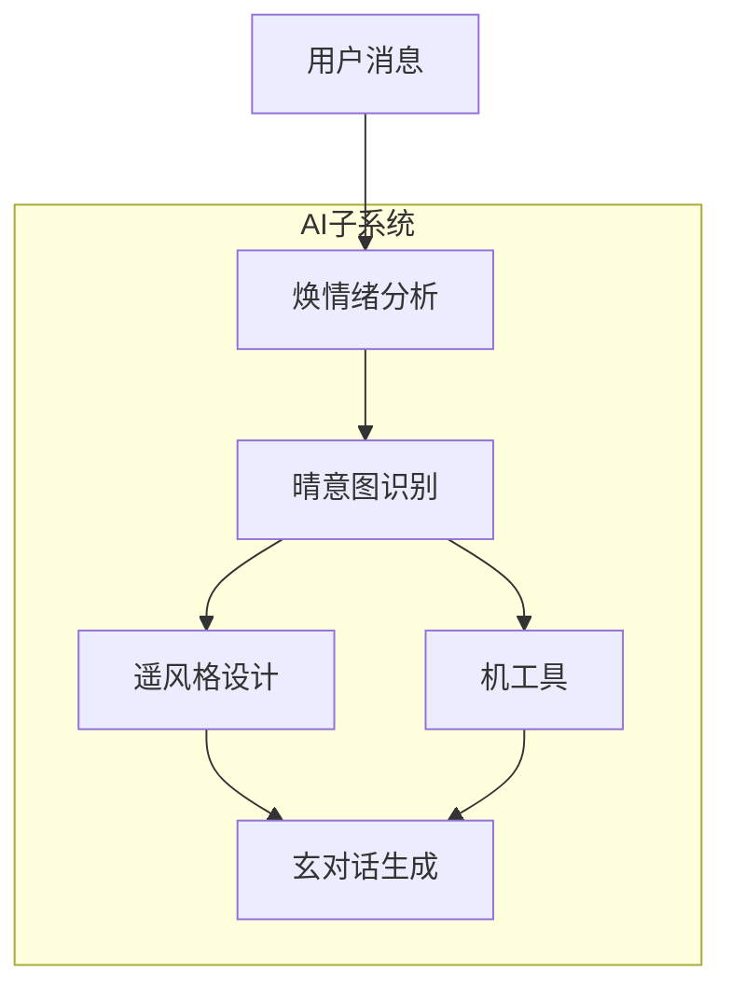
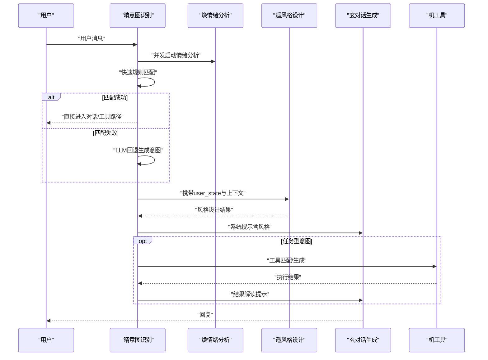
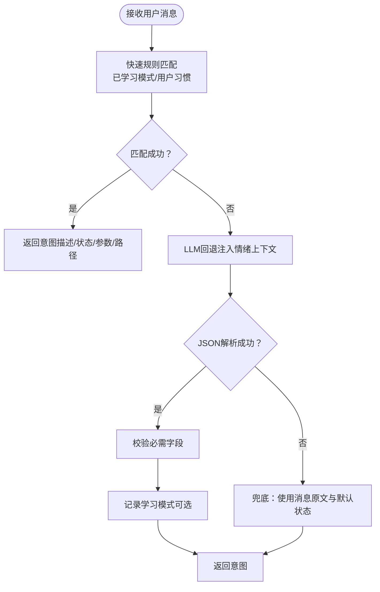
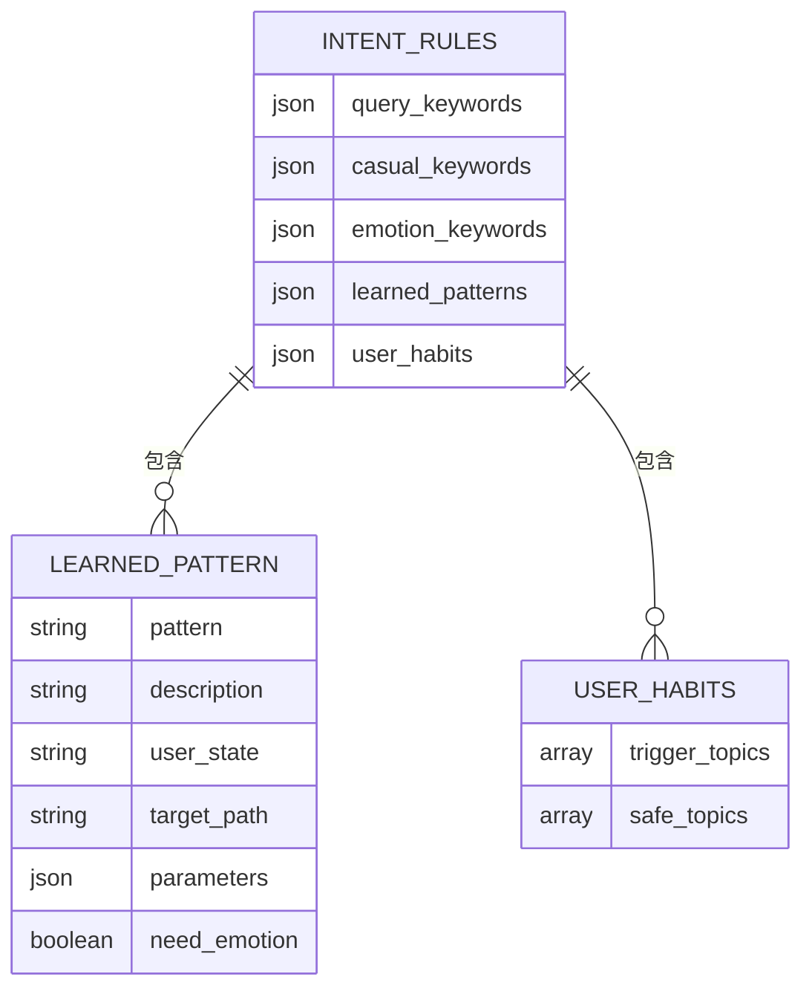
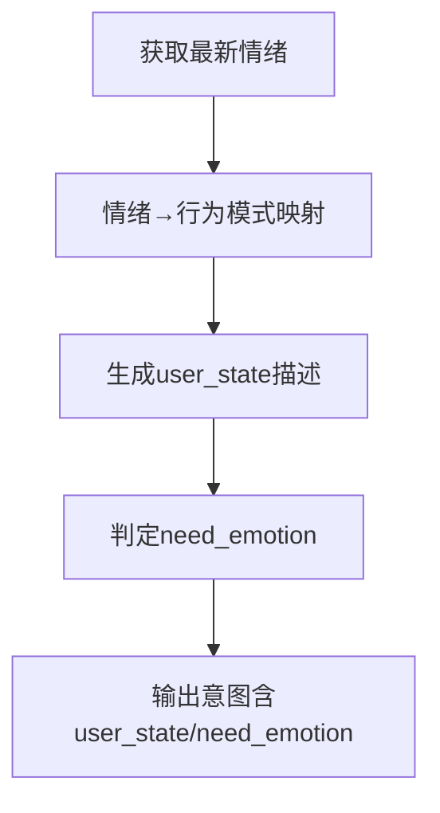
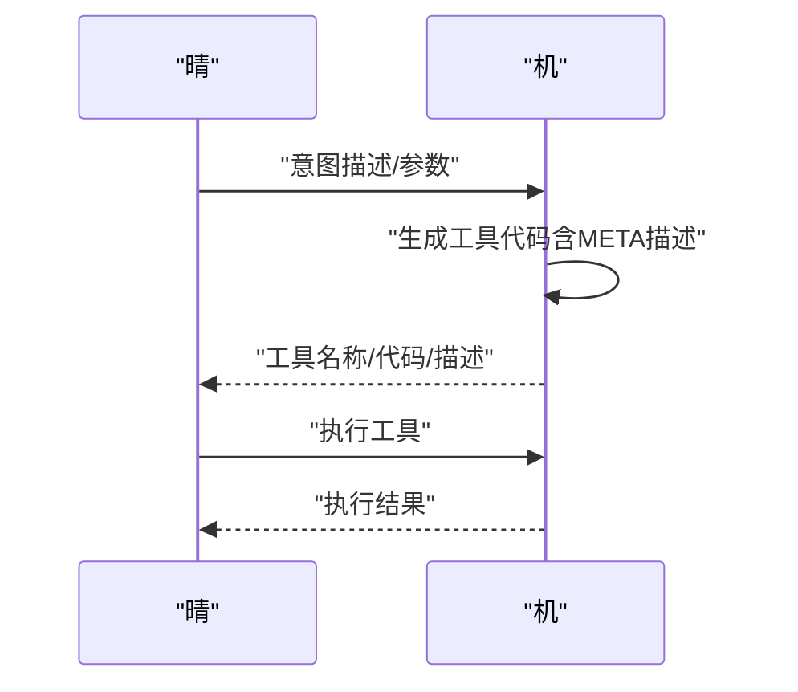
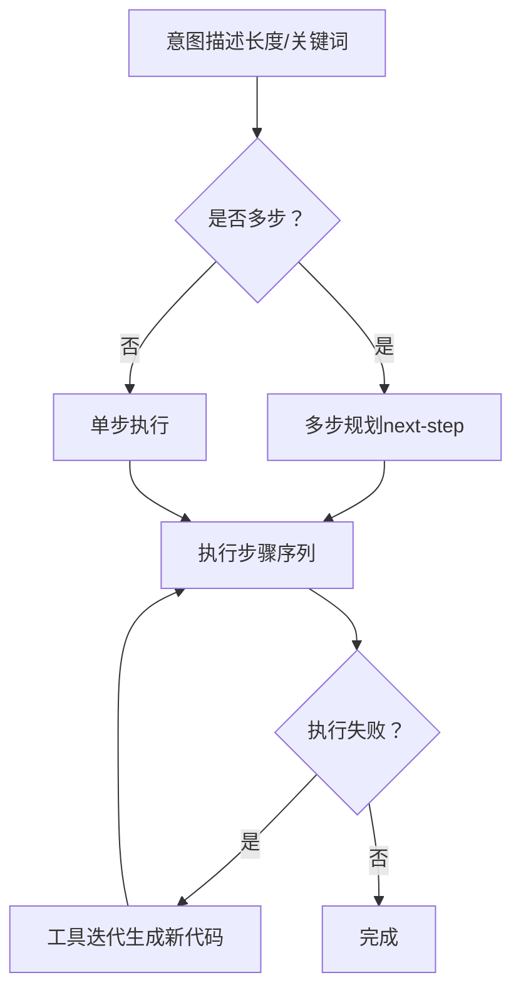
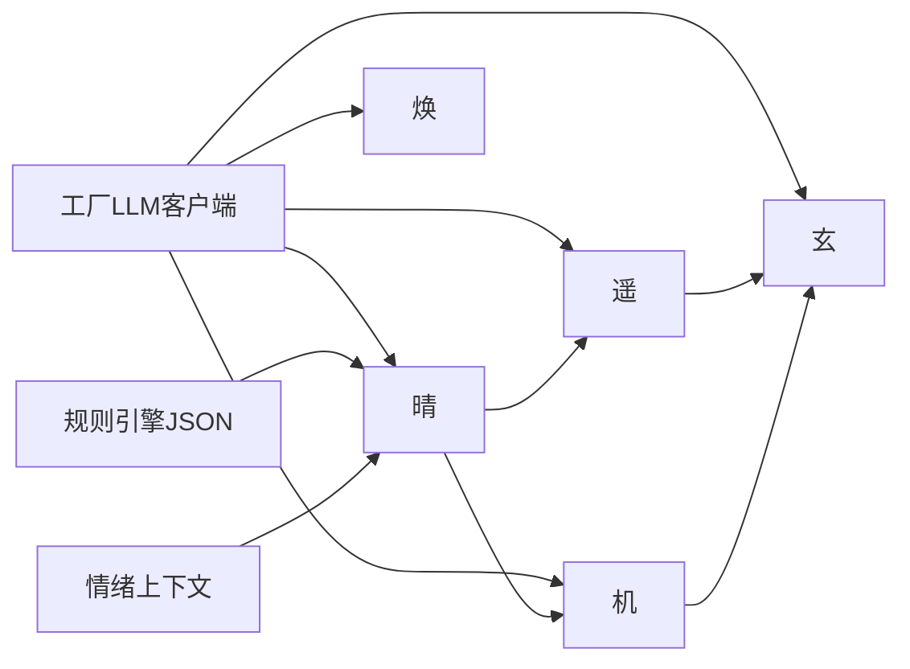

# 晴-意图识别系统

<cite>
**本文引用的文件**
- [agent.py](file://backend/app/ai/agent.py)
- [base.py](file://backend/app/ai/base.py)
- [factory.py](file://backend/app/ai/factory.py)
- [tool_generator.py](file://backend/app/ai/tool_generator.py)
- [intent_rules.json](file://backend/app/ai/intent_rules.json)
- [SKILL.md（晴）](file://backend/app/ai/skills/xuanji-qing/SKILL.md)
- [evolution-rules.md（晴）](file://backend/app/ai/skills/xuanji-qing/evolution-rules.md)
- [next-step.md（晴）](file://backend/app/ai/skills/xuanji-qing/next-step.md)
- [tool-generate.md（机）](file://backend/app/ai/skills/xuanji-ji/tool-generate.md)
- [tool-match.md（机）](file://backend/app/ai/skills/xuanji-ji/tool-match.md)
- [persona.md（焕）](file://backend/app/ai/skills/xuanji-huan/persona.md)
- [persona.md（遥）](file://backend/app/ai/skills/xuanji-yao/persona.md)
- [persona.md（玄）](file://backend/app/ai/skills/xuanji-xuan/persona.md)
</cite>

## 目录
1. [简介](#简介)
2. [项目结构](#项目结构)
3. [核心组件](#核心组件)
4. [架构总览](#架构总览)
5. [详细组件分析](#详细组件分析)
6. [依赖分析](#依赖分析)
7. [性能考量](#性能考量)
8. [故障排查指南](#故障排查指南)
9. [结论](#结论)
10. [附录](#附录)

## 简介
本文件面向AI算法工程师与NLP开发者，系统化解析“晴-意图识别系统”的实现与优化方法。重点涵盖：
- 意图分类算法与快速匹配机制
- 规则引擎设计与演化规则
- 意图解析流程、用户状态推断、情感需求判断
- 进化规则应用、意图描述生成、参数提取机制
- 规则配置、分类准确率优化、边界情况处理
- 意图树结构图、决策流程图、规则配置示例

## 项目结构
后端采用模块化组织，AI子系统位于 backend/app/ai 下，围绕“四AI一机”协作模型构建：
- 晴：意图识别中枢，负责行为推测与快速分类
- 焕：情绪分析，提供情绪上下文
- 遥：风格设计，基于记忆与上下文生成回复风格
- 玄：对话生成，依据系统提示与上下文生成回复
- 机：工具检索/生成/执行，支撑任务型意图

图表来源
- [agent.py:78-274](file://backend/app/ai/agent.py#L78-L274)
- [SKILL.md（晴）:143-159](file://backend/app/ai/skills/xuanji-qing/SKILL.md#L143-L159)

章节来源
- [agent.py:35-763](file://backend/app/ai/agent.py#L35-L763)

## 核心组件
- 晴（意图识别中枢）
  - 负责快速规则匹配与LLM回退，输出标准化意图结构（描述、用户状态、目标路径、参数、是否需要情绪）
  - 维护规则引擎，结合用户习惯与情绪上下文优化推测
- 焕（情绪分析）
  - 提供最新情绪状态（主情绪、强度、深层需求、风险等级），为晴与遥提供上下文
- 遥（风格设计）
  - 基于记忆与上下文生成风格化提示，影响玄的回复风格
- 玄（对话生成）
  - 依据系统提示与上下文生成自然语言回复
- 机（系统迭代）
  - 工具检索、生成与执行，支持任务型意图闭环

章节来源
- [SKILL.md（晴）:10-18](file://backend/app/ai/skills/xuanji-qing/SKILL.md#L10-L18)
- [SKILL.md（晴）:22-82](file://backend/app/ai/skills/xuanji-qing/SKILL.md#L22-L82)
- [agent.py:35-120](file://backend/app/ai/agent.py#L35-L120)

## 架构总览
系统以“消息流”为主线，按阶段产出协作日志与中间结果，确保可观测与可优化。

图表来源
- [agent.py:78-274](file://backend/app/ai/agent.py#L78-L274)
- [agent.py:361-674](file://backend/app/ai/agent.py#L361-L674)

## 详细组件分析

### 晴：意图识别与规则引擎
- 快速匹配机制
  - 优先检查“已学习模式”（历史高置信样本的子串）
  - 叠加用户习惯（触发话题/安全话题）修正推测
  - 关键路径：<1ms，避免成为系统瓶颈
- LLM回退
  - 当规则无法判断时，注入最新情绪上下文，调用意图LLM生成标准化JSON
  - 回退失败时进行健壮的JSON提取与兜底
- 规则学习与演化
  - 将LLM分类结果纳入“已学习模式”，并结合用户画像与习惯优化
  - 与焕协作维护规则引擎，确保情绪关键词与行为模式协同

图表来源
- [agent.py:1386-1408](file://backend/app/ai/agent.py#L1386-L1408)
- [agent.py:1306-1352](file://backend/app/ai/agent.py#L1306-L1352)
- [agent.py:1216-1245](file://backend/app/ai/agent.py#L1216-L1245)

章节来源
- [agent.py:1206-1245](file://backend/app/ai/agent.py#L1206-L1245)
- [agent.py:1386-1408](file://backend/app/ai/agent.py#L1386-L1408)
- [agent.py:1306-1352](file://backend/app/ai/agent.py#L1306-L1352)
- [evolution-rules.md（晴）:1-82](file://backend/app/ai/skills/xuanji-qing/evolution-rules.md#L1-L82)
- [SKILL.md（晴）:66-82](file://backend/app/ai/skills/xuanji-qing/SKILL.md#L66-L82)

### 意图规则配置与参数提取
- 规则文件结构
  - 查询关键词、闲聊关键词、情感关键词、已学习模式、用户习惯
- 已学习模式
  - 以历史高置信样本为键，存储意图描述、用户状态、目标路径、参数、是否需要情绪
- 用户习惯
  - 触发话题（强制需要情绪）、安全话题（无需情绪）
- 参数提取
  - 从消息中抽取城市、目的地、时间范围、角色名等，写入parameters对象

图表来源
- [intent_rules.json:1-306](file://backend/app/ai/intent_rules.json#L1-L306)

章节来源
- [intent_rules.json:1-306](file://backend/app/ai/intent_rules.json#L1-L306)
- [agent.py:1401-1408](file://backend/app/ai/agent.py#L1401-L1408)

### 情感需求判断与用户状态推断
- 情绪上下文利用
  - 晴在推测时参考“最新情绪”（主情绪、强度、深层需求、风险等级）
  - 情绪低落时倾向“需要情绪支持”的推测；愉悦时倾向“积极互动”
- 用户状态描述规范
  - 以“简要描述用户当前状态”为目标，帮助遥与玄理解上下文
- 规则协作
  - 焕贡献情绪关键词与触发话题，晴负责行为模式学习与推测优化

图表来源
- [SKILL.md（晴）:42-65](file://backend/app/ai/skills/xuanji-qing/SKILL.md#L42-L65)
- [agent.py:121-129](file://backend/app/ai/agent.py#L121-L129)

章节来源
- [SKILL.md（晴）:42-65](file://backend/app/ai/skills/xuanji-qing/SKILL.md#L42-L65)
- [agent.py:121-129](file://backend/app/ai/agent.py#L121-L129)

### 意图描述生成与参数提取机制
- 描述生成
  - 优先使用规则/LLM生成的描述；兜底为消息原文
- 参数提取
  - 从消息中抽取实体（如地点、人物、时间范围），写入parameters
- 工具生成
  - 机通过工具生成提示，生成符合规范的Python工具函数，并在META注释中提供英文/中文描述

图表来源
- [agent.py:481-526](file://backend/app/ai/agent.py#L481-L526)
- [tool_generator.py:10-67](file://backend/app/ai/tool_generator.py#L10-L67)
- [tool-generate.md（机）:1-36](file://backend/app/ai/skills/xuanji-ji/tool-generate.md#L1-L36)

章节来源
- [agent.py:481-526](file://backend/app/ai/agent.py#L481-L526)
- [tool_generator.py:10-67](file://backend/app/ai/tool_generator.py#L10-L67)
- [tool-generate.md（机）:1-36](file://backend/app/ai/skills/xuanji-ji/tool-generate.md#L1-L36)

### 多步规划与边界情况处理
- 复杂任务识别
  - 当意图描述较长或包含“和/并且/同时”等连接词时，触发多步规划
- 边界情况
  - 工具执行失败时，机可自动迭代生成新代码并重试
  - LLM流式输出超时/失败时，提供降级回复与日志记录
  - 情绪分析异步超时/失败时，记录日志并继续流程

图表来源
- [agent.py:343-359](file://backend/app/ai/agent.py#L343-L359)
- [agent.py:418-476](file://backend/app/ai/agent.py#L418-L476)
- [next-step.md（晴）:12-25](file://backend/app/ai/skills/xuanji-qing/next-step.md#L12-L25)

章节来源
- [agent.py:343-359](file://backend/app/ai/agent.py#L343-L359)
- [agent.py:418-476](file://backend/app/ai/agent.py#L418-L476)
- [next-step.md（晴）:12-25](file://backend/app/ai/skills/xuanji-qing/next-step.md#L12-L25)

### 规则配置示例与调优建议
- 规则配置示例
  - 已学习模式：包含描述、用户状态、目标路径、参数、是否需要情绪
  - 用户习惯：触发话题（强制需要情绪）、安全话题（无需情绪）
- 调优建议
  - 基于真实交互数据扩展“已学习模式”，保持准确率不下降
  - 与焕协作同步情绪关键词，确保情绪-行为映射一致性
  - 控制输出格式（JSON）稳定，避免下游模块适配成本上升
  - 严格控制响应时间（<500ms），避免成为系统瓶颈

章节来源
- [intent_rules.json:164-305](file://backend/app/ai/intent_rules.json#L164-L305)
- [SKILL.md（晴）:197-206](file://backend/app/ai/skills/xuanji-qing/SKILL.md#L197-L206)
- [evolution-rules.md（晴）:26-61](file://backend/app/ai/skills/xuanji-qing/evolution-rules.md#L26-L61)

## 依赖分析
- 组件耦合
  - 晴依赖规则引擎与情绪上下文；遥依赖晴的user_state与记忆上下文；玄依赖遥的风格提示与对话历史；机独立于对话流，负责工具生命周期
- 外部依赖
  - LLM客户端工厂按用户设置动态创建在线/本地模型客户端
  - 工具生成依赖代码校验器，保证安全性与可执行性

图表来源
- [factory.py:54-154](file://backend/app/ai/factory.py#L54-L154)
- [agent.py:44-62](file://backend/app/ai/agent.py#L44-L62)

章节来源
- [factory.py:54-154](file://backend/app/ai/factory.py#L54-L154)
- [agent.py:44-62](file://backend/app/ai/agent.py#L44-L62)

## 性能考量
- 快速匹配优先：规则匹配<1ms，避免LLM成为瓶颈
- 并发与异步：情绪分析与意图推测并行，工具执行与对话生成并行
- 超时与降级：流式输出超时/失败提供降级回复，确保用户体验
- 缓存与复用：风格设计结果缓存，减少重复计算

## 故障排查指南
- 意图JSON解析失败
  - 现象：回退到兜底意图
  - 排查：检查意图LLM输出格式、健壮提取逻辑
- 工具生成/执行失败
  - 现象：自动迭代生成新代码并重试
  - 排查：查看生成代码合法性、参数完整性、执行环境
- 情绪分析超时/失败
  - 现象：记录告警日志，继续流程
  - 排查：检查情绪LLM配置、网络连通性、模型可用性

章节来源
- [agent.py:1328-1352](file://backend/app/ai/agent.py#L1328-L1352)
- [agent.py:418-476](file://backend/app/ai/agent.py#L418-L476)
- [agent.py:276-319](file://backend/app/ai/agent.py#L276-L319)

## 结论
晴-意图识别系统通过“规则优先+LLM回退”的双轨机制，在保证低延迟的同时兼顾准确性。配合焕的情绪上下文与遥的风格设计，形成从意图到回复的完整闭环。建议持续以真实数据驱动规则演化，强化情绪-行为映射，稳定输出格式与性能指标，确保系统在复杂对话场景下的鲁棒性与可维护性。

## 附录
- 角色人设参考
  - 焕：情绪感知者与心理顾问
  - 遥：风格设计师
  - 玄：对话生成者
  - 晴：意图识别中枢
  - 机：工具执行者

章节来源
- [persona.md（焕）:1-26](file://backend/app/ai/skills/xuanji-huan/persona.md#L1-L26)
- [persona.md（遥）:1-26](file://backend/app/ai/skills/xuanji-yao/persona.md#L1-L26)
- [persona.md（玄）:1-26](file://backend/app/ai/skills/xuanji-xuan/persona.md#L1-L26)
- [SKILL.md（晴）:10-18](file://backend/app/ai/skills/xuanji-qing/SKILL.md#L10-L18)