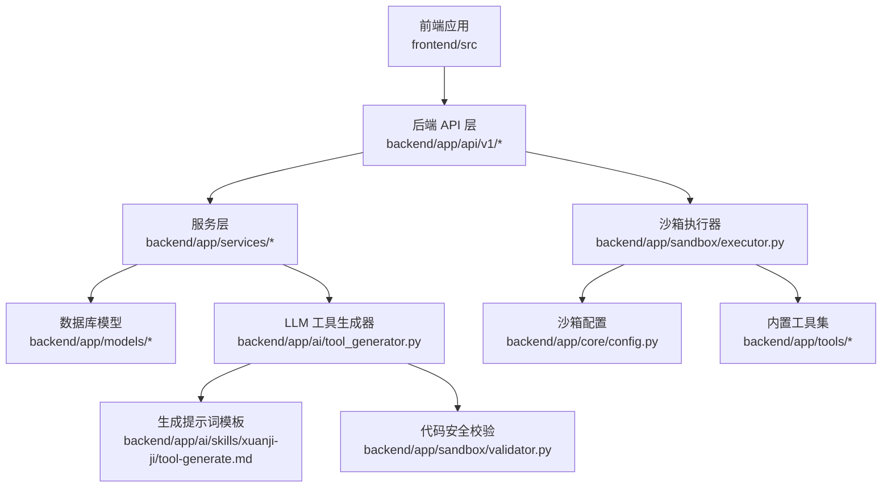
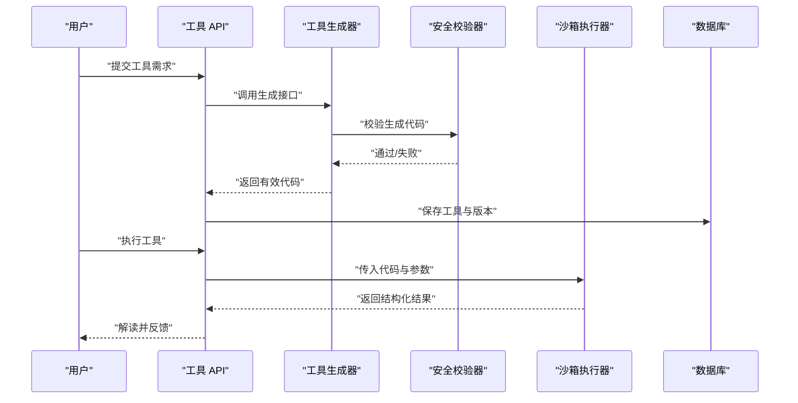
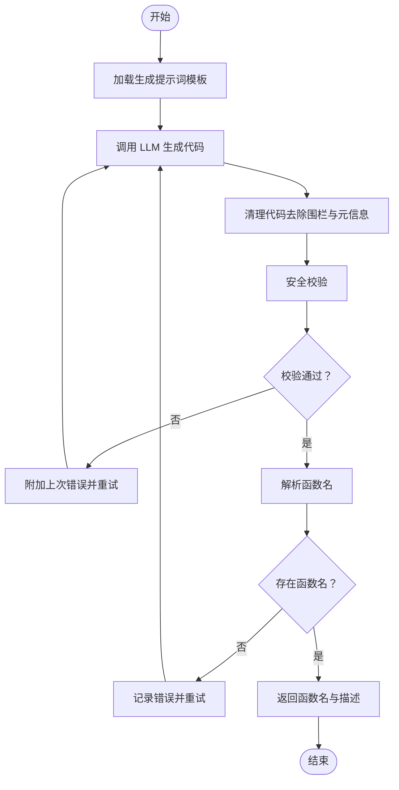
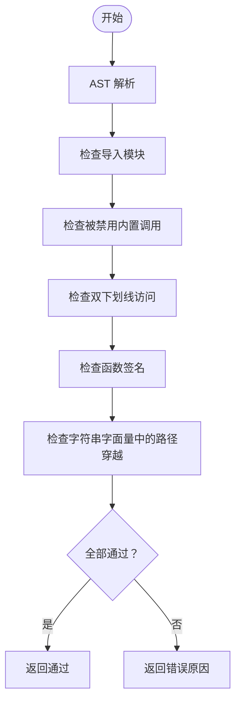
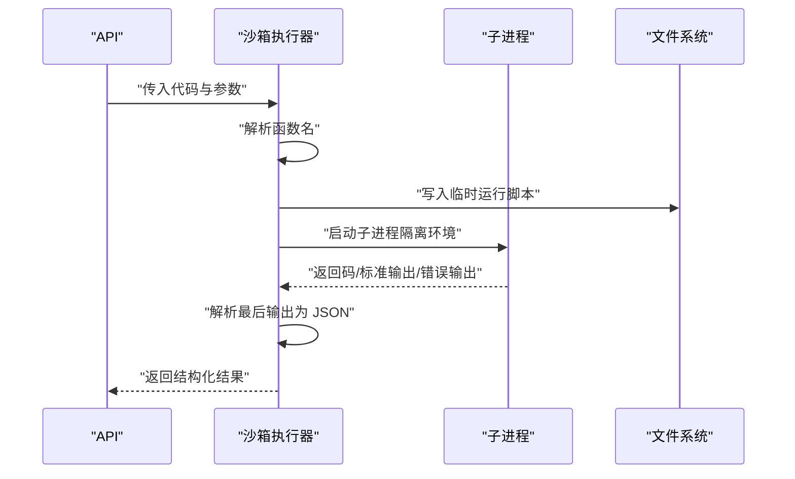
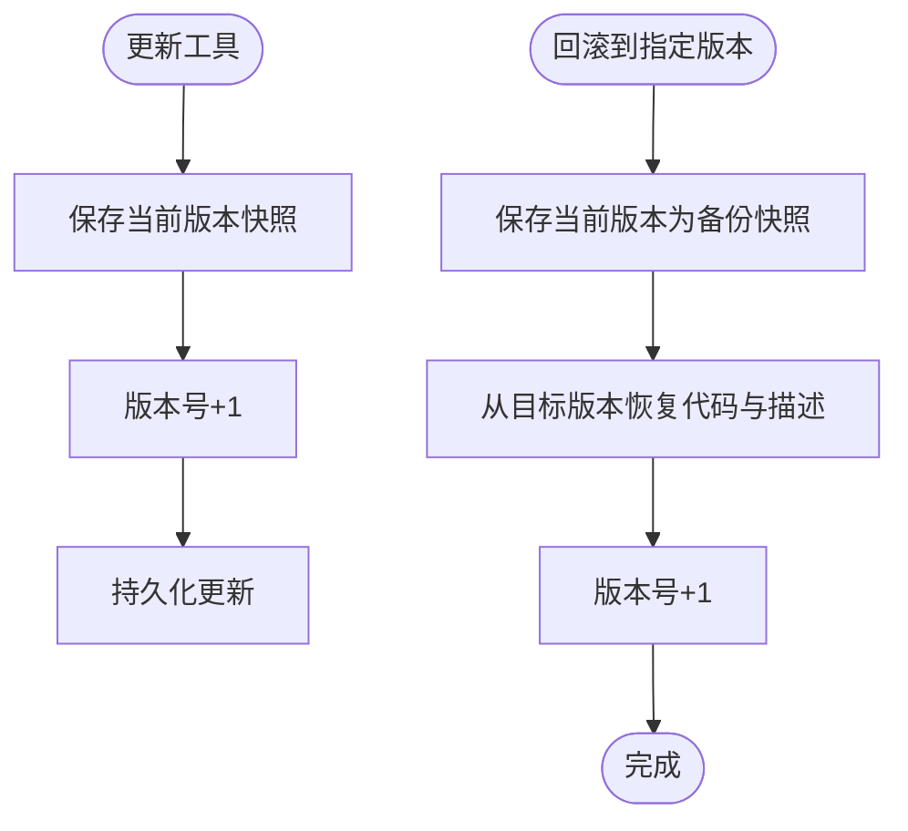
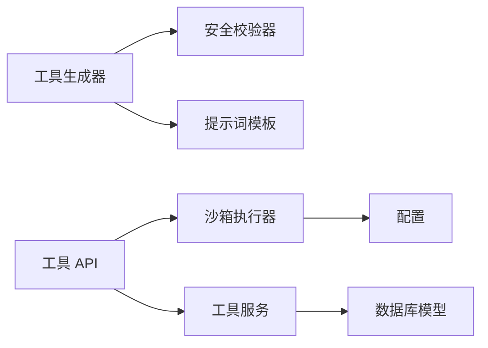
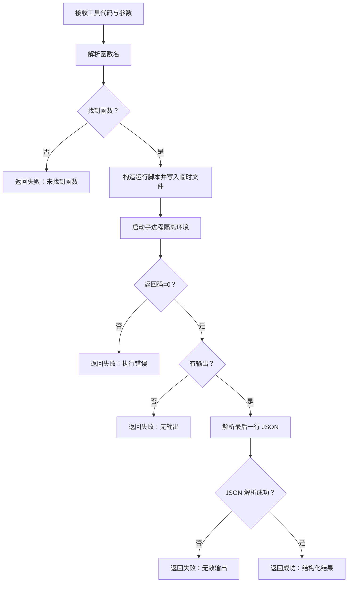

# 机-工具执行系统

> **重要说明：** 工具执行功能已停用，机的职责已从"工具执行者"转变为"AI系统迭代者"，在后台独立运行5项定时优化任务（规则引擎迭代、对话质量自评、画像监控、身份迭代、流程效率分析）。以下工具执行相关内容为历史参考，代码保留但不再触达。

<cite>
**本文引用的文件**
- [backend/app/ai/tool_generator.py](file://backend/app/ai/tool_generator.py)
- [backend/app/sandbox/validator.py](file://backend/app/sandbox/validator.py)
- [backend/app/sandbox/executor.py](file://backend/app/sandbox/executor.py)
- [backend/app/services/tool_service.py](file://backend/app/services/tool_service.py)
- [backend/app/models/tool.py](file://backend/app/models/tool.py)
- [backend/app/ai/skills/xuanji-ji/tool-generate.md](file://backend/app/ai/skills/xuanji-ji/tool-generate.md)
- [backend/app/ai/skills/xuanji-ji/tool-match.md](file://backend/app/ai/skills/xuanji-ji/tool-match.md)
- [backend/app/ai/skills/xuanji-ji/tool-iterate.md](file://backend/app/ai/skills/xuanji-ji/tool-iterate.md)
- [backend/app/ai/skills/xuanji-ji/result-interpret.md](file://backend/app/ai/skills/xuanji-ji/result-interpret.md)
- [backend/app/api/v1/tools.py](file://backend/app/api/v1/tools.py)
- [backend/app/tools/get_weather_today.py](file://backend/app/tools/get_weather_today.py)
- [backend/app/tools/check_tomorrow_weather.py](file://backend/app/tools/check_tomorrow_weather.py)
- [backend/app/core/config.py](file://backend/app/core/config.py)
- [backend/app/main.py](file://backend/app/main.py)
</cite>

## 目录
1. [简介](#简介)
2. [项目结构](#项目结构)
3. [核心组件](#核心组件)
4. [架构总览](#架构总览)
5. [详细组件分析](#详细组件分析)
6. [依赖分析](#依赖分析)
7. [性能考虑](#性能考虑)
8. [故障排查指南](#故障排查指南)
9. [结论](#结论)
10. [附录](#附录)

## 简介
本文件面向工具开发者与系统工程师，系统性阐述“机智能体工具执行系统”的技术架构与实现细节。内容覆盖工具匹配算法、自动生成机制、执行迭代优化、工具代码生成与沙箱安全执行、结果解读流程、工具版本管理、错误恢复机制与性能监控策略，并提供工具生成模板、执行流程图与迭代优化算法说明，以及开发示例、安全执行规范与调试技巧。

## 项目结构
系统采用前后端分离架构，后端基于 FastAPI，前端基于 React+TypeScript。工具生态围绕“工具注册—生成—匹配—执行—迭代—版本管理”闭环构建，安全执行通过独立沙箱进程与 AST 安全校验保障。

图表来源
- [backend/app/api/v1/tools.py:1-169](file://backend/app/api/v1/tools.py#L1-L169)
- [backend/app/services/tool_service.py:1-222](file://backend/app/services/tool_service.py#L1-L222)
- [backend/app/ai/tool_generator.py:1-129](file://backend/app/ai/tool_generator.py#L1-L129)
- [backend/app/sandbox/validator.py:1-95](file://backend/app/sandbox/validator.py#L1-L95)
- [backend/app/sandbox/executor.py:1-101](file://backend/app/sandbox/executor.py#L1-L101)
- [backend/app/core/config.py:1-68](file://backend/app/core/config.py#L1-L68)
- [backend/app/tools/get_weather_today.py:1-51](file://backend/app/tools/get_weather_today.py#L1-L51)
- [backend/app/tools/check_tomorrow_weather.py:1-57](file://backend/app/tools/check_tomorrow_weather.py#L1-L57)

章节来源
- [backend/app/main.py:1-79](file://backend/app/main.py#L1-L79)
- [backend/app/api/v1/tools.py:1-169](file://backend/app/api/v1/tools.py#L1-L169)

## 核心组件
- 工具生成器：基于 LLM 的 Python 工具函数生成，带元信息提取与多轮校验。
- 安全校验器：AST 分析限制导入模块、内置函数与路径遍历风险。
- 沙箱执行器：隔离子进程执行工具，统一输出格式与超时控制。
- 版本管理：工具版本快照、回滚与导入导出。
- API 接口：提供工具的增删改查、版本查询与回滚。
- 内置工具：示例工具展示标准签名与错误处理模式。

章节来源
- [backend/app/ai/tool_generator.py:10-67](file://backend/app/ai/tool_generator.py#L10-L67)
- [backend/app/sandbox/validator.py:33-94](file://backend/app/sandbox/validator.py#L33-L94)
- [backend/app/sandbox/executor.py:13-101](file://backend/app/sandbox/executor.py#L13-L101)
- [backend/app/services/tool_service.py:158-222](file://backend/app/services/tool_service.py#L158-L222)
- [backend/app/api/v1/tools.py:25-169](file://backend/app/api/v1/tools.py#L25-L169)

## 架构总览
系统通过“意图识别—工具匹配—工具生成—执行—结果解读—迭代优化”的链路形成闭环。生成器负责产出符合规范的工具代码，安全校验器确保可执行代码的安全性，沙箱执行器在隔离环境中运行工具并返回结构化结果，版本管理保证可追溯与可回滚。

图表来源
- [backend/app/ai/tool_generator.py:10-67](file://backend/app/ai/tool_generator.py#L10-L67)
- [backend/app/sandbox/validator.py:33-94](file://backend/app/sandbox/validator.py#L33-L94)
- [backend/app/sandbox/executor.py:13-101](file://backend/app/sandbox/executor.py#L13-L101)
- [backend/app/services/tool_service.py:158-222](file://backend/app/services/tool_service.py#L158-L222)
- [backend/app/api/v1/tools.py:25-169](file://backend/app/api/v1/tools.py#L25-L169)

## 详细组件分析

### 工具生成器（LLM 驱动）
- 输入：任务描述、目标路径、参数定义、最大重试次数、用户设置、用量回调。
- 输出：函数名、代码、英文描述、中文描述。
- 关键流程：
  - 加载生成提示词模板，拼接上下文。
  - 调用 LLM 生成代码，清理 Markdown 包装。
  - 从注释中提取元信息，剥离元信息行。
  - 使用安全校验器验证，若失败则携带上次错误再次生成，最多重试 N 次。
  - 解析函数名，若缺失则记录错误并重试。
- 返回值：成功时返回函数名与描述，失败抛出异常。

图表来源
- [backend/app/ai/tool_generator.py:10-67](file://backend/app/ai/tool_generator.py#L10-L67)
- [backend/app/ai/skills/xuanji-ji/tool-generate.md:1-36](file://backend/app/ai/skills/xuanji-ji/tool-generate.md#L1-L36)

章节来源
- [backend/app/ai/tool_generator.py:10-129](file://backend/app/ai/tool_generator.py#L10-L129)
- [backend/app/ai/skills/xuanji-ji/tool-generate.md:1-36](file://backend/app/ai/skills/xuanji-ji/tool-generate.md#L1-L36)

### 安全校验器（AST 安全策略）
- 模块限制：禁止使用 os、subprocess、sys、socket、requests、ctypes、multiprocessing 等高危模块；允许 urllib.parse 等受限子模块。
- 允许模块：json、re、math、datetime、collections、itertools、functools、string、pathlib、csv、io、glob、hashlib、base64、textwrap、statistics、typing、httpx。
- 禁止内置：eval、exec、compile、__import__、globals、locals、getattr、setattr、delattr、breakpoint、exit、quit 等。
- 函数签名：必须有且仅有 1 个参数（params: dict），参数名为 params。
- 路径检查：字符串字面量中禁止出现路径穿越序列。
- 结果：通过或返回具体错误原因。

图表来源
- [backend/app/sandbox/validator.py:33-94](file://backend/app/sandbox/validator.py#L33-L94)

章节来源
- [backend/app/sandbox/validator.py:1-95](file://backend/app/sandbox/validator.py#L1-L95)

### 沙箱执行器（隔离执行与结果解析）
- 功能：在独立子进程中执行工具代码，捕获标准输出并解析为 JSON。
- 关键点：
  - 从代码中解析函数名，若无则直接失败。
  - 将工具代码与参数打包为运行脚本，写入临时文件避免触发热重载。
  - 设置隔离环境变量（清空 PYTHONPATH、设置 HOME/TMP/TEMP 等指向沙箱目录）。
  - 设置超时时间（来自配置）。
  - 解析最后一行 JSON 作为最终结果；若无输出或 JSON 解析失败则返回错误。
  - 异常处理：超时、非零退出码、输出为空、JSON 解析失败。

图表来源
- [backend/app/sandbox/executor.py:13-101](file://backend/app/sandbox/executor.py#L13-L101)
- [backend/app/core/config.py:44-46](file://backend/app/core/config.py#L44-L46)

章节来源
- [backend/app/sandbox/executor.py:1-101](file://backend/app/sandbox/executor.py#L1-L101)
- [backend/app/core/config.py:1-68](file://backend/app/core/config.py#L1-L68)

### 工具版本管理与回滚
- 快照：更新前保存当前版本快照，包含代码、描述、变更摘要等。
- 回滚：按目标版本恢复工具字段，同时自动生成回滚前备份快照。
- 导入导出：支持批量导入/导出工具，内置工具不可编辑/删除。

图表来源
- [backend/app/services/tool_service.py:169-222](file://backend/app/services/tool_service.py#L169-L222)
- [backend/app/models/tool.py:47-64](file://backend/app/models/tool.py#L47-L64)

章节来源
- [backend/app/services/tool_service.py:158-222](file://backend/app/services/tool_service.py#L158-L222)
- [backend/app/models/tool.py:1-64](file://backend/app/models/tool.py#L1-L64)

### 工具匹配与结果解读
- 工具匹配：根据用户意图与可用工具列表，由 LLM 判定最合适的工具名称或 none。
- 结果解读：将工具执行结果转化为自然语言，适配口语化表达与用户情绪。

章节来源
- [backend/app/ai/skills/xuanji-ji/tool-match.md:1-8](file://backend/app/ai/skills/xuanji-ji/tool-match.md#L1-L8)
- [backend/app/ai/skills/xuanji-ji/result-interpret.md:1-14](file://backend/app/ai/skills/xuanji-ji/result-interpret.md#L1-L14)

### 迭代优化算法（工具升级）
- 输入：工具名称、版本、描述、当前代码、执行结果、成功标志、用户原始需求。
- 输出：是否需要迭代、原因、新代码（可选）、变更说明（可选）。
- 算法要点：
  - 若执行失败或结果不符合预期，评估是否需要改进。
  - 改进方向包括：健壮性、错误处理、参数扩展、性能优化、可读性提升。
  - 返回 JSON 格式，便于系统自动化处理。

章节来源
- [backend/app/ai/skills/xuanji-ji/tool-iterate.md:1-16](file://backend/app/ai/skills/xuanji-ji/tool-iterate.md#L1-L16)

### API 与工具生态
- 工具 CRUD：分页列表、搜索、创建、更新、删除、导出、导入。
- 版本管理：查询版本历史、按版本回滚。
- 内置工具：示例工具展示标准签名与错误处理模式，供开发者参考。

章节来源
- [backend/app/api/v1/tools.py:25-169](file://backend/app/api/v1/tools.py#L25-L169)
- [backend/app/tools/get_weather_today.py:1-51](file://backend/app/tools/get_weather_today.py#L1-L51)
- [backend/app/tools/check_tomorrow_weather.py:1-57](file://backend/app/tools/check_tomorrow_weather.py#L1-L57)

## 依赖分析
- 组件耦合：
  - 工具生成器依赖 LLM 客户端与提示词模板，输出经安全校验器验证。
  - 沙箱执行器依赖配置中的超时与工作目录，执行结果统一为 JSON。
  - 服务层负责工具与版本的持久化，API 层提供对外接口。
- 外部依赖：
  - 数据库连接与 ORM 模型。
  - LLM 服务（本地 Ollama 或在线提供商）。
  - HTTP 客户端（httpx）用于外部服务调用。

图表来源
- [backend/app/ai/tool_generator.py:1-129](file://backend/app/ai/tool_generator.py#L1-L129)
- [backend/app/sandbox/validator.py:1-95](file://backend/app/sandbox/validator.py#L1-L95)
- [backend/app/sandbox/executor.py:1-101](file://backend/app/sandbox/executor.py#L1-L101)
- [backend/app/services/tool_service.py:1-222](file://backend/app/services/tool_service.py#L1-L222)
- [backend/app/models/tool.py:1-64](file://backend/app/models/tool.py#L1-L64)
- [backend/app/core/config.py:1-68](file://backend/app/core/config.py#L1-L68)

章节来源
- [backend/app/ai/tool_generator.py:1-129](file://backend/app/ai/tool_generator.py#L1-L129)
- [backend/app/sandbox/validator.py:1-95](file://backend/app/sandbox/validator.py#L1-L95)
- [backend/app/sandbox/executor.py:1-101](file://backend/app/sandbox/executor.py#L1-L101)
- [backend/app/services/tool_service.py:1-222](file://backend/app/services/tool_service.py#L1-L222)
- [backend/app/models/tool.py:1-64](file://backend/app/models/tool.py#L1-L64)
- [backend/app/core/config.py:1-68](file://backend/app/core/config.py#L1-L68)

## 性能考虑
- 执行超时：通过配置项控制子进程最长执行时间，避免阻塞。
- 重试策略：生成阶段采用指数退避或固定间隔重试，降低一次性失败概率。
- I/O 优化：临时脚本写入系统临时目录，避免触发后端热重载。
- 并发控制：API 层对工具执行并发数进行限制，防止资源争用。
- 缓存与复用：对常用外部服务响应进行缓存，减少重复请求。

## 故障排查指南
- 生成失败：
  - 检查提示词模板是否正确注入上下文。
  - 查看上次错误信息是否包含语法或元信息问题。
  - 确认 LLM 服务可用与模型配置正确。
- 校验失败：
  - 关注被禁用模块或内置函数调用。
  - 检查函数签名是否为单参数 params。
  - 排查字符串字面量中的路径穿越风险。
- 执行失败：
  - 检查沙箱目录权限与磁盘空间。
  - 查看超时日志与子进程返回码。
  - 确认工具返回 JSON 是否为最后一行。
- 版本回滚：
  - 确认目标版本是否存在。
  - 回滚前会自动保存备份快照，可据此恢复。

章节来源
- [backend/app/ai/tool_generator.py:30-67](file://backend/app/ai/tool_generator.py#L30-L67)
- [backend/app/sandbox/validator.py:33-94](file://backend/app/sandbox/validator.py#L33-L94)
- [backend/app/sandbox/executor.py:55-101](file://backend/app/sandbox/executor.py#L55-L101)
- [backend/app/services/tool_service.py:193-222](file://backend/app/services/tool_service.py#L193-L222)

## 结论
本系统通过“生成—校验—执行—迭代—版本管理”的闭环，实现了工具的自动化与安全化。生成器与校验器确保代码质量与安全性，沙箱执行器提供强隔离的运行环境，版本管理保障可追溯与可回滚。配合 API 层与内置工具示例，开发者可快速构建高质量工具并融入整体智能体生态。

## 附录

### 工具生成模板（提示词要点）
- 任务描述、目标路径、参数定义。
- 函数命名规范（snake_case）、签名要求、返回结构。
- 允许与禁止的导入模块清单。
- 天气/定位类工具的调用示例与编码规范。
- 元信息注释格式（英文与中文描述）。

章节来源
- [backend/app/ai/skills/xuanji-ji/tool-generate.md:1-36](file://backend/app/ai/skills/xuanji-ji/tool-generate.md#L1-L36)

### 执行流程图（代码级）

图表来源
- [backend/app/sandbox/executor.py:13-101](file://backend/app/sandbox/executor.py#L13-L101)

### 迭代优化算法（伪代码思路）
- 输入：工具元数据、当前代码、执行结果、用户需求。
- 步骤：
  - 评估执行是否成功与结果是否满足需求。
  - 若失败：定位异常类型（网络、解析、业务逻辑）并修复。
  - 若成功但效果不佳：扩展参数、增强错误提示、优化性能。
  - 生成新代码与变更说明，触发版本快照与更新。

章节来源
- [backend/app/ai/skills/xuanji-ji/tool-iterate.md:1-16](file://backend/app/ai/skills/xuanji-ji/tool-iterate.md#L1-L16)

### 开发示例与最佳实践
- 示例工具：
  - 当日天气：展示 IP 地理定位与天气 API 调用、错误处理与 JSON 返回。
  - 明日天气：展示参数解析、URL 编码与多段天气数据提取。
- 最佳实践：
  - 始终返回统一结构：{"success": true/false, "result": ...}。
  - 参数校验与异常捕获，避免未处理异常导致执行中断。
  - 使用 httpx 并设置合理超时，避免阻塞。
  - 使用 pathlib 处理路径，避免字符串拼接引发路径穿越。

章节来源
- [backend/app/tools/get_weather_today.py:1-51](file://backend/app/tools/get_weather_today.py#L1-L51)
- [backend/app/tools/check_tomorrow_weather.py:1-57](file://backend/app/tools/check_tomorrow_weather.py#L1-L57)

### 安全执行规范
- 禁止模块与内置函数清单详见安全校验器。
- 子进程环境变量隔离，限制临时目录与 HOME。
- 严格校验函数签名与输入参数类型。
- 对外部服务调用设置超时与重试策略。

章节来源
- [backend/app/sandbox/validator.py:1-95](file://backend/app/sandbox/validator.py#L1-L95)
- [backend/app/sandbox/executor.py:55-101](file://backend/app/sandbox/executor.py#L55-L101)
- [backend/app/core/config.py:44-46](file://backend/app/core/config.py#L44-L46)

### 调试技巧
- 生成阶段：开启用量回调，观察 token 使用与成本。
- 执行阶段：查看子进程 stderr、stdout 截断日志，确认 JSON 输出格式。
- 校验阶段：关注 AST 报错的具体节点与原因。
- 版本阶段：利用版本快照与回滚，快速定位问题引入点。

章节来源
- [backend/app/ai/tool_generator.py:39-41](file://backend/app/ai/tool_generator.py#L39-L41)
- [backend/app/sandbox/executor.py:81-98](file://backend/app/sandbox/executor.py#L81-L98)
- [backend/app/services/tool_service.py:169-222](file://backend/app/services/tool_service.py#L169-L222)