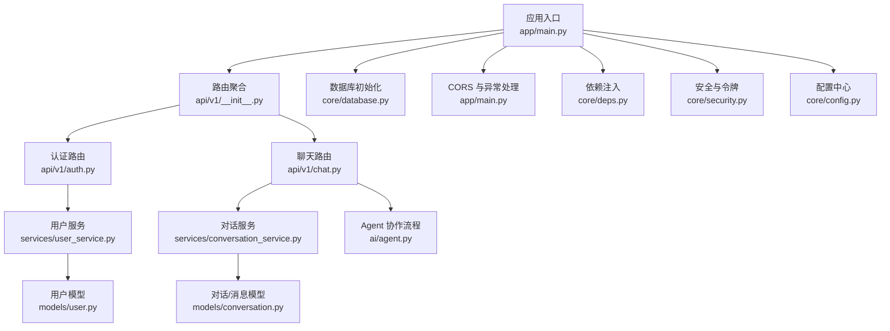
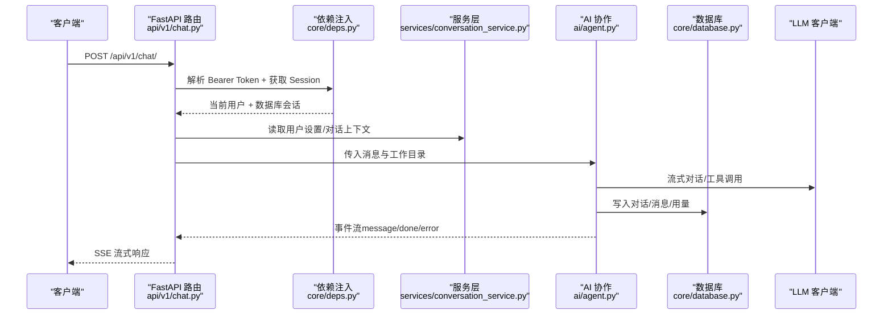
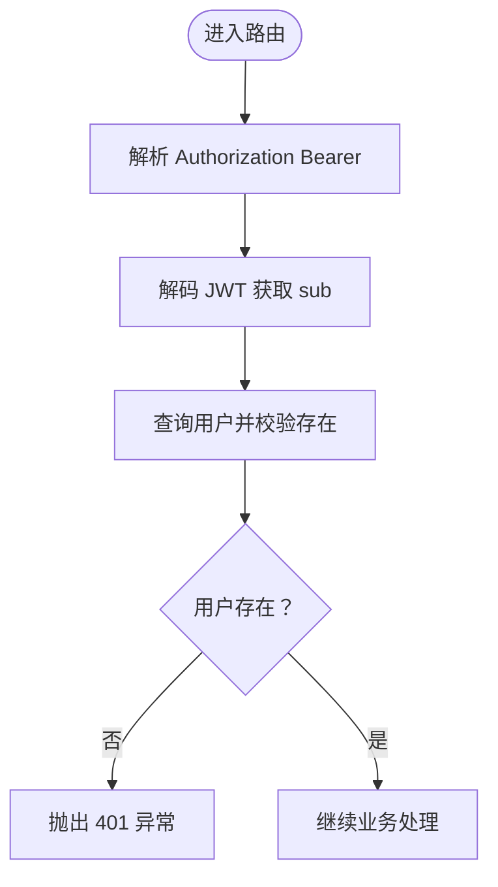
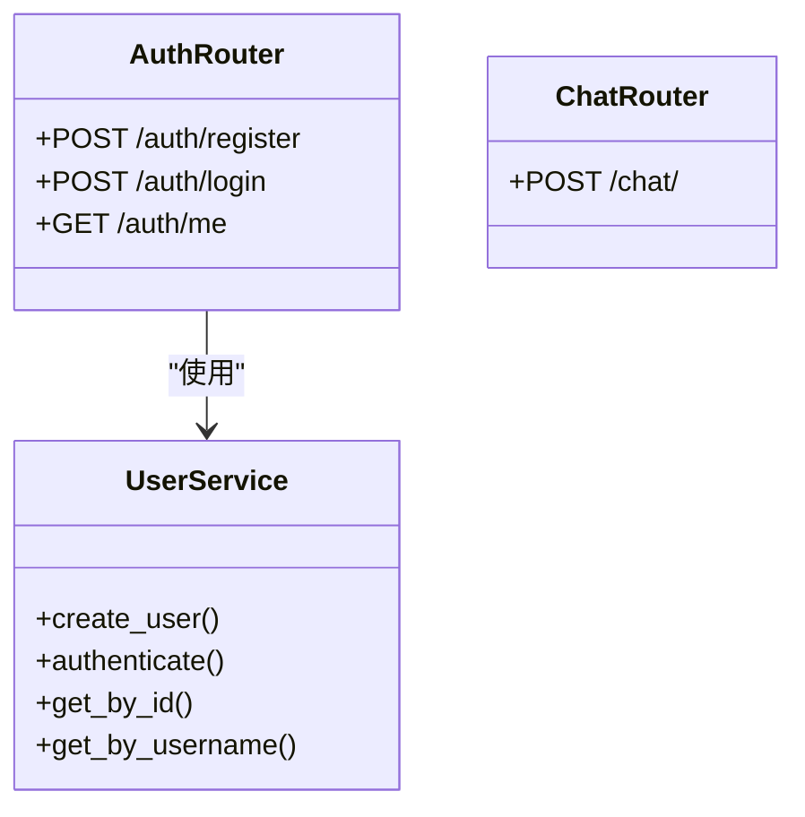
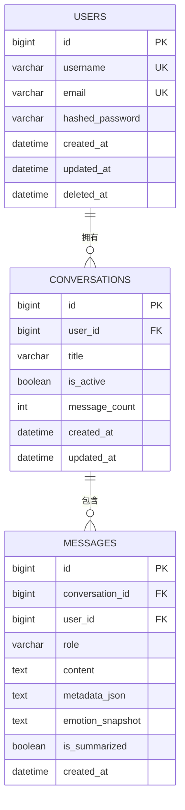
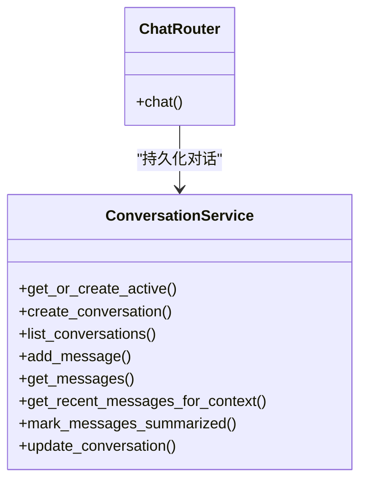
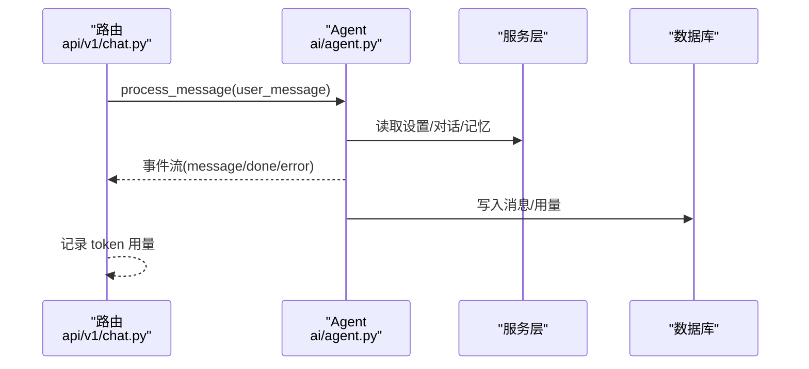
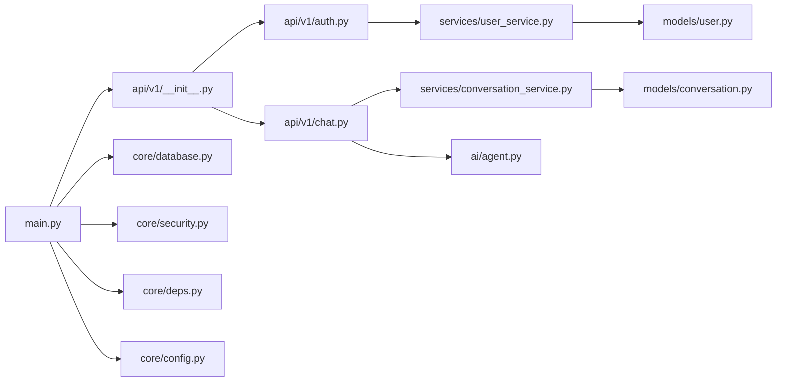

# 后端开发指南

<cite>
**本文引用的文件**
- [backend/app/main.py](file://backend/app/main.py)
- [backend/app/core/config.py](file://backend/app/core/config.py)
- [backend/app/core/database.py](file://backend/app/core/database.py)
- [backend/app/core/deps.py](file://backend/app/core/deps.py)
- [backend/app/core/security.py](file://backend/app/core/security.py)
- [backend/app/core/exceptions.py](file://backend/app/core/exceptions.py)
- [backend/app/api/v1/__init__.py](file://backend/app/api/v1/__init__.py)
- [backend/app/api/v1/auth.py](file://backend/app/api/v1/auth.py)
- [backend/app/api/v1/chat.py](file://backend/app/api/v1/chat.py)
- [backend/app/schemas/user.py](file://backend/app/schemas/user.py)
- [backend/app/models/user.py](file://backend/app/models/user.py)
- [backend/app/models/conversation.py](file://backend/app/models/conversation.py)
- [backend/app/services/user_service.py](file://backend/app/services/user_service.py)
- [backend/app/services/conversation_service.py](file://backend/app/services/conversation_service.py)
- [backend/app/ai/agent.py](file://backend/app/ai/agent.py)
</cite>

## 目录
1. [简介](#简介)
2. [项目结构](#项目结构)
3. [核心组件](#核心组件)
4. [架构总览](#架构总览)
5. [组件详解](#组件详解)
6. [依赖关系分析](#依赖关系分析)
7. [性能考量](#性能考量)
8. [故障排查指南](#故障排查指南)
9. [结论](#结论)
10. [附录](#附录)

## 简介
本指南面向不同经验水平的开发者，系统梳理 XuanJi 后端的开发要点，覆盖 FastAPI 应用入口与生命周期管理、路由组织与依赖注入、数据模型与 SQLAlchemy ORM 映射、数据库连接池与自动迁移、服务层架构与业务封装、AI 协作流程与流式输出、API 接口设计规范、错误处理与日志记录、单元测试与性能优化、安全防护等主题。文档以“从上到下”的方式逐步展开，既提供高层架构视图，也给出代码级细节与可视化图表。

## 项目结构
后端采用分层清晰的组织方式：
- 应用入口与中间件：FastAPI 应用、CORS、健康检查、全局异常处理器、生命周期钩子
- 配置与数据库：统一配置类、数据库引擎与会话工厂、初始化与自动迁移
- 路由与依赖：API v1 路由聚合、认证与权限依赖
- 数据模型与服务：用户、对话与消息、各类业务服务
- AI 协作与工具：Agent 主控制器、多角色协同、工具生成与执行
- 前端对接：统一返回结构 code/message/data，便于前端消费

图表来源
- [backend/app/main.py:1-79](file://backend/app/main.py#L1-L79)
- [backend/app/api/v1/__init__.py:1-23](file://backend/app/api/v1/__init__.py#L1-L23)
- [backend/app/core/database.py:1-65](file://backend/app/core/database.py#L1-L65)
- [backend/app/core/deps.py:1-42](file://backend/app/core/deps.py#L1-L42)
- [backend/app/core/security.py:1-38](file://backend/app/core/security.py#L1-L38)
- [backend/app/core/config.py:1-68](file://backend/app/core/config.py#L1-L68)
- [backend/app/api/v1/auth.py:1-61](file://backend/app/api/v1/auth.py#L1-L61)
- [backend/app/api/v1/chat.py:1-106](file://backend/app/api/v1/chat.py#L1-L106)
- [backend/app/services/user_service.py:1-46](file://backend/app/services/user_service.py#L1-L46)
- [backend/app/services/conversation_service.py:1-141](file://backend/app/services/conversation_service.py#L1-L141)
- [backend/app/ai/agent.py:1-800](file://backend/app/ai/agent.py#L1-L800)
- [backend/app/models/user.py:1-23](file://backend/app/models/user.py#L1-L23)
- [backend/app/models/conversation.py:1-41](file://backend/app/models/conversation.py#L1-L41)

章节来源
- [backend/app/main.py:1-79](file://backend/app/main.py#L1-L79)
- [backend/app/core/config.py:1-68](file://backend/app/core/config.py#L1-L68)
- [backend/app/core/database.py:1-65](file://backend/app/core/database.py#L1-L65)
- [backend/app/api/v1/__init__.py:1-23](file://backend/app/api/v1/__init__.py#L1-L23)

## 核心组件
- 应用入口与生命周期：通过 lifespan 管理数据库初始化与后台调度器启停；注册 CORS 中间件与统一健康检查端点；自定义请求参数校验异常处理器，统一返回 code/message/data 结构。
- 配置中心：集中管理数据库、AI 提供商、密钥、跨域等配置，并提供数据库 URL 与无库 URL 的便捷属性。
- 数据库与 ORM：使用 SQLAlchemy 2.x DeclarativeBase，创建引擎与会话工厂；提供 get_db 依赖；初始化时自动创建库与表并进行列级自动迁移。
- 依赖注入：HTTP Bearer 令牌解析与用户鉴权依赖，结合数据库会话依赖，形成标准的权限控制链路。
- 安全与令牌：基于 HS256 的 JWT 生成与解码，密码使用 bcrypt 哈希与校验。
- 路由与服务：API v1 路由聚合，按领域拆分；服务层封装业务逻辑，避免路由直接操作数据库。
- AI 协作：Agent 统一编排"晴/焕/遥/玄"角色完成对话流程，机在后台独立运行系统迭代任务，支持流式输出与记忆增强。

章节来源
- [backend/app/main.py:15-64](file://backend/app/main.py#L15-L64)
- [backend/app/core/config.py:4-64](file://backend/app/core/config.py#L4-L64)
- [backend/app/core/database.py:6-38](file://backend/app/core/database.py#L6-L38)
- [backend/app/core/deps.py:12-42](file://backend/app/core/deps.py#L12-L42)
- [backend/app/core/security.py:12-38](file://backend/app/core/security.py#L12-L38)
- [backend/app/api/v1/__init__.py:13-22](file://backend/app/api/v1/__init__.py#L13-L22)

## 架构总览
下图展示从客户端到服务层、数据库与 AI 协作的整体调用链路。

图表来源
- [backend/app/api/v1/chat.py:40-106](file://backend/app/api/v1/chat.py#L40-L106)
- [backend/app/core/deps.py:12-42](file://backend/app/core/deps.py#L12-L42)
- [backend/app/services/conversation_service.py:13-141](file://backend/app/services/conversation_service.py#L13-L141)
- [backend/app/ai/agent.py:78-274](file://backend/app/ai/agent.py#L78-L274)
- [backend/app/core/database.py:14-19](file://backend/app/core/database.py#L14-L19)

## 组件详解

### FastAPI 应用与生命周期
- 生命周期：在 lifespan 中完成数据库初始化与两个调度器的启动/停止，确保应用启动时数据库可用、关闭时资源释放。
- 中间件：启用 CORS，允许凭证、任意方法与头。
- 路由：include_router(api_v1_router, prefix="/api/v1")，统一前缀。
- 异常：将 Pydantic 验证错误转为中文提示，统一返回 code/message/data。
- 健康检查：GET /health 返回健康状态。

章节来源
- [backend/app/main.py:15-64](file://backend/app/main.py#L15-L64)

### 配置中心与数据库
- 配置项：数据库连接、AI 提供商（本地 Ollama 与在线 LLM）、密钥、跨域、沙箱目录与超时。
- 数据库 URL：提供带库名与不带库名两种形式，便于初始化数据库与创建表。
- 初始化：先创建数据库（utf8mb4 字符集），再创建所有表；最后自动检测缺失列并执行 ALTER 添加。

章节来源
- [backend/app/core/config.py:4-64](file://backend/app/core/config.py#L4-L64)
- [backend/app/core/database.py:22-65](file://backend/app/core/database.py#L22-L65)

### 依赖注入与安全
- 依赖注入：HTTPBearer 解析令牌，解码后从数据库查询用户，校验存在且未删除。
- 密码安全：bcrypt 哈希与校验；JWT 使用 HS256，7 天过期。
- 统一返回：所有路由返回统一结构 code/message/data，便于前端处理。

图表来源
- [backend/app/core/deps.py:12-42](file://backend/app/core/deps.py#L12-L42)
- [backend/app/core/security.py:24-38](file://backend/app/core/security.py#L24-L38)

章节来源
- [backend/app/core/deps.py:12-42](file://backend/app/core/deps.py#L12-L42)
- [backend/app/core/security.py:12-38](file://backend/app/core/security.py#L12-L38)

### 路由设计与服务层
- 路由聚合：API v1 将 auth/chat/conversations/tasks/tools/files/stats/settings/logs 等路由聚合，便于扩展。
- 认证路由：注册/登录/当前用户信息，使用 UserService 与 Security 工具。
- 聊天路由：支持流式与非流式两种模式，记录 token 用量，返回统一结构。

图表来源
- [backend/app/api/v1/auth.py:14-61](file://backend/app/api/v1/auth.py#L14-L61)
- [backend/app/services/user_service.py:8-46](file://backend/app/services/user_service.py#L8-L46)

章节来源
- [backend/app/api/v1/__init__.py:13-22](file://backend/app/api/v1/__init__.py#L13-L22)
- [backend/app/api/v1/auth.py:14-61](file://backend/app/api/v1/auth.py#L14-L61)
- [backend/app/services/user_service.py:8-46](file://backend/app/services/user_service.py#L8-L46)

### 数据模型与 ORM 映射
- 用户模型：id、username、email、hashed_password、软删除字段 deleted_at。
- 对话与消息：Conversation 与 Message，外键关联用户，Cascade 删除，索引优化查询。
- 映射：基于 DeclarativeBase，使用 mapped_column 定义字段类型与约束。

图表来源
- [backend/app/models/user.py:9-23](file://backend/app/models/user.py#L9-L23)
- [backend/app/models/conversation.py:9-41](file://backend/app/models/conversation.py#L9-L41)

章节来源
- [backend/app/models/user.py:9-23](file://backend/app/models/user.py#L9-L23)
- [backend/app/models/conversation.py:9-41](file://backend/app/models/conversation.py#L9-L41)

### 服务层架构与业务封装
- 用户服务：封装用户创建、认证、查询等逻辑，统一使用 bcrypt 与数据库 ORM。
- 对话服务：围绕 Conversation 与 Message 提供增删改查、分页、上下文检索、消息标记等能力。
- 聊天路由：调用 SettingService/TokenService 与 Agent，记录 token 用量，支持 SSE 流式输出。

图表来源
- [backend/app/services/conversation_service.py:9-141](file://backend/app/services/conversation_service.py#L9-L141)
- [backend/app/api/v1/chat.py:40-106](file://backend/app/api/v1/chat.py#L40-L106)

章节来源
- [backend/app/services/conversation_service.py:9-141](file://backend/app/services/conversation_service.py#L9-L141)
- [backend/app/api/v1/chat.py:40-106](file://backend/app/api/v1/chat.py#L40-L106)

### AI 协作流程与流式输出
- Agent 编排：统一处理意图识别、情绪分析与记忆增强。机在后台独立运行系统迭代任务。
- 流式输出：SSE 事件类型包括 message、done、error、metadata、tool_* 等，前端逐段渲染。
- 用量统计：通过回调收集各角色 token 使用，最终汇总入库。
- 异常与降级：LLM 失败时提供降级回复，保证用户体验。

图表来源
- [backend/app/api/v1/chat.py:40-106](file://backend/app/api/v1/chat.py#L40-L106)
- [backend/app/ai/agent.py:78-274](file://backend/app/ai/agent.py#L78-L274)

章节来源
- [backend/app/api/v1/chat.py:40-106](file://backend/app/api/v1/chat.py#L40-L106)
- [backend/app/ai/agent.py:78-274](file://backend/app/ai/agent.py#L78-L274)

### API 接口设计规范
- 统一返回结构：code（状态码）、message（提示）、data（数据）
- 认证：Bearer Token，401 未授权时明确提示
- 参数校验：Pydantic 校验失败统一转为中文错误信息
- 路由命名：按领域划分（auth/chat/conversations等），前缀 /api/v1
- 流式接口：SSE 事件类型约定，前端按类型渲染

章节来源
- [backend/app/api/v1/auth.py:14-61](file://backend/app/api/v1/auth.py#L14-L61)
- [backend/app/api/v1/chat.py:40-106](file://backend/app/api/v1/chat.py#L40-L106)
- [backend/app/main.py:43-59](file://backend/app/main.py#L43-L59)

### 错误处理机制
- 请求参数校验：将 Pydantic 错误消息转为中文，拼接后返回
- 业务异常：LLMConfigError 自定义异常，携带角色名与缺失字段
- 日志记录：聊天路由与 Agent 中广泛使用 logger，便于定位问题

章节来源
- [backend/app/main.py:43-59](file://backend/app/main.py#L43-L59)
- [backend/app/core/exceptions.py:1-20](file://backend/app/core/exceptions.py#L1-L20)
- [backend/app/api/v1/chat.py:78-85](file://backend/app/api/v1/chat.py#L78-L85)
- [backend/app/ai/agent.py:192-194](file://backend/app/ai/agent.py#L192-L194)

### 日志记录最佳实践
- 使用标准 logging 模块，按模块/函数命名 logger
- 关键路径（LLM 调用、工具执行、异常）记录 info/warn/error
- SSE 流中断与异常捕获，保证前端可观测性

章节来源
- [backend/app/api/v1/chat.py:7-8](file://backend/app/api/v1/chat.py#L7-L8)
- [backend/app/api/v1/chat.py:78-85](file://backend/app/api/v1/chat.py#L78-L85)
- [backend/app/ai/agent.py:280-298](file://backend/app/ai/agent.py#L280-L298)

### 单元测试编写指南
- 路由层：使用 TestClient 或模拟请求，验证返回结构与状态码
- 服务层：构造最小依赖（Session Mock），断言数据库操作与业务逻辑
- 安全层：验证 JWT 生成/解码、密码哈希/校验、401 场景
- AI 协作：Mock LLM 客户端与工具执行，验证事件流与用量统计
- 数据库：使用独立测试库或内存数据库，确保隔离性

[本节为通用指导，无需具体文件引用]

### 性能优化技巧
- 数据库：合理索引（外键、时间字段）、批量写入、连接池参数调优
- ORM：避免 N+1 查询，使用 select joined/eager 加载策略
- 流式输出：SSE 分片传输，及时断开连接清理
- AI 调用：并发限制与超时控制，缓存热点提示与中间结果
- 缓存策略：短期热点数据（近期消息、用户设置）可引入进程内缓存或 Redis

[本节为通用指导，无需具体文件引用]

### 安全防护措施
- 密码安全：bcrypt 哈希存储，禁止明文或弱加密
- 令牌安全：HS256 算法，短生命周期，生产环境更换密钥
- 输入校验：Pydantic 校验 + 自定义字段校验器
- 跨域：严格控制 origins/methods/headers
- 文件与工具：沙箱执行、超时与资源限制

章节来源
- [backend/app/core/security.py:12-38](file://backend/app/core/security.py#L12-L38)
- [backend/app/schemas/user.py:11-37](file://backend/app/schemas/user.py#L11-L37)
- [backend/app/main.py:32-38](file://backend/app/main.py#L32-L38)

## 依赖关系分析
- 组件耦合：路由依赖服务层，服务层依赖模型与数据库；Agent 作为编排者依赖多个服务。
- 外部依赖：FastAPI、SQLAlchemy、Pydantic、bcrypt、jose（JWT）、uvicorn（开发服务器）
- 循环依赖：当前结构未见循环导入，保持清晰的单向依赖

图表来源
- [backend/app/main.py:10-40](file://backend/app/main.py#L10-L40)
- [backend/app/api/v1/__init__.py:3-22](file://backend/app/api/v1/__init__.py#L3-L22)
- [backend/app/api/v1/auth.py:8-9](file://backend/app/api/v1/auth.py#L8-L9)
- [backend/app/api/v1/chat.py:16-17](file://backend/app/api/v1/chat.py#L16-L17)
- [backend/app/services/user_service.py:3-5](file://backend/app/services/user_service.py#L3-L5)
- [backend/app/services/conversation_service.py:3-6](file://backend/app/services/conversation_service.py#L3-L6)
- [backend/app/models/user.py:6](file://backend/app/models/user.py#L6)
- [backend/app/models/conversation.py:6](file://backend/app/models/conversation.py#L6)
- [backend/app/core/database.py:4](file://backend/app/core/database.py#L4)
- [backend/app/core/security.py:6](file://backend/app/core/security.py#L6)
- [backend/app/core/deps.py:5-7](file://backend/app/core/deps.py#L5-L7)
- [backend/app/core/config.py:1](file://backend/app/core/config.py#L1)

章节来源
- [backend/app/main.py:10-40](file://backend/app/main.py#L10-L40)
- [backend/app/api/v1/__init__.py:3-22](file://backend/app/api/v1/__init__.py#L3-L22)

## 性能考量
- 数据库连接池：默认参数满足中小规模场景；高并发时可调整 pool_size、max_overflow、pool_recycle
- ORM 查询：优先使用索引字段过滤，避免一次性加载大列表；必要时分页
- AI 调用：限制并发与超时，避免阻塞主线程；对热点提示做缓存
- 流式输出：及时断开与异常处理，避免资源泄漏

[本节为通用指导，无需具体文件引用]

## 故障排查指南
- 登录/注册失败：检查用户名/密码校验规则与数据库用户是否存在
- 401 未授权：确认 Bearer Token 是否正确、是否过期、用户是否被软删除
- SSE 断流：查看聊天路由中的异常捕获与日志，确认 is_disconnected 判断
- LLM 配置缺失：捕获 LLMConfigError，引导用户完善设置
- 数据库初始化失败：检查数据库 URL、权限与网络连通性

章节来源
- [backend/app/api/v1/auth.py:14-61](file://backend/app/api/v1/auth.py#L14-L61)
- [backend/app/core/deps.py:12-42](file://backend/app/core/deps.py#L12-L42)
- [backend/app/api/v1/chat.py:78-85](file://backend/app/api/v1/chat.py#L78-L85)
- [backend/app/core/exceptions.py:1-20](file://backend/app/core/exceptions.py#L1-L20)
- [backend/app/core/database.py:22-38](file://backend/app/core/database.py#L22-L38)

## 结论
本指南从应用入口、配置与数据库、路由与依赖、服务与模型、AI 协作到接口规范、错误处理与安全等方面，系统呈现了 XuanJi 后端的实现要点。建议在开发中遵循统一的返回结构、严格的输入校验与安全策略，结合服务层封装业务逻辑，利用 SSE 提升用户体验，并通过日志与异常机制保障可观测性与稳定性。

## 附录
- 开发环境：Python + FastAPI + SQLAlchemy + MySQL
- 运行方式：uvicorn 运行 main.py，开发模式启用热更新
- 前后端联调：统一 code/message/data 返回结构，SSE 事件类型约定

章节来源
- [backend/app/main.py:67-79](file://backend/app/main.py#L67-L79)