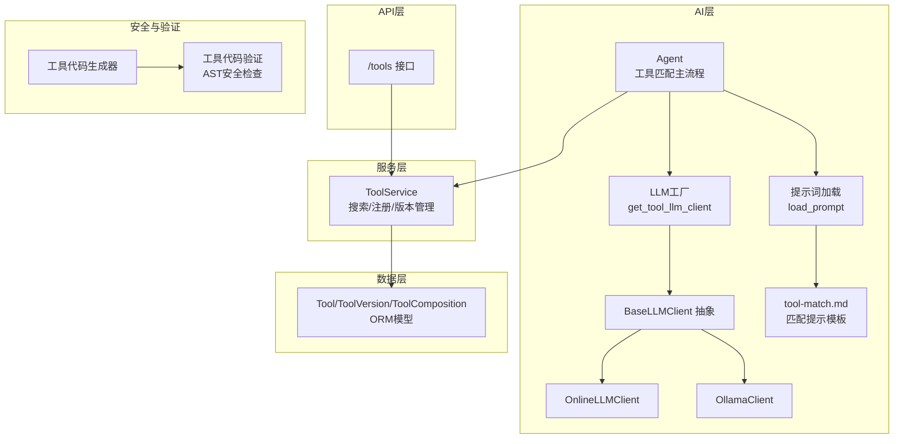
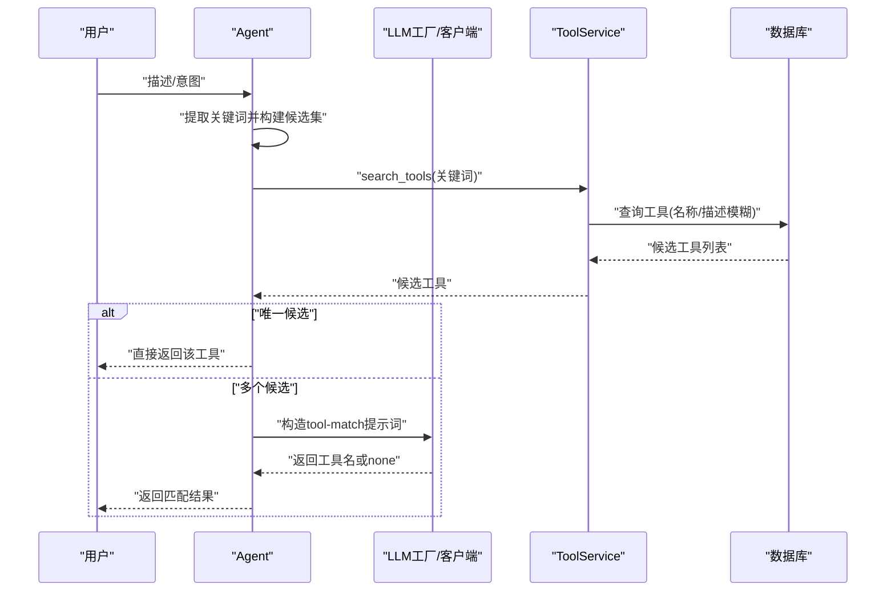
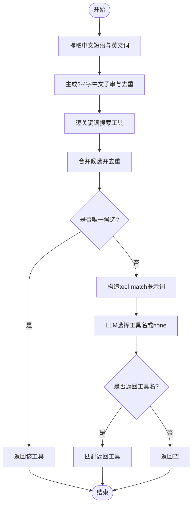
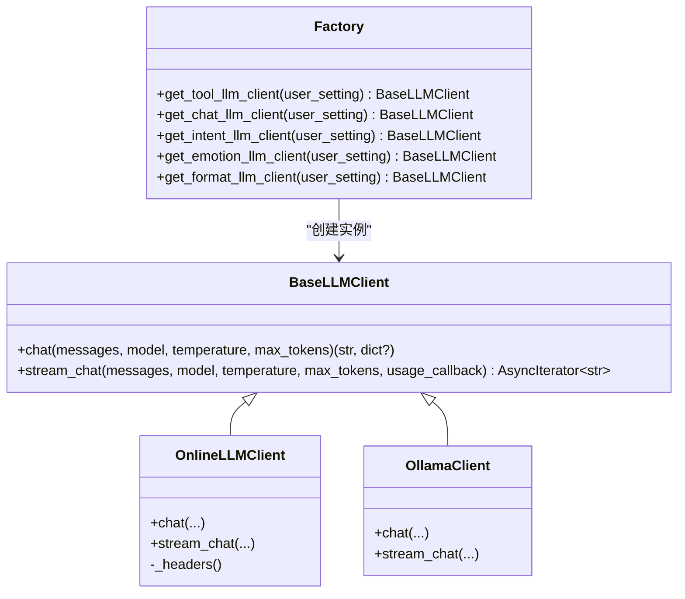
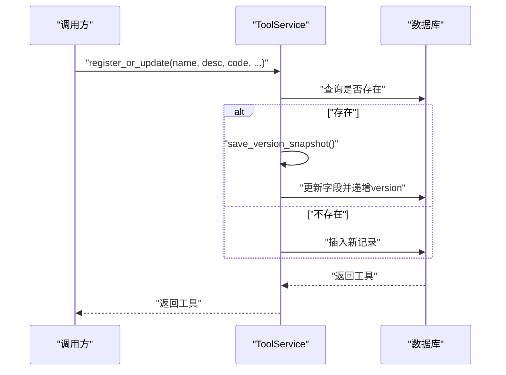
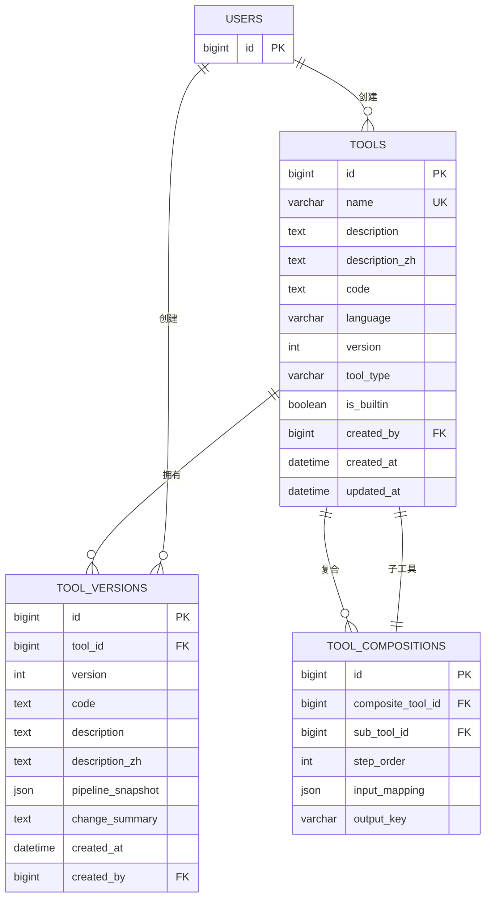
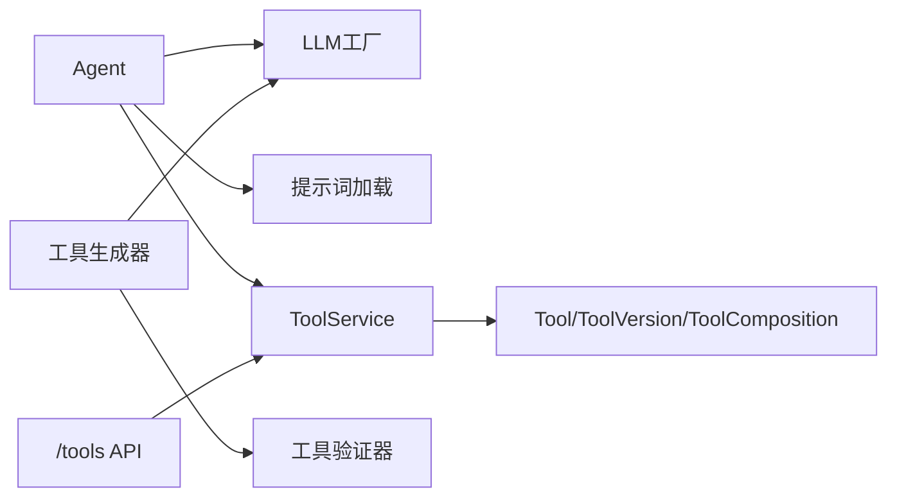

# 工具匹配算法

> **重要说明：** 工具执行功能已停用，所有用户消息强制走 chat 路径。代码保留但不再触达，以下内容仅供历史参考。

<cite>
**本文引用的文件**
- [backend/app/ai/agent.py](file://backend/app/ai/agent.py)
- [backend/app/ai/base.py](file://backend/app/ai/base.py)
- [backend/app/ai/factory.py](file://backend/app/ai/factory.py)
- [backend/app/ai/online.py](file://backend/app/ai/online.py)
- [backend/app/ai/ollama.py](file://backend/app/ai/ollama.py)
- [backend/app/ai/skills/xuanji-ji/tool-match.md](file://backend/app/ai/skills/xuanji-ji/tool-match.md)
- [backend/app/services/tool_service.py](file://backend/app/services/tool_service.py)
- [backend/app/models/tool.py](file://backend/app/models/tool.py)
- [backend/app/schemas/tool.py](file://backend/app/schemas/tool.py)
- [backend/app/api/v1/tools.py](file://backend/app/api/v1/tools.py)
- [backend/app/sandbox/validator.py](file://backend/app/sandbox/validator.py)
- [backend/app/ai/tool_generator.py](file://backend/app/ai/tool_generator.py)
- [backend/app/core/migrate_composite.py](file://backend/app/core/migrate_composite.py)
</cite>

## 目录
1. [简介](#简介)
2. [项目结构](#项目结构)
3. [核心组件](#核心组件)
4. [架构总览](#架构总览)
5. [详细组件分析](#详细组件分析)
6. [依赖分析](#依赖分析)
7. [性能考量](#性能考量)
8. [故障排查指南](#故障排查指南)
9. [结论](#结论)
10. [附录](#附录)

## 简介
本文件面向“工具匹配算法”的技术文档，聚焦于璇玑系统中工具检索与匹配的完整流程：从用户意图到工具选择，覆盖关键词提取、候选集生成、LLM辅助排序、最终工具选择与执行。文档同时阐述工具描述向量化与语义搜索的可扩展路径、版本管理与兼容性策略、依赖关系处理、匹配精度与召回率优化、性能基准与调优建议，并给出实际应用场景示例。

## 项目结构
围绕工具匹配算法的相关模块分布如下：
- AI层：意图与工具选择的LLM客户端抽象、在线与Ollama实现、工具生成器、提示词加载与分段
- 服务层：工具服务封装数据库操作、版本快照与回滚
- 数据模型：工具、组合工具、版本记录的ORM定义
- API层：工具列表、搜索、导入导出、版本查询与回滚接口
- 安全与验证：工具代码安全校验与AST限制
- 迁移脚本：复合工具与版本化能力的数据库迁移

图表来源
- [backend/app/ai/agent.py:1821-1877](file://backend/app/ai/agent.py#L1821-L1877)
- [backend/app/ai/base.py:8-36](file://backend/app/ai/base.py#L8-L36)
- [backend/app/ai/online.py:10-58](file://backend/app/ai/online.py#L10-L58)
- [backend/app/ai/ollama.py:10-48](file://backend/app/ai/ollama.py#L10-L48)
- [backend/app/ai/factory.py:75-94](file://backend/app/ai/factory.py#L75-L94)
- [backend/app/ai/base.py:41-54](file://backend/app/ai/base.py#L41-L54)
- [backend/app/ai/skills/xuanji-ji/tool-match.md:1-8](file://backend/app/ai/skills/xuanji-ji/tool-match.md#L1-L8)
- [backend/app/services/tool_service.py:30-40](file://backend/app/services/tool_service.py#L30-L40)
- [backend/app/models/tool.py:9-63](file://backend/app/models/tool.py#L9-L63)
- [backend/app/api/v1/tools.py:25-66](file://backend/app/api/v1/tools.py#L25-L66)
- [backend/app/sandbox/validator.py:33-94](file://backend/app/sandbox/validator.py#L33-L94)
- [backend/app/ai/tool_generator.py:10-67](file://backend/app/ai/tool_generator.py#L10-L67)

章节来源
- [backend/app/ai/agent.py:1821-1877](file://backend/app/ai/agent.py#L1821-L1877)
- [backend/app/ai/base.py:8-36](file://backend/app/ai/base.py#L8-L36)
- [backend/app/ai/factory.py:75-94](file://backend/app/ai/factory.py#L75-L94)
- [backend/app/ai/online.py:10-58](file://backend/app/ai/online.py#L10-L58)
- [backend/app/ai/ollama.py:10-48](file://backend/app/ai/ollama.py#L10-L48)
- [backend/app/ai/base.py:41-54](file://backend/app/ai/base.py#L41-L54)
- [backend/app/ai/skills/xuanji-ji/tool-match.md:1-8](file://backend/app/ai/skills/xuanji-ji/tool-match.md#L1-L8)
- [backend/app/services/tool_service.py:30-40](file://backend/app/services/tool_service.py#L30-L40)
- [backend/app/models/tool.py:9-63](file://backend/app/models/tool.py#L9-L63)
- [backend/app/api/v1/tools.py:25-66](file://backend/app/api/v1/tools.py#L25-L66)
- [backend/app/sandbox/validator.py:33-94](file://backend/app/sandbox/validator.py#L33-L94)
- [backend/app/ai/tool_generator.py:10-67](file://backend/app/ai/tool_generator.py#L10-L67)

## 核心组件
- 工具匹配主流程（Agent）
  - 关键步骤：中文分词与英文词提取、多粒度关键词生成、候选集构建与去重、单候选直接返回、多候选交由LLM进行二选一或返回none
  - 温度控制与提示词：LLM温度较低以提升确定性；提示词模板严格限定输出格式
- LLM客户端抽象与工厂
  - 统一接口：同步与流式聊天；在线与本地Ollama两种实现；工厂按角色选择不同配置
- 工具服务与版本管理
  - 搜索：基于名称/描述的模糊匹配；版本快照与回滚；导入导出与原子更新
- 数据模型与迁移
  - 工具、组合工具、版本三张表；迁移脚本确保新增列与外键约束
- 工具生成与安全校验
  - 生成器：提示词驱动、META注释抽取、代码清理与函数名提取；验证器：AST语法、导入白黑名单、内置函数限制、路径穿越检测

章节来源
- [backend/app/ai/agent.py:1821-1877](file://backend/app/ai/agent.py#L1821-L1877)
- [backend/app/ai/base.py:8-36](file://backend/app/ai/base.py#L8-L36)
- [backend/app/ai/factory.py:75-94](file://backend/app/ai/factory.py#L75-L94)
- [backend/app/services/tool_service.py:30-40](file://backend/app/services/tool_service.py#L30-L40)
- [backend/app/models/tool.py:9-63](file://backend/app/models/tool.py#L9-L63)
- [backend/app/core/migrate_composite.py:33-123](file://backend/app/core/migrate_composite.py#L33-L123)
- [backend/app/sandbox/validator.py:33-94](file://backend/app/sandbox/validator.py#L33-L94)
- [backend/app/ai/tool_generator.py:10-67](file://backend/app/ai/tool_generator.py#L10-L67)

## 架构总览
工具匹配算法在系统中的位置与交互如下：

图表来源
- [backend/app/ai/agent.py:1821-1877](file://backend/app/ai/agent.py#L1821-L1877)
- [backend/app/ai/factory.py:75-94](file://backend/app/ai/factory.py#L75-L94)
- [backend/app/services/tool_service.py:30-40](file://backend/app/services/tool_service.py#L30-L40)

## 详细组件分析

### 工具匹配主流程（Agent）
- 关键点
  - 中文短语与英文单词提取，中文子串长度2~4，形成关键词集合
  - 对每个关键词执行搜索并合并候选，去重后形成唯一候选集
  - 单候选直接返回；多候选通过LLM进行二选一或返回none
  - LLM温度极低，提示词模板严格限定输出仅允许工具名或none
- 输出与错误处理
  - 若LLM异常或返回none，则回退到首个候选或空结果

图表来源
- [backend/app/ai/agent.py:1821-1877](file://backend/app/ai/agent.py#L1821-L1877)
- [backend/app/ai/skills/xuanji-ji/tool-match.md:1-8](file://backend/app/ai/skills/xuanji-ji/tool-match.md#L1-L8)

章节来源
- [backend/app/ai/agent.py:1821-1877](file://backend/app/ai/agent.py#L1821-L1877)
- [backend/app/ai/skills/xuanji-ji/tool-match.md:1-8](file://backend/app/ai/skills/xuanji-ji/tool-match.md#L1-L8)

### LLM客户端与工厂
- 抽象接口统一聊天与流式接口，支持usage回调
- 在线客户端：OpenAI风格API，支持流式与usage回传
- Ollama客户端：本地推理，支持流式与usage回传
- 工厂：按角色（对话/工具/意图/情绪/格式）选择provider与参数

图表来源
- [backend/app/ai/base.py:8-36](file://backend/app/ai/base.py#L8-L36)
- [backend/app/ai/online.py:10-58](file://backend/app/ai/online.py#L10-L58)
- [backend/app/ai/ollama.py:10-48](file://backend/app/ai/ollama.py#L10-L48)
- [backend/app/ai/factory.py:75-94](file://backend/app/ai/factory.py#L75-L94)

章节来源
- [backend/app/ai/base.py:8-36](file://backend/app/ai/base.py#L8-L36)
- [backend/app/ai/online.py:10-58](file://backend/app/ai/online.py#L10-L58)
- [backend/app/ai/ollama.py:10-48](file://backend/app/ai/ollama.py#L10-L48)
- [backend/app/ai/factory.py:75-94](file://backend/app/ai/factory.py#L75-L94)

### 工具服务与版本管理
- 搜索：基于名称/描述的模糊匹配，限制返回数量
- 注册/更新：保存版本快照，自动递增版本号
- 版本回滚：备份当前状态后恢复目标版本
- 导入导出：批量导入/导出工具，跳过内置工具

图表来源
- [backend/app/services/tool_service.py:121-156](file://backend/app/services/tool_service.py#L121-L156)
- [backend/app/services/tool_service.py:169-191](file://backend/app/services/tool_service.py#L169-L191)
- [backend/app/services/tool_service.py:193-221](file://backend/app/services/tool_service.py#L193-L221)

章节来源
- [backend/app/services/tool_service.py:30-40](file://backend/app/services/tool_service.py#L30-L40)
- [backend/app/services/tool_service.py:121-156](file://backend/app/services/tool_service.py#L121-L156)
- [backend/app/services/tool_service.py:169-191](file://backend/app/services/tool_service.py#L169-L191)
- [backend/app/services/tool_service.py:193-221](file://backend/app/services/tool_service.py#L193-L221)

### 数据模型与迁移
- 工具表：名称、描述（中/英）、代码、语言、版本、类型、内置标识、创建者、时间戳
- 组合工具表：复合工具与其子工具的步骤顺序、输入映射、输出键
- 版本表：工具版本快照、变更摘要、创建者
- 迁移脚本：新增列、创建表、插入初始版本快照、添加用户设置与token统计字段

图表来源
- [backend/app/models/tool.py:9-63](file://backend/app/models/tool.py#L9-L63)
- [backend/app/core/migrate_composite.py:33-123](file://backend/app/core/migrate_composite.py#L33-L123)

章节来源
- [backend/app/models/tool.py:9-63](file://backend/app/models/tool.py#L9-L63)
- [backend/app/core/migrate_composite.py:33-123](file://backend/app/core/migrate_composite.py#L33-L123)

### API层对接
- 列表与搜索：支持按关键词搜索工具，限制返回数量
- 导入导出：批量导入/导出工具，跳过内置工具
- 版本查询与回滚：查询历史版本并回滚到指定版本

章节来源
- [backend/app/api/v1/tools.py:25-66](file://backend/app/api/v1/tools.py#L25-L66)
- [backend/app/api/v1/tools.py:83-95](file://backend/app/api/v1/tools.py#L83-L95)
- [backend/app/api/v1/tools.py:140-169](file://backend/app/api/v1/tools.py#L140-L169)

### 工具生成与安全校验
- 生成器：提示词驱动生成Python工具代码，清理markdown围栏、提取META注释、验证函数名、安全校验
- 验证器：AST解析、导入白名单/黑名单、内置函数限制、dunder访问禁止、路径穿越检测、参数签名校验

章节来源
- [backend/app/ai/tool_generator.py:10-67](file://backend/app/ai/tool_generator.py#L10-L67)
- [backend/app/sandbox/validator.py:33-94](file://backend/app/sandbox/validator.py#L33-L94)

## 依赖分析
- Agent依赖LLM工厂与提示词加载，依赖ToolService进行候选搜索
- ToolService依赖ORM模型与数据库会话
- API层依赖ToolService与Pydantic Schema
- 工具生成器依赖LLM工厂与验证器

图表来源
- [backend/app/ai/agent.py:1821-1877](file://backend/app/ai/agent.py#L1821-L1877)
- [backend/app/ai/factory.py:75-94](file://backend/app/ai/factory.py#L75-L94)
- [backend/app/ai/base.py:41-54](file://backend/app/ai/base.py#L41-L54)
- [backend/app/services/tool_service.py:30-40](file://backend/app/services/tool_service.py#L30-L40)
- [backend/app/models/tool.py:9-63](file://backend/app/models/tool.py#L9-L63)
- [backend/app/api/v1/tools.py:25-66](file://backend/app/api/v1/tools.py#L25-L66)
- [backend/app/ai/tool_generator.py:10-67](file://backend/app/ai/tool_generator.py#L10-L67)
- [backend/app/sandbox/validator.py:33-94](file://backend/app/sandbox/validator.py#L33-L94)

## 性能考量
- 检索阶段
  - 关键词数量上限与候选去重可显著降低后续LLM负担
  - 搜索限制返回条数，避免超大候选集
- LLM阶段
  - 低温度与严格提示词减少上下文浪费与输出解析成本
  - 流式输出可用于进度反馈与早期中断
- 存储与网络
  - 本地Ollama可降低网络延迟；在线API需考虑超时与重试
- 版本与回滚
  - 版本快照与回滚避免频繁全量更新带来的风险与开销

## 故障排查指南
- LLM返回无法解析
  - 检查提示词模板是否被修改；确认输出格式严格限定
  - 使用日志记录usage并定位异常
- 工具未匹配到
  - 增加关键词数量上限或放宽最小词长；检查描述中是否包含工具名或同义词
  - 确认工具描述已正确入库且未被内置工具屏蔽
- 生成的工具代码无效
  - 检查验证器报错原因（导入模块、内置函数、路径穿越、参数签名等）
  - 适当提高生成器重试次数并结合上次错误信息修正提示词
- 版本回滚失败
  - 确认目标版本存在；检查回滚前备份是否成功

章节来源
- [backend/app/ai/agent.py:1861-1877](file://backend/app/ai/agent.py#L1861-L1877)
- [backend/app/sandbox/validator.py:33-94](file://backend/app/sandbox/validator.py#L33-L94)
- [backend/app/services/tool_service.py:193-221](file://backend/app/services/tool_service.py#L193-L221)

## 结论
本算法以“关键词检索 + LLM二选一”为核心，兼顾确定性与灵活性。通过严格的提示词约束、低温度策略与候选集去重，有效平衡了匹配精度与召回率。配合版本管理与安全校验，系统在可用性与安全性之间取得良好平衡。未来可在描述向量化与语义搜索上进一步扩展，以支持更复杂的语义匹配场景。

## 附录

### 相似度计算与权重评分机制（可扩展）
- 当前实现
  - 关键词命中与候选去重；多候选时由LLM二选一
- 可扩展方案
  - 描述向量化：使用嵌入模型对工具描述与用户意图进行向量编码
  - 相似度计算：余弦相似度或内积归一化
  - 权重评分：结合关键词匹配强度、向量相似度、工具版本、使用频率、评分等综合打分
  - 排序与阈值：Top-K候选与相似度阈值过滤

[本节为概念性扩展，不直接对应具体源码，故不附加章节来源]

### 工具版本管理策略与兼容性检查
- 策略
  - 版本快照：每次更新前保存当前版本；支持回滚到任意历史版本
  - 兼容性：组合工具的输入映射与输出键需保持前后兼容
- 实施要点
  - 回滚前自动备份；变更摘要便于审计
  - 迁移脚本确保数据库结构演进与初始快照填充

章节来源
- [backend/app/services/tool_service.py:169-191](file://backend/app/services/tool_service.py#L169-L191)
- [backend/app/services/tool_service.py:193-221](file://backend/app/services/tool_service.py#L193-L221)
- [backend/app/core/migrate_composite.py:102-123](file://backend/app/core/migrate_composite.py#L102-L123)

### 依赖关系处理
- 组合工具
  - 子工具间通过输入映射与输出键连接，保证数据流一致性
- 外键约束
  - 组合工具删除时级联删除；子工具删除受限制以保护引用完整性

章节来源
- [backend/app/models/tool.py:32-44](file://backend/app/models/tool.py#L32-L44)

### 匹配精度优化与召回率提升
- 精度优化
  - 降低LLM温度、严格提示词、增加关键词粒度与数量
  - 引入向量相似度与权重评分，提升二选一质量
- 召回率提升
  - 扩展关键词生成策略（同义词、领域词典、正则模式）
  - 调整搜索返回上限与去重策略

[本节为通用优化建议，不直接对应具体源码，故不附加章节来源]

### 性能基准测试与调优
- 基准指标
  - 响应时间（检索+LLM）、吞吐量、准确率、召回率、误报率
- 调优方向
  - 检索阶段：关键词数量上限、搜索返回限制
  - LLM阶段：温度、提示词长度、流式输出
  - 存储阶段：索引优化、连接池与超时设置

[本节为通用性能建议，不直接对应具体源码，故不附加章节来源]

### 实际应用场景示例
- 场景A：用户请求“明天天气”，系统提取“明天/天气”关键词，匹配到“查询天气”工具
- 场景B：用户请求“查看当前时间”，系统通过关键词“当前/时间”匹配到“查询当前时间”工具
- 场景C：用户请求“查看北京天气”，系统通过“北京/天气”匹配到“查询天气”工具

章节来源
- [backend/app/ai/agent.py:1821-1877](file://backend/app/ai/agent.py#L1821-L1877)