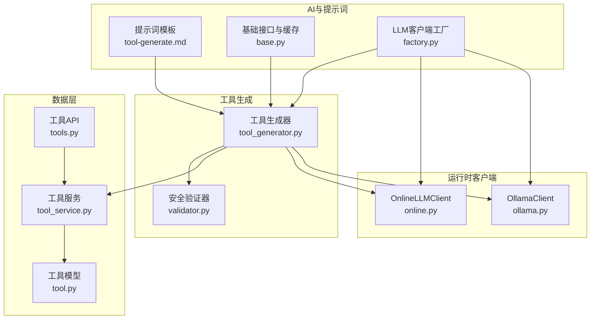
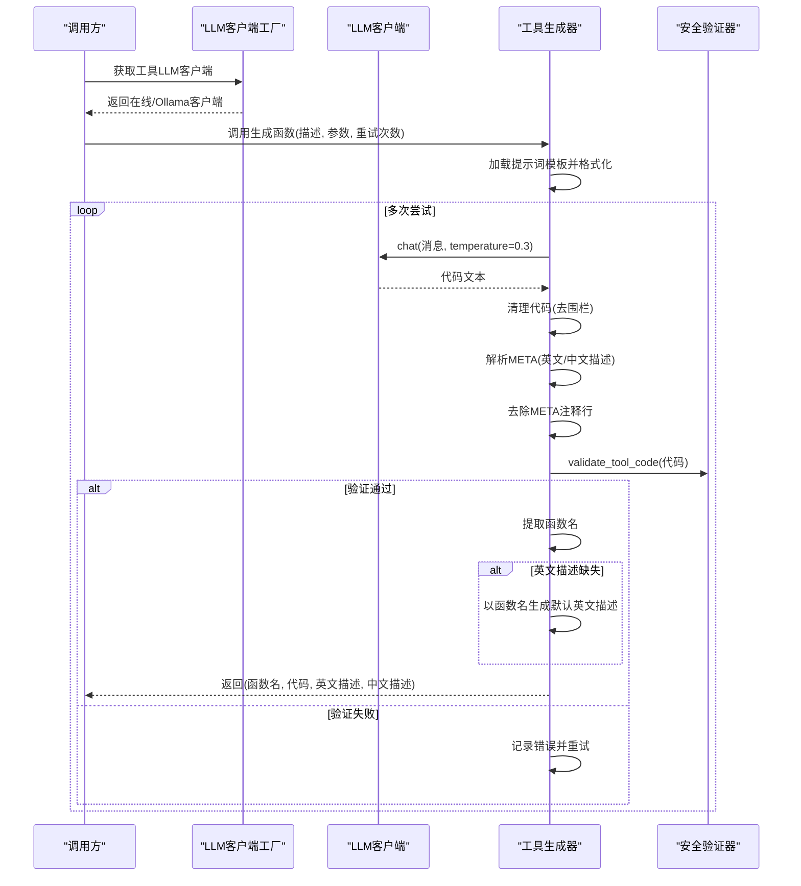
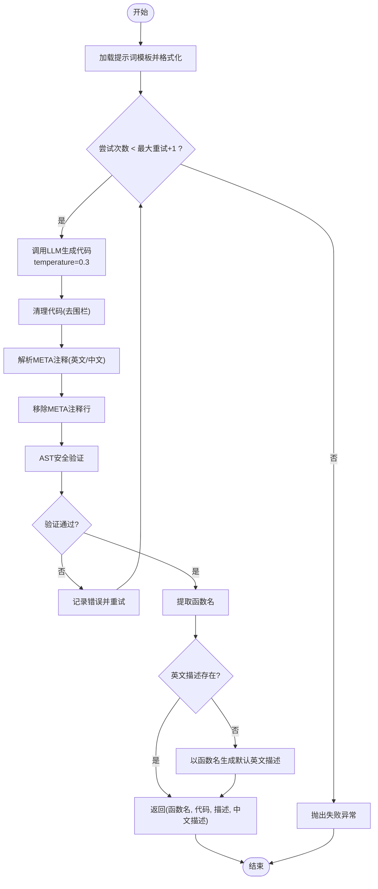
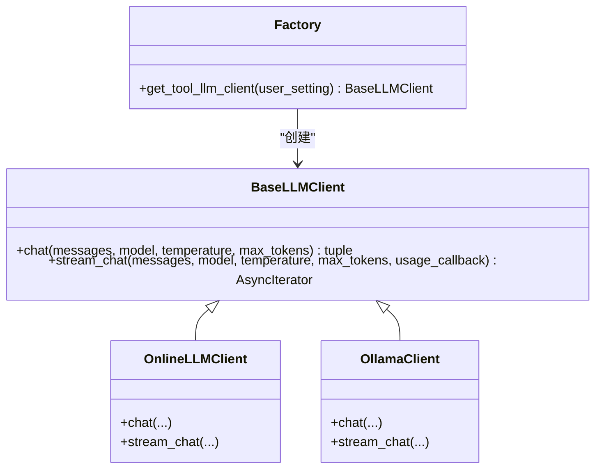
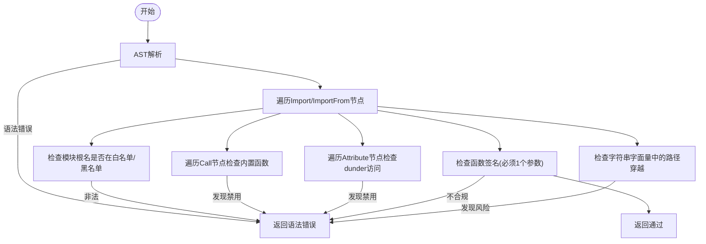
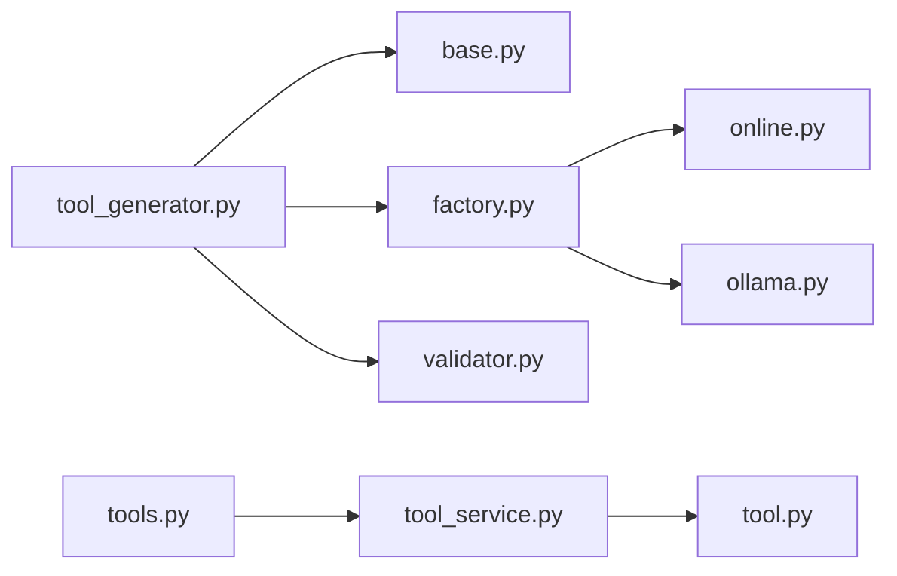

# 工具生成机制

> **重要说明：** 工具执行功能已停用，所有用户消息强制走 chat 路径。代码保留但不再触达，以下内容仅供历史参考。

<cite>
**本文档引用的文件**
- [tool_generator.py](file://backend/app/ai/tool_generator.py)
- [factory.py](file://backend/app/ai/factory.py)
- [base.py](file://backend/app/ai/base.py)
- [tool-generate.md](file://backend/app/ai/skills/xuanji-ji/tool-generate.md)
- [tool-iterate.md](file://backend/app/ai/skills/xuanji-ji/tool-iterate.md)
- [validator.py](file://backend/app/sandbox/validator.py)
- [tool.py](file://backend/app/models/tool.py)
- [tool_service.py](file://backend/app/services/tool_service.py)
- [tools.py](file://backend/app/api/v1/tools.py)
- [ollama.py](file://backend/app/ai/ollama.py)
- [online.py](file://backend/app/ai/online.py)
</cite>

## 目录
1. [引言](#引言)
2. [项目结构](#项目结构)
3. [核心组件](#核心组件)
4. [架构总览](#架构总览)
5. [详细组件分析](#详细组件分析)
6. [依赖分析](#依赖分析)
7. [性能考虑](#性能考虑)
8. [故障排除指南](#故障排除指南)
9. [结论](#结论)
10. [附录](#附录)

## 引言
本文件面向“XuanJi工具生成机制”的技术文档，聚焦于基于大语言模型（LLM）的Python工具自动生成流程。内容涵盖提示词模板设计、代码生成算法、函数名提取机制、META注释解析、代码清理处理、描述信息提取、温度参数调优、重试机制与错误处理策略、代码质量保证与语法验证、函数签名提取等实现细节，并提供最佳实践、性能优化建议与常见问题解决方案。

## 项目结构
围绕工具生成的核心代码主要分布在以下模块：
- 提示词与模板：位于技能目录下的提示词模板文件
- 工具生成器：负责调用LLM、生成代码、清理与验证
- LLM客户端工厂：按用户设置动态创建在线或本地Ollama客户端
- 安全验证器：对生成代码进行AST安全检查
- 数据模型与服务：持久化工具元数据与版本快照
- API接口：对外暴露工具的增删改查与版本回滚能力

图表来源
- [tool_generator.py:10-67](file://backend/app/ai/tool_generator.py#L10-L67)
- [factory.py:75-94](file://backend/app/ai/factory.py#L75-L94)
- [base.py:41-54](file://backend/app/ai/base.py#L41-L54)
- [validator.py:33-94](file://backend/app/sandbox/validator.py#L33-L94)
- [tool.py:9-29](file://backend/app/models/tool.py#L9-L29)
- [tool_service.py:121-156](file://backend/app/services/tool_service.py#L121-L156)
- [tools.py:19-169](file://backend/app/api/v1/tools.py#L19-L169)
- [online.py:10-57](file://backend/app/ai/online.py#L10-L57)
- [ollama.py:10-48](file://backend/app/ai/ollama.py#L10-L48)

章节来源
- [tool_generator.py:10-67](file://backend/app/ai/tool_generator.py#L10-L67)
- [factory.py:75-94](file://backend/app/ai/factory.py#L75-L94)
- [base.py:41-54](file://backend/app/ai/base.py#L41-L54)
- [validator.py:33-94](file://backend/app/sandbox/validator.py#L33-L94)
- [tool.py:9-29](file://backend/app/models/tool.py#L9-L29)
- [tool_service.py:121-156](file://backend/app/services/tool_service.py#L121-L156)
- [tools.py:19-169](file://backend/app/api/v1/tools.py#L19-L169)
- [online.py:10-57](file://backend/app/ai/online.py#L10-L57)
- [ollama.py:10-48](file://backend/app/ai/ollama.py#L10-L48)

## 核心组件
- 工具生成器：封装提示词构造、LLM调用、代码清理、META解析、函数名提取、安全验证与重试逻辑
- LLM客户端工厂：根据用户配置动态创建在线或本地LLM客户端
- 安全验证器：基于AST的静态分析，确保导入、内置函数、路径遍历、函数签名等符合安全规范
- 工具服务与模型：提供工具注册/更新、版本快照保存、导出导入、版本回滚等能力
- API接口：对外提供工具的查询、创建、更新、删除、版本查询与回滚

章节来源
- [tool_generator.py:10-67](file://backend/app/ai/tool_generator.py#L10-L67)
- [factory.py:75-94](file://backend/app/ai/factory.py#L75-L94)
- [validator.py:33-94](file://backend/app/sandbox/validator.py#L33-L94)
- [tool_service.py:121-156](file://backend/app/services/tool_service.py#L121-L156)
- [tools.py:19-169](file://backend/app/api/v1/tools.py#L19-L169)

## 架构总览
工具生成的整体流程如下：
- 通过工厂方法按用户设置选择合适的LLM客户端
- 使用提示词模板构造消息，调用LLM生成Python工具代码
- 清理Markdown代码块、解析META注释、移除META行
- 进行AST安全验证；若失败则携带上次错误重试
- 成功后提取函数名与描述，返回结果供服务层注册/更新

图表来源
- [tool_generator.py:10-67](file://backend/app/ai/tool_generator.py#L10-L67)
- [factory.py:75-94](file://backend/app/ai/factory.py#L75-L94)
- [validator.py:33-94](file://backend/app/sandbox/validator.py#L33-L94)
- [tool-generate.md:1-36](file://backend/app/ai/skills/xuanji-ji/tool-generate.md#L1-L36)

## 详细组件分析

### 工具生成器（tool_generator.py）
- 角色与职责
  - 组装提示词消息
  - 调用LLM生成代码（temperature=0.3）
  - 清理代码（去除Markdown围栏）
  - 解析META注释（英文/中文描述）
  - 移除META注释行
  - 安全验证与函数名提取
  - 重试机制与错误聚合
- 关键算法
  - 代码清理：去除首尾三引号围栏，保留中间代码
  - 函数名提取：使用AST遍历首个函数定义节点
  - META解析：逐行扫描# META: JSON注释，解析并提取description/description_zh
  - 重试循环：携带上次错误原因再次请求LLM，最多尝试N+1次
- 错误处理
  - 若无法提取函数名或验证失败，记录具体错误并重试
  - 达到最大重试次数后抛出异常

图表来源
- [tool_generator.py:10-67](file://backend/app/ai/tool_generator.py#L10-L67)
- [tool_generator.py:70-129](file://backend/app/ai/tool_generator.py#L70-L129)

章节来源
- [tool_generator.py:10-67](file://backend/app/ai/tool_generator.py#L10-L67)
- [tool_generator.py:70-129](file://backend/app/ai/tool_generator.py#L70-L129)

### 提示词模板（tool-generate.md）
- 设计要点
  - 明确工具函数签名要求（snake_case命名、单参数字典、固定返回结构）
  - 列举允许/禁止的模块与内置函数
  - 提供HTTP请求与天气/位置查询的推荐实现方式
  - 强制要求在代码后添加# META: JSON注释，包含英文与中文描述
  - 禁止使用危险模块与子进程等
- 作用
  - 为LLM提供结构化约束，减少生成代码的偏差
  - 保证生成代码满足后续解析与验证要求

章节来源
- [tool-generate.md:1-36](file://backend/app/ai/skills/xuanji-ji/tool-generate.md#L1-L36)

### LLM客户端工厂（factory.py）
- 功能
  - 根据用户设置选择provider（online/ollama），并创建对应客户端
  - 对缺失配置进行校验并抛出统一错误类型
- 客户端差异
  - OnlineLLMClient：基于HTTP API，支持流式与非流式
  - OllamaClient：基于本地Ollama服务，支持流式与非流式
- 工具生成专用客户端
  - 通过tool_llm_*前缀的配置项创建工具AI客户端

图表来源
- [base.py:8-35](file://backend/app/ai/base.py#L8-L35)
- [online.py:10-57](file://backend/app/ai/online.py#L10-L57)
- [ollama.py:10-48](file://backend/app/ai/ollama.py#L10-L48)
- [factory.py:75-94](file://backend/app/ai/factory.py#L75-L94)

章节来源
- [factory.py:75-94](file://backend/app/ai/factory.py#L75-L94)
- [online.py:10-57](file://backend/app/ai/online.py#L10-L57)
- [ollama.py:10-48](file://backend/app/ai/ollama.py#L10-L48)
- [base.py:8-35](file://backend/app/ai/base.py#L8-L35)

### 安全验证器（validator.py）
- 验证维度
  - 语法：捕获SyntaxError
  - 导入白名单/黑名单：允许有限标准库与httpx，禁止系统级模块
  - 内置函数限制：禁止eval/exec/compile等高危内置
  - 属性访问限制：禁止dunder属性访问
  - 函数签名：必须有且仅有1个参数（params: dict）
  - 路径遍历：检测字符串字面量中的路径穿越模式
- 输出
  - ValidationResult(valid, error)

图表来源
- [validator.py:33-94](file://backend/app/sandbox/validator.py#L33-L94)

章节来源
- [validator.py:33-94](file://backend/app/sandbox/validator.py#L33-L94)

### 工具服务与模型（tool_service.py, tool.py）
- 工具模型
  - 字段覆盖：名称、描述（中/英）、代码、语言、版本、类型、是否内置、创建者、时间戳
  - 版本表：记录每次变更的代码与描述快照
- 服务能力
  - 注册/更新工具：自动递增版本号，保存代码文件
  - 版本快照：保存当前状态作为历史快照
  - 回滚：将工具恢复到指定版本
  - 导入/导出：批量导入/导出工具
- 与生成器协作
  - 生成器返回的函数名、代码、描述用于注册/更新工具

章节来源
- [tool.py:9-29](file://backend/app/models/tool.py#L9-L29)
- [tool.py:47-63](file://backend/app/models/tool.py#L47-L63)
- [tool_service.py:121-156](file://backend/app/services/tool_service.py#L121-L156)
- [tool_service.py:169-191](file://backend/app/services/tool_service.py#L169-L191)
- [tool_service.py:193-222](file://backend/app/services/tool_service.py#L193-L222)

### API接口（tools.py）
- 能力范围
  - 查询、搜索、创建、更新、删除工具
  - 导出/导入工具
  - 查看版本列表与回滚到指定版本
- 与服务层交互
  - 统一返回结构（code/message/data）

章节来源
- [tools.py:19-169](file://backend/app/api/v1/tools.py#L19-L169)

## 依赖分析
- 组件耦合
  - 工具生成器依赖：提示词加载、LLM客户端工厂、安全验证器
  - 客户端工厂依赖：OnlineLLMClient/OllamaClient
  - 服务层依赖：SQLAlchemy模型与数据库会话
- 外部依赖
  - httpx：网络请求（工具执行与LLM通信）
  - ast/json/re：代码解析与JSON处理
- 循环依赖
  - 未见循环依赖迹象

图表来源
- [tool_generator.py:1-8](file://backend/app/ai/tool_generator.py#L1-L8)
- [factory.py:1-8](file://backend/app/ai/factory.py#L1-L8)
- [validator.py:1-2](file://backend/app/sandbox/validator.py#L1-L2)
- [tool_service.py:1-9](file://backend/app/services/tool_service.py#L1-L9)
- [tools.py:1-17](file://backend/app/api/v1/tools.py#L1-L17)

章节来源
- [tool_generator.py:1-8](file://backend/app/ai/tool_generator.py#L1-L8)
- [factory.py:1-8](file://backend/app/ai/factory.py#L1-L8)
- [validator.py:1-2](file://backend/app/sandbox/validator.py#L1-L2)
- [tool_service.py:1-9](file://backend/app/services/tool_service.py#L1-L9)
- [tools.py:1-17](file://backend/app/api/v1/tools.py#L1-L17)

## 性能考虑
- 温度参数调优
  - 工具生成阶段采用较低温度（如0.3），提升确定性与一致性
  - 在需要创意或扩展场景可考虑提高温度，但需配合更强的约束与验证
- 重试策略
  - 适度重试可提升成功率；建议结合指数退避与最大重试上限
- LLM调用优化
  - 合理设置max_tokens，避免过长上下文导致延迟
  - 流式输出可用于前端体验，但工具生成通常采用非流式以获得完整代码
- 验证开销
  - AST验证为O(n)复杂度，对一般工具代码足够高效
  - 可在生成器中缓存提示词模板与JSON配置（已有LRU缓存）

## 故障排除指南
- 常见错误与定位
  - 语法错误：验证器返回语法错误，检查提示词约束与LLM输出格式
  - 导入违规：确认仅使用允许模块（如httpx、标准库），避免系统级模块
  - 函数签名不符：确保函数名为snake_case且仅接受一个参数（params: dict）
  - 路径穿越：避免在字符串字面量中出现路径穿越模式
  - 未提取到函数名：检查生成代码是否包含有效函数定义
- 重试与回滚
  - 生成失败时可查看最近一次错误原因并调整提示词或参数
  - 使用版本快照与回滚功能恢复到稳定版本
- 配置问题
  - 确认工具LLM的provider、base_url、model等配置正确
  - 在线模式需提供有效的API密钥与基础URL

章节来源
- [validator.py:33-94](file://backend/app/sandbox/validator.py#L33-L94)
- [tool_generator.py:30-67](file://backend/app/ai/tool_generator.py#L30-L67)
- [tool_service.py:169-191](file://backend/app/services/tool_service.py#L169-L191)
- [tool_service.py:193-222](file://backend/app/services/tool_service.py#L193-L222)
- [factory.py:75-94](file://backend/app/ai/factory.py#L75-L94)

## 结论
XuanJi的工具生成机制通过“提示词约束 + LLM生成 + AST验证 + 元信息解析 + 重试与版本管理”形成闭环，既保证了生成代码的安全性与可用性，又提供了良好的可维护性与可追溯性。建议在实际部署中结合业务场景对温度参数与重试策略进行微调，并持续完善提示词模板与安全规则。

## 附录

### 提示词模板设计要点
- 明确函数签名与返回结构
- 列举允许/禁止的模块与内置函数
- 提供典型场景的实现参考（HTTP请求、天气/位置查询）
- 强制要求# META: JSON注释，便于AI匹配与用户展示

章节来源
- [tool-generate.md:1-36](file://backend/app/ai/skills/xuanji-ji/tool-generate.md#L1-L36)

### 迭代优化模板（tool-iterate.md）
- 用途：对现有工具进行评估与优化
- 输入：工具名称/版本、描述、当前代码、执行结果、用户原始需求
- 输出：是否需要迭代、原因、改进后的完整代码与变更说明

章节来源
- [tool-iterate.md:1-16](file://backend/app/ai/skills/xuanji-ji/tool-iterate.md#L1-L16)

### 最佳实践
- 提示词工程
  - 将约束条件显式写入模板，减少LLM自由发挥空间
  - 为不同领域（天气、位置、文件操作）提供专门示例
- 代码质量
  - 优先使用标准库与httpx，避免高危模块
  - 严格遵循函数签名与返回结构
  - 在关键路径添加try/except并设置超时
- 安全与验证
  - 保持导入白名单最小化
  - 定期审查与更新安全规则
- 版本管理
  - 每次更新保存版本快照，便于回滚与审计
  - 使用回滚功能快速恢复到稳定版本