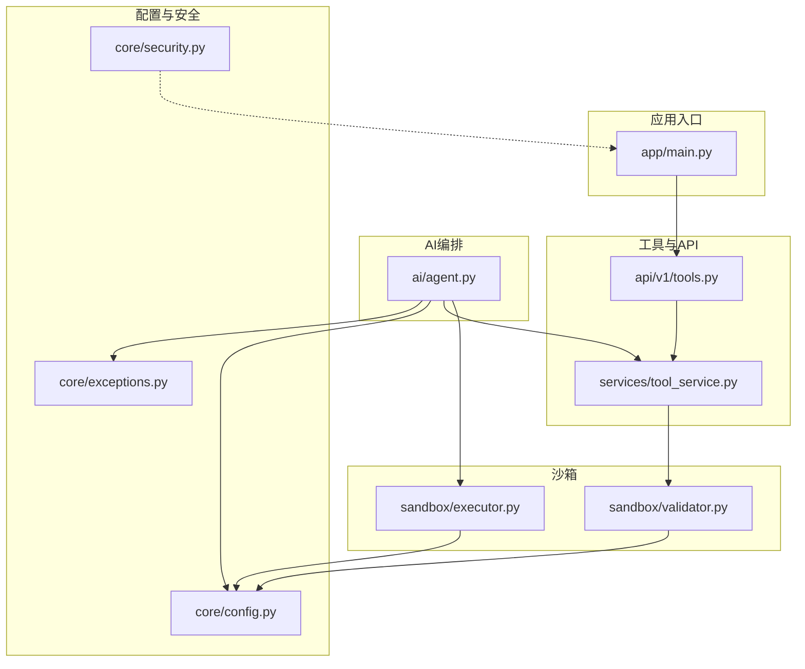
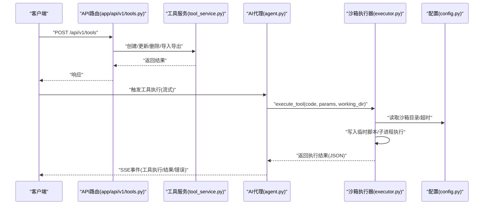
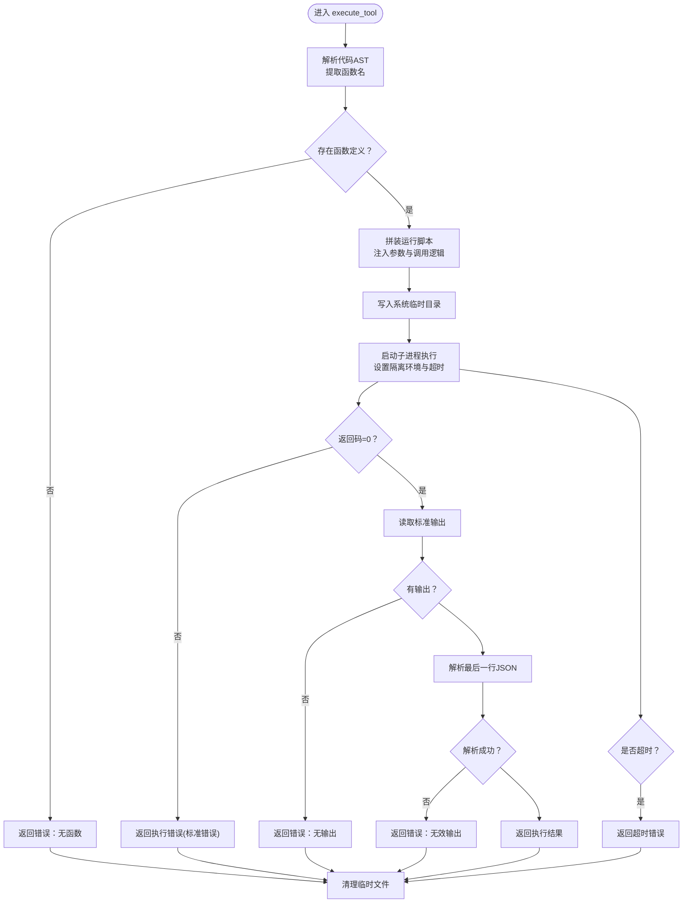
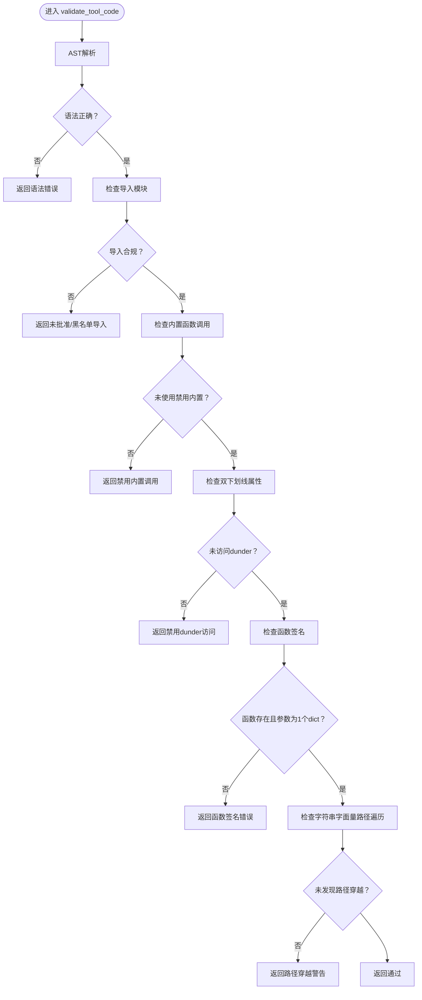
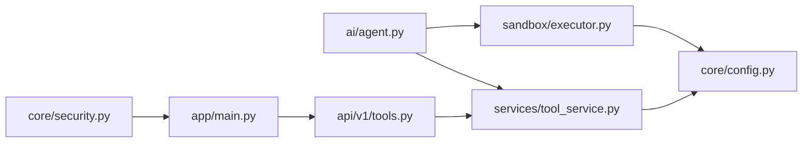

# 沙箱执行环境

> **重要说明：** 工具执行功能已停用，所有用户消息强制走 chat 路径。代码保留但不再触达，以下内容仅供历史参考。

<cite>
**本文引用的文件**
- [backend/app/sandbox/executor.py](file://backend/app/sandbox/executor.py)
- [backend/app/sandbox/validator.py](file://backend/app/sandbox/validator.py)
- [backend/app/core/config.py](file://backend/app/core/config.py)
- [backend/app/main.py](file://backend/app/main.py)
- [backend/app/ai/agent.py](file://backend/app/ai/agent.py)
- [backend/app/services/tool_service.py](file://backend/app/services/tool_service.py)
- [backend/app/api/v1/tools.py](file://backend/app/api/v1/tools.py)
- [backend/app/core/security.py](file://backend/app/core/security.py)
- [backend/app/core/exceptions.py](file://backend/app/core/exceptions.py)
</cite>

## 目录
1. [简介](#简介)
2. [项目结构](#项目结构)
3. [核心组件](#核心组件)
4. [架构总览](#架构总览)
5. [组件详解](#组件详解)
6. [依赖关系分析](#依赖关系分析)
7. [性能考量](#性能考量)
8. [故障排除指南](#故障排除指南)
9. [结论](#结论)
10. [附录](#附录)

## 简介
本文件面向XuanJi沙箱执行环境，系统性阐述其安全隔离机制、进程隔离策略、资源限制配置、代码执行器实现、执行上下文管理、超时控制、代码验证器的安全检查规则、恶意代码检测与权限控制策略，并覆盖执行环境启动流程、监控机制、错误捕获与异常处理。最后给出沙箱安全最佳实践、性能调优方案与故障排除指南。

## 项目结构
XuanJi后端采用FastAPI框架，沙箱执行与安全校验位于独立模块，由AI代理在运行时触发执行。关键位置如下：
- 沙箱执行器：backend/app/sandbox/executor.py
- 代码验证器：backend/app/sandbox/validator.py
- 应用入口与生命周期：backend/app/main.py
- 配置中心：backend/app/core/config.py（含沙箱目录与超时）
- AI代理与工具执行编排：backend/app/ai/agent.py
- 工具服务与持久化：backend/app/services/tool_service.py
- 工具API路由：backend/app/api/v1/tools.py
- 安全与认证辅助：backend/app/core/security.py
- 自定义异常：backend/app/core/exceptions.py

图表来源
- [backend/app/main.py:1-79](file://backend/app/main.py#L1-L79)
- [backend/app/ai/agent.py:1-400](file://backend/app/ai/agent.py#L1-L400)
- [backend/app/sandbox/executor.py:1-101](file://backend/app/sandbox/executor.py#L1-L101)
- [backend/app/sandbox/validator.py:1-95](file://backend/app/sandbox/validator.py#L1-L95)
- [backend/app/core/config.py:1-68](file://backend/app/core/config.py#L1-L68)
- [backend/app/services/tool_service.py:1-222](file://backend/app/services/tool_service.py#L1-L222)
- [backend/app/api/v1/tools.py:1-169](file://backend/app/api/v1/tools.py#L1-L169)
- [backend/app/core/security.py:1-38](file://backend/app/core/security.py#L1-L38)
- [backend/app/core/exceptions.py:1-20](file://backend/app/core/exceptions.py#L1-L20)

章节来源
- [backend/app/main.py:1-79](file://backend/app/main.py#L1-L79)
- [backend/app/core/config.py:1-68](file://backend/app/core/config.py#L1-L68)

## 核心组件
- 沙箱执行器：负责在隔离子进程中解析并执行工具代码，输出JSON结果，统一错误处理与超时控制。
- 代码验证器：基于AST的静态分析，禁止危险模块与内置函数，限定允许导入集合，校验函数签名与路径遍历等。
- 配置中心：集中管理沙箱工作目录与超时时间等关键参数。
- AI代理：编排工具检索/生成、执行、结果解读与自动保存，贯穿沙箱执行链路。
- 工具服务：工具的增删改查、版本快照与导入导出，支撑沙箱执行后的持久化。
- 安全与异常：JWT与密码哈希、自定义异常类型，保障系统安全与可诊断性。

章节来源
- [backend/app/sandbox/executor.py:13-101](file://backend/app/sandbox/executor.py#L13-L101)
- [backend/app/sandbox/validator.py:33-95](file://backend/app/sandbox/validator.py#L33-L95)
- [backend/app/core/config.py:44-46](file://backend/app/core/config.py#L44-L46)
- [backend/app/ai/agent.py:35-400](file://backend/app/ai/agent.py#L35-L400)
- [backend/app/services/tool_service.py:11-222](file://backend/app/services/tool_service.py#L11-L222)
- [backend/app/core/security.py:12-38](file://backend/app/core/security.py#L12-L38)
- [backend/app/core/exceptions.py:1-20](file://backend/app/core/exceptions.py#L1-L20)

## 架构总览
下图展示从API到沙箱执行的端到端流程，以及关键组件间的依赖关系。

图表来源
- [backend/app/api/v1/tools.py:1-169](file://backend/app/api/v1/tools.py#L1-L169)
- [backend/app/services/tool_service.py:11-222](file://backend/app/services/tool_service.py#L11-L222)
- [backend/app/ai/agent.py:380-579](file://backend/app/ai/agent.py#L380-L579)
- [backend/app/sandbox/executor.py:13-101](file://backend/app/sandbox/executor.py#L13-L101)
- [backend/app/core/config.py:44-46](file://backend/app/core/config.py#L44-L46)

## 组件详解

### 沙箱执行器（executor.py）
- 安全隔离与进程隔离
  - 在独立子进程中执行工具代码，避免污染主进程。
  - Windows平台使用进程组标志防止父进程信号中断子进程。
  - 设置隔离环境变量：清空Python路径、指定HOME/TEMP/TMP/USERPROFILE指向沙箱目录，降低I/O与环境泄露风险。
  - 工作目录指向配置中的沙箱目录，限制文件访问范围。
- 执行上下文与超时控制
  - 通过子进程超时参数强制终止长时间运行的工具。
  - 输出解析：仅读取最后一行作为JSON结果，确保输出格式可控。
- 错误处理
  - 子进程非零退出码、无输出、JSON解析失败均转为结构化错误返回。
  - 超时捕获并返回明确的超时信息。
- 临时脚本与重载规避
  - 将运行脚本写入系统临时目录，避免watchfiles监控导致的开发服务器热重载。

图表来源
- [backend/app/sandbox/executor.py:13-101](file://backend/app/sandbox/executor.py#L13-L101)

章节来源
- [backend/app/sandbox/executor.py:13-101](file://backend/app/sandbox/executor.py#L13-L101)
- [backend/app/core/config.py:44-46](file://backend/app/core/config.py#L44-L46)

### 代码验证器（validator.py）
- AST静态分析
  - 解析代码为AST树，进行多轮检查。
- 导入白名单与黑名单
  - 黑名单模块：如os、subprocess、sys、socket、网络相关库等。
  - 白名单模块：如json、re、math、datetime、pathlib、csv、httpx等。
  - 特例放行：如urllib.parse。
- 内置函数限制
  - 禁止eval/exec/compile/__import__/getattr/setattr/delattr/breakpoint/exit/quit等高危内置。
- 双下划线属性访问
  - 禁止访问dunder属性，阻断潜在反射攻击面。
- 函数签名约束
  - 必须存在一个函数定义，且唯一参数为params（dict）。
- 路径遍历检测
  - 检测字符串字面量中的“..”与分隔符组合，阻断路径穿越。
- 返回值
  - 通过/失败均返回结构化结果，便于上层拒绝执行。

图表来源
- [backend/app/sandbox/validator.py:33-95](file://backend/app/sandbox/validator.py#L33-L95)

章节来源
- [backend/app/sandbox/validator.py:33-95](file://backend/app/sandbox/validator.py#L33-L95)

### 配置中心（config.py）
- 关键参数
  - 沙箱目录：sandbox_dir，默认“./sandbox”，用于限制工作目录与临时文件位置。
  - 执行超时：sandbox_timeout，默认30秒，用于强制终止长时间运行的工具。
- 数据库连接URL生成方法：提供不含库名与含库名两种形式，便于迁移与初始化。
- 环境文件：支持从.env加载配置，编码为UTF-8。

章节来源
- [backend/app/core/config.py:44-46](file://backend/app/core/config.py#L44-L46)
- [backend/app/core/config.py:48-64](file://backend/app/core/config.py#L48-L64)

### AI代理与工具执行编排（agent.py）
- 单步工具执行
  - 匹配/生成工具后，调用execute_tool执行，产出SSE事件流，包含工具选择、执行中、结果与错误。
  - 成功后可自动保存工具至数据库与本地文件，便于复用与版本管理。
- 多步编排
  - 基于规划与gap收集，循环执行多个工具，聚合结果后由“玄”进行综合解读。
  - 每步执行均通过沙箱执行器隔离，失败时可触发工具迭代与回滚。
- 情绪分析与风格设计
  - 并行启动情绪分析任务，超时/失败进行告警记录，不影响主流程继续。
- 异常与日志
  - 对LLM配置缺失等场景抛出自定义异常，保证错误可诊断。

章节来源
- [backend/app/ai/agent.py:380-579](file://backend/app/ai/agent.py#L380-L579)
- [backend/app/ai/agent.py:1550-1749](file://backend/app/ai/agent.py#L1550-L1749)
- [backend/app/core/exceptions.py:1-20](file://backend/app/core/exceptions.py#L1-L20)

### 工具服务与API（tool_service.py, api/v1/tools.py）
- 工具服务
  - 提供工具的创建、查询、更新、删除、导入导出、版本快照与回滚。
  - 支持将工具代码保存到后端tools目录，便于本地调试与版本追踪。
- 工具API
  - 提供列表、搜索、创建、更新、删除、导出、导入、版本查询与回滚等REST接口。
  - 与认证中间件配合，确保操作权限。

章节来源
- [backend/app/services/tool_service.py:11-222](file://backend/app/services/tool_service.py#L11-L222)
- [backend/app/api/v1/tools.py:1-169](file://backend/app/api/v1/tools.py#L1-L169)

### 安全与认证（security.py, main.py）
- JWT与密码哈希
  - 提供密码哈希、校验与JWT签发/解码，算法为HS256，密钥来自配置。
- CORS与健康检查
  - 配置跨域来源，提供健康检查端点。
- 开发服务器重载
  - 显式指定reload_dirs，避免工具目录触发热重载。

章节来源
- [backend/app/core/security.py:12-38](file://backend/app/core/security.py#L12-L38)
- [backend/app/main.py:30-79](file://backend/app/main.py#L30-L79)

## 依赖关系分析
- 组件耦合
  - AI代理依赖沙箱执行器与工具服务，形成“编排-执行-存储”的清晰边界。
  - 沙箱执行器与验证器均依赖配置中心的超时与工作目录。
  - 工具API与服务构成数据面，与编排层松耦合。
- 外部依赖
  - Python标准库AST、subprocess、tempfile、pathlib等。
  - FastAPI、SQLAlchemy、bcrypt、jose等第三方库。
- 潜在环路
  - 当前模块间为单向依赖，未见循环导入。

图表来源
- [backend/app/ai/agent.py:21-22](file://backend/app/ai/agent.py#L21-L22)
- [backend/app/sandbox/executor.py:10](file://backend/app/sandbox/executor.py#L10)
- [backend/app/services/tool_service.py:1-9](file://backend/app/services/tool_service.py#L1-L9)
- [backend/app/api/v1/tools.py:1-17](file://backend/app/api/v1/tools.py#L1-L17)
- [backend/app/main.py:10-40](file://backend/app/main.py#L10-L40)
- [backend/app/core/security.py:1-7](file://backend/app/core/security.py#L1-L7)

章节来源
- [backend/app/ai/agent.py:21-22](file://backend/app/ai/agent.py#L21-L22)
- [backend/app/sandbox/executor.py:10](file://backend/app/sandbox/executor.py#L10)
- [backend/app/services/tool_service.py:1-9](file://backend/app/services/tool_service.py#L1-L9)
- [backend/app/api/v1/tools.py:1-17](file://backend/app/api/v1/tools.py#L1-L17)
- [backend/app/main.py:10-40](file://backend/app/main.py#L10-L40)
- [backend/app/core/security.py:1-7](file://backend/app/core/security.py#L1-L7)

## 性能考量
- 超时与并发
  - 通过沙箱超时参数限制单次执行时长，避免资源耗尽。
  - 多步编排中情绪分析异步执行，避免阻塞主流程。
- I/O与磁盘
  - 沙箱工作目录与临时目录分离，减少不必要的文件扫描与监控。
  - 工具代码落地到本地tools目录，便于快速定位与调试。
- 缓存与复用
  - 成功执行的工具自动保存，减少重复生成开销。
- 网络与外部依赖
  - httpx允许网络请求，建议在工具层面做连接池与超时控制，避免阻塞。
- 日志与可观测性
  - 在关键节点输出SSE事件与日志，便于前端流式渲染与后端审计。

## 故障排除指南
- 执行超时
  - 现象：返回超时错误。
  - 排查：检查工具是否陷入死循环或长阻塞IO；适当提高超时阈值。
  - 参考：[backend/app/sandbox/executor.py:95-96](file://backend/app/sandbox/executor.py#L95-L96)
- 无输出或输出非JSON
  - 现象：返回“无输出”或“无效输出”。
  - 排查：确认工具函数最终打印符合要求的JSON；检查是否提前退出。
  - 参考：[backend/app/sandbox/executor.py:87-93](file://backend/app/sandbox/executor.py#L87-L93)
- 执行错误（子进程非零返回）
  - 现象：返回stderr内容。
  - 排查：查看工具内部异常栈；确认依赖模块与权限。
  - 参考：[backend/app/sandbox/executor.py:81-85](file://backend/app/sandbox/executor.py#L81-L85)
- 语法错误或导入违规
  - 现象：验证器返回相应错误。
  - 排查：核对导入模块是否在白名单；避免使用禁用内置与dunder访问。
  - 参考：[backend/app/sandbox/validator.py:36-76](file://backend/app/sandbox/validator.py#L36-L76)
- LLM配置缺失
  - 现象：抛出自定义异常，提示前往“记忆体”页面完成配置。
  - 排查：检查对应角色的LLM配置字段是否齐全。
  - 参考：[backend/app/core/exceptions.py:1-20](file://backend/app/core/exceptions.py#L1-L20)
- 开发服务器热重载干扰
  - 现象：工具变更导致服务重启。
  - 排查：确认reload_dirs未包含工具目录；临时脚本写入系统临时目录。
  - 参考：[backend/app/main.py:76-78](file://backend/app/main.py#L76-L78), [backend/app/sandbox/executor.py:46-53](file://backend/app/sandbox/executor.py#L46-L53)

章节来源
- [backend/app/sandbox/executor.py:81-96](file://backend/app/sandbox/executor.py#L81-L96)
- [backend/app/sandbox/validator.py:36-76](file://backend/app/sandbox/validator.py#L36-L76)
- [backend/app/core/exceptions.py:1-20](file://backend/app/core/exceptions.py#L1-L20)
- [backend/app/main.py:76-78](file://backend/app/main.py#L76-L78)

## 结论
XuanJi沙箱执行环境通过“AST静态校验+子进程隔离+环境变量约束+超时控制”的组合拳，实现了对工具代码的强安全边界。AI代理在编排层统一调度工具检索/生成与执行，结合版本快照与自动保存，提升了可用性与可维护性。建议在生产环境中进一步强化资源限额、网络白名单与日志审计，持续优化超时与并发策略，以获得更稳健的执行体验。

## 附录
- 最佳实践
  - 严格遵循验证器规则，优先使用白名单模块。
  - 工具函数必须接受且仅接受一个dict类型的参数，确保输入规范化。
  - 控制工具执行时间，必要时拆分为多步任务。
  - 对外网访问进行最小化授权，避免敏感端口暴露。
  - 定期审查工具版本与执行日志，建立回滚机制。
- 性能调优
  - 合理设置sandbox_timeout，兼顾稳定性与响应速度。
  - 使用工具缓存与复用，减少重复生成成本。
  - 优化工具内部I/O与网络请求，避免阻塞。
- 故障排查清单
  - 是否命中超时？
  - 是否通过验证器？
  - 是否存在语法/导入/内置/dunder问题？
  - 是否有输出且为合法JSON？
  - 是否正确设置工作目录与临时目录？