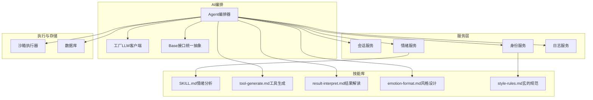
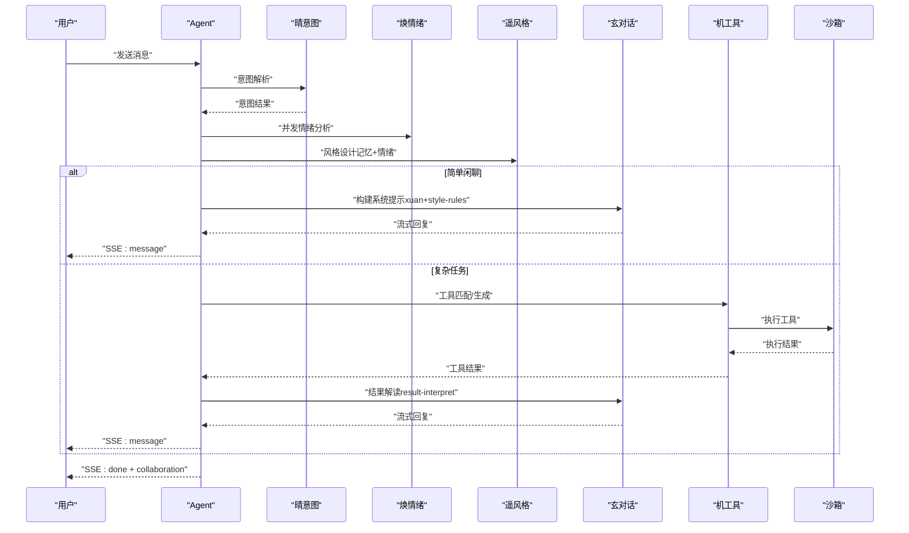
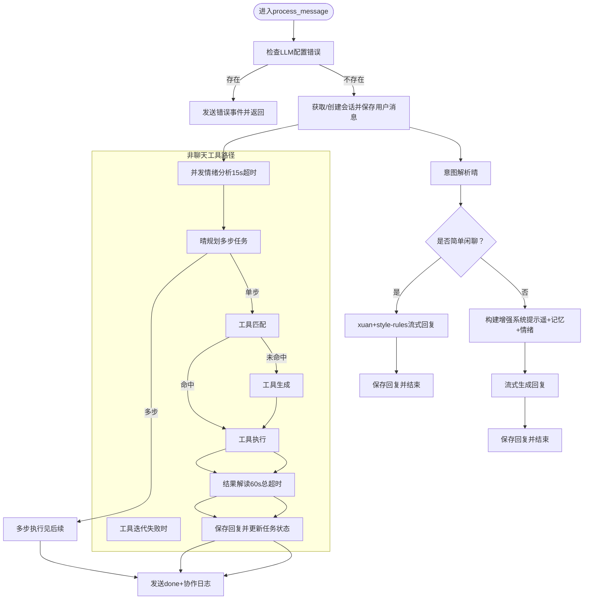
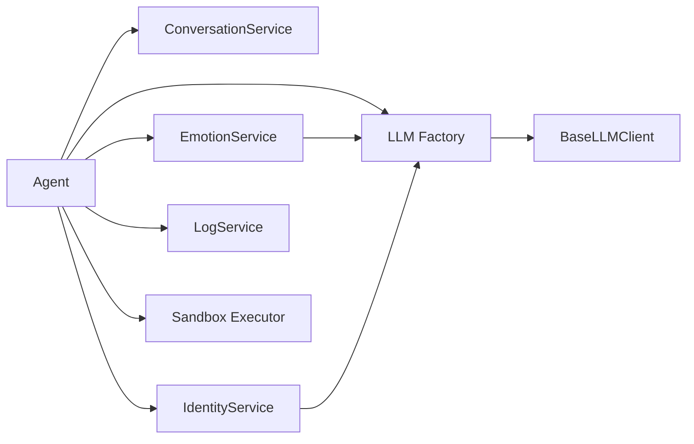
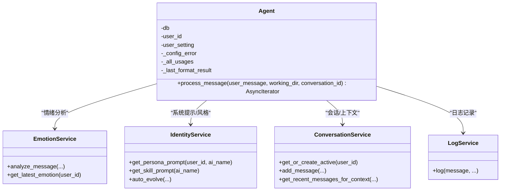

# Agent核心组件

<cite>
**本文引用的文件**
- [agent.py](file://backend/app/ai/agent.py)
- [base.py](file://backend/app/ai/base.py)
- [factory.py](file://backend/app/ai/factory.py)
- [tool_generator.py](file://backend/app/ai/tool_generator.py)
- [intent_rules.json](file://backend/app/ai/intent_rules.json)
- [executor.py](file://backend/app/sandbox/executor.py)
- [conversation_service.py](file://backend/app/services/conversation_service.py)
- [emotion_service.py](file://backend/app/services/emotion_service.py)
- [identity_service.py](file://backend/app/services/identity_service.py)
- [log_service.py](file://backend/app/services/log_service.py)
- [SKILL.md（情绪分析）](file://backend/app/ai/skills/xuanji-huan/SKILL.md)
- [tool-generate.md（工具生成）](file://backend/app/ai/skills/xuanji-ji/tool-generate.md)
- [result-interpret.md（结果解读）](file://backend/app/ai/skills/xuanji-ji/result-interpret.md)
- [emotion-format.md（风格设计）](file://backend/app/ai/skills/xuanji-yao/emotion-format.md)
- [style-rules.md（玄的规范）](file://backend/app/ai/skills/xuanji-xuan/style-rules.md)
</cite>

## 目录
1. [简介](#简介)
2. [项目结构](#项目结构)
3. [核心组件](#核心组件)
4. [架构总览](#架构总览)
5. [详细组件分析](#详细组件分析)
6. [依赖分析](#依赖分析)
7. [性能考虑](#性能考虑)
8. [故障排查指南](#故障排查指南)
9. [结论](#结论)
10. [附录](#附录)

## 简介
本文件面向XuanJi系统中的Agent核心组件，系统性阐述其设计架构、初始化与依赖注入机制、核心属性配置，以及process_message主流程的七大关键步骤：意图解析、情绪分析、工具匹配/生成、工具执行、结果解读、协作日志记录与状态管理。文档还覆盖异步流式处理机制、SSE事件传输协议、错误处理策略，并通过图示与路径引用帮助读者快速定位实现细节。

## 项目结构
XuanJi采用"多AI协作团队"的分层架构：Agent作为编排器，协调"晴（意图）—焕（情绪）—遥（风格）—玄（对话）"四大对话角色，机在后台独立运行系统迭代任务；服务层负责持久化与业务逻辑；技能库提供各AI的角色提示与行为规范。

图表来源
- [agent.py](file://backend/app/ai/agent.py)
- [factory.py](file://backend/app/ai/factory.py)
- [base.py](file://backend/app/ai/base.py)
- [conversation_service.py](file://backend/app/services/conversation_service.py)
- [emotion_service.py](file://backend/app/services/emotion_service.py)
- [identity_service.py](file://backend/app/services/identity_service.py)
- [log_service.py](file://backend/app/services/log_service.py)
- [executor.py](file://backend/app/sandbox/executor.py)
- [SKILL.md（情绪分析）](file://backend/app/ai/skills/xuanji-huan/SKILL.md)
- [tool-generate.md（工具生成）](file://backend/app/ai/skills/xuanji-ji/tool-generate.md)
- [result-interpret.md（结果解读）](file://backend/app/ai/skills/xuanji-ji/result-interpret.md)
- [emotion-format.md（风格设计）](file://backend/app/ai/skills/xuanji-yao/emotion-format.md)
- [style-rules.md（玄的规范）](file://backend/app/ai/skills/xuanji-xuan/style-rules.md)

章节来源
- [agent.py](file://backend/app/ai/agent.py)
- [factory.py](file://backend/app/ai/factory.py)
- [base.py](file://backend/app/ai/base.py)
- [conversation_service.py](file://backend/app/services/conversation_service.py)
- [emotion_service.py](file://backend/app/services/emotion_service.py)
- [identity_service.py](file://backend/app/services/identity_service.py)
- [log_service.py](file://backend/app/services/log_service.py)
- [executor.py](file://backend/app/sandbox/executor.py)
- [SKILL.md（情绪分析）](file://backend/app/ai/skills/xuanji-huan/SKILL.md)
- [tool-generate.md（工具生成）](file://backend/app/ai/skills/xuanji-ji/tool-generate.md)
- [result-interpret.md（结果解读）](file://backend/app/ai/skills/xuanji-ji/result-interpret.md)
- [emotion-format.md（风格设计）](file://backend/app/ai/skills/xuanji-yao/emotion-format.md)
- [style-rules.md（玄的规范）](file://backend/app/ai/skills/xuanji-xuan/style-rules.md)

## 核心组件
- Agent：多AI编排核心，负责消息处理主循环、意图解析、情绪分析、工具匹配/生成、工具执行、结果解读、协作日志与状态管理。
- LLM工厂：按用户设置动态创建在线/本地LLM客户端，统一接口适配。
- 服务层：会话、情绪、身份、日志、记忆、任务、工具等服务封装。
- 技能库：各AI角色的提示词模板与行为规范。
- 沙箱执行器：隔离执行工具代码，保障安全与超时控制。

章节来源
- [agent.py](file://backend/app/ai/agent.py)
- [factory.py](file://backend/app/ai/factory.py)
- [base.py](file://backend/app/ai/base.py)
- [conversation_service.py](file://backend/app/services/conversation_service.py)
- [emotion_service.py](file://backend/app/services/emotion_service.py)
- [identity_service.py](file://backend/app/services/identity_service.py)
- [log_service.py](file://backend/app/services/log_service.py)
- [executor.py](file://backend/app/sandbox/executor.py)

## 架构总览
Agent通过异步生成器逐阶段产出SSE事件，前端以流式方式接收“thinking/message/error/done/emotion_update/collaboration”等事件，实现端到端的实时交互与可观测协作。

图表来源
- [agent.py](file://backend/app/ai/agent.py)
- [emotion_service.py](file://backend/app/services/emotion_service.py)
- [identity_service.py](file://backend/app/services/identity_service.py)
- [executor.py](file://backend/app/sandbox/executor.py)
- [result-interpret.md（结果解读）](file://backend/app/ai/skills/xuanji-ji/result-interpret.md)
- [style-rules.md（玄的规范）](file://backend/app/ai/skills/xuanji-xuan/style-rules.md)

## 详细组件分析

### 初始化与依赖注入机制
- 依赖注入
  - 数据库会话Session注入至各服务层。
  - 用户设置user_setting驱动LLM工厂创建对应客户端。
  - 服务层实例化：会话、情绪、身份、日志、记忆、任务、工具等。
- LLM客户端创建
  - 工厂方法按provider选择在线或本地模型，参数来自用户设置。
  - 若配置缺失，捕获LLMConfigError并缓存，后续流程中作为错误事件返回。
- 缓存与全局状态
  - 提示词模板与JSON配置使用LRU缓存加载。
  - 全局格式缓存用于提升性能。
- 核心属性
  - _all_usages：聚合各角色token用量。
  - _last_format_result：遥的最近一次风格设计结果，用于协作日志。

章节来源
- [agent.py](file://backend/app/ai/agent.py)
- [factory.py](file://backend/app/ai/factory.py)
- [base.py](file://backend/app/ai/base.py)

### process_message主流程（七步）
Agent将消息处理拆解为以下步骤，均通过SSE事件向前端反馈进度与结果：

1) 意图解析（晴）
- 从规则文件加载意图关键词与模式，结合快速规则与LLM回退，输出意图描述、是否需要情绪、用户状态等。
- 记录协作日志：晴的行为推测与下一步。

2) 情绪分析（焕）并发启动
- 并发创建情绪分析任务，超时15秒；成功后更新协作日志、持久化快照、贡献规则引擎。
- 若超时或失败，记录日志并继续后续流程。

3) 工具路径选择
- 简单闲聊：直接走“xuan+style-rules”系统提示，流式生成回复。
- 复杂任务：构建“遥风格设计+记忆上下文+情绪上下文”的增强系统提示，流式生成回复。

4) 工具匹配/生成
- 若数据库存在匹配工具：执行并产出结果事件。
- 否则：调用工具生成器生成Python工具代码，执行并产出结果事件；成功则自动保存工具。

5) 工具执行与迭代
- 执行失败时，根据决策进行工具代码迭代与重试，产出“tool_iterated”事件。
- 保存迭代版本并提交数据库。

6) 结果解读（玄）
- 使用“result-interpret”模板构造解读提示，流式生成自然口语化回复。
- 设置总超时60秒，分片超时30秒，异常时降级输出。

7) 协作日志记录与状态管理
- 保存最终回复至会话，记录任务状态与日志。
- 生成done事件，随后异步补录token用量、发送协作日志，后台触发记忆压缩与身份迭代评估。

图表来源
- [agent.py](file://backend/app/ai/agent.py)
- [emotion_service.py](file://backend/app/services/emotion_service.py)
- [identity_service.py](file://backend/app/services/identity_service.py)
- [executor.py](file://backend/app/sandbox/executor.py)
- [result-interpret.md（结果解读）](file://backend/app/ai/skills/xuanji-ji/result-interpret.md)
- [style-rules.md（玄的规范）](file://backend/app/ai/skills/xuanji-xuan/style-rules.md)

章节来源
- [agent.py](file://backend/app/ai/agent.py)

### 异步流式处理与SSE事件协议
- 事件类型
  - metadata：首次发送，携带当前会话ID。
  - thinking：阶段性思考提示。
  - message：流式回复片段。
  - error：错误事件。
  - done：处理完成，携带会话ID与token用量。
  - emotion_update：情绪分析结果更新。
  - collaboration：协作日志。
- 超时策略
  - 情绪分析：15秒超时；工具执行：沙箱超时由配置控制。
  - 结果解读：总超时60秒，分片超时30秒；异常时降级回复。
- 生成器生命周期
  - finally块确保发送done事件并异步补录token用量与协作日志，避免阻塞用户交互。

章节来源
- [agent.py](file://backend/app/ai/agent.py)
- [executor.py](file://backend/app/sandbox/executor.py)

### 错误处理策略
- LLM配置错误：捕获并缓存，后续流程以error事件返回。
- 情绪分析：超时与异常分别记录warn/error日志并继续流程。
- 工具生成：参数校验失败或多次尝试失败时返回error事件并标记任务失败。
- 工具执行：超时、输出为空或JSON解析失败时返回错误信息。
- 结果解读：流式异常时降级输出，保证用户可见结果。
- 任务状态：根据工具执行结果更新为完成或失败。

章节来源
- [agent.py](file://backend/app/ai/agent.py)
- [log_service.py](file://backend/app/services/log_service.py)

### 多AI协作与角色职责
- 晴（意图）：行为推测与调度，决定是否需要情绪分析与工具路径。
- 焕（情绪）：深度情绪分析，提供交互建议与风险评估。
- 遥（风格）：根据记忆与情绪设计回复风格与格式。
- 玄（对话）：整合信息，生成自然口语化回复。
- 机（系统迭代）：后台独立运行，负责规则引擎优化、对话质量自评等5项定时任务，不参与对话流程。

章节来源
- [agent.py](file://backend/app/ai/agent.py)
- [emotion_service.py](file://backend/app/services/emotion_service.py)
- [identity_service.py](file://backend/app/services/identity_service.py)
- [SKILL.md（情绪分析）](file://backend/app/ai/skills/xuanji-huan/SKILL.md)
- [emotion-format.md（风格设计）](file://backend/app/ai/skills/xuanji-yao/emotion-format.md)
- [style-rules.md（玄的规范）](file://backend/app/ai/skills/xuanji-xuan/style-rules.md)

## 依赖分析
- 组件耦合
  - Agent高度依赖服务层与工厂；服务层之间松耦合，通过数据库会话交互。
  - LLM客户端通过统一Base接口抽象，便于替换与扩展。
- 外部依赖
  - 在线模型需API密钥与基础URL；本地模型需模型名称与可访问的服务端。
  - 沙箱执行器依赖系统环境与超时配置。
- 循环依赖
  - 未发现直接循环依赖；服务层与Agent通过接口调用形成单向依赖。

图表来源
- [agent.py](file://backend/app/ai/agent.py)
- [factory.py](file://backend/app/ai/factory.py)
- [base.py](file://backend/app/ai/base.py)
- [conversation_service.py](file://backend/app/services/conversation_service.py)
- [emotion_service.py](file://backend/app/services/emotion_service.py)
- [identity_service.py](file://backend/app/services/identity_service.py)
- [log_service.py](file://backend/app/services/log_service.py)
- [executor.py](file://backend/app/sandbox/executor.py)

章节来源
- [agent.py](file://backend/app/ai/agent.py)
- [factory.py](file://backend/app/ai/factory.py)
- [base.py](file://backend/app/ai/base.py)
- [conversation_service.py](file://backend/app/services/conversation_service.py)
- [emotion_service.py](file://backend/app/services/emotion_service.py)
- [identity_service.py](file://backend/app/services/identity_service.py)
- [log_service.py](file://backend/app/services/log_service.py)
- [executor.py](file://backend/app/sandbox/executor.py)

## 性能考虑
- 流式输出：前端可即时渲染，降低首帧延迟。
- 并发执行：情绪分析与工具执行并行，缩短端到端时间。
- 缓存策略：提示词与JSON配置LRU缓存，减少IO开销。
- 超时控制：分层超时（情绪15s、工具沙箱、解读60s），避免资源长时间占用。
- 后台任务：记忆压缩、画像摘要与身份迭代评估采用fire-and-forget，不影响主线程。

## 故障排查指南
- 配置错误
  - 现象：直接返回error事件。
  - 排查：检查用户设置中的provider与必要字段。
- 情绪分析失败
  - 现象：日志warn/error，流程继续。
  - 排查：确认情绪AI配置与网络连通性。
- 工具生成失败
  - 现象：返回error事件并标记任务失败。
  - 排查：查看生成器提示词与验证规则，确认返回的META注释与函数签名。
- 工具执行失败
  - 现象：返回错误信息；若可迭代则自动重试。
  - 排查：检查沙箱超时、工作目录权限与工具代码逻辑。
- 结果解读异常
  - 现象：流式异常时降级输出。
  - 排查：检查解读模板与输入数据长度限制。

章节来源
- [agent.py](file://backend/app/ai/agent.py)
- [log_service.py](file://backend/app/services/log_service.py)
- [executor.py](file://backend/app/sandbox/executor.py)

## 结论
Agent通过清晰的七步流程、严格的SSE事件协议与完善的错误处理策略，实现了多AI协作下的高可用与高体验。其异步流式与并发设计兼顾性能与稳定性，适合复杂对话与工具执行场景。建议持续优化提示词模板与规则库，完善异常监控与指标采集，以进一步提升系统鲁棒性与可观测性。

## 附录

### 代码级类图（Agent与关键服务）

图表来源
- [agent.py](file://backend/app/ai/agent.py)
- [emotion_service.py](file://backend/app/services/emotion_service.py)
- [identity_service.py](file://backend/app/services/identity_service.py)
- [conversation_service.py](file://backend/app/services/conversation_service.py)
- [log_service.py](file://backend/app/services/log_service.py)