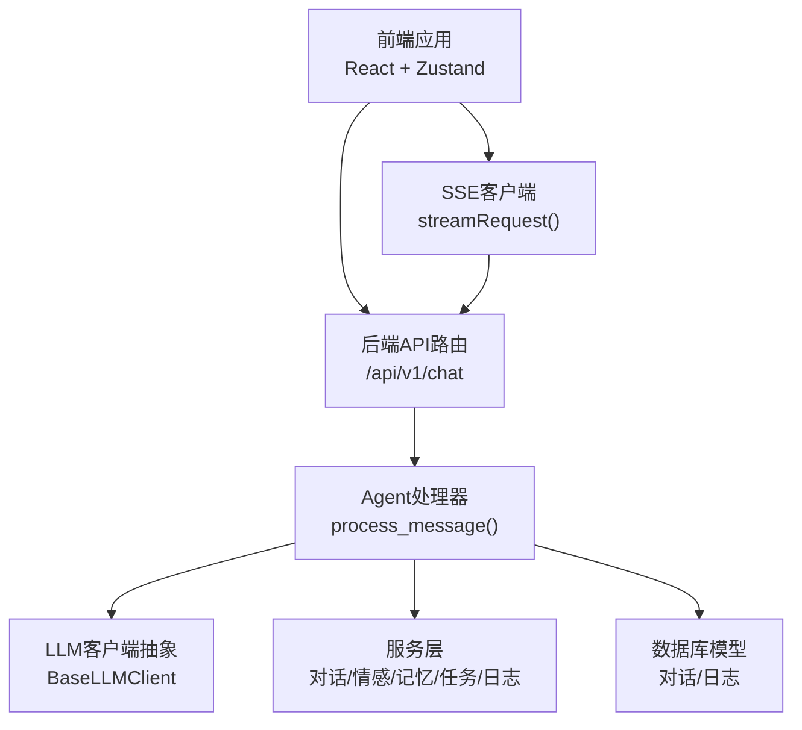
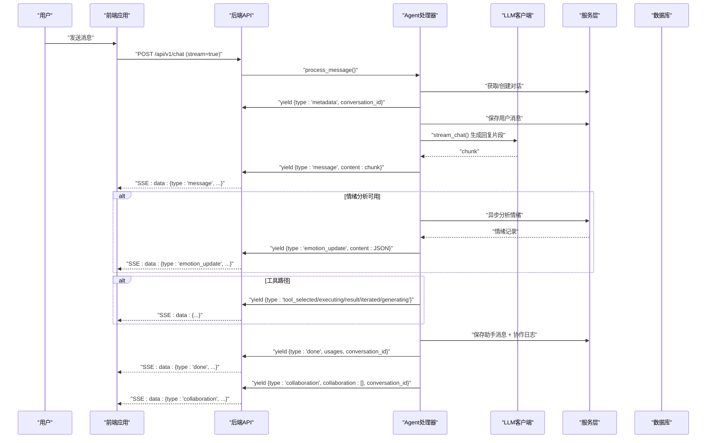
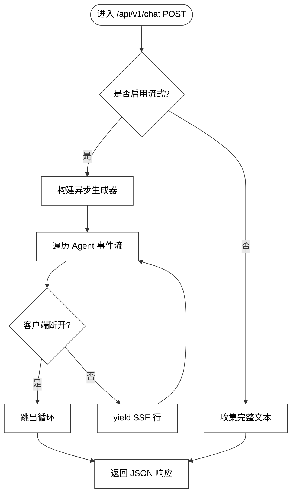
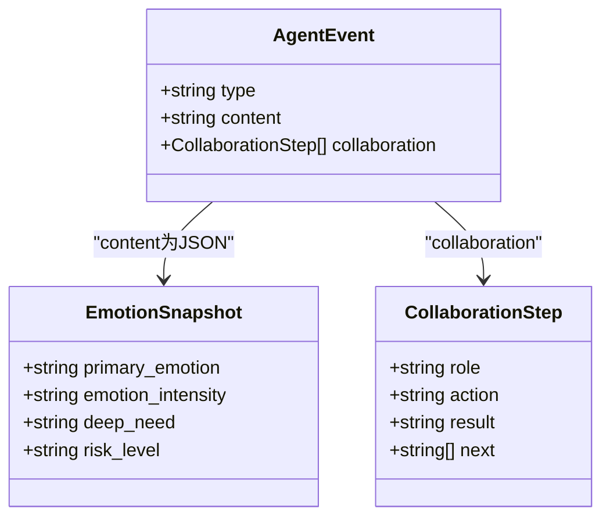
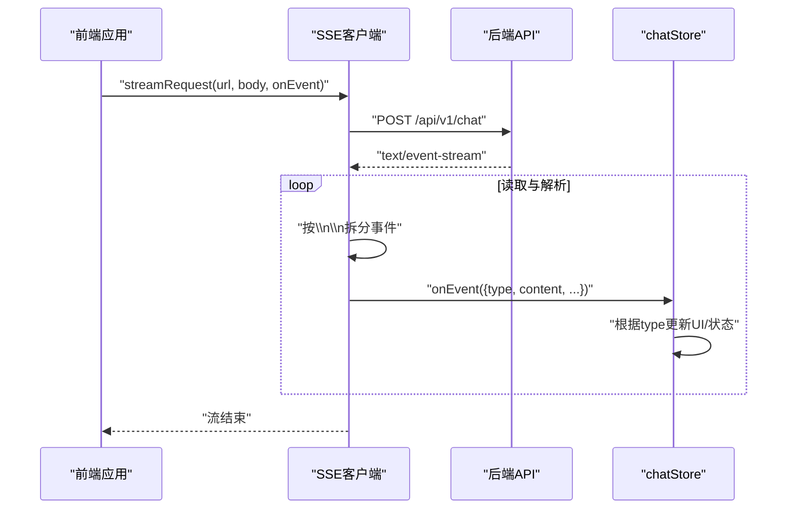
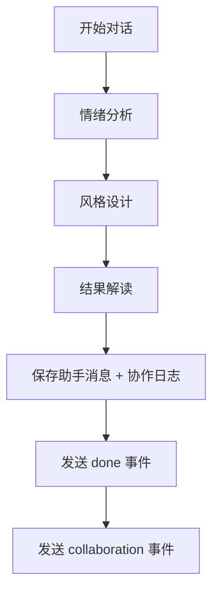
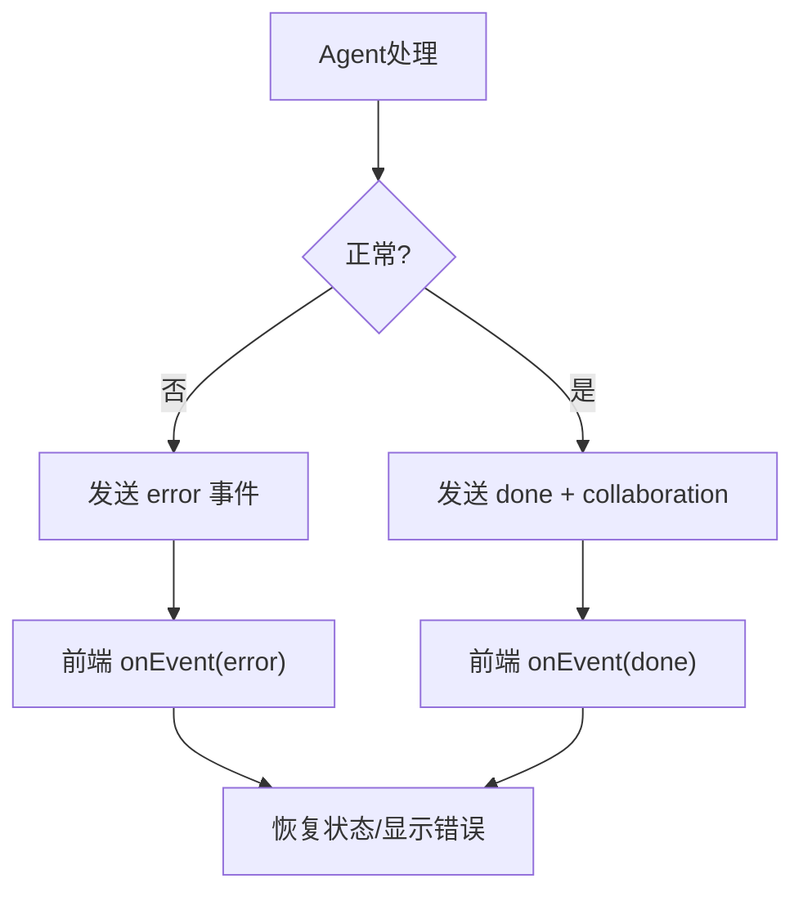
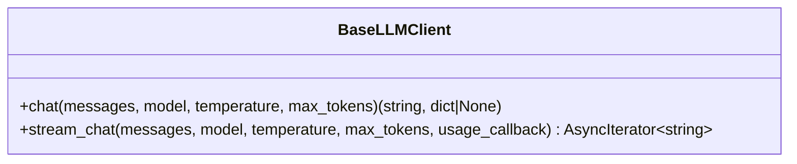
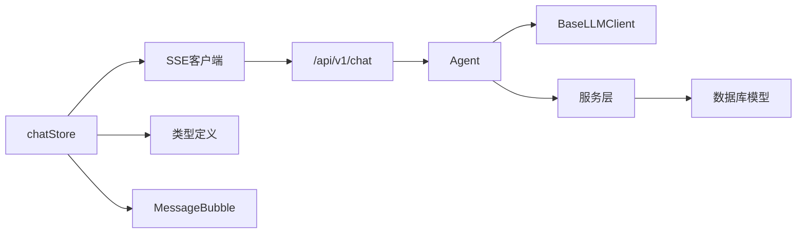

# 通信协议

<cite>
**本文引用的文件**
- [backend/app/main.py](file://backend/app/main.py)
- [backend/app/api/v1/chat.py](file://backend/app/api/v1/chat.py)
- [backend/app/schemas/chat.py](file://backend/app/schemas/chat.py)
- [backend/app/ai/agent.py](file://backend/app/ai/agent.py)
- [backend/app/ai/base.py](file://backend/app/ai/base.py)
- [backend/app/schemas/emotion.py](file://backend/app/schemas/emotion.py)
- [backend/app/models/log.py](file://backend/app/models/log.py)
- [frontend/src/api/client.ts](file://frontend/src/api/client.ts)
- [frontend/src/api/chat.ts](file://frontend/src/api/chat.ts)
- [frontend/src/stores/chatStore.ts](file://frontend/src/stores/chatStore.ts)
- [frontend/src/types/chat.ts](file://frontend/src/types/chat.ts)
- [frontend/src/components/chat/MessageBubble.tsx](file://frontend/src/components/chat/MessageBubble.tsx)
</cite>

## 目录
1. [引言](#引言)
2. [项目结构](#项目结构)
3. [核心组件](#核心组件)
4. [架构总览](#架构总览)
5. [详细组件分析](#详细组件分析)
6. [依赖分析](#依赖分析)
7. [性能考量](#性能考量)
8. [故障排查指南](#故障排查指南)
9. [结论](#结论)
10. [附录](#附录)

## 引言
本文件面向XuanJi多智能体通信协议，系统性阐述智能体间的消息传递机制、事件类型与数据格式规范，以及SSE（Server-Sent Events）协议在后端与前端的实现细节。重点覆盖以下方面：
- SSE事件类型与数据结构：thinking、message、emotion_update、tool_selected、tool_executing、tool_result、tool_generating、tool_iterated、collaboration、done、error、metadata
- 协作日志生成与状态同步策略
- 异常传播与错误恢复机制
- 前端事件处理、流式响应解析与断线重连建议
- 实际应用示例与调试技巧

## 项目结构
XuanJi采用前后端分离架构，后端基于FastAPI提供REST接口与SSE流式输出，前端通过Fetch与ReadableStream消费SSE事件，实时渲染对话与协作过程。

图表来源
- [backend/app/api/v1/chat.py:40-106](file://backend/app/api/v1/chat.py#L40-L106)
- [backend/app/ai/agent.py:78-792](file://backend/app/ai/agent.py#L78-L792)
- [frontend/src/api/client.ts:46-119](file://frontend/src/api/client.ts#L46-L119)

章节来源
- [backend/app/main.py:30-41](file://backend/app/main.py#L30-L41)
- [backend/app/api/v1/chat.py:19-106](file://backend/app/api/v1/chat.py#L19-L106)
- [frontend/src/api/chat.ts:35-49](file://frontend/src/api/chat.ts#L35-L49)

## 核心组件
- 后端API路由：接收聊天请求，封装SSE响应，转发至Agent处理器
- Agent处理器：统一调度多智能体（晴/焕/机/遥/玄），产出SSE事件流
- LLM客户端抽象：统一聊天与流式聊天接口
- 前端SSE客户端：解析SSE行，回调上层事件处理器
- 前端状态管理：维护消息、流状态、协作日志与情绪快照

章节来源
- [backend/app/api/v1/chat.py:40-106](file://backend/app/api/v1/chat.py#L40-L106)
- [backend/app/ai/agent.py:78-792](file://backend/app/ai/agent.py#L78-L792)
- [frontend/src/api/client.ts:46-119](file://frontend/src/api/client.ts#L46-L119)
- [frontend/src/stores/chatStore.ts:25-291](file://frontend/src/stores/chatStore.ts#L25-L291)

## 架构总览
下图展示从用户输入到SSE事件消费的端到端流程，包括事件类型、数据结构与状态流转。

图表来源
- [backend/app/api/v1/chat.py:40-106](file://backend/app/api/v1/chat.py#L40-L106)
- [backend/app/ai/agent.py:78-792](file://backend/app/ai/agent.py#L78-L792)
- [frontend/src/api/client.ts:46-119](file://frontend/src/api/client.ts#L46-L119)

## 详细组件分析

### 后端SSE路由与事件生成
- 路由定义与依赖注入：使用FastAPI路由注册聊天接口，依赖当前用户与数据库会话
- 流式响应：当请求开启流式时，后端以text/event-stream媒体类型返回事件
- 事件生成：Agent的process_message方法按阶段产出事件，后端逐条序列化为SSE行
- 断线检测：在生成器中检测客户端断开，优雅终止
- 异常处理：捕获运行期异常，发送error事件，确保前端可见

图表来源
- [backend/app/api/v1/chat.py:40-106](file://backend/app/api/v1/chat.py#L40-L106)

章节来源
- [backend/app/api/v1/chat.py:40-106](file://backend/app/api/v1/chat.py#L40-L106)

### Agent事件类型与数据结构
Agent在不同阶段产出多种SSE事件，前端据此更新UI与状态。事件类型与字段如下：

- metadata
  - 作用：告知前端当前对话ID，用于防串话校验
  - 字段：type, conversation_id
- thinking
  - 作用：阶段性思考提示
  - 字段：type, content
- message
  - 作用：流式回复片段
  - 字段：type, content
- emotion_update
  - 作用：情绪分析结果
  - 字段：type, content(JSON字符串，包含primary_emotion、emotion_intensity、deep_need、risk_level)
- tool_selected
  - 作用：匹配到工具
  - 字段：type, content
- tool_executing
  - 作用：开始执行工具
  - 字段：type, content
- tool_result
  - 作用：工具执行结果
  - 字段：type, content(JSON字符串，包含tool、success、result，可选iterated)
- tool_generating
  - 作用：生成新工具或进度提示
  - 字段：type, content
- tool_iterated
  - 作用：工具迭代后的元信息
  - 字段：type, content(JSON字符串，包含tool_name、version、change_summary、reason)
- collaboration
  - 作用：协作日志（最终一次性发送）
  - 字段：type, content(空), collaboration(数组), conversation_id
- done
  - 作用：流结束信号，携带token用量
  - 字段：type, content(空), conversation_id, usages(数组)
- error
  - 作用：异常事件
  - 字段：type, content

章节来源
- [backend/app/ai/agent.py:107-108](file://backend/app/ai/agent.py#L107-L108)
- [backend/app/ai/agent.py:119](file://backend/app/ai/agent.py#L119)
- [backend/app/ai/agent.py:191](file://backend/app/ai/agent.py#L191)
- [backend/app/ai/agent.py:305-313](file://backend/app/ai/agent.py#L305-L313)
- [backend/app/ai/agent.py:374](file://backend/app/ai/agent.py#L374)
- [backend/app/ai/agent.py:397-404](file://backend/app/ai/agent.py#L397-L404)
- [backend/app/ai/agent.py:497-498](file://backend/app/ai/agent.py#L497-L498)
- [backend/app/ai/agent.py:440-448](file://backend/app/ai/agent.py#L440-L448)
- [backend/app/ai/agent.py:740-745](file://backend/app/ai/agent.py#L740-L745)
- [backend/app/ai/agent.py:687-692](file://backend/app/ai/agent.py#L687-L692)
- [backend/app/ai/agent.py:681](file://backend/app/ai/agent.py#L681)

### SSE事件数据模型与类型定义
- 后端事件模型：Agent产出的事件字典即为SSE数据载体
- 前端事件模型：统一的AgentEvent接口，包含type与content，并扩展collaboration字段
- 情绪快照模型：EmotionSnapshot包含primary_emotion、emotion_intensity、deep_need、risk_level
- 协作步骤模型：CollaborationStep包含role、action、result、next

图表来源
- [frontend/src/types/chat.ts:34-47](file://frontend/src/types/chat.ts#L34-L47)
- [frontend/src/types/chat.ts:27-32](file://frontend/src/types/chat.ts#L27-L32)
- [frontend/src/types/chat.ts:1-6](file://frontend/src/types/chat.ts#L1-L6)

章节来源
- [frontend/src/types/chat.ts:34-47](file://frontend/src/types/chat.ts#L34-L47)
- [backend/app/schemas/emotion.py:6-19](file://backend/app/schemas/emotion.py#L6-L19)

### 前端SSE客户端与事件处理
- 流式请求：streamRequest通过Fetch建立SSE连接，使用ReadableStream读取数据
- 事件解析：按行解析SSE，过滤以"data: "开头的行，解析JSON并回调onEvent
- 错误处理：连续解析错误超过阈值抛出异常；HTTP非OK状态抛出ApiError
- 事件分发：chatStore根据事件类型更新消息、状态与协作日志

图表来源
- [frontend/src/api/client.ts:46-119](file://frontend/src/api/client.ts#L46-L119)
- [frontend/src/stores/chatStore.ts:144-289](file://frontend/src/stores/chatStore.ts#L144-L289)

章节来源
- [frontend/src/api/client.ts:46-119](file://frontend/src/api/client.ts#L46-L119)
- [frontend/src/stores/chatStore.ts:144-289](file://frontend/src/stores/chatStore.ts#L144-L289)

### 协作日志生成与状态同步
- 生成时机：Agent在各阶段（情绪分析、风格设计、对话生成）累积协作步骤
- 最终发送：在done事件之后，Agent一次性发送collaboration事件，包含完整协作链路
- 前端应用：chatStore使用requestIdleCallback异步应用协作日志，避免阻塞主线程
- 状态同步：通过conversation_id与metadata事件确保跨对话的事件隔离与一致性

图表来源
- [backend/app/ai/agent.py:131-137](file://backend/app/ai/agent.py#L131-L137)
- [backend/app/ai/agent.py:377-382](file://backend/app/ai/agent.py#L377-L382)
- [backend/app/ai/agent.py:520-525](file://backend/app/ai/agent.py#L520-L525)
- [backend/app/ai/agent.py:650-661](file://backend/app/ai/agent.py#L650-L661)
- [backend/app/ai/agent.py:740-745](file://backend/app/ai/agent.py#L740-L745)

章节来源
- [backend/app/ai/agent.py:131-137](file://backend/app/ai/agent.py#L131-L137)
- [backend/app/ai/agent.py:377-382](file://backend/app/ai/agent.py#L377-L382)
- [backend/app/ai/agent.py:520-525](file://backend/app/ai/agent.py#L520-L525)
- [backend/app/ai/agent.py:650-661](file://backend/app/ai/agent.py#L650-L661)
- [backend/app/ai/agent.py:740-745](file://backend/app/ai/agent.py#L740-L745)
- [frontend/src/stores/chatStore.ts:217-245](file://frontend/src/stores/chatStore.ts#L217-L245)

### 异常传播与错误恢复
- 后端异常：Agent在异常分支产出error事件，同时记录日志；SSE路由捕获异常并发送error事件
- 前端异常：SSE客户端对连续解析错误进行保护；chatStore在done事件后兜底恢复状态，防止UI卡死
- 主动取消：前端AbortController支持取消流，chatStore区分AbortError与网络错误

图表来源
- [backend/app/ai/agent.py:681](file://backend/app/ai/agent.py#L681)
- [backend/app/api/v1/chat.py:82-85](file://backend/app/api/v1/chat.py#L82-L85)
- [frontend/src/stores/chatStore.ts:250-259](file://frontend/src/stores/chatStore.ts#L250-L259)
- [frontend/src/stores/chatStore.ts:265-278](file://frontend/src/stores/chatStore.ts#L265-L278)

章节来源
- [backend/app/api/v1/chat.py:82-85](file://backend/app/api/v1/chat.py#L82-L85)
- [frontend/src/stores/chatStore.ts:250-259](file://frontend/src/stores/chatStore.ts#L250-L259)
- [frontend/src/stores/chatStore.ts:265-278](file://frontend/src/stores/chatStore.ts#L265-L278)

### LLM客户端抽象与流式接口
- 统一接口：BaseLLMClient定义chat与stream_chat两个抽象方法，便于替换不同大模型提供商
- 流式回调：stream_chat支持usage_callback，在流结束后回传token用量，Agent用于聚合统计

图表来源
- [backend/app/ai/base.py:8-35](file://backend/app/ai/base.py#L8-L35)

章节来源
- [backend/app/ai/base.py:8-35](file://backend/app/ai/base.py#L8-L35)

## 依赖分析
- 后端API依赖Agent与服务层，Agent依赖LLM客户端与服务层，服务层依赖数据库模型
- 前端依赖API客户端与状态管理，状态管理依赖类型定义与组件渲染

图表来源
- [backend/app/api/v1/chat.py:11-17](file://backend/app/api/v1/chat.py#L11-L17)
- [backend/app/ai/agent.py:13-32](file://backend/app/ai/agent.py#L13-L32)
- [frontend/src/api/client.ts:1-14](file://frontend/src/api/client.ts#L1-L14)
- [frontend/src/stores/chatStore.ts:1-5](file://frontend/src/stores/chatStore.ts#L1-L5)

章节来源
- [backend/app/api/v1/chat.py:11-17](file://backend/app/api/v1/chat.py#L11-L17)
- [backend/app/ai/agent.py:13-32](file://backend/app/ai/agent.py#L13-L32)
- [frontend/src/api/client.ts:1-14](file://frontend/src/api/client.ts#L1-L14)
- [frontend/src/stores/chatStore.ts:1-5](file://frontend/src/stores/chatStore.ts#L1-L5)

## 性能考量
- 流式传输：SSE逐片推送，降低首屏延迟，提升交互体验
- 异步协作：情绪分析与工具执行并发，done事件先发，保证用户交互即时可用
- 后置用量记录：done之后补充记录，避免阻塞主流程
- 前端异步渲染：协作日志使用requestIdleCallback异步应用，避免阻塞UI

## 故障排查指南
- SSE解析错误
  - 现象：控制台出现“SSE parse error”并累计计数
  - 排查：确认后端事件行格式为"data: "开头的JSON；检查编码与换行符
  - 参考：[frontend/src/api/client.ts:77-92](file://frontend/src/api/client.ts#L77-L92)
- 事件串话
  - 现象：切换对话后旧事件仍影响当前界面
  - 排查：确保前端收到metadata事件并校验conversation_id；store中对不匹配事件直接忽略
  - 参考：[frontend/src/stores/chatStore.ts:150-162](file://frontend/src/stores/chatStore.ts#L150-L162)
- done事件缺失
  - 现象：UI卡在“正在生成”
  - 排查：后端finally确保发送done；前端finally兜底恢复状态
  - 参考：[backend/app/ai/agent.py:687-692](file://backend/app/ai/agent.py#L687-L692)、[frontend/src/stores/chatStore.ts:279-288](file://frontend/src/stores/chatStore.ts#L279-L288)
- 工具执行失败
  - 现象：tool_result.success=false
  - 排查：查看后端日志与工具执行结果；必要时触发tool_iterated自动迭代
  - 参考：[backend/app/ai/agent.py:419-448](file://backend/app/ai/agent.py#L419-L448)
- 情绪分析超时
  - 现象：日志记录超时或失败
  - 排查：检查情绪服务可用性与超时配置
  - 参考：[backend/app/ai/agent.py:279-299](file://backend/app/ai/agent.py#L279-L299)

章节来源
- [frontend/src/api/client.ts:77-92](file://frontend/src/api/client.ts#L77-L92)
- [frontend/src/stores/chatStore.ts:150-162](file://frontend/src/stores/chatStore.ts#L150-L162)
- [backend/app/ai/agent.py:687-692](file://backend/app/ai/agent.py#L687-L692)
- [frontend/src/stores/chatStore.ts:279-288](file://frontend/src/stores/chatStore.ts#L279-L288)
- [backend/app/ai/agent.py:419-448](file://backend/app/ai/agent.py#L419-L448)
- [backend/app/ai/agent.py:279-299](file://backend/app/ai/agent.py#L279-L299)

## 结论
XuanJi的通信协议以SSE为核心，结合Agent多智能体协作与前端事件驱动渲染，实现了高实时性与可观测性的对话系统。通过标准化事件类型、严格的断线与异常处理、以及协作日志的异步应用，系统在复杂推理与工具执行场景下仍保持良好的用户体验与稳定性。

## 附录
- 请求与响应示例（路径）
  - 后端SSE路由：[backend/app/api/v1/chat.py:40-106](file://backend/app/api/v1/chat.py#L40-L106)
  - 前端SSE客户端：[frontend/src/api/client.ts:46-119](file://frontend/src/api/client.ts#L46-L119)
  - 前端聊天API封装：[frontend/src/api/chat.ts:35-49](file://frontend/src/api/chat.ts#L35-L49)
  - 前端状态管理：[frontend/src/stores/chatStore.ts:144-289](file://frontend/src/stores/chatStore.ts#L144-L289)
  - 类型定义：[frontend/src/types/chat.ts:34-47](file://frontend/src/types/chat.ts#L34-L47)
  - 数据模型：[backend/app/schemas/emotion.py:6-19](file://backend/app/schemas/emotion.py#L6-L19)
  - 日志模型：[backend/app/models/log.py:9-29](file://backend/app/models/log.py#L9-L29)