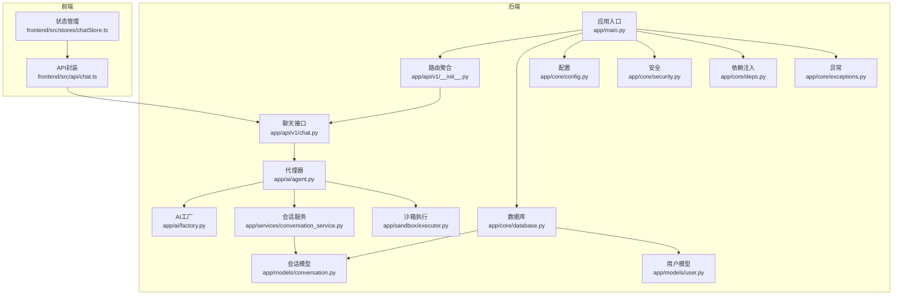
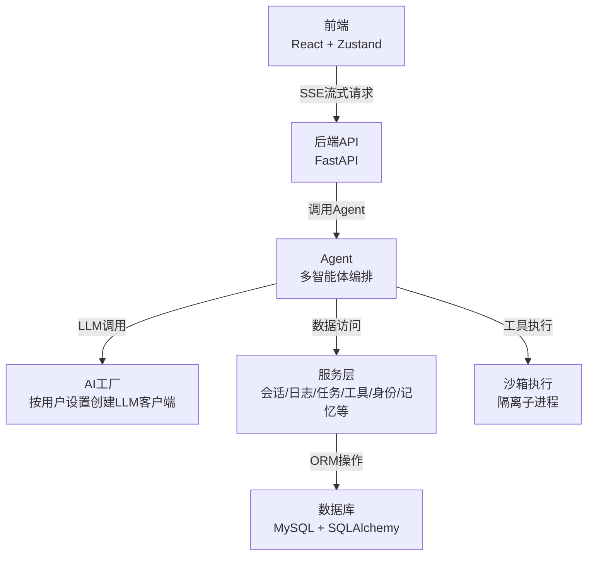
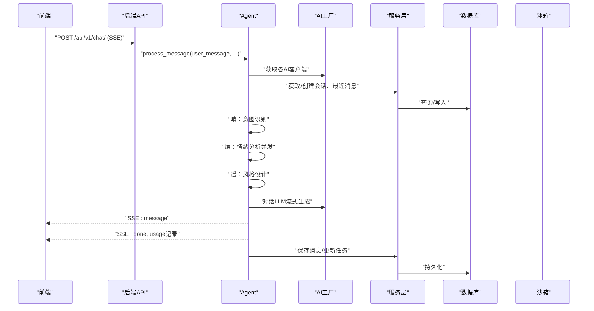
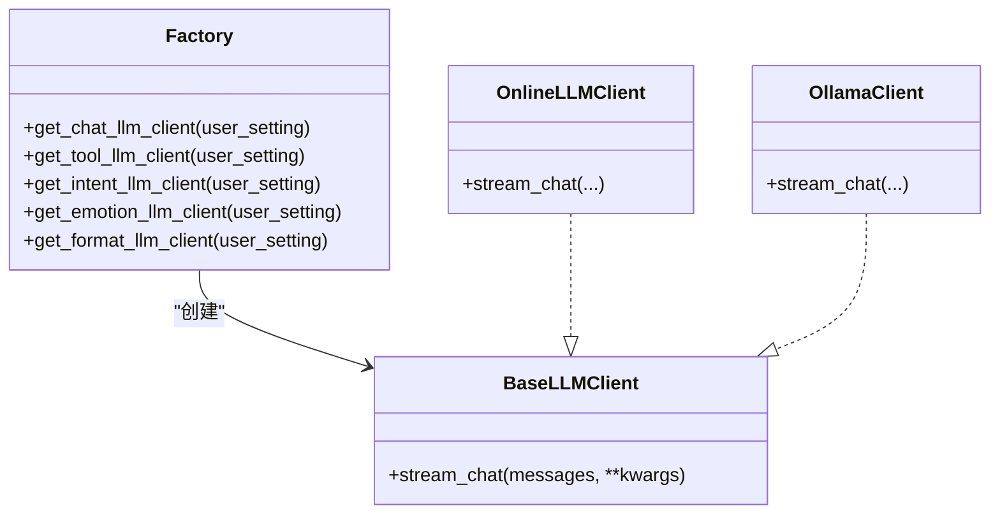
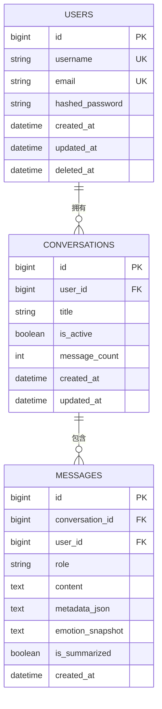
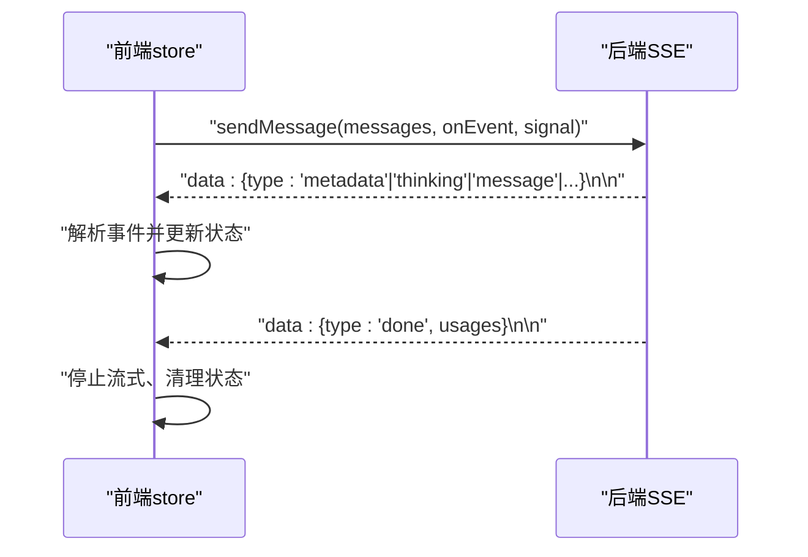
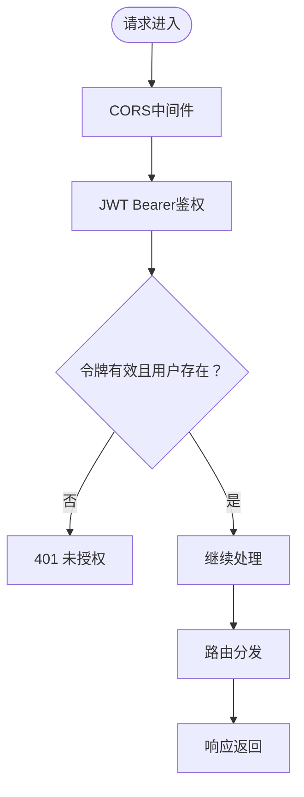
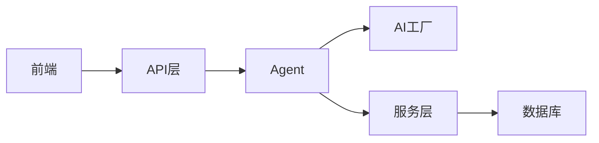
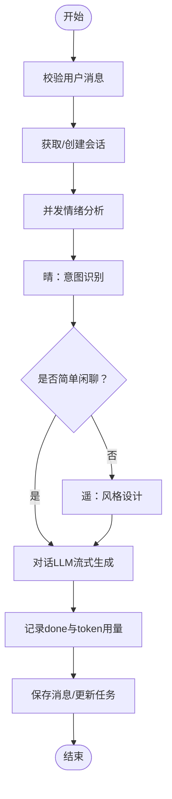

# 系统架构

<cite>
**本文引用的文件**
- [backend/app/main.py](file://backend/app/main.py)
- [backend/app/ai/agent.py](file://backend/app/ai/agent.py)
- [backend/app/ai/factory.py](file://backend/app/ai/factory.py)
- [backend/app/api/v1/__init__.py](file://backend/app/api/v1/__init__.py)
- [backend/app/api/v1/chat.py](file://backend/app/api/v1/chat.py)
- [backend/app/core/config.py](file://backend/app/core/config.py)
- [backend/app/core/database.py](file://backend/app/core/database.py)
- [backend/app/core/security.py](file://backend/app/core/security.py)
- [backend/app/core/deps.py](file://backend/app/core/deps.py)
- [backend/app/core/exceptions.py](file://backend/app/core/exceptions.py)
- [backend/app/models/conversation.py](file://backend/app/models/conversation.py)
- [backend/app/models/user.py](file://backend/app/models/user.py)
- [backend/app/services/conversation_service.py](file://backend/app/services/conversation_service.py)
- [backend/app/schemas/chat.py](file://backend/app/schemas/chat.py)
- [backend/app/sandbox/executor.py](file://backend/app/sandbox/executor.py)
- [frontend/src/api/chat.ts](file://frontend/src/api/chat.ts)
- [frontend/src/stores/chatStore.ts](file://frontend/src/stores/chatStore.ts)
</cite>

## 目录
1. [引言](#引言)
2. [项目结构](#项目结构)
3. [核心组件](#核心组件)
4. [架构总览](#架构总览)
5. [详细组件分析](#详细组件分析)
6. [依赖分析](#依赖分析)
7. [性能考虑](#性能考虑)
8. [故障排查指南](#故障排查指南)
9. [结论](#结论)
10. [附录](#附录)

## 引言
本架构文档面向XuanJi系统，围绕“多智能体协作”展开，系统通过“角色化AI”协同完成意图理解、情绪分析、工具检索/生成/执行、结果解读与对话持久化。后端采用FastAPI+SQLAlchemy实现REST API与数据库访问，前端基于React+Zustand实现SSE驱动的流式交互。系统支持可插拔的AI模型管理（工厂模式），具备完善的异常处理与安全中间件。

## 项目结构
- 后端（Python/FastAPI）
  - 应用入口与生命周期：app/main.py
  - AI核心与工厂：app/ai/agent.py、app/ai/factory.py
  - API路由聚合：app/api/v1/__init__.py
  - 业务接口：app/api/v1/chat.py 等
  - 核心基础设施：app/core/config.py、app/core/database.py、app/core/security.py、app/core/deps.py、app/core/exceptions.py
  - 数据模型：app/models/*.py
  - 服务层：app/services/*.py
  - 沙箱执行：app/sandbox/executor.py
- 前端（TypeScript/React）
  - API封装：frontend/src/api/chat.ts
  - 状态管理：frontend/src/stores/chatStore.ts

图表来源
- [backend/app/main.py:1-79](file://backend/app/main.py#L1-L79)
- [backend/app/api/v1/__init__.py:1-23](file://backend/app/api/v1/__init__.py#L1-L23)
- [backend/app/api/v1/chat.py:1-106](file://backend/app/api/v1/chat.py#L1-L106)
- [backend/app/ai/agent.py:1-800](file://backend/app/ai/agent.py#L1-L800)
- [backend/app/ai/factory.py:1-154](file://backend/app/ai/factory.py#L1-L154)
- [backend/app/core/database.py:1-65](file://backend/app/core/database.py#L1-L65)
- [backend/app/core/config.py:1-68](file://backend/app/core/config.py#L1-L68)
- [backend/app/core/security.py:1-38](file://backend/app/core/security.py#L1-L38)
- [backend/app/core/deps.py:1-42](file://backend/app/core/deps.py#L1-L42)
- [backend/app/core/exceptions.py:1-20](file://backend/app/core/exceptions.py#L1-L20)
- [backend/app/services/conversation_service.py:1-141](file://backend/app/services/conversation_service.py#L1-L141)
- [backend/app/models/conversation.py:1-41](file://backend/app/models/conversation.py#L1-L41)
- [backend/app/models/user.py:1-23](file://backend/app/models/user.py#L1-L23)
- [backend/app/sandbox/executor.py:1-101](file://backend/app/sandbox/executor.py#L1-L101)
- [frontend/src/api/chat.ts:1-49](file://frontend/src/api/chat.ts#L1-L49)
- [frontend/src/stores/chatStore.ts:1-291](file://frontend/src/stores/chatStore.ts#L1-L291)

章节来源
- [backend/app/main.py:1-79](file://backend/app/main.py#L1-L79)
- [backend/app/api/v1/__init__.py:1-23](file://backend/app/api/v1/__init__.py#L1-L23)

## 核心组件
- 应用入口与生命周期
  - 初始化数据库、启动后台调度器、注册CORS、注册路由、全局异常处理器、健康检查端点。
- AI工厂与模型管理
  - 工厂函数按用户设置动态创建不同Provider（在线/本地）的LLM客户端，统一抛出配置异常。
- 代理器（Agent）
  - 多智能体编排：晴（意图）、焕（情绪）、遥（风格）、玄（对话）协作完成对话流程，机（系统迭代）在后台独立运行定时优化任务。
- 服务层
  - 会话服务负责对话与消息的增删查改、上下文拼接、近期消息统计等。
- 数据层
  - SQLAlchemy模型定义会话与消息表，自动迁移缺失列。
- 安全与认证
  - JWT令牌签发/解码、Bearer鉴权依赖注入、密码哈希与校验。
- 前后端交互
  - 后端提供SSE流式接口，前端使用Zustand状态管理与AbortController控制流式传输。

章节来源
- [backend/app/main.py:15-79](file://backend/app/main.py#L15-L79)
- [backend/app/ai/factory.py:54-154](file://backend/app/ai/factory.py#L54-L154)
- [backend/app/ai/agent.py:35-792](file://backend/app/ai/agent.py#L35-L792)
- [backend/app/services/conversation_service.py:9-141](file://backend/app/services/conversation_service.py#L9-L141)
- [backend/app/core/database.py:22-65](file://backend/app/core/database.py#L22-L65)
- [backend/app/core/security.py:12-38](file://backend/app/core/security.py#L12-L38)
- [backend/app/core/deps.py:12-42](file://backend/app/core/deps.py#L12-L42)
- [frontend/src/api/chat.ts:35-49](file://frontend/src/api/chat.ts#L35-L49)
- [frontend/src/stores/chatStore.ts:116-291](file://frontend/src/stores/chatStore.ts#L116-L291)

## 架构总览
系统采用前后端分离，后端以FastAPI为核心，提供REST API与SSE流式响应；前端通过Zustand集中管理聊天状态，使用AbortController中断流式传输。AI模型管理采用工厂模式，按用户设置动态选择Provider与模型；多智能体在Agent内协同，形成“意图-情绪-风格-工具-对话”的闭环。

图表来源
- [backend/app/api/v1/chat.py:40-106](file://backend/app/api/v1/chat.py#L40-L106)
- [backend/app/ai/agent.py:78-792](file://backend/app/ai/agent.py#L78-L792)
- [backend/app/ai/factory.py:54-154](file://backend/app/ai/factory.py#L54-L154)
- [backend/app/services/conversation_service.py:9-141](file://backend/app/services/conversation_service.py#L9-L141)
- [backend/app/core/database.py:22-65](file://backend/app/core/database.py#L22-L65)
- [backend/app/sandbox/executor.py:13-101](file://backend/app/sandbox/executor.py#L13-L101)
- [frontend/src/api/chat.ts:35-49](file://frontend/src/api/chat.ts#L35-L49)
- [frontend/src/stores/chatStore.ts:116-291](file://frontend/src/stores/chatStore.ts#L116-L291)

## 详细组件分析

### 多智能体协作流程（序列图）

图表来源
- [backend/app/api/v1/chat.py:40-106](file://backend/app/api/v1/chat.py#L40-L106)
- [backend/app/ai/agent.py:78-792](file://backend/app/ai/agent.py#L78-L792)
- [backend/app/ai/factory.py:54-154](file://backend/app/ai/factory.py#L54-L154)
- [backend/app/services/conversation_service.py:61-141](file://backend/app/services/conversation_service.py#L61-L141)
- [backend/app/sandbox/executor.py:13-101](file://backend/app/sandbox/executor.py#L13-L101)

章节来源
- [backend/app/api/v1/chat.py:40-106](file://backend/app/api/v1/chat.py#L40-L106)
- [backend/app/ai/agent.py:78-792](file://backend/app/ai/agent.py#L78-L792)

### AI模型工厂（类图）

图表来源
- [backend/app/ai/factory.py:14-154](file://backend/app/ai/factory.py#L14-L154)
- [backend/app/ai/base.py:1-200](file://backend/app/ai/base.py#L1-L200)

章节来源
- [backend/app/ai/factory.py:14-154](file://backend/app/ai/factory.py#L14-L154)

### 数据模型与关系（ER图）

图表来源
- [backend/app/models/user.py:9-23](file://backend/app/models/user.py#L9-L23)
- [backend/app/models/conversation.py:9-41](file://backend/app/models/conversation.py#L9-L41)

章节来源
- [backend/app/models/user.py:9-23](file://backend/app/models/user.py#L9-L23)
- [backend/app/models/conversation.py:9-41](file://backend/app/models/conversation.py#L9-L41)

### 前后端交互（SSE与状态管理）
- 后端
  - /api/v1/chat/ 接收消息，构造Agent，逐事件SSE推送（message/thinking/emotion_update/collaboration/done/error）。
  - done事件携带token用量，后端统一记录。
- 前端
  - 使用AbortController中断流；store按事件类型更新消息、情绪快照、协作日志；done后清理状态，确保UI不卡死。

图表来源
- [backend/app/api/v1/chat.py:40-106](file://backend/app/api/v1/chat.py#L40-L106)
- [frontend/src/api/chat.ts:35-49](file://frontend/src/api/chat.ts#L35-L49)
- [frontend/src/stores/chatStore.ts:116-291](file://frontend/src/stores/chatStore.ts#L116-L291)

章节来源
- [backend/app/api/v1/chat.py:40-106](file://backend/app/api/v1/chat.py#L40-L106)
- [frontend/src/api/chat.ts:35-49](file://frontend/src/api/chat.ts#L35-L49)
- [frontend/src/stores/chatStore.ts:116-291](file://frontend/src/stores/chatStore.ts#L116-L291)

### 安全架构与中间件
- CORS中间件：允许跨域请求，支持凭证与通配方法/头。
- JWT认证：Bearer令牌，解码后从数据库加载用户，校验未删除。
- 密码：bcrypt哈希存储。
- 全局异常：Pydantic校验错误转中文提示，统一422响应。

图表来源
- [backend/app/main.py:30-60](file://backend/app/main.py#L30-L60)
- [backend/app/core/deps.py:12-42](file://backend/app/core/deps.py#L12-L42)
- [backend/app/core/security.py:24-38](file://backend/app/core/security.py#L24-L38)

章节来源
- [backend/app/main.py:30-60](file://backend/app/main.py#L30-L60)
- [backend/app/core/deps.py:12-42](file://backend/app/core/deps.py#L12-L42)
- [backend/app/core/security.py:24-38](file://backend/app/core/security.py#L24-L38)

## 依赖分析
- 组件耦合
  - API层依赖Agent；Agent依赖AI工厂与服务层；服务层依赖模型与数据库。
  - 前端仅依赖API封装与状态管理，耦合度低。
- 外部依赖
  - FastAPI、SQLAlchemy、Pydantic、uvicorn、bcrypt、jose等。
- 循环依赖
  - 未见循环导入；模块职责清晰，分层明确。

图表来源
- [backend/app/api/v1/chat.py:40-106](file://backend/app/api/v1/chat.py#L40-L106)
- [backend/app/ai/agent.py:78-792](file://backend/app/ai/agent.py#L78-L792)
- [backend/app/ai/factory.py:54-154](file://backend/app/ai/factory.py#L54-L154)
- [backend/app/services/conversation_service.py:9-141](file://backend/app/services/conversation_service.py#L9-L141)
- [backend/app/core/database.py:22-65](file://backend/app/core/database.py#L22-L65)
- [frontend/src/api/chat.ts:35-49](file://frontend/src/api/chat.ts#L35-L49)

章节来源
- [backend/app/api/v1/chat.py:40-106](file://backend/app/api/v1/chat.py#L40-L106)
- [backend/app/ai/agent.py:78-792](file://backend/app/ai/agent.py#L78-L792)
- [backend/app/ai/factory.py:54-154](file://backend/app/ai/factory.py#L54-L154)
- [backend/app/services/conversation_service.py:9-141](file://backend/app/services/conversation_service.py#L9-L141)
- [backend/app/core/database.py:22-65](file://backend/app/core/database.py#L22-L65)
- [frontend/src/api/chat.ts:35-49](file://frontend/src/api/chat.ts#L35-L49)

## 性能考虑
- 流式输出与SSE
  - 后端按事件推送，前端即时渲染；done事件后记录token用量，避免阻塞。
- 并发与超时
  - 情绪分析异步并发，设定超时与降级；工具执行在沙箱隔离子进程，限制超时。
- 数据库与索引
  - 会话与消息建立外键与索引，查询近期消息与上下文注入高效。
- 自动迁移
  - 新增字段自动ALTER，降低部署成本。

章节来源
- [backend/app/ai/agent.py:140-149](file://backend/app/ai/agent.py#L140-L149)
- [backend/app/sandbox/executor.py:64-99](file://backend/app/sandbox/executor.py#L64-L99)
- [backend/app/services/conversation_service.py:95-110](file://backend/app/services/conversation_service.py#L95-L110)
- [backend/app/core/database.py:44-65](file://backend/app/core/database.py#L44-L65)

## 故障排查指南
- 请求参数校验失败
  - 全局异常处理器将Pydantic错误转为中文提示，返回422。
- LLM配置缺失
  - 工厂创建客户端时抛出LLMConfigError，提示用户前往“记忆体”页面完善配置。
- SSE中断与超时
  - 前端使用AbortController中断；后端检测is_disconnected并优雅退出；工具执行超时返回错误。
- 令牌无效
  - 鉴权失败返回401，检查secret_key与令牌有效期。

章节来源
- [backend/app/main.py:43-59](file://backend/app/main.py#L43-L59)
- [backend/app/core/exceptions.py:1-20](file://backend/app/core/exceptions.py#L1-L20)
- [backend/app/api/v1/chat.py:78-87](file://backend/app/api/v1/chat.py#L78-L87)
- [backend/app/sandbox/executor.py:95-99](file://backend/app/sandbox/executor.py#L95-L99)
- [backend/app/core/deps.py:16-41](file://backend/app/core/deps.py#L16-L41)

## 结论
XuanJi系统通过“角色化AI+工厂模式+服务层封装+SSE流式交互”，实现了高内聚、低耦合的多智能体协作架构。后端以FastAPI+SQLAlchemy提供稳定的数据与接口能力，前端以Zustand与AbortController保障流畅的用户体验。工厂模式使AI模型配置灵活可插拔，服务层抽象了业务逻辑，数据库自动迁移降低了维护成本。整体架构在可扩展性、安全性与可维护性之间取得良好平衡。

## 附录
- 关键流程（算法流程）

图表来源
- [backend/app/ai/agent.py:78-792](file://backend/app/ai/agent.py#L78-L792)